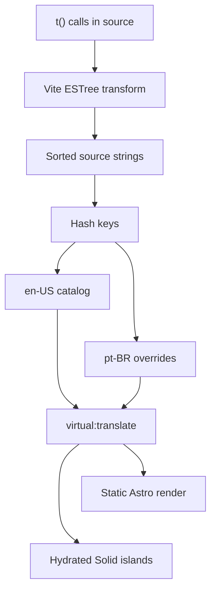
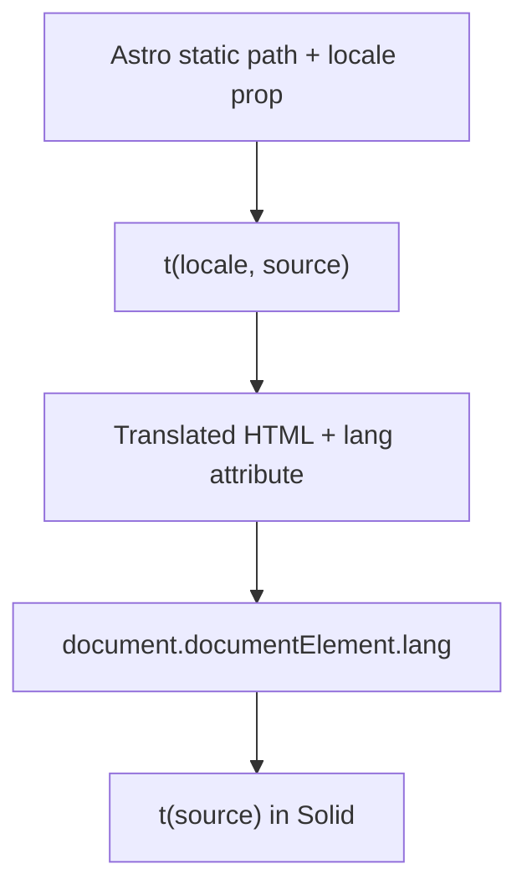

import { TranslationCatalogLab } from "@web/content/labs/translation-catalog-lab";

The [blog layer](/blog/the-blog-layer-static-pages-live-view-counts) treats English and Brazilian Portuguese articles as separate MDX files. That is the right boundary for long-form writing: translation is editorial work, not a string lookup.

The surrounding interface has a different problem. Labels such as “All posts,” “Battery,” and “Nothing playing” appear across Astro pages and hydrated Solid components. They need one small translation API, the same locale, and a path strategy that works during a static build and after JavaScript starts.

I built a custom integration for that narrower requirement. It is not a general internationalization framework. It collects static source strings, generates hash-keyed TypeScript catalogs, exposes a virtual module, and falls back to the English source whenever a translation is absent.



## The authoring API starts with English

The default locale is `en-US`, and the source string is the default translation. An Astro page passes its build-time locale explicitly:

```astro
<h1>{t(locale, "Blog")}</h1>
```

A client component can use the shorter form:

```tsx
<PanelHeader title={t("Now Playing")} />
```

Both functions come from `virtual:translate`, along with `locales`, `defaultLocale`, `resolveLocale`, `getPathLocale`, and `getLocale`. The integration injects a declaration for that virtual module, including a `Locale` union derived from the configured locale list and overloads for the two forms of `t()`.

This API makes the constraint visible at the call site. Astro code already knows which static path it is generating, so it passes the locale. Browser code can read the locale from the rendered document. There is no process-global “current request locale” to leak between static pages.

## Collecting calls without scanning text

The Vite plugin inside [`plugins/translate-plugin.ts`](https://github.com/ErickCReis/ErickCReis/blob/main/plugins/translate-plugin.ts) runs its collector during production builds. It only inspects modules that reference `virtual:translate`, then uses Vite's parser to walk their ESTree syntax trees.

The collector first finds the actual imported binding. It supports a named import—even when renamed—and namespace calls such as `translate.t(...)`. It then records calls whose translation value can be resolved statically:

- string literals;
- template literals with no expressions;
- concatenations made entirely from static strings;
- those expressions inside parentheses.

For `t(value)` it reads the first argument. For `t(locale, value)` it reads the second. A dynamic expression is skipped rather than guessed.

Using the syntax tree avoids treating comments, unrelated functions named `t`, or text inside other strings as translations. The tradeoff is equally direct: values assembled from runtime data cannot create catalog entries. Dynamic values belong outside the lookup, or the static pieces around them need separate calls.

## Generated catalogs are an authoring loop

At the end of a build, the integration sorts the collected strings and hashes each one with a small 32-bit FNV-style function. The base-36 result becomes a seven-character catalog key.

The default catalog maps each hash back to the English source. Every other locale receives the same set of keys, preserves existing values, removes keys no longer used, and adds `null` for new strings. Comments above the override keep the source readable:

```ts
const translations = {
  // Blog
  "1jdup01": "Blog",
  // Nothing playing
  "0vgq4zc": "Nada tocando",
} satisfies TranslationOverrides;
```

[`web/i18n/en-US.ts`](https://github.com/ErickCReis/ErickCReis/blob/main/web/i18n/en-US.ts) also generates the `TranslationHash` union and an override type. [`web/i18n/pt-BR.ts`](https://github.com/ErickCReis/ErickCReis/blob/main/web/i18n/pt-BR.ts) uses `satisfies` against that type, so a catalog cannot add an unknown key or a non-string value. The override remains partial because a missing translation is valid during the authoring cycle.

That cycle takes two build passes for a brand-new string: one build discovers it and writes the `null` placeholder; after the translation is filled in, the next build includes it in the rendered output and client bundle. Source and generated catalogs are committed together.

That choice makes the English source both the fallback copy and the entry's identity. Even a punctuation edit produces a different hash: the next build removes the unused key and creates a new `null` entry. I prefer that small interruption to silently carrying an old translation across copy whose meaning may have changed.

The workbench below makes the loop concrete. A literal and a static concatenation converge on the same key, while a runtime variable never enters the catalog. Run one build, edit the generated override, run the next, and switch the preview locale to watch the English fallback give way to the bundled Portuguese value.

<TranslationCatalogLab client:load locale="en-US" />

Hashing keeps the generated catalog keys short, but it gives up the readability of source keys and currently has no collision check. Two different source strings producing the same 32-bit hash would silently share one entry. The catalog is small enough that this is unlikely, but “unlikely” is not validation. If the translation surface grows, the generator should fail when one hash maps to two sources.

## One virtual module, two execution contexts

When Vite resolves `virtual:translate`, the plugin loads the generated locale files and produces a small module around [`plugins/translate-runtime.ts`](https://github.com/ErickCReis/ErickCReis/blob/main/plugins/translate-runtime.ts).

During Astro's server-side static rendering, that module contains the build catalogs. `t(locale, value)` normalizes the explicit locale, hashes the source string, and reads the matching override. The default locale and missing or `null` entries return the source value.

The browser receives client catalogs containing only completed string values. It does not need the `null` placeholders or the build-only catalog structure. `t(value)` resolves the locale from `<html lang>`, with the first URL segment as a fallback, then performs the same hash lookup. Astro's base layout already writes the normalized locale to the document, so hydrated islands inherit the language selected while the page was built.



This split prevents a browser-only assumption from entering the build and prevents every island from receiving locale props just to translate its own labels.

## Locale paths are part of the same contract

The integration is configured in [`astro.config.mjs`](https://github.com/ErickCReis/ErickCReis/blob/main/astro.config.mjs) with `en-US` and `pt-BR`, using English as the default. Astro's static path functions map the default locale to no prefix and Portuguese to `/pt-BR`.

[`getLocalizedPath`](https://github.com/ErickCReis/ErickCReis/blob/main/web/i18n/index.ts) applies that rule to links. The locale switcher keeps the content path while changing its prefix. Blog lookup extends it by preferring `slug.pt-BR.mdx` on a Portuguese path and falling back to the default file when that localized article does not exist.

The base layout completes the route contract. It sets `<html lang>`, creates a canonical URL, adds `hreflang` alternates and an `x-default` link, and translates locale codes to the underscore form used by Open Graph metadata. Localization is therefore more than replacing a label: routing, content selection, client state, and discovery metadata agree on the same configured locale.

## Useful because the boundary is small

This runtime does not provide ICU messages, locale negotiation, grammatical plural rules, rich-text interpolation, translation services, or a content-management workflow. The site still uses `Intl` directly for dates and numbers, and whole blog posts still have dedicated files.

Those omissions are why the custom tool remains understandable. For two known locales and a few dozen static UI strings, an Astro hook, a Vite plugin, two generated catalogs, and a small runtime solve the actual problem. A broader product would cross the point where maintaining those missing capabilities costs more than adopting an established i18n system.

The final post adds one more personal data source to the shared telemetry pipeline: normalized token usage from local agent sessions, synced without uploading the session content itself.
