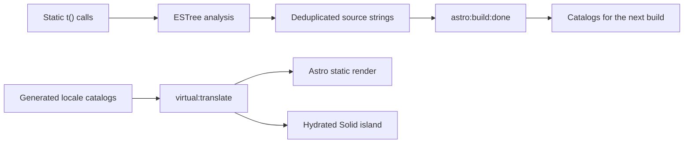

This Astro application translates text in two places. During the build, every route already has an explicit locale. In the browser, a hydrated island has to recover that locale from the rendered document. Both places use the same catalogs and fallback rules. The generator, however, can collect only source strings that it can identify statically.

An Astro integration collects static `t()` calls, writes TypeScript catalogs keyed by hashes of the English source, and exposes them through a virtual module. Long posts remain in separate MDX files for each locale. The catalog holds interface copy such as labels, empty states, and panel headings.


```mermaid center
flowchart LR
  Source["Static t() calls"] --> AST["ESTree analysis"]
  AST --> Collector["Deduplicated source strings"]
  Catalogs["Generated locale catalogs"] --> Virtual["virtual:translate"]
  Virtual --> SSR["Astro static render"]
  Virtual --> Client["Hydrated Solid island"]
  Collector --> Done["astro:build:done"]
  Done --> Next["Catalogs for the next build"]
```

The build consumes existing catalogs and regenerates them after rendering. A newly discovered translation reaches the output on the following build.

## The API used by application code

The integration is registered with a closed locale set and one default:

```ts
astroTranslate({
  locales: ["en-US", "pt-BR"],
  defaultLocale: "en-US",
})
```

During `astro:config:done`, it injects a declaration for `virtual:translate`. The configured locale array becomes a string-literal union, and `t` exposes two call shapes:

```ts
declare module "virtual:translate" {
  export type Locale = "en-US" | "pt-BR";
  export const locales: readonly Locale[];
  export const defaultLocale: "en-US";
  export function resolveLocale(value?: string | null): Locale;
  export function getPathLocale(pathname?: string | null): Locale;
  export function getLocale(): Locale;
  export function t(value: string): string;
  export function t(locale: Locale, value: string): string;
}
```

Astro routes use the explicit overload because `getStaticPaths()` already assigns a locale to every generated page:

```astro
const { locale } = Astro.props;

<h1>{t(locale, "Blog")}</h1>
```

Browser-owned components can use `t("Nothing playing")`; the runtime then reads the locale from the document. Components that receive a typed locale can keep using `t(locale, value)` on both sides of hydration.

## Collect static calls without rewriting them

The Vite plugin inspects code through its `transform` hook. It parses matching modules, records source strings, and returns `null`, so the emitted program keeps the original `t()` call. A hash lookup performs the translation at runtime.

Collection runs only for production builds and only when the module source contains `virtual:translate`. The analyzer first discovers the local binding imported from that exact module. It supports direct imports, renamed direct imports, and namespace imports:

```ts
import { t } from "virtual:translate";
import { t as translate } from "virtual:translate";
import * as i18n from "virtual:translate";
```

The ESTree walk accepts these equivalent static forms:

```ts
t("Nothing playing");
translate(locale, `Nothing playing`);
i18n.t("Nothing " + "playing");
```

`resolveStaticString()` recursively evaluates string literals, template literals without expressions, parenthesized expressions, and `+` expressions whose two operands are also static. For the overloaded API, argument selection is positional:

```ts
function resolveCallTranslationValue(node: ESTree.CallExpression): string | null {
  const argumentIndex = node.arguments.length >= 2 ? 1 : 0;
  const argument = node.arguments[argumentIndex];
  return argument && argument.type !== "SpreadElement"
    ? resolveStaticString(argument)
    : null;
}
```

A call such as `t(statusLabel)` is invisible to the catalog generator by design. AST analysis avoids false positives from comments, unrelated functions named `t`, and arbitrary strings, but it cannot infer runtime values. The analyzer does not report a dynamic key as an error. At runtime, the call falls back to its source value.

## Derive catalog keys and types from the source

Every collected source string is hashed with a compact FNV-1a-style 32-bit function:

```ts
export function hashTranslationKey(value: string): string {
  let hash = 0x811c9dc5;

  for (let index = 0; index < value.length; index += 1) {
    hash ^= value.charCodeAt(index);
    hash = Math.imul(hash, 0x01000193);
  }

  return (hash >>> 0).toString(36).padStart(7, "0");
}
```

The default catalog maps each hash to the English source and defines the key space:

```ts
export const translations = {
  "1jdup01": "Blog",
  "0vgq4zc": "Nothing playing",
} as const;

export type TranslationHash = keyof typeof translations;
export type TranslationOverrides =
  Partial<Record<TranslationHash, string | null>>;
```

The Portuguese module is generated against that type:

```ts
import type { TranslationOverrides } from "./en-US";

const translations = {
  // Blog
  "1jdup01": "Blog",
  // Nothing playing
  "0vgq4zc": "Nada tocando",
} satisfies TranslationOverrides;
```

`Partial` permits an incomplete locale, `null` marks an untranslated entry, and `satisfies` rejects unknown hashes. At load time, `normalizeLocaleCatalog()` discards invalid shapes and values.

The source text also identifies the message. Changing capitalization or punctuation creates a new hash. The next generation pass removes the old entry and inserts a new `null` override. This sends changed copy through translation again. It also leaves the catalog with opaque keys and creates more diff noise than stable message IDs would.

## Catalog generation is a two-build protocol

The collector is cleared at `astro:build:start`. As Vite transforms modules, discovered values enter a shared `Set`; `collector.values()` sorts them before serialization. In `astro:build:done`, the generator:

- keeps still-referenced values from the existing default catalog;
- adds newly discovered English source strings;
- removes hashes no longer present in source;
- preserves existing locale overrides for retained hashes;
- inserts `null` for untranslated hashes;
- rewrites `web/i18n/en-US.ts` and `web/i18n/pt-BR.ts`.

The same build loaded the virtual module before rewriting these files. Adding a source string therefore follows this sequence:

```text
build N     discover source → render with source fallback → write null override
edit        replace null with the translated string
build N + 1 load completed override → render and bundle the translation
```

Development mode does not collect or regenerate catalogs because the transform gate checks `config.command === "build"`. A new `t()` call can appear to work in dev through English fallback while still having no generated override.

## Send different catalogs to server and browser code

Vite resolves `virtual:translate` to an internal `\0virtual:translate` ID and resolves `virtual:translate/runtime` to the physical runtime file. Its `load` hook imports the generated locale modules and emits code equivalent to:

```ts
import { createTranslateRuntime } from "virtual:translate/runtime";

export const {
  locales,
  defaultLocale,
  resolveLocale,
  getPathLocale,
  getLocale,
  t,
} = createTranslateRuntime({
  locales: ["en-US", "pt-BR"],
  defaultLocale: "en-US",
  buildCatalogs,
  clientCatalogs,
});
```

The values substituted for those last two fields depend on Vite's SSR flag:

- server/static-render modules receive `buildCatalogs`, including `null` values;
- browser modules receive an empty `buildCatalogs` object and `clientCatalogs` containing only completed string translations.

Browser code receives every configured catalog. It does not limit the payload to the current page locale. Two small catalogs cost little, but the bundle grows with `locales × translated strings`. A larger catalog should load each locale through a separate dynamic import.

## Resolve translations and fall back to the source

The runtime keeps server and browser resolution in the same overloaded function:

```ts
function t(localeOrValue: string, maybeValue?: string): string {
  if (typeof maybeValue === "string") {
    return typeof window === "undefined"
      ? translateForBuild(localeOrValue, maybeValue)
      : translateForBrowser(localeOrValue, maybeValue);
  }

  return typeof window === "undefined"
    ? localeOrValue
    : translateForBrowser(getLocale(), localeOrValue);
}
```

The one-argument form deliberately returns the source unchanged when `window` is unavailable. Static Astro code must pass its locale explicitly. The two-argument form normalizes the requested locale, returns source immediately for `en-US`, and otherwise reads `catalog[hashTranslationKey(value)] ?? value`. Missing entries and `null` entries therefore have the same visible fallback.

In the browser, `getLocale()` uses:

```ts
resolveLocale(
  document.documentElement.lang || getPathLocale(window.location.pathname),
);
```

`<html lang>` tells hydrated code which locale to use. The runtime checks the URL's first segment only when `lang` is empty. An invalid but non-empty `lang` resolves directly to the default locale. The base Astro layout calls `resolveLocale(lang)` before writing the attribute, so pages generated through that layout provide a valid value.

At hydration boundaries, `client:load` components pass `locale` and use `t(locale, value)` on both sides. Browser-only components can use `t(value)` after reading `<html lang>`. A server-rendered island that uses the one-argument overload would emit English during SSR and could switch language when hydrated.

## Route locale and translation locale must agree

The catch-all routes generate `/` for `en-US` and `/pt-BR` for Portuguese:

```ts
params: {
  locale: locale === defaultLocale ? undefined : locale,
}
```

`getLocalizedPath()` applies the same rule to links:

```ts
if (normalizedLocale === defaultLocale) {
  return normalizedPath ? `/${normalizedPath}` : "/";
}

return normalizedPath
  ? `/${normalizedLocale}/${normalizedPath}`
  : `/${normalizedLocale}`;
```

The base layout uses the normalized route locale for `<html lang>`, canonical URLs, `hreflang` alternates, and Open Graph locale metadata. Separately, blog selection prefers `slug.pt-BR.mdx` and falls back to `slug.mdx`. Catalog fallback handles one UI string at a time. Article fallback chooses a complete content entry.

## Where this design breaks down

The main failure modes are:

- dynamic translation arguments are skipped without a diagnostic;
- parser failures emit a warning and allow the build to continue;
- a new string needs the post-build generation/edit/rebuild cycle;
- dev mode never updates the generated catalogs;
- changing source copy invalidates its translation identity;
- the 32-bit hash has no collision detection, so two sources could silently share an entry;
- every browser consumer receives every locale's completed catalog;
- the runtime has no interpolation, plural rules, or rich-text messages.

If the catalog grows, I would add collision checks, errors for dynamic calls, client catalogs split by locale, and a separate generation command. Past that size, stable message IDs and an ICU-capable library would remove more problems than this custom runtime solves.
