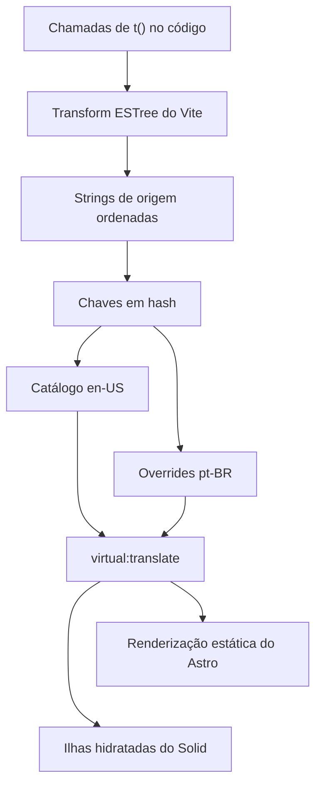
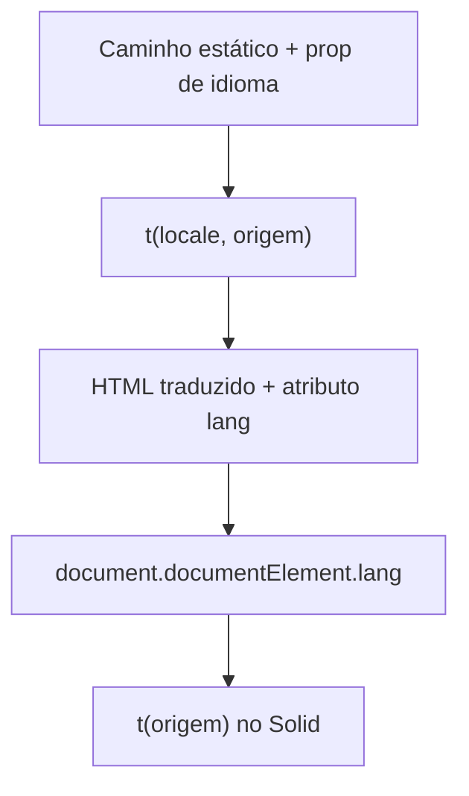

import { TranslationCatalogLab } from "@web/content/labs/translation-catalog-lab";

A [camada do blog](/pt-BR/blog/the-blog-layer-static-pages-live-view-counts) trata os artigos em inglês e português brasileiro como arquivos MDX separados. Essa é a fronteira certa para textos longos, cuja tradução exige um trabalho editorial que vai além de uma consulta em um catálogo de strings.

A interface ao redor tem outro problema. Rótulos como “Todos os posts”, “Bateria” e “Nada tocando” aparecem em páginas do Astro e componentes hidratados do Solid. Eles precisam de uma pequena API de tradução, do mesmo idioma e de uma estratégia de caminhos que funcione durante o build estático e depois que o JavaScript inicia.

Criei uma integração sob medida para esse requisito mais estreito. Ela coleta strings de origem estáticas, gera catálogos TypeScript indexados por hashes, expõe um módulo virtual e usa o texto em inglês sempre que uma tradução está ausente.



## A API de autoria começa em inglês

O idioma padrão é `en-US`, e a string de origem funciona como tradução padrão. Uma página do Astro passa explicitamente o idioma conhecido durante o build:

```astro
<h1>{t(locale, "Blog")}</h1>
```

Um componente no cliente pode usar a forma mais curta:

```tsx
<PanelHeader title={t("Now Playing")} />
```

As duas funções vêm de `virtual:translate`, junto com `locales`, `defaultLocale`, `resolveLocale`, `getPathLocale` e `getLocale`. A integração injeta uma declaração para esse módulo virtual, incluindo um tipo união `Locale` derivado da lista de idiomas configurada e overloads para as duas formas de `t()`.

Essa API deixa a restrição visível no ponto de uso. O código do Astro já sabe qual caminho estático está gerando, portanto passa o idioma. O código no navegador pode ler o idioma do documento renderizado. Não existe um “idioma da requisição atual” global ao processo que possa vazar de uma página estática para outra.

## Coletando chamadas sem procurar texto bruto

O plugin do Vite dentro de [`plugins/translate-plugin.ts`](https://github.com/ErickCReis/ErickCReis/blob/main/plugins/translate-plugin.ts) executa seu coletor durante os builds de produção. Ele inspeciona apenas os módulos que fazem referência a `virtual:translate` e usa o parser do Vite para percorrer suas árvores sintáticas ESTree.

Primeiro, o coletor encontra o binding realmente importado. Ele aceita um import nomeado, mesmo que renomeado, e chamadas pelo namespace, como `translate.t(...)`. Depois, registra chamadas cujo valor de tradução pode ser resolvido estaticamente:

- strings literais;
- template literals sem expressões;
- concatenações formadas apenas por strings estáticas;
- essas expressões dentro de parênteses.

Em `t(value)`, ele lê o primeiro argumento. Em `t(locale, value)`, lê o segundo. Uma expressão dinâmica é ignorada em vez de ser adivinhada.

Usar a árvore sintática evita tratar comentários, outras funções chamadas `t` ou texto dentro de strings não relacionadas como traduções. A desvantagem também é direta: valores montados a partir de dados de runtime não conseguem criar entradas no catálogo. Valores dinâmicos devem ficar fora da consulta, ou as partes estáticas ao redor deles precisam de chamadas separadas.

## Catálogos gerados formam um ciclo de autoria

No fim de um build, a integração ordena as strings coletadas e calcula o hash de cada uma com uma pequena função de 32 bits no estilo FNV. O resultado em base 36 se torna uma chave de catálogo com sete caracteres.

O catálogo padrão liga cada hash de volta ao texto em inglês. Todos os outros idiomas recebem o mesmo conjunto de chaves, preservam os valores existentes, removem chaves que não são mais usadas e acrescentam `null` para strings novas. Comentários acima dos overrides mantêm a origem legível:

```ts
const translations = {
  // Blog
  "1jdup01": "Blog",
  // Nothing playing
  "0vgq4zc": "Nada tocando",
} satisfies TranslationOverrides;
```

O arquivo [`web/i18n/en-US.ts`](https://github.com/ErickCReis/ErickCReis/blob/main/web/i18n/en-US.ts) também gera a união `TranslationHash` e um tipo para os overrides. O arquivo [`web/i18n/pt-BR.ts`](https://github.com/ErickCReis/ErickCReis/blob/main/web/i18n/pt-BR.ts) usa `satisfies` com esse tipo, impedindo que o catálogo acrescente uma chave desconhecida ou um valor que não seja string. O override continua parcial porque uma tradução ausente é válida durante o ciclo de autoria.

Esse ciclo exige duas passagens de build para uma string inédita: um build a descobre e grava o placeholder `null`; depois que a tradução é preenchida, o build seguinte a inclui na saída renderizada e no bundle do cliente. O código e os catálogos gerados são versionados juntos.

Essa escolha faz do texto em inglês tanto o fallback quanto a identidade da entrada. Até uma mudança de pontuação produz outro hash: no build seguinte, o gerador remove a chave que deixou de ser usada e cria uma nova entrada com `null`. Prefiro essa pequena interrupção a carregar silenciosamente uma tradução antiga para um texto cujo sentido pode ter mudado.

A bancada abaixo torna o ciclo concreto. Um literal e uma concatenação estática convergem na mesma chave, enquanto uma variável de runtime nunca entra no catálogo. Rode um build, edite o override gerado, rode o próximo e troque o idioma da prévia para ver o fallback em inglês dar lugar ao valor em português incluído no bundle.

<TranslationCatalogLab client:load locale="pt-BR" />

O hash mantém curtas as chaves geradas dos catálogos, mas abre mão da legibilidade de uma chave textual e hoje não tem uma verificação de colisões. Duas strings de origem diferentes que produzissem o mesmo hash de 32 bits compartilhariam silenciosamente uma entrada. O catálogo é pequeno o bastante para tornar isso improvável, mas “improvável” não é validação. Se a superfície de tradução crescer, o gerador deve falhar quando um hash apontar para duas origens.

## Um módulo virtual, dois contextos de execução

Quando o Vite resolve `virtual:translate`, o plugin carrega os arquivos de idioma gerados e produz um pequeno módulo ao redor de [`plugins/translate-runtime.ts`](https://github.com/ErickCReis/ErickCReis/blob/main/plugins/translate-runtime.ts).

Durante a renderização estática no lado do servidor do Astro, esse módulo contém os catálogos de build. `t(locale, value)` normaliza o idioma explícito, calcula o hash da string de origem e busca o override correspondente. O idioma padrão e as entradas ausentes ou com `null` retornam o texto original.

O navegador recebe catálogos contendo apenas traduções completas. Ele não precisa dos placeholders `null` nem da estrutura usada apenas no build. `t(value)` descobre o idioma a partir de `<html lang>`, com o primeiro segmento da URL como fallback, e faz a mesma consulta pelo hash. O layout base do Astro já escreve o idioma normalizado no documento, portanto as ilhas hidratadas herdam o idioma escolhido durante a geração da página.



Essa divisão impede que uma suposição exclusiva do navegador entre no build e evita que toda ilha receba props de idioma apenas para traduzir os próprios rótulos.

## Os caminhos localizados fazem parte do mesmo contrato

A integração é configurada em [`astro.config.mjs`](https://github.com/ErickCReis/ErickCReis/blob/main/astro.config.mjs) com `en-US` e `pt-BR`, usando o inglês como padrão. As funções de caminhos estáticos do Astro mapeiam o idioma padrão para a ausência de prefixo e o português para `/pt-BR`.

[`getLocalizedPath`](https://github.com/ErickCReis/ErickCReis/blob/main/web/i18n/index.ts) aplica essa regra aos links. O seletor de idiomas preserva o caminho do conteúdo enquanto troca o prefixo. A busca de posts estende a lógica ao preferir `slug.pt-BR.mdx` em um caminho em português e retornar ao arquivo padrão quando o artigo localizado não existe.

O layout base completa o contrato das rotas. Ele define `<html lang>`, cria uma URL canônica, adiciona alternates com `hreflang` e um link `x-default` e converte os códigos de idioma para o formato com sublinhado usado pelos metadados Open Graph. A localização, portanto, é mais do que trocar um rótulo: roteamento, seleção de conteúdo, estado no cliente e metadados de descoberta concordam sobre o mesmo idioma configurado.

## Útil porque a fronteira é pequena

O escopo desse runtime exclui mensagens ICU, negociação de idioma, regras gramaticais de plural, interpolação de rich text, serviços de tradução e um fluxo de gerenciamento de conteúdo. O site ainda usa `Intl` diretamente para datas e números, e posts completos continuam em arquivos próprios.

São essas ausências que mantêm a ferramenta sob medida compreensível. Para dois idiomas conhecidos e algumas dezenas de strings estáticas da interface, um hook do Astro, um plugin do Vite, dois catálogos gerados e um pequeno runtime resolvem o problema real. Um produto mais amplo cruzaria o ponto em que manter todas essas capacidades ausentes custa mais do que adotar um sistema de i18n estabelecido.

O post final acrescenta mais uma fonte de dados pessoais ao pipeline compartilhado de telemetria: uso normalizado de tokens a partir de sessões locais de agentes, sincronizado sem enviar o conteúdo das sessões.
