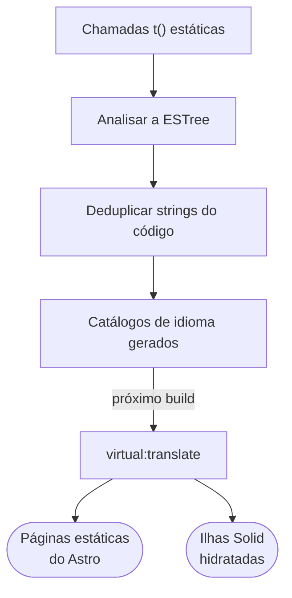

Esta aplicação Astro traduz textos em dois lugares. Durante o build, cada rota já possui um idioma explícito. No navegador, uma ilha hidratada precisa recuperar esse idioma do documento renderizado. Os dois lugares usam os mesmos catálogos e regras de fallback. O gerador, porém, só consegue coletar strings que identifica estaticamente no código.

Uma integração do Astro coleta chamadas estáticas de `t()`, grava catálogos TypeScript indexados por hashes do texto em inglês e os expõe por um módulo virtual. Posts completos continuam em arquivos MDX separados por idioma. O catálogo guarda textos de interface, como rótulos, estados vazios e títulos de painéis.


```mermaid center
flowchart TB
  Source["Chamadas t() estáticas"] --> AST["Analisar a ESTree"]
  AST --> Collector["Deduplicar strings do código"]
  Collector --> Catalogs["Catálogos de idioma gerados"]
  Catalogs -->|"próximo build"| Virtual["virtual:translate"]
  Virtual --> SSR(["Páginas estáticas<br/>do Astro"])
  Virtual --> Client(["Ilhas Solid<br/>hidratadas"])
```

O build consome os catálogos existentes e os regenera depois da renderização. Uma tradução recém-descoberta chega à saída no build seguinte.

## A API usada pelo código da aplicação

A integração é registrada com um conjunto fechado de idiomas e um idioma padrão:

```ts
astroTranslate({
  locales: ["en-US", "pt-BR"],
  defaultLocale: "en-US",
});
```

Durante `astro:config:done`, ela injeta uma declaração para `virtual:translate`. O array configurado se torna uma união de strings literais, e `t` expõe duas formas de chamada:

```ts
declare module "virtual:translate" {
  export type Locale = "en-US" | "pt-BR";
  export const locales: readonly Locale[];
  export const defaultLocale: "en-US";
  export function resolveLocale(value?: string | null): Locale;
  export function getPathLocale(pathname?: string | null): Locale;
  export function getLocale(): Locale;
  export function t(value: string): string;
  export function t(locale: Locale, value: string): string;
}
```

As rotas Astro usam o overload explícito porque `getStaticPaths()` já atribui um idioma a cada página gerada:

```astro
const { locale } = Astro.props;

<h1>{t(locale, "Blog")}</h1>
```

Componentes controlados pelo navegador podem usar `t("Nothing playing")`; nesse caso, o runtime lê o idioma do documento. Componentes que recebem um idioma tipado podem continuar usando `t(locale, value)` nos dois lados da hidratação.

## Colete chamadas estáticas sem reescrevê-las

O plugin do Vite inspeciona o código pelo hook `transform`. Ele faz o parse dos módulos relevantes, registra as strings de origem e retorna `null`, então o programa emitido mantém a chamada original de `t()`. Uma consulta por hash faz a tradução em runtime.

A coleta roda apenas em builds de produção e somente quando o código-fonte do módulo contém `virtual:translate`. Primeiro, o analisador descobre o binding local importado exatamente desse módulo. Ele aceita imports diretos, imports diretos renomeados e imports por namespace:

```ts
import { t } from "virtual:translate";
import { t as translate } from "virtual:translate";
import * as i18n from "virtual:translate";
```

O percurso da ESTree aceita estas formas estáticas equivalentes:

```ts
t("Nothing playing");
translate(locale, `Nothing playing`);
i18n.t("Nothing " + "playing");
```

`resolveStaticString()` avalia recursivamente strings literais, template literals sem expressões, expressões entre parênteses e operações `+` cujos dois operandos também são estáticos. Na API com overload, a seleção do argumento é posicional:

```ts
function resolveCallTranslationValue(node: ESTree.CallExpression): string | null {
  const argumentIndex = node.arguments.length >= 2 ? 1 : 0;
  const argument = node.arguments[argumentIndex];
  return argument && argument.type !== "SpreadElement" ? resolveStaticString(argument) : null;
}
```

Uma chamada como `t(statusLabel)` fica invisível para o gerador de propósito. A análise da AST evita falsos positivos em comentários, funções não relacionadas chamadas `t` e strings arbitrárias, mas não consegue inferir valores de runtime. O analisador não reporta uma chave dinâmica como erro. Durante a execução, a chamada usa o texto de origem como fallback.

## Derive as chaves e os tipos do catálogo a partir da origem

Cada string coletada passa por uma função compacta de 32 bits no estilo FNV-1a:

```ts
export function hashTranslationKey(value: string): string {
  let hash = 0x811c9dc5;

  for (let index = 0; index < value.length; index += 1) {
    hash ^= value.charCodeAt(index);
    hash = Math.imul(hash, 0x01000193);
  }

  return (hash >>> 0).toString(36).padStart(7, "0");
}
```

O catálogo padrão relaciona cada hash ao texto em inglês e define o espaço de chaves:

```ts
export const translations = {
  "1jdup01": "Blog",
  "0vgq4zc": "Nothing playing",
} as const;

export type TranslationHash = keyof typeof translations;
export type TranslationOverrides = Partial<Record<TranslationHash, string | null>>;
```

O módulo em português é gerado com validação contra esse tipo:

```ts
import type { TranslationOverrides } from "./en-US";

const translations = {
  // Blog
  "1jdup01": "Blog",
  // Nothing playing
  "0vgq4zc": "Nada tocando",
} satisfies TranslationOverrides;
```

`Partial` permite um idioma incompleto, `null` marca uma entrada sem tradução e `satisfies` rejeita hashes desconhecidos. Durante o carregamento, `normalizeLocaleCatalog()` descarta formatos e valores inválidos.

O texto de origem também identifica a mensagem. Alterar capitalização ou pontuação cria outro hash. A geração seguinte remove a entrada antiga e insere um novo override com `null`. Assim, todo texto alterado passa novamente pela tradução. Em troca, o catálogo fica com chaves opacas e gera mais ruído no diff do que IDs estáveis gerariam.

## A geração dos catálogos é um protocolo de dois builds

O coletor é limpo em `astro:build:start`. Conforme o Vite transforma os módulos, os valores encontrados entram em um `Set` compartilhado; `collector.values()` os ordena antes da serialização. Em `astro:build:done`, o gerador:

- mantém os valores ainda referenciados no catálogo padrão existente;
- adiciona novas strings de origem em inglês;
- remove hashes que não aparecem mais no código;
- preserva overrides existentes para hashes mantidos;
- insere `null` em hashes ainda sem tradução;
- reescreve `web/i18n/en-US.ts` e `web/i18n/pt-BR.ts`.

O mesmo build carregou o módulo virtual antes de reescrever esses arquivos. Por isso, adicionar uma string segue esta sequência:

```text
build N     descobre texto → renderiza com fallback → grava override null
edição      substitui null pela string traduzida
build N + 1 carrega o override completo → renderiza e empacota a tradução
```

O modo de desenvolvimento não coleta nem regenera catálogos porque o transform verifica `config.command === "build"`. Uma nova chamada de `t()` pode parecer correta em desenvolvimento por causa do fallback em inglês, mesmo sem ter um override gerado.

## Envie catálogos diferentes ao servidor e ao navegador

O Vite resolve `virtual:translate` para o ID interno `\0virtual:translate` e `virtual:translate/runtime` para o arquivo físico do runtime. O hook `load` importa os módulos de idioma gerados e emite código equivalente a:

```ts
import { createTranslateRuntime } from "virtual:translate/runtime";

export const { locales, defaultLocale, resolveLocale, getPathLocale, getLocale, t } =
  createTranslateRuntime({
    locales: ["en-US", "pt-BR"],
    defaultLocale: "en-US",
    buildCatalogs,
    clientCatalogs,
  });
```

Os valores substituídos nos dois últimos campos dependem do sinalizador SSR do Vite:

- módulos de servidor e de renderização estática recebem `buildCatalogs`, inclusive valores `null`;
- módulos de navegador recebem um `buildCatalogs` vazio e `clientCatalogs` apenas com traduções completas.

O código do navegador recebe todos os catálogos configurados. Ele não limita o payload ao idioma da página atual. Dois catálogos pequenos custam pouco, mas o bundle cresce com `idiomas × strings traduzidas`. Um catálogo maior deveria carregar cada idioma por um import dinâmico separado.

## Resolva traduções e use o texto de origem como fallback

O runtime mantém a resolução no servidor e no navegador na mesma função com overload:

```ts
function t(localeOrValue: string, maybeValue?: string): string {
  if (typeof maybeValue === "string") {
    return typeof window === "undefined"
      ? translateForBuild(localeOrValue, maybeValue)
      : translateForBrowser(localeOrValue, maybeValue);
  }

  return typeof window === "undefined"
    ? localeOrValue
    : translateForBrowser(getLocale(), localeOrValue);
}
```

A forma com um argumento retorna deliberadamente o texto de origem sem alterações quando `window` não existe. Código Astro estático precisa passar o idioma explicitamente. A forma com dois argumentos normaliza o idioma recebido, retorna a origem imediatamente para `en-US` e, nos demais casos, consulta `catalog[hashTranslationKey(value)] ?? value`. Entradas ausentes e entradas com `null` possuem, portanto, o mesmo fallback visível.

No navegador, `getLocale()` usa:

```ts
resolveLocale(document.documentElement.lang || getPathLocale(window.location.pathname));
```

`<html lang>` informa ao código hidratado qual idioma usar. O runtime consulta o primeiro segmento da URL apenas quando `lang` está vazio. Um `lang` inválido, mas não vazio, resolve diretamente para o idioma padrão. O layout base do Astro chama `resolveLocale(lang)` antes de escrever o atributo, então as páginas geradas por esse layout fornecem um valor válido.

Nas fronteiras de hidratação, componentes com `client:load` passam `locale` e usam `t(locale, value)` nos dois lados. Componentes exclusivos do navegador podem usar `t(value)` depois de ler `<html lang>`. Uma ilha renderizada no servidor que use o overload de um argumento emitiria inglês no SSR e poderia trocar de idioma durante a hidratação.

## O idioma da rota e o idioma da tradução precisam concordar

As rotas catch-all geram `/` para `en-US` e `/pt-BR` para português:

```ts
params: {
  locale: locale === defaultLocale ? undefined : locale,
}
```

`getLocalizedPath()` aplica a mesma regra aos links:

```ts
if (normalizedLocale === defaultLocale) {
  return normalizedPath ? `/${normalizedPath}` : "/";
}

return normalizedPath ? `/${normalizedLocale}/${normalizedPath}` : `/${normalizedLocale}`;
```

O layout base usa o idioma normalizado da rota em `<html lang>`, URLs canônicas, alternativas `hreflang` e metadados de idioma do Open Graph. Separadamente, a seleção do blog prefere `slug.pt-BR.mdx` e usa `slug.mdx` como fallback. O fallback do catálogo trata uma string da interface por vez. O fallback do artigo escolhe uma entrada de conteúdo completa.

## Quando este projeto deixa de bastar

Os principais modos de falha são:

- argumentos dinâmicos de tradução são ignorados sem diagnóstico;
- falhas no parser emitem um aviso e deixam o build continuar;
- uma string nova exige o ciclo de geração pós-build, edição e rebuild;
- o modo de desenvolvimento nunca atualiza os catálogos gerados;
- alterar o texto de origem invalida a identidade da tradução;
- o hash de 32 bits não verifica colisões, então duas origens poderiam compartilhar silenciosamente uma entrada;
- todo consumidor no navegador recebe o catálogo completo de todos os idiomas;
- o runtime não oferece interpolação, regras de pluralização nem mensagens em rich text.

Se o catálogo crescer, eu adicionaria detecção de colisões, erros para chamadas dinâmicas, catálogos do cliente separados por idioma e um comando próprio de geração. Depois desse ponto, IDs estáveis e uma biblioteca com suporte a ICU eliminariam mais problemas do que este runtime customizado resolve.
