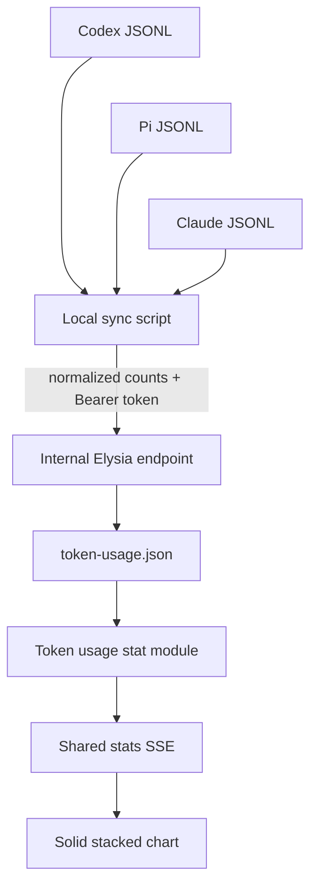
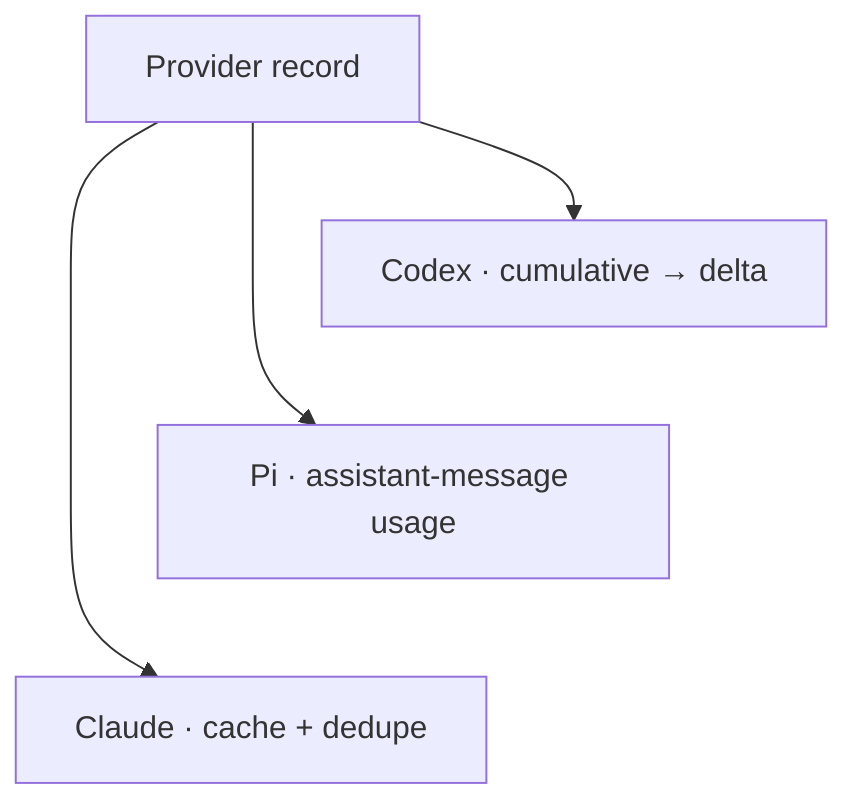
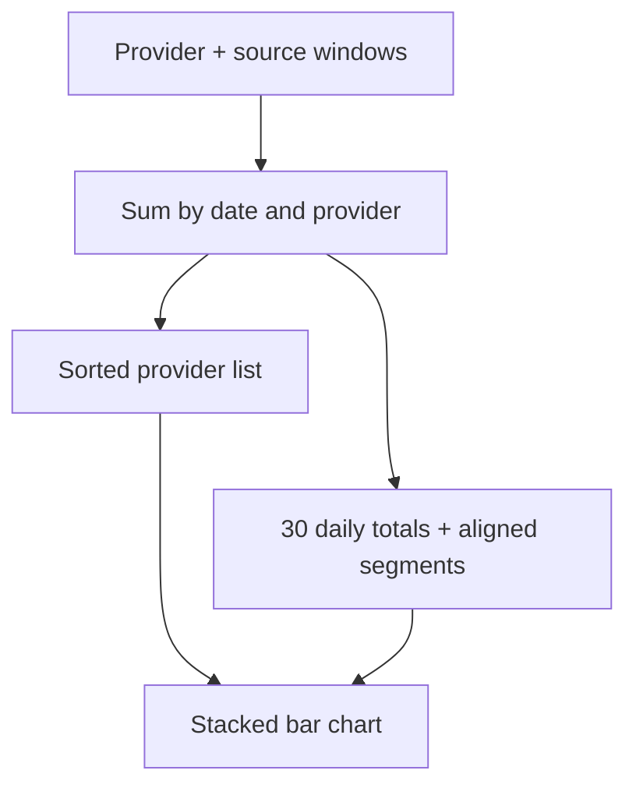

import { TokenUsageMergeLab } from "@web/content/labs/token-usage-merge-lab";

The [custom i18n runtime](/content/a-small-custom-i18n-runtime-for-astro) was small tooling built around the way this site is authored. The last integration in this series starts from another local detail: the JSONL session files written by the coding agents I use.

Those files already contain token-usage events. The portfolio already has a pipeline for dated history and live panels. The interesting work was not drawing another chart; it was turning provider-specific local records into one small, safe input for that pipeline.

The result supports Codex, Pi, and Claude sessions. A Bun script reads their files on the machine where they exist, aggregates counts by day, and sends normalized payloads to a protected internal endpoint. The server merges sources into a rolling 30-day stat and exposes only daily provider totals to the public telemetry stream.



## Parse where the private data already lives

The production server should not mount my agent directories or understand every session format. [`scripts/token-usage-sync.ts`](https://github.com/ErickCReis/ErickCReis/blob/main/scripts/token-usage-sync.ts) runs separately, with local filesystem access and an explicit destination URL.

By default it looks in the usual provider homes:

- `~/.codex/sessions` for Codex;
- `~/.pi/agent/sessions` for Pi;
- `~/.claude/projects` for Claude.

Environment variables can replace each home, sessions directory, and source ID. A provider list can limit a run, and a dry-run mode prints the payload without sending it. The normal `bun run tokens:sync` command can therefore be invoked manually or by a scheduler without changing the web server lifecycle.

The privacy boundary is the aggregation step. The script reads session records locally, but the payload contains only a provider ID, source ID, generation time, and daily input, cached-input, output, reasoning, and total counts. It does not upload prompts, responses, tool calls, file paths, model names, session IDs, or message IDs.

The source ID can reveal a machine label if it is derived from a non-Linux hostname, and the resulting per-provider activity is intentionally published by the stats API. “No session content” is a narrow claim, not a claim that the telemetry reveals nothing.

## Each provider needs its own accounting adapter

JSONL is only a container format. The records inside it do not agree on where usage lives or whether a number is a per-message value or a cumulative total.

The Codex adapter selects `event_msg` records with a `token_count` payload. When an event has cumulative `total_token_usage`, the parser subtracts the previous cumulative value to obtain the new delta. Some records expose only `last_token_usage`; a fingerprint prevents the same adjacent value from being counted again.

Pi records usage on assistant messages. The adapter reads each assistant message's usage object directly and accepts the common snake-case and camel-case field variants handled by the normalizer.

Claude also records assistant-message usage, but its input accounting separates uncached input, cache reads, and cache creation. The adapter adds all three to an inclusive input total, tracks cache reads as cached input, and adds output for the overall count. Resumed Claude sessions can repeat the same assistant response in more than one file, so the parser deduplicates records by the API message ID before aggregation.



Malformed JSON lines, irrelevant event types, invalid timestamps, and absent session directories are skipped instead of aborting the whole scan. That makes the collector tolerant of mixed log contents, but it also means a provider format change can look like a quiet drop to zero. Provider parsers need fixtures and monitoring as those upstream formats evolve.

## Dates and sources make reruns stable

Every accepted delta is assigned to a date using its event timestamp and `TOKEN_USAGE_TIMEZONE`, which defaults to `America/Sao_Paulo`. The script keeps the configured window—30 days by default—and sorts its daily payload before sending.

The normalized contract in [`shared/stats/token-usage.ts`](https://github.com/ErickCReis/ErickCReis/blob/main/shared/stats/token-usage.ts) is independent of the JSONL shapes:

```ts
type TokenUsageSyncPayload = {
  sourceId: string;
  providerId: string;
  generatedAt: number;
  daily: Array<{
    date: string;
    inputTokens: number;
    cachedInputTokens: number;
    outputTokens: number;
    reasoningOutputTokens: number;
    totalTokens: number;
  }>;
  totals?: { totalTokens: number } | null;
};
```

`providerId` describes the adapter and chart segment. `sourceId` distinguishes copies of that provider on different machines. The server treats the pair as a replaceable snapshot: syncing `codex-workstation` again replaces that source's previous 30-day window instead of adding the same sessions twice. Different sources are summed when they contribute to the same provider and date.

That compound identity—not the token count—is the merge instruction. Repeating the same pair replaces one window; a previously unseen pair creates another window that contributes to the aggregate. Scheduler reruns can therefore be safe without collapsing activity from separate machines.

The defaults prefix a machine fingerprint with the provider. On Linux the script uses the stable label `vps-prod`; on other systems it normalizes the hostname. Multiple Linux machines therefore need explicit source-ID overrides or they would replace one another. Stable merging depends on stable IDs also being unique.

Choose a provider/source key, adjust its token total, and sync it. An existing key replaces its previous window; a new source adds another window to the public aggregate.

<TokenUsageMergeLab client:visible locale="en-US" />

Stale windows still contribute to the total in this model. What the newest source can hide is their stale status, not their token count.

## A protected write into a local file

The script validates its own payload with Valibot, then sends it to `POST /internal/token-usage/sync` with a Bearer token. [`server/internal/routes.ts`](https://github.com/ErickCReis/ErickCReis/blob/main/server/internal/routes.ts) returns `503` when sync is not configured, `401` for a missing or incorrect token, and `400` for a payload that fails the same shared schema.

Authentication protects the ability to write telemetry; it is not a user login system. The token belongs in the environment on both sides and the endpoint is called over HTTPS in production.

Accepted payloads are persisted in `token-usage.json` under the application's data directory. [`server/stats/token-usage.ts`](https://github.com/ErickCReis/ErickCReis/blob/main/server/stats/token-usage.ts) serializes in-process writes through a promise queue, refreshes the latest file before each update, writes a uniquely named temporary file, and renames it over the target. A failed write removes its temporary file rather than leaving a partially written store as the current state.

This stat does not need SQLite's query model. The complete persisted unit is a small, versioned list of source windows, and each sync replaces one member of that list. A validated JSON file plus atomic rename matches that shape.

## From source windows to a public snapshot

The stat module reads the file at startup and checks it every 30 seconds. Even when the modification time is unchanged, it rebuilds derived state when necessary so the current date window and freshness flag can move with time.

For each of the last 30 date keys, it sums sources by provider, sorts provider IDs, and creates an index-aligned `byProvider` array. It then derives today's total and the 30-day total. Reusing the [shared stats pipeline](/content/the-stats-pipeline) only requires the token module, its history projection and tuple transport, a Solid store, and stream dispatch.

The panel maps each day to a stacked bar. Known providers receive stable colors and labels; unknown provider IDs still get fallback colors. The trigger shows today's compact total, the body shows exact today and 30-day totals, and the footer shows the newest `generatedAt` time across the sources.



Only totals by provider and day enter the public snapshot. The server retains the detailed normalized token categories in its local file, but the browser does not need them for this chart.

## Freshness and comparability are limits, not footnotes

The module marks a snapshot stale when its newest `generatedAt` is older than the configured threshold, three hours by default. That boolean travels through the transport and history store. The current panel does not yet render a distinct stale warning; it only shows the update time. Carrying freshness in the contract is useful, but the visible product should still make stale data unmistakable.

Freshness is also calculated from the newest source in the aggregate. One provider syncing successfully can keep the whole snapshot fresh while another provider has stopped. Per-source generation times and stale states would be a better model if the panel needs to diagnose individual collectors.

Finally, token counts are not a productivity score. Providers and models tokenize text differently, report cache activity differently, and may include different categories in their totals. Adding their counts is useful as a rough activity footprint for my own dashboard. It is not a fair comparison of agent quality, completed work, API cost, or energy use.

That caveat is part of making token usage a first-class stat: a first-class metric has a source, a normalization rule, a freshness policy, a privacy boundary, and an honest explanation of what it cannot measure.

## The shape behind the series

This integration closes the same loop as the rest of the portfolio. Keep private, provider-specific parsing close to the source. Send a small validated contract across the network. Let the server own persistence and aggregation. Reuse one transport and reactive store pattern for the visible surface.

Across cursor presence, external APIs, runtime health, static content, localization, and token sync, the recurring architecture is not a particular framework. It is a preference for explicit boundaries: static when possible, live where it adds meaning, and small integrations that remain inspectable when they are composed.
