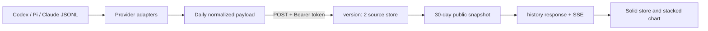

Token usage arrives in incompatible record shapes. Codex emits cumulative and per-turn values, Pi attaches usage to assistant messages, and Claude splits input into uncached, cache-read, and cache-creation fields. Those records also live in private JSONL session files that should never become server inputs directly.

Provider adapters turn local records into event deltas. A collector groups them by calendar day, the server stores one replaceable window per source, and the browser receives a rolling 30-day projection.


```mermaid center
flowchart LR
  Logs["Codex / Pi / Claude JSONL"] --> Adapters["Provider adapters"]
  Adapters --> Daily["Daily normalized payload"]
  Daily -->|"POST + Bearer token"| Store["version: 2 source store"]
  Store --> Snapshot["30-day public snapshot"]
  Snapshot --> Transport["history response + SSE"]
  Transport --> Panel["Solid store and stacked chart"]
```

## Normalize events before aggregating time

[`scripts/token-usage-sync.ts`](https://github.com/ErickCReis/ErickCReis/blob/main/scripts/token-usage-sync.ts) owns filesystem access and provider-specific parsing. It scans `~/.codex/sessions`, `~/.pi/agent/sessions`, and `~/.claude/projects` by default; environment variables can override homes, session directories, provider selection, source IDs, window length, and timezone.

All adapters produce the same internal delta:

```ts
type TokenUsageDelta = {
  inputTokens: number;
  cachedInputTokens: number;
  outputTokens: number;
  reasoningOutputTokens: number;
  totalTokens: number;
};
```

The general normalizer accepts common snake-case and camel-case field names. Missing or non-finite values become zero. If a record does not provide a positive total, the collector uses `input + output`; cached input is clamped so that it cannot exceed normalized input:

```ts
function toDelta(raw: RawUsage): TokenUsageDelta {
  const totalTokens =
    raw.total_tokens > 0 ? raw.total_tokens : raw.input_tokens + raw.output_tokens;
  const cachedInputTokens = Math.min(raw.cached_input_tokens, raw.input_tokens);

  return {
    inputTokens: raw.input_tokens,
    cachedInputTokens,
    outputTokens: raw.output_tokens,
    reasoningOutputTokens: raw.reasoning_output_tokens,
    totalTokens,
  };
}
```

That gives the local collector two invariants:

- every emitted field is finite and non-negative;
- `cachedInputTokens <= inputTokens`.

It deliberately does **not** assert that `totalTokens` equals the sum of all visible categories. A provider-supplied total wins, and reasoning or cache fields may be subsets rather than additive dimensions.

## Provider adapters encode different accounting models

For Codex, the adapter reads `event_msg` records with a `token_count` payload. `total_token_usage` is cumulative within a session, so each field becomes `Math.max(current - previous, 0)`. If only `last_token_usage` exists, the adapter treats it as a per-turn sample and suppresses an immediately repeated fingerprint. It does not deduplicate repeated records elsewhere in the file.

Pi records are simpler: only `message` entries whose message role is `assistant` are accepted, and each message's usage is treated as an independent sample.

Claude also emits assistant-message usage, but `input_tokens` excludes prompt-cache activity. The adapter defines inclusive input as:

```ts
const inputTokens =
  uncachedInput + cacheReadInput + cacheCreationInput;
const totalTokens = inputTokens + outputTokens;
```

`cachedInputTokens` contains cache reads only; cache creation contributes to inclusive input but has no separate public field. Resumed Claude sessions can repeat an API response across files, so one collector run keeps a `Set` of message IDs and counts each known ID once. Records without an ID cannot receive that protection.

Malformed JSON, unrelated event types, invalid timestamps, and missing session directories are skipped. This keeps one damaged line from aborting a scan, but it creates a critical operational behavior: a missing directory or an incompatible upstream format can produce a valid empty payload. Because source sync is replacement-based, successfully sending that payload clears the server's previous active window for that source.

## Calendar aggregation is timezone-sensitive

Accepted deltas are assigned to dates with `Intl.DateTimeFormat("sv-SE", ...)`, producing sortable `YYYY-MM-DD` keys in `TOKEN_USAGE_TIMEZONE` (`America/Sao_Paulo` by default). Only keys inside the configured window are retained:

```ts
const dateKey = formatter.format(new Date(timestamp));
if (dateKey < since || dateKey > until) return;

const day = dailyUsage.get(dateKey) ?? createEmptyDay();
addDeltaToDay(day, delta);
dailyUsage.set(dateKey, day);
```

Daily aggregation is component-wise addition. The outgoing array is sorted by date, making payloads deterministic apart from `generatedAt`.

There is one boundary condition to understand: the collector computes `since` and `until` with the host's local calendar, while event keys use `TOKEN_USAGE_TIMEZONE`. Deployments whose host timezone differs from the configured aggregation timezone can disagree around midnight. A stricter implementation would derive both the range and event keys from the same calendar abstraction.

## The sync payload is a replaceable source snapshot

The shared Valibot schema in [`shared/stats/token-usage.ts`](https://github.com/ErickCReis/ErickCReis/blob/main/shared/stats/token-usage.ts) defines the write boundary:

```ts
const tokenUsageSyncPayloadSchema = v.object({
  sourceId: v.pipe(v.string(), v.minLength(1)),
  providerId: v.pipe(v.string(), v.minLength(1)),
  generatedAt: nonNegativeNumber,
  daily: v.array(tokenUsageDatedDaySchema),
  totals: v.optional(v.nullable(v.object({ totalTokens: nonNegativeNumber }))),
});
```

The collector validates this payload before sending it. `POST /internal/token-usage/sync` checks the Bearer token, validates the same schema, and returns `503`, `401`, or `400` for missing configuration, failed authentication, or invalid input respectively.

The merge identity is the ordered pair:

```txt
(providerId, sourceId)
```

On every accepted sync, the server removes the existing member with that pair and inserts the new window. This makes scheduler retries idempotent at source-window granularity. A second machine must use a different `sourceId`, or its snapshot will overwrite the first machine's snapshot. The Linux default fingerprint is the fixed label `vps-prod`, so explicit source IDs are required when multiple Linux machines report the same provider.

The schema guarantees shapes, date syntax, and non-negative numbers. It does not enforce equations such as `cachedInputTokens <= inputTokens`; another authorized producer could violate the collector's assumptions.

## Persistence is a versioned file with process-local serialization

The server stores the complete normalized input in `token-usage.json` under `DATA_DIR`. Its persisted shape is deliberately small:

```ts
const persistedStoreSchema = v.object({
  version: v.literal(2),
  sources: v.array(persistedSourceSchema),
});
```

Before writing, the module reloads the current file, removes dates outside the active 30-day window, and collapses duplicate dates within a source using last-entry-wins semantics. It then replaces the matching source and sorts sources by provider and source ID.

Writes pass through an in-process promise queue. Each update is written to a uniquely named temporary file and renamed over the destination:

```ts
writeQueue = writeQueue.catch(() => {}).then(async () => {
  await refreshFromDisk(true);
  // replace (providerId, sourceId), then serialize
  await Bun.write(tempPath, serialized);
  await rename(tempPath, filePath);
});
```

The rename prevents partial reads, and the queue serializes writes inside one process. Two processes sharing the file could still race. Invalid persisted data is logged and ignored; only version `2` is accepted.

## The public projection has index-aligned provider vectors

The public snapshot does not expose source IDs or detailed token categories. For each of the 30 active dates, the server sums `totalTokens` first across sources and then by provider. Provider IDs are sorted once, and each day uses the same positional order:

```ts
const providers = getProviderIds(store); // sorted
const byProvider = providers.map(
  (providerId) => entry.byProvider.get(providerId) ?? 0,
);

return {
  date: entry.date,
  totalTokens: byProvider.reduce((sum, value) => sum + value, 0),
  byProvider,
};
```

The invariant is:

```txt
daily[d].byProvider[i] belongs to providers[i]
daily[d].totalTokens = sum(daily[d].byProvider)
```

Zero-filled days are included, so a non-empty snapshot has exactly 30 calendar points. `todayTokens` is the last point and `totalTokens30d` is the sum of all points.

The transport in [`shared/stats/token-usage.transport.ts`](https://github.com/ErickCReis/ErickCReis/blob/main/shared/stats/token-usage.transport.ts) compresses the snapshot into a positional tuple:

```ts
type TokenUsageSnapshotTuple = [
  timestamp,
  generatedAt,
  isStale,
  todayTokens,
  totalTokens30d,
  providers,
  Array<[date, totalTokens, byProvider]>,
];
```

That reduces repeated property names in history and SSE payloads, but tuple order becomes a protocol. Adding or reordering a field requires coordinated serializers and deserializers; the browser deserializer does not independently validate the tuple.

## Polling and versions suppress redundant SSE events

The token module checks the file every 30 seconds. An unchanged modification time avoids reparsing the file, but the server still rebuilds derived state so midnight window shifts and stale-state transitions can occur without a write.

`areSnapshotsEqual` compares all public semantic fields except the observation `timestamp`. Only a changed snapshot calls `markDirty`, appends a history sample, and increments the module version. The shared SSE loop polls module versions every 500 ms and emits token usage only after its version advances.

The browser first loads `/stats/history`, then receives `tu` stream events. Its Solid store merges history points by `timestamp`, sorts them, and keeps the latest 30 state changes. That history is not the chart's 30 daily buckets: the panel renders `latest.daily`, while store history tracks successive server snapshots.

The panel assumes the provider-vector invariant to build stacked segments. Known providers have fixed colors; unknown IDs receive deterministic fallback colors by index. It shows today's total, the 30-day total, and the newest generation time.

## Error and freshness semantics define what the metric means

Freshness is calculated from the newest `generatedAt` across all sources and defaults to stale after 180 minutes. The reduction starts at `null` so an empty store remains distinguishable from a timestamp:

```ts
const generatedAt = store.sources.reduce<number | null>(
  (latest, source) =>
    latest == null || source.generatedAt > latest ? source.generatedAt : latest,
  null,
);
const isStale =
  generatedAt === null || Date.now() - generatedAt > staleAfterMs;
```

This is aggregate freshness. One healthy source can keep the snapshot fresh while another source has stopped reporting. The `isStale` value reaches the client, but the current panel only renders the generation time, not a distinct warning. Per-source health would require preserving source freshness in a private diagnostic projection or exposing a carefully designed public summary.

Other limits are intrinsic to the metric:

- tokenizers differ across providers and models;
- cache creation and cache reads have provider-specific meanings;
- cumulative-counter resets can lose information even when negative deltas are clamped;
- deduplication is only as strong as the identifiers present in the logs;
- zero can mean no usage, no files, malformed records, or a provider format change;
- token totals do not measure completed work, quality, latency, cost, or energy.
