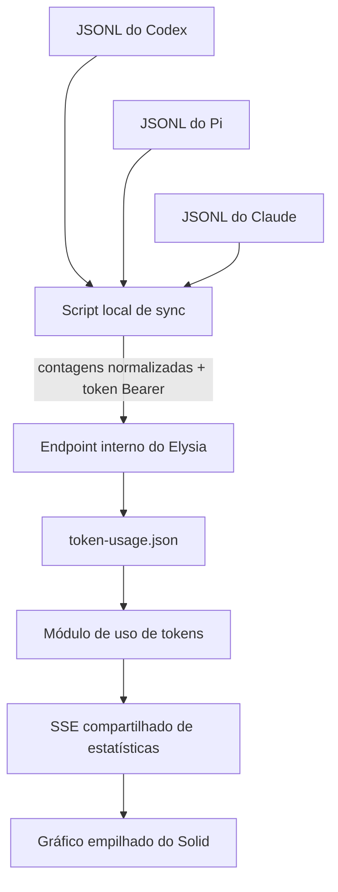
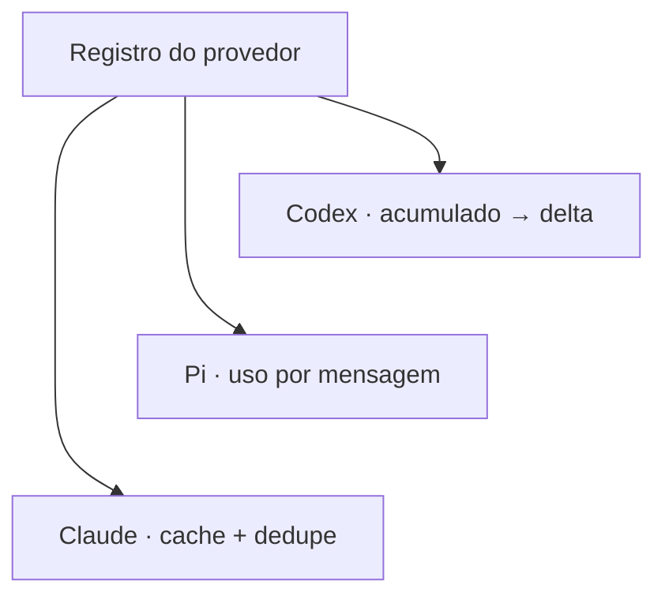
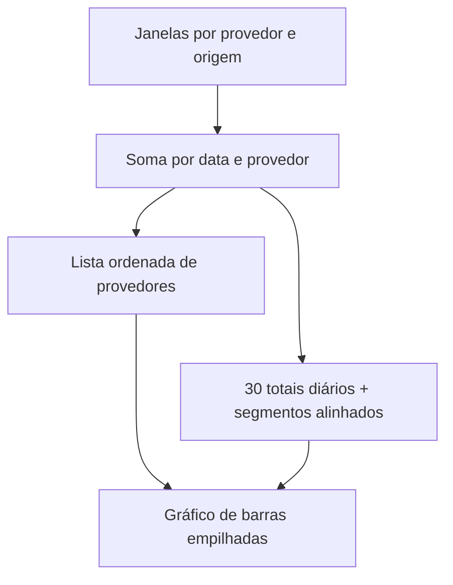

import { TokenUsageMergeLab } from "@web/content/labs/token-usage-merge-lab";

O [runtime customizado de i18n](/pt-BR/content/a-small-custom-i18n-runtime-for-astro) foi uma pequena ferramenta construída em torno da forma como este site é escrito. A última integração da série começa em outro detalhe local: os arquivos de sessão JSONL gravados pelos agentes de programação que uso.

Esses arquivos já contêm eventos de uso de tokens. O portfólio já tem um pipeline para históricos datados e painéis dinâmicos. O trabalho interessante não era desenhar mais um gráfico; era transformar registros locais específicos de cada provedor em uma entrada pequena e segura para aquele pipeline.

O resultado aceita sessões do Codex, Pi e Claude. Um script do Bun lê seus arquivos na máquina em que existem, agrega as contagens por dia e envia payloads normalizados para um endpoint interno protegido. O servidor combina as fontes em uma estatística móvel de 30 dias e expõe apenas os totais diários por provedor no fluxo público de telemetria.



## Processar onde os dados privados já estão

O servidor de produção não deve montar meus diretórios de agentes nem entender todos os formatos de sessão. O arquivo [`scripts/token-usage-sync.ts`](https://github.com/ErickCReis/ErickCReis/blob/main/scripts/token-usage-sync.ts) roda separadamente, com acesso ao sistema de arquivos local e uma URL de destino explícita.

Por padrão, ele procura nos diretórios usuais de cada provedor:

- `~/.codex/sessions` para o Codex;
- `~/.pi/agent/sessions` para o Pi;
- `~/.claude/projects` para o Claude.

Variáveis de ambiente podem substituir a raiz, o diretório de sessões e o ID de origem de cada provedor. Uma lista de provedores pode limitar uma execução, e um modo dry run imprime o payload sem enviá-lo. Assim, o comando normal `bun run tokens:sync` pode ser chamado manualmente ou por um agendador sem alterar o ciclo de vida do servidor web.

A fronteira de privacidade está na etapa de agregação. O script lê os registros de sessão localmente, mas o payload contém apenas ID do provedor, ID da origem, horário de geração e contagens diárias de entrada, entrada em cache, saída, raciocínio e total. Ele não envia prompts, respostas, chamadas de ferramentas, caminhos de arquivos, nomes de modelos, IDs de sessões nem IDs de mensagens.

O ID da origem pode revelar o nome da máquina quando é derivado do hostname em um sistema que não é Linux, e a atividade resultante por provedor é publicada intencionalmente pela API de estatísticas. “Sem conteúdo da sessão” é uma afirmação estreita, não uma promessa de que a telemetria não revela nada.

## Cada provedor precisa do próprio adaptador contábil

JSONL é apenas um formato de armazenamento. Os registros internos não concordam sobre onde o uso aparece nem sobre um número representar o valor de uma mensagem ou um total cumulativo.

O adaptador do Codex seleciona registros `event_msg` com um payload `token_count`. Quando o evento contém `total_token_usage` cumulativo, o parser subtrai o total cumulativo anterior para obter o novo delta. Alguns registros expõem apenas `last_token_usage`; uma impressão digital impede que o mesmo valor adjacente seja contado novamente.

O Pi registra o uso nas mensagens do assistente. O adaptador lê diretamente o objeto de uso de cada mensagem do assistente e aceita as variações comuns dos campos em snake case e camel case tratadas pelo normalizador.

O Claude também registra uso em mensagens do assistente, mas sua contagem de entrada separa entrada sem cache, leitura do cache e criação do cache. O adaptador soma as três em um total de entrada que inclui todas essas categorias, registra as leituras como entrada em cache e adiciona a saída para formar o total geral. Sessões retomadas do Claude podem repetir a mesma resposta do assistente em mais de um arquivo, então o parser deduplica os registros pelo ID da mensagem da API antes da agregação.



Linhas JSON malformadas, tipos de eventos irrelevantes, timestamps inválidos e diretórios de sessão ausentes são ignorados em vez de interromper toda a leitura. Isso torna o coletor tolerante a logs com conteúdo variado, mas também permite que uma mudança no formato do provedor pareça uma queda silenciosa para zero. Os parsers precisam de fixtures e monitoramento conforme esses formatos externos evoluem.

## Datas e origens tornam as reexecuções estáveis

Cada delta aceito é atribuído a uma data a partir do timestamp do evento e de `TOKEN_USAGE_TIMEZONE`, cujo padrão é `America/Sao_Paulo`. O script mantém a janela configurada — 30 dias por padrão — e ordena o payload diário antes do envio.

O contrato normalizado em [`shared/stats/token-usage.ts`](https://github.com/ErickCReis/ErickCReis/blob/main/shared/stats/token-usage.ts) não depende dos formatos JSONL:

```ts
type TokenUsageSyncPayload = {
  sourceId: string;
  providerId: string;
  generatedAt: number;
  daily: Array<{
    date: string;
    inputTokens: number;
    cachedInputTokens: number;
    outputTokens: number;
    reasoningOutputTokens: number;
    totalTokens: number;
  }>;
  totals?: { totalTokens: number } | null;
};
```

`providerId` descreve o adaptador e o segmento do gráfico. `sourceId` diferencia cópias daquele provedor em máquinas distintas. O servidor trata o par como um retrato substituível: sincronizar `codex-workstation` novamente substitui a janela anterior de 30 dias daquela origem, em vez de somar as mesmas sessões duas vezes. Origens distintas são somadas quando contribuem para o mesmo provedor e a mesma data.

Essa identidade composta — e não a contagem de tokens — determina como os dados são combinados. Repetir o mesmo par substitui uma janela; um par ainda não visto cria outra janela, que passa a contribuir para o conjunto. Assim, as reexecuções de um agendador podem ser seguras sem misturar a atividade de máquinas distintas.

Os padrões adicionam o provedor como prefixo de uma impressão digital da máquina. No Linux, o script usa o rótulo estável `vps-prod`; nos outros sistemas, normaliza o hostname. Várias máquinas Linux, portanto, precisam de IDs de origem explícitos ou substituirão os dados umas das outras. Uma combinação estável depende de IDs que sejam estáveis e também únicos.

Escolha uma chave de provedor e origem, ajuste o total de tokens e sincronize. Uma chave existente substitui a janela anterior; uma nova origem acrescenta outra janela ao total público.

<TokenUsageMergeLab client:visible locale="pt-BR" />

Janelas antigas continuam contribuindo para o total neste modelo. O que a origem mais nova pode ocultar é o estado desatualizado delas, não a contagem de tokens.

## Uma gravação protegida em um arquivo local

O script valida o próprio payload com Valibot e o envia para `POST /internal/token-usage/sync` com um token Bearer. O arquivo [`server/internal/routes.ts`](https://github.com/ErickCReis/ErickCReis/blob/main/server/internal/routes.ts) retorna `503` quando a sincronização não está configurada, `401` quando o token está ausente ou incorreto e `400` quando o payload não passa pelo mesmo schema compartilhado.

A autenticação protege a capacidade de gravar telemetria; ela não forma um sistema de login de usuários. O token deve permanecer no ambiente dos dois lados, e o endpoint é acessado por HTTPS em produção.

Payloads aceitos são persistidos em `token-usage.json`, dentro do diretório de dados da aplicação. O arquivo [`server/stats/token-usage.ts`](https://github.com/ErickCReis/ErickCReis/blob/main/server/stats/token-usage.ts) serializa as gravações dentro do processo em uma fila de promessas, atualiza a leitura do arquivo antes de cada mudança, grava um arquivo temporário com nome único e o renomeia para substituir o destino. Uma falha remove o arquivo temporário em vez de deixá-lo parcialmente gravado como estado atual.

Essa estatística não precisa do modelo de consultas do SQLite. A unidade persistida completa é uma lista pequena e versionada de janelas por origem, e cada sincronização substitui um item dessa lista. Um arquivo JSON validado com renomeação atômica combina com esse formato.

## De janelas por origem a um retrato público

O módulo de estatísticas lê o arquivo ao iniciar e o verifica a cada 30 segundos. Mesmo quando a data de modificação não muda, ele reconstrói o estado derivado quando necessário, permitindo que a janela da data atual e o indicador de atualização mudem com o tempo.

Para cada uma das últimas 30 datas, ele soma as origens por provedor, ordena os IDs dos provedores e cria um vetor `byProvider` alinhado pelos índices. Depois, deriva o total de hoje e o total dos 30 dias. Reutilizar o [pipeline compartilhado de estatísticas](/pt-BR/content/the-stats-pipeline) exige apenas o módulo de tokens, sua projeção de histórico e o transporte por tuplas, um store do Solid e o encaminhamento dos eventos.

O painel transforma cada dia em uma barra empilhada. Provedores conhecidos recebem cores e rótulos estáveis; IDs desconhecidos ainda recebem cores alternativas. O gatilho mostra o total compacto de hoje, o conteúdo mostra os totais exatos de hoje e dos 30 dias, e o rodapé mostra o `generatedAt` mais recente entre as origens.



Somente os totais por provedor e dia entram no retrato público. O servidor mantém as categorias detalhadas e normalizadas de tokens em seu arquivo local, mas o navegador não precisa delas para este gráfico.

## Atualização e comparabilidade são limites, não notas de rodapé

O módulo marca um retrato como desatualizado quando o `generatedAt` mais novo ultrapassa o limite configurado, que por padrão é de três horas. Esse booleano atravessa o transporte e o store de histórico. O painel atual ainda não renderiza um aviso de desatualização; ele mostra apenas o horário da atualização. Levar essa informação no contrato é útil, mas o produto visível ainda deve tornar dados antigos inconfundíveis.

A atualização também é calculada a partir da origem mais nova do conjunto. Um provedor sincronizado com sucesso pode manter todo o retrato atualizado enquanto outro deixou de sincronizar. Horários de geração e estados de atualização por origem seriam um modelo melhor se o painel precisasse diagnosticar coletores individuais.

Por fim, a quantidade de tokens não é uma medida de produtividade. Provedores e modelos dividem texto em tokens de formas diferentes, registram atividade de cache de formas diferentes e podem incluir categorias distintas em seus totais. Somar as contagens é útil como um retrato aproximado de atividade no meu painel pessoal. Não é uma comparação justa de qualidade do agente, trabalho concluído, custo de API nem consumo de energia.

Essa ressalva faz parte de tratar o uso de tokens como uma estatística de primeira classe: uma métrica de primeira classe tem uma origem, uma regra de normalização, uma política de atualização, uma fronteira de privacidade e uma explicação honesta sobre o que não consegue medir.

## O formato por trás da série

Esta integração fecha o mesmo ciclo do restante do portfólio. Manter o processamento privado e específico do provedor perto da fonte. Enviar um pequeno contrato validado pela rede. Deixar o servidor cuidar da persistência e da agregação. Reutilizar um único padrão de transporte e store reativo na superfície visível.

Entre presença de cursores, APIs externas, saúde do runtime, conteúdo estático, localização e sincronização de tokens, a arquitetura recorrente não é um framework específico. É uma preferência por fronteiras explícitas: estático quando possível, dinâmico quando acrescenta significado e pequenas integrações que continuam inspecionáveis quando são combinadas.
