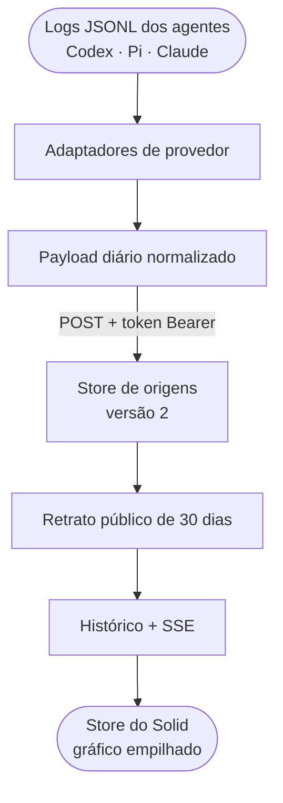

O uso de tokens chega em formatos incompatíveis. O Codex emite valores cumulativos e por turno. O Pi associa o uso às mensagens do assistente. O Claude separa a entrada entre campos sem cache, leitura de cache e criação de cache. Esses registros ficam em arquivos de sessão JSONL privados, que não devem virar entradas diretas do servidor.

Adaptadores de provedor transformam registros locais em deltas por evento. Um coletor os agrupa por dia, o servidor armazena uma janela substituível por origem e o navegador recebe uma projeção móvel de 30 dias.


```mermaid center
flowchart TB
  Logs(["Logs JSONL dos agentes<br/>Codex · Pi · Claude"]) --> Adapters["Adaptadores de provedor"]
  Adapters --> Daily["Payload diário normalizado"]
  Daily -->|"POST + token Bearer"| Store["Store de origens<br/>versão 2"]
  Store --> Snapshot["Retrato público de 30 dias"]
  Snapshot --> Transport["Histórico + SSE"]
  Transport --> Panel(["Store do Solid<br/>gráfico empilhado"])
```

## Normalizar eventos antes de agregá-los por data

O arquivo [`scripts/token-usage-sync.ts`](https://github.com/ErickCReis/ErickCReis/blob/main/scripts/token-usage-sync.ts) cuida do acesso ao sistema de arquivos e do parsing específico de cada provedor. Por padrão, ele percorre `~/.codex/sessions`, `~/.pi/agent/sessions` e `~/.claude/projects`. Variáveis de ambiente podem substituir diretórios, seleção de provedores, IDs de origem, tamanho da janela e fuso horário.

Todos os adaptadores produzem o mesmo delta interno:

```ts
type TokenUsageDelta = {
  inputTokens: number;
  cachedInputTokens: number;
  outputTokens: number;
  reasoningOutputTokens: number;
  totalTokens: number;
};
```

O normalizador geral aceita nomes de campos comuns em snake case e camel case. Ele transforma valores ausentes ou não finitos em zero. Quando um registro não fornece um total positivo, o coletor usa `input + output`. Também limita a entrada em cache para que ela não ultrapasse a entrada normalizada:

```ts
function toDelta(raw: RawUsage): TokenUsageDelta {
  const totalTokens =
    raw.total_tokens > 0 ? raw.total_tokens : raw.input_tokens + raw.output_tokens;
  const cachedInputTokens = Math.min(raw.cached_input_tokens, raw.input_tokens);

  return {
    inputTokens: raw.input_tokens,
    cachedInputTokens,
    outputTokens: raw.output_tokens,
    reasoningOutputTokens: raw.reasoning_output_tokens,
    totalTokens,
  };
}
```

Assim, o coletor local mantém duas invariantes:

- todos os campos emitidos são finitos e não negativos;
- `cachedInputTokens <= inputTokens`.

O coletor **não** exige que `totalTokens` seja igual à soma de todas as categorias visíveis. O total informado pelo provedor tem precedência porque os campos de raciocínio e cache podem ser subconjuntos, não valores que devem ser somados.

## Os adaptadores codificam modelos contábeis diferentes

No Codex, o adaptador lê registros `event_msg` com payload `token_count`. `total_token_usage` é cumulativo dentro da sessão, então cada campo vira `Math.max(atual - anterior, 0)`. Se houver apenas `last_token_usage`, o adaptador o considera uma amostra por turno e descarta a repetição imediata da mesma assinatura. O mesmo registro não é deduplicado quando aparece em outra parte do arquivo.

Os registros do Pi são mais simples. O adaptador aceita somente entradas `message` cuja mensagem tem o papel `assistant` e trata o uso de cada mensagem como uma amostra independente.

O Claude também emite uso em mensagens do assistente, mas `input_tokens` não inclui a atividade do cache de prompts. O adaptador define a entrada inclusiva como:

```ts
const inputTokens =
  uncachedInput + cacheReadInput + cacheCreationInput;
const totalTokens = inputTokens + outputTokens;
```

`cachedInputTokens` contém apenas leituras do cache; a criação de cache contribui para a entrada inclusiva, mas não possui um campo público separado. Sessões retomadas do Claude podem repetir uma resposta da API em vários arquivos. Por isso, uma execução do coletor mantém um `Set` de IDs de mensagem e conta cada ID conhecido uma vez. Registros sem ID não recebem essa proteção.

O coletor ignora JSON malformado, tipos de evento não relacionados, timestamps inválidos e diretórios de sessão ausentes. Uma linha danificada não encerra a leitura. Há um risco nessa escolha. Um diretório ausente ou um formato externo incompatível pode gerar um payload vazio, mas válido. Como cada sincronização substitui a janela da origem, enviar esse payload apaga a janela ativa anterior daquela origem no servidor.

## A agregação por calendário depende do fuso horário

Os deltas aceitos recebem datas por meio de `Intl.DateTimeFormat("sv-SE", ...)`, que produz chaves `YYYY-MM-DD` ordenáveis em `TOKEN_USAGE_TIMEZONE` (`America/Sao_Paulo` por padrão). Somente chaves dentro da janela configurada são mantidas:

```ts
const dateKey = formatter.format(new Date(timestamp));
if (dateKey < since || dateKey > until) return;

const day = dailyUsage.get(dateKey) ?? createEmptyDay();
addDeltaToDay(day, delta);
dailyUsage.set(dateKey, day);
```

A agregação diária soma cada componente separadamente. O vetor enviado é ordenado por data, tornando o payload determinístico com exceção de `generatedAt`.

Um limite de data usa dois relógios. O coletor calcula `since` e `until` pelo calendário local do host, enquanto as chaves dos eventos usam `TOKEN_USAGE_TIMEZONE`. Quando o fuso do host difere do fuso configurado para a agregação, os cálculos podem divergir perto da meia-noite. Uma implementação mais estrita derivaria o intervalo e as chaves dos eventos do mesmo código de calendário.

## O payload de sincronização é um retrato substituível por origem

O schema compartilhado do Valibot em [`shared/stats/token-usage.ts`](https://github.com/ErickCReis/ErickCReis/blob/main/shared/stats/token-usage.ts) define a fronteira de gravação:

```ts
const tokenUsageSyncPayloadSchema = v.object({
  sourceId: v.pipe(v.string(), v.minLength(1)),
  providerId: v.pipe(v.string(), v.minLength(1)),
  generatedAt: nonNegativeNumber,
  daily: v.array(tokenUsageDatedDaySchema),
  totals: v.optional(v.nullable(v.object({ totalTokens: nonNegativeNumber }))),
});
```

O coletor valida esse payload antes do envio. O endpoint `POST /internal/token-usage/sync` verifica o token Bearer, valida o mesmo schema e retorna `503`, `401` ou `400` para configuração ausente, falha de autenticação ou entrada inválida, respectivamente.

A identidade usada na combinação é o par ordenado:

```txt
(providerId, sourceId)
```

A cada sincronização aceita, o servidor remove o membro anterior com esse par e insere a nova janela. Repetir a mesma janela de origem é, portanto, idempotente. Uma segunda máquina precisa usar outro `sourceId`; caso contrário, seu retrato substituirá o retrato da primeira. No Linux, a impressão digital padrão é o rótulo fixo `vps-prod`, então várias máquinas Linux que reportam o mesmo provedor precisam de IDs explícitos.

O schema garante formatos, sintaxe das datas e números não negativos. Ele não impõe equações como `cachedInputTokens <= inputTokens`; outro produtor autorizado poderia violar as premissas do coletor.

## A persistência usa um arquivo versionado e serialização local ao processo

O servidor armazena a entrada normalizada completa em `token-usage.json`, dentro de `DATA_DIR`. O arquivo persistido contém apenas a versão e uma lista de origens:

```ts
const persistedStoreSchema = v.object({
  version: v.literal(2),
  sources: v.array(persistedSourceSchema),
});
```

Antes de gravar, o módulo relê o arquivo atual, remove datas fora da janela ativa de 30 dias e reduz datas duplicadas dentro de uma origem com a regra "a última entrada vence". Em seguida, substitui a origem correspondente e ordena as origens por provedor e ID.

As gravações passam por uma fila de `Promise`s dentro do processo. Cada atualização é escrita em um arquivo temporário com nome único, que depois é renomeado para o caminho de destino, substituindo o arquivo anterior:

```ts
writeQueue = writeQueue.catch(() => {}).then(async () => {
  await refreshFromDisk(true);
  // substitui (providerId, sourceId) e serializa
  await Bun.write(tempPath, serialized);
  await rename(tempPath, filePath);
});
```

A renomeação impede leituras parciais, e a fila serializa gravações dentro de um processo. Dois processos que compartilham o arquivo ainda podem disputar a gravação. O módulo registra e ignora dados persistidos inválidos. Ele aceita somente a versão `2`.

## A projeção pública usa vetores de provedores alinhados por índice

O retrato público não expõe IDs de origem nem as categorias detalhadas de tokens. Para cada uma das 30 datas ativas, o servidor soma `totalTokens` primeiro entre origens e depois por provedor. Os IDs de provedor são ordenados uma vez, e todos os dias usam a mesma ordem posicional:

```ts
const providers = getProviderIds(store); // ordenados
const byProvider = providers.map(
  (providerId) => entry.byProvider.get(providerId) ?? 0,
);

return {
  date: entry.date,
  totalTokens: byProvider.reduce((sum, value) => sum + value, 0),
  byProvider,
};
```

A invariante é:

```txt
daily[d].byProvider[i] pertence a providers[i]
daily[d].totalTokens = sum(daily[d].byProvider)
```

Dias sem atividade são preenchidos com zero, então um retrato não vazio possui exatamente 30 pontos do calendário. `todayTokens` é o último ponto, e `totalTokens30d` é a soma de todos eles.

O transporte em [`shared/stats/token-usage.transport.ts`](https://github.com/ErickCReis/ErickCReis/blob/main/shared/stats/token-usage.transport.ts) comprime o retrato em uma tupla posicional:

```ts
type TokenUsageSnapshotTuple = [
  timestamp,
  generatedAt,
  isStale,
  todayTokens,
  totalTokens30d,
  providers,
  Array<[date, totalTokens, byProvider]>,
];
```

Isso remove nomes de propriedades repetidos dos payloads do histórico e do SSE, mas torna a ordem da tupla parte do protocolo. Adicionar ou reordenar um campo exige mudar serializadores e desserializadores em conjunto. O desserializador do navegador não valida a tupla por conta própria.

## Polling e versões eliminam eventos SSE redundantes

O módulo verifica o arquivo a cada 30 segundos. Quando a data de modificação não mudou, ele pula um novo parsing do JSON. O servidor ainda reconstrói o estado derivado para que a janela de 30 dias avance à meia-noite e o retrato possa ficar desatualizado sem uma nova gravação.

`areSnapshotsEqual` compara todos os campos semânticos públicos, exceto o `timestamp` da observação. Somente quando o retrato muda, o módulo chama `markDirty`, adiciona uma amostra ao histórico e incrementa sua versão. O loop compartilhado de SSE consulta as versões a cada 500 ms e emite uso de tokens apenas depois que essa versão é incrementada.

O navegador carrega primeiro `/stats/history` e depois recebe eventos `tu` pelo stream. O store do Solid combina pontos de histórico pelo `timestamp`, ordena-os e mantém as 30 mudanças de estado mais recentes. Essa não é a mesma série de 30 dias exibida no gráfico. O painel renderiza `latest.daily`, enquanto o histórico do store registra retratos sucessivos do servidor.

O painel depende da invariante dos vetores de provedores para criar segmentos empilhados. Provedores conhecidos têm cores fixas; IDs desconhecidos recebem cores alternativas determinísticas pelo índice. A interface mostra o total de hoje, o total de 30 dias e o horário de geração mais recente.

## A atualidade pode esconder uma origem quebrada

A atualidade é determinada pelo `generatedAt` mais recente entre todas as origens e, por padrão, o retrato se torna desatualizado após 180 minutos. A redução começa em `null` para que um store vazio continue diferente de um timestamp:

```ts
const generatedAt = store.sources.reduce<number | null>(
  (latest, source) =>
    latest == null || source.generatedAt > latest ? source.generatedAt : latest,
  null,
);
const isStale =
  generatedAt === null || Date.now() - generatedAt > staleAfterMs;
```

A atualidade vale para o agregado. Uma origem saudável pode manter o retrato atualizado enquanto outra deixou de reportar. O valor `isStale` chega ao cliente, mas o painel atual mostra apenas o horário de geração, sem um aviso separado. Para diagnosticar cada origem, seria preciso manter o timestamp de cada uma em uma visão privada ou criar um resumo público com esse propósito.

Outros limites pertencem à própria métrica:

- tokenizadores variam entre provedores e modelos;
- criação e leitura de cache têm significados específicos de cada provedor;
- reinícios de contadores cumulativos podem perder informação mesmo com deltas negativos limitados a zero;
- a deduplicação é tão forte quanto os identificadores presentes nos logs;
- zero pode significar ausência de uso, arquivos ausentes, registros malformados ou mudança no formato do provedor;
- totais de tokens não medem trabalho concluído, qualidade, latência, custo nem energia.
