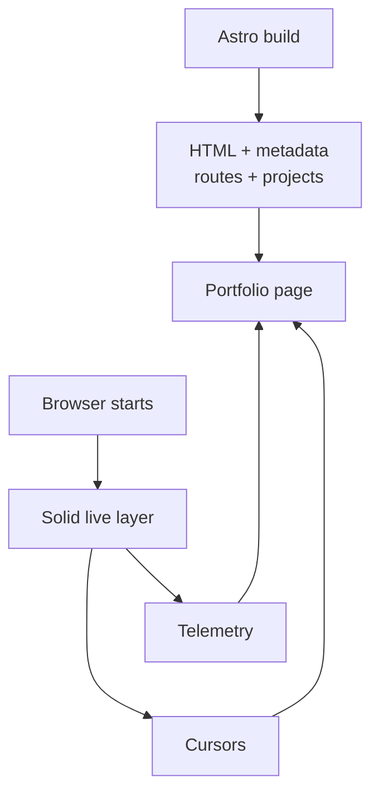

import { IslandBoundaryLab } from "@web/content/labs/island-boundary-lab";

In the [previous post](/content/rewriting-my-portfolio-for-self-hosting), I compressed the frontend architecture into one sentence: [Astro](https://astro.build/) turns most of the site into HTML, and [Solid](https://www.solidjs.com/) starts only the live islands in the browser.

That sentence hides one of the most useful boundaries in the rewrite.

The portfolio content is already part of the generated document. Solid starts later, when the browser needs telemetry, cursor presence, and state shared between those live surfaces. The rewrite removed deployment boundaries, but it did not remove the application boundaries that still help.

## From the container to the page

The previous post ended with two artifacts inside one runtime image: the Astro output in `dist` and the compiled server executable. This post starts inside the first one.

The homepage is an Astro page. During the build it resolves the locale, creates the project list, and renders the heading, description, navigation, and links. The shared Astro layout owns the document metadata, canonical URLs, alternate locales, fonts, and page transitions.

The live layer enters through one line in [`index.astro`](https://github.com/ErickCReis/ErickCReis/blob/main/web/pages/%5B...locale%5D/index.astro):

```astro
<BaseLayout title={title} description={description} lang={locale}>
  <HomeLiveOverlay client:only="solid-js" />

  <main>
    <!-- Portfolio content -->
  </main>
</BaseLayout>
```

The placement is intentional. The Solid component sits beside the main content instead of wrapping it. Astro does not need Solid to render the portfolio, and Solid does not need to own the page to add live behavior to it.



## Why this island is client-only

Astro's [`client:only`](https://docs.astro.build/en/reference/directives-reference/#clientonly) directive skips rendering the component into HTML during the build and renders it in the browser instead. Because there is no server-rendered component markup to resume, this is a client render rather than hydration of that component. The directive is not just a shorter spelling for “make this interactive,” and it is not automatically a performance optimization.

For this overlay, skipping the build-time render is the correct tradeoff. The component depends on browser state such as the viewport size and pointer position. Its telemetry and cursor data also have no useful build-time value. A stat panel generated during the build would be stale before the page reached the browser.

More importantly, the empty state is valid. Until the island starts, there are simply no floating telemetry panels or remote cursors. The heading, project links, navigation, and metadata do not need a loading placeholder because they were never inside the island.

If the JavaScript fails to start, the page is still a portfolio. If the stats stream or WebSocket disconnects, the document does not disappear with it. That failure mode is part of the design.

The boundary inspector below makes that ownership visible. Switch between the architecture I shipped and a counterfactual where the client owns the document, then inject a JavaScript or stream failure. “Client-owned” is deliberately narrower than “SPA”: the comparison is about which layer produced the content, not a verdict on every client-side application.

<IslandBoundaryLab client:load locale="en-US" />

The two failures remove different things. Blocking JavaScript prevents the live island from starting; dropping the stream leaves the island running but without fresh data. In both cases, the generated Astro document remains available because neither dependency owns it.

## One island instead of two

Telemetry and cursor presence look like separate features, but they share one interaction. When a telemetry panel is active, the cursor layer changes how cursor labels are displayed.

The coordination lives in a small component called [`HomeLiveOverlay`](https://github.com/ErickCReis/ErickCReis/blob/main/web/islands/home-live-overlay.tsx):

```tsx
export function HomeLiveOverlay() {
  const { selfId, cursors } = useCursorPresence();
  const [isStatsHovered, setIsStatsHovered] = createSignal(false);

  return (
    <>
      <TelemetryBackdrop placement="hero" onStatsHoverChange={setIsStatsHovered} />
      <CursorPresenceLayer
        selfId={selfId()}
        cursors={cursors()}
        isStatsHovered={isStatsHovered()}
      />
    </>
  );
}
```

A [Solid signal](https://docs.solidjs.com/concepts/signals) is enough to connect them. Keeping both surfaces inside the same island makes that relationship local. Splitting them into independent islands would require another communication mechanism for state that already belongs to the same visual layer.

This is the useful unit for an island in this project: not one island per component and not one framework tree for the entire page, but one boundary around behavior that needs to react together.

## Static does not mean no JavaScript

The boundary is not “Astro has no JavaScript and Solid has all of it.” The base layout still uses Astro's client router, and small page behaviors can remain ordinary scripts. The distinction is about ownership.

Astro owns the document and the content that should exist before browser state is available. Solid owns the component tree whose output changes as signals, streams, pointer positions, and connections change.

There is still a cost to that choice. `client:only` loads the live overlay immediately, and the telemetry panels contain more client code than the rest of the homepage. I am accepting that cost because the overlay is the homepage's main live surface. If it grows far beyond that role, the next step is to split or delay parts of the live layer—not to move the portfolio content into it.

## The next boundary

The deployment now has one container and one server process. Inside the browser, the page still has a clear division: Astro provides the document, and Solid adds the parts that are only meaningful while the page is alive.

The next post will follow one of those parts across the boundary: pointer movement in the browser, a typed WebSocket message, cookie-backed identity, and the Solid layer that renders another visitor's cursor.
