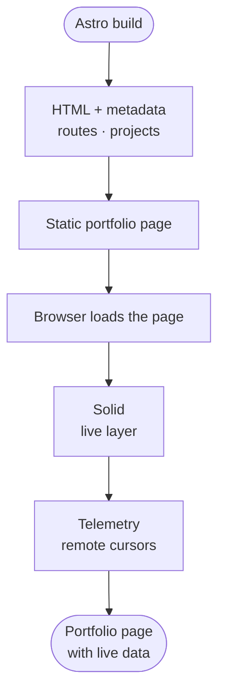

In the [previous post](/blog/rewriting-my-portfolio-for-self-hosting), I summed up the frontend in one sentence: [Astro](https://astro.build/) turns most of the site into HTML, and [Solid](https://www.solidjs.com/) starts only the live islands in the browser.

The split keeps the portfolio readable when the live code fails.

The generated document already contains the portfolio content. Solid starts after the page reaches the browser, when telemetry and cursor presence need browser state. The rewrite combined the deploy into one process while keeping these two rendering jobs separate.

## From the container to the page

The previous post ended with two artifacts inside one runtime image: the Astro output in `dist` and the compiled server executable. This post starts with the files in `dist`.

The homepage is an Astro page. During the build, it resolves the locale, creates the project list, and renders the heading, description, navigation, and links. The shared Astro layout writes the document metadata, canonical URLs, alternate locales, fonts, and page transitions.

The live layer enters through one line in [`index.astro`](https://github.com/ErickCReis/ErickCReis/blob/main/web/pages/%5B...locale%5D/index.astro):

```astro
<BaseLayout title={title} description={description} lang={locale}>
  <HomeLiveOverlay client:only="solid-js" />

  <main>
    <!-- Portfolio content -->
  </main>
</BaseLayout>
```

The Solid component sits beside the main content instead of wrapping it. Astro renders the portfolio on its own. Solid adds live behavior without taking control of the page.


```mermaid center
flowchart TB
  Build(["Astro build"]) --> Document["HTML + metadata<br/>routes · projects"]
  Document --> Page["Static portfolio page"]
  Page --> Browser["Browser loads the page"]
  Browser --> Island["Solid<br/>live layer"]
  Island --> Live["Telemetry<br/>remote cursors"]
  Live --> Result(["Portfolio page<br/>with live data"])
```

## Why this island is client-only

Astro's [`client:only`](https://docs.astro.build/en/reference/directives-reference/#clientonly) directive tells Astro to skip the component during the HTML build. The browser renders it from scratch. The directive chooses where rendering happens. It does not make that rendering faster by itself.

For this overlay, build-time HTML would be useless. The component depends on the viewport size and pointer position. Its telemetry and cursor data do not exist at build time either. A stat panel generated then would be stale before the page reached the browser.

The island needs no placeholder. Until it runs, the page has no floating telemetry panels or remote cursors. The heading, project links, navigation, and metadata need no loading state because Astro already rendered them outside the island.

If the JavaScript fails to start, the page is still a portfolio. If the stats stream or WebSocket disconnects, the document does not disappear with it. I want failures to stop there.

Blocking JavaScript prevents the live island from starting. Dropping the stream leaves the island running without fresh data. In both cases, the generated Astro document remains available because neither dependency controls it.

## One island instead of two

Telemetry and cursor presence look like separate features, but they share one interaction. When a telemetry panel is active, the cursor layer changes how cursor labels are displayed.

The coordination lives in a small component called [`HomeLiveOverlay`](https://github.com/ErickCReis/ErickCReis/blob/main/web/islands/home-live-overlay.tsx):

```tsx
export function HomeLiveOverlay() {
  const { selfId, cursors } = useCursorPresence();
  const [isStatsHovered, setIsStatsHovered] = createSignal(false);

  return (
    <>
      <TelemetryBackdrop placement="hero" onStatsHoverChange={setIsStatsHovered} />
      <CursorPresenceLayer
        selfId={selfId()}
        cursors={cursors()}
        isStatsHovered={isStatsHovered()}
      />
    </>
  );
}
```

A [Solid signal](https://docs.solidjs.com/concepts/signals) connects them. Keeping both features inside the same island keeps `isStatsHovered` local. Splitting them into independent islands would require another way to pass that one value between them.

In this project, I group behavior that must react to the same state in one island. The number of components does not decide where the island starts or ends.

## JavaScript still exists outside Solid

The base layout still uses Astro's client router, and small page behaviors can remain ordinary scripts. This split assigns ownership. It does not ban JavaScript from either side.

Astro owns the document and the content that must exist before browser state is available. Solid owns the component tree that reacts to signals, data streams, pointer positions, and connections.

`client:only` loads the overlay immediately, and the telemetry panels contain more client code than the rest of the homepage. I accept that cost because the overlay is the homepage's main interactive feature. If it grows beyond that job, I will split or delay parts of it while the portfolio content stays in Astro.

## Following one live feature

The deployment now has one container and one server process. The browser still divides the work. Astro provides the document. Solid adds the parts that only make sense while the page is running.

The next post follows a pointer from browser movement through a typed WebSocket and cookie-backed identity to the Solid component that renders another visitor's cursor.
