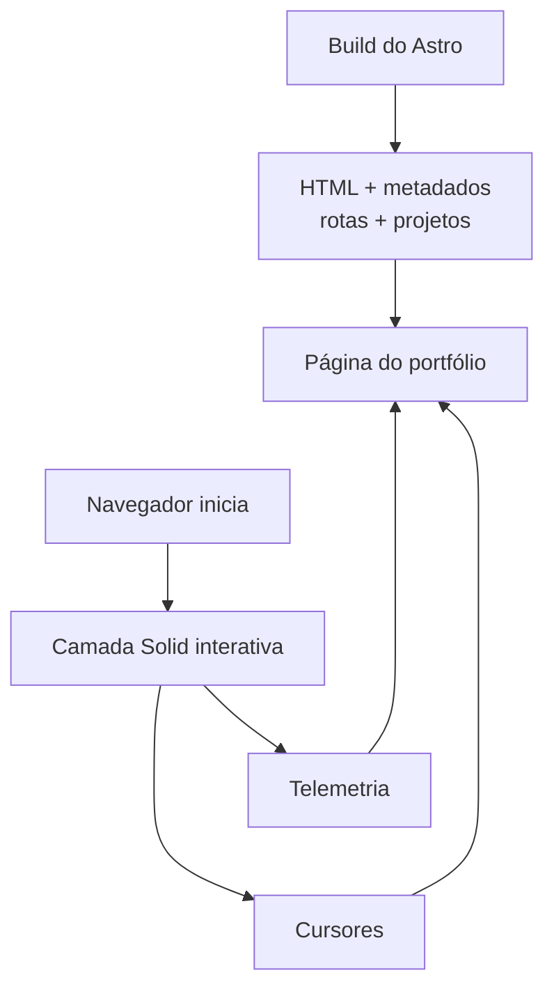

import { IslandBoundaryLab } from "@web/content/labs/island-boundary-lab";

No [post anterior](/pt-BR/content/rewriting-my-portfolio-for-self-hosting), resumi a arquitetura do frontend em uma frase: o [Astro](https://astro.build/) transforma a maior parte do site em HTML, e o [Solid](https://www.solidjs.com/) inicia apenas as ilhas interativas no navegador.

Essa frase esconde uma das fronteiras mais úteis da reescrita.

O conteúdo do portfólio já faz parte do documento gerado. O Solid entra depois, quando o navegador precisa de telemetria, presença de cursores e estado compartilhado entre essas partes da interface. A reescrita eliminou fronteiras no deploy, mas preservou as separações que continuam sendo úteis dentro da aplicação.

## Do container à página

O post anterior terminou com dois artefatos dentro de uma única imagem de runtime: a saída do Astro em `dist` e o executável compilado do servidor. Este post começa no primeiro deles.

A página inicial é uma página do Astro. Durante o build, ela resolve o idioma, cria a lista de projetos e renderiza o título, a descrição, a navegação e os links. O layout compartilhado do Astro cuida dos metadados do documento, das URLs canônicas, das versões em outros idiomas, das fontes e das transições entre páginas.

A camada interativa entra por uma única linha em [`index.astro`](https://github.com/ErickCReis/ErickCReis/blob/main/web/pages/%5B...locale%5D/index.astro):

```astro
<BaseLayout title={title} description={description} lang={locale}>
  <HomeLiveOverlay client:only="solid-js" />

  <main>
    <!-- Conteúdo do portfólio -->
  </main>
</BaseLayout>
```

Essa posição foi intencional. O componente do Solid fica ao lado do conteúdo principal, em vez de envolvê-lo. O Astro não precisa do Solid para renderizar o portfólio, e o Solid não precisa controlar a página inteira para adicionar comportamento em tempo real.



## Por que esta ilha usa client:only

A diretiva [`client:only`](https://docs.astro.build/en/reference/directives-reference/#clientonly) do Astro não renderiza o HTML do componente durante o build e deixa essa renderização para o navegador. Como não existe uma marcação do componente renderizada no servidor para ser retomada, trata-se de uma renderização no cliente, não da hidratação daquele componente. A diretiva não é apenas uma forma curta de dizer “torne isto interativo”, nem representa automaticamente uma otimização de desempenho.

Para esta camada, deixar de renderizar o componente durante o build é a escolha correta. Ele depende de informações do navegador, como as dimensões da janela e a posição do ponteiro. Os dados de telemetria e dos cursores também não têm valor durante o build. Um painel de estatísticas gerado nesse momento já chegaria desatualizado ao navegador.

Mais importante: o estado vazio é válido. Enquanto a ilha não inicia, não há painéis de telemetria flutuando pela tela nem cursores remotos. O título, os links dos projetos, a navegação e os metadados não precisam de um estado de carregamento porque nunca estiveram dentro da ilha.

Se o JavaScript não carregar, a página continua sendo um portfólio. Se o fluxo de estatísticas ou a conexão WebSocket cair, o documento não desaparece junto. Esse modo de falha faz parte do design.

O inspetor de fronteiras abaixo torna essa responsabilidade visível. Alterne entre a arquitetura que coloquei em produção e uma alternativa em que o cliente controla o documento; depois, injete uma falha no JavaScript ou no fluxo de dados. “Controlado pelo cliente” é intencionalmente mais específico do que “SPA”: a comparação mostra qual camada produziu o conteúdo, não pretende avaliar toda aplicação executada no cliente.

<IslandBoundaryLab client:visible locale="pt-BR" />

As duas falhas removem partes diferentes. Bloquear o JavaScript impede que a ilha interativa inicie; derrubar o fluxo mantém a ilha em execução, mas sem dados novos. Nos dois casos, o documento gerado pelo Astro continua disponível porque nenhuma dessas dependências o controla.

## Uma ilha em vez de duas

A telemetria e a presença de cursores parecem funcionalidades separadas, mas compartilham uma interação. Quando um painel de telemetria está ativo, a camada de cursores muda a forma de exibir os rótulos.

Essa coordenação fica em um pequeno componente chamado [`HomeLiveOverlay`](https://github.com/ErickCReis/ErickCReis/blob/main/web/islands/home-live-overlay.tsx):

```tsx
export function HomeLiveOverlay() {
  const { selfId, cursors } = useCursorPresence();
  const [isStatsHovered, setIsStatsHovered] = createSignal(false);

  return (
    <>
      <TelemetryBackdrop placement="hero" onStatsHoverChange={setIsStatsHovered} />
      <CursorPresenceLayer
        selfId={selfId()}
        cursors={cursors()}
        isStatsHovered={isStatsHovered()}
      />
    </>
  );
}
```

Um [sinal reativo do Solid](https://docs.solidjs.com/concepts/signals) é suficiente para conectá-las. Manter as duas camadas dentro da mesma ilha faz com que essa relação continue local. Separá-las em ilhas independentes exigiria outro mecanismo de comunicação para um estado que já pertence à mesma camada visual.

Esta é uma unidade útil para uma ilha neste projeto: não uma ilha por componente, nem uma única árvore de componentes para a página inteira, mas uma fronteira em torno dos comportamentos que precisam reagir em conjunto.

## Estático não significa ausência de JavaScript

A fronteira não é “o Astro não tem JavaScript e o Solid tem todo ele”. O layout base ainda usa o roteador no cliente do Astro, e pequenos comportamentos da página podem continuar em scripts comuns. A diferença está na responsabilidade de cada parte.

O Astro cuida do documento e do conteúdo que precisa existir antes que o estado do navegador esteja disponível. O Solid cuida da árvore de componentes cujo resultado muda conforme sinais, fluxos de dados, posições do ponteiro e conexões são atualizados.

Essa escolha ainda tem um custo. `client:only` carrega a camada interativa imediatamente, e os painéis de telemetria concentram mais código executado no cliente do que o restante da página inicial. Aceito esse custo porque essa camada é a principal superfície dinâmica da página inicial. Se ela crescer muito além desse papel, o próximo passo será dividir ou adiar partes da camada interativa, não mover o conteúdo do portfólio para dentro dela.

## A próxima fronteira

Agora o deploy tem um container e um processo de servidor. Dentro do navegador, a página continua dividida com clareza: o Astro fornece o documento, e o Solid adiciona as partes que só fazem sentido enquanto a página está em execução.

O próximo post acompanhará uma dessas partes ao atravessar a fronteira: o movimento do ponteiro no navegador, uma mensagem WebSocket tipada, uma identidade baseada em cookie e a camada do Solid que renderiza o cursor de outro visitante.
