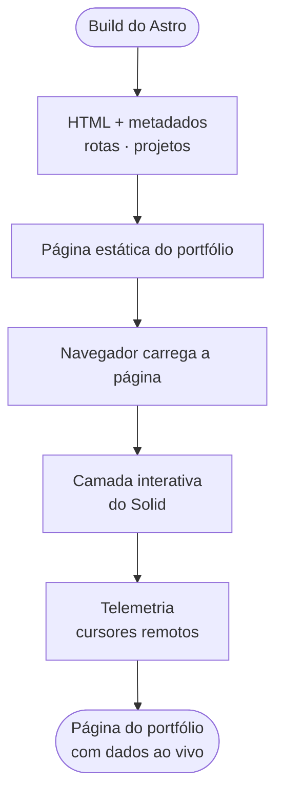

No [post anterior](/pt-BR/blog/rewriting-my-portfolio-for-self-hosting), resumi o frontend em uma frase: o [Astro](https://astro.build/) transforma a maior parte do site em HTML, e o [Solid](https://www.solidjs.com/) inicia apenas as ilhas interativas no navegador.

A separação mantém o portfólio legível quando o código em tempo real falha.

O documento gerado já contém o portfólio. O Solid entra depois que a página chega ao navegador, quando a telemetria e a presença de cursores dependem do estado do navegador. A reescrita reuniu o deploy em um processo, mas manteve esses dois trabalhos de renderização separados.

## Do container à página

O post anterior terminou com dois artefatos dentro de uma única imagem de runtime: a saída do Astro em `dist` e o executável compilado do servidor. Este post começa nos arquivos de `dist`.

A página inicial é uma página do Astro. Durante o build, ela resolve o idioma, cria a lista de projetos e renderiza o título, a descrição, a navegação e os links. O layout compartilhado do Astro escreve os metadados do documento, as URLs canônicas, as versões em outros idiomas, as fontes e as transições entre páginas.

A camada interativa entra por uma única linha em [`index.astro`](https://github.com/ErickCReis/ErickCReis/blob/main/web/pages/%5B...locale%5D/index.astro):

```astro
<BaseLayout title={title} description={description} lang={locale}>
  <HomeLiveOverlay client:only="solid-js" />

  <main>
    <!-- Conteúdo do portfólio -->
  </main>
</BaseLayout>
```

O componente do Solid fica ao lado do conteúdo principal, em vez de envolvê-lo. O Astro renderiza o portfólio sozinho. O Solid acrescenta o comportamento em tempo real sem assumir o controle da página.


```mermaid center
flowchart TB
  Build(["Build do Astro"]) --> Document["HTML + metadados<br/>rotas · projetos"]
  Document --> Page["Página estática do portfólio"]
  Page --> Browser["Navegador carrega a página"]
  Browser --> Island["Camada interativa<br/>do Solid"]
  Island --> Live["Telemetria<br/>cursores remotos"]
  Live --> Result(["Página do portfólio<br/>com dados ao vivo"])
```

## Por que esta ilha usa client:only

A diretiva [`client:only`](https://docs.astro.build/en/reference/directives-reference/#clientonly) instrui o Astro a ignorar o componente durante a geração do HTML. O navegador o renderiza do zero. A diretiva escolhe onde a renderização acontece. Sozinha, ela não torna esse trabalho mais rápido.

Para esta camada, o HTML gerado no build não teria utilidade. O componente depende das dimensões da janela e da posição do ponteiro. Os dados de telemetria e dos cursores também não existem durante o build. Um painel de estatísticas gerado nesse momento chegaria desatualizado ao navegador.

A ilha não precisa de placeholder. Enquanto ela não inicia, a página não mostra painéis de telemetria nem cursores remotos. O título, os links dos projetos, a navegação e os metadados dispensam um estado de carregamento porque o Astro já os renderizou fora da ilha.

Se o JavaScript não carregar, a página continua sendo um portfólio. Se o fluxo de estatísticas ou a conexão WebSocket cair, o documento não desaparece junto. Quero que as falhas terminem ali.

Bloquear o JavaScript impede que a ilha interativa inicie. Derrubar o fluxo mantém a ilha em execução, mas sem dados novos. Nos dois casos, o documento gerado pelo Astro continua disponível porque nenhuma dessas dependências o controla.

## Uma ilha em vez de duas

A telemetria e a presença de cursores parecem funcionalidades separadas, mas compartilham uma interação. Quando um painel de telemetria está ativo, a camada de cursores muda a forma de exibir os rótulos.

Essa coordenação fica em um pequeno componente chamado [`HomeLiveOverlay`](https://github.com/ErickCReis/ErickCReis/blob/main/web/islands/home-live-overlay.tsx):

```tsx
export function HomeLiveOverlay() {
  const { selfId, cursors } = useCursorPresence();
  const [isStatsHovered, setIsStatsHovered] = createSignal(false);

  return (
    <>
      <TelemetryBackdrop placement="hero" onStatsHoverChange={setIsStatsHovered} />
      <CursorPresenceLayer
        selfId={selfId()}
        cursors={cursors()}
        isStatsHovered={isStatsHovered()}
      />
    </>
  );
}
```

Um [sinal reativo do Solid](https://docs.solidjs.com/concepts/signals) conecta as duas funcionalidades. Mantê-las na mesma ilha preserva `isStatsHovered` como um estado local. Em ilhas independentes, eu precisaria de outro mecanismo para passar esse único valor entre elas.

Neste projeto, coloco na mesma ilha os comportamentos que reagem ao mesmo estado. A quantidade de componentes não decide onde a ilha começa ou termina.

## O JavaScript também existe fora do Solid

O layout base ainda usa o roteador no cliente do Astro, e pequenos comportamentos da página podem continuar em scripts comuns. Essa divisão atribui responsabilidades. Ela não proíbe o JavaScript em nenhum dos lados.

O Astro cuida do documento e do conteúdo que precisa existir antes que o estado do navegador esteja disponível. O Solid cuida da árvore de componentes que reage a sinais, fluxos de dados, posições do ponteiro e conexões.

`client:only` carrega a camada interativa imediatamente, e os painéis de telemetria concentram mais código executado no cliente do que o restante da página inicial. Aceito esse custo porque essa é a principal funcionalidade interativa da página. Se ela crescer além desse trabalho, vou dividir ou adiar algumas partes enquanto o conteúdo do portfólio permanece no Astro.

## Seguindo uma funcionalidade em tempo real

Agora o deploy tem um container e um processo de servidor. O navegador ainda divide o trabalho. O Astro fornece o documento. O Solid acrescenta o que só faz sentido enquanto a página está em execução.

O próximo post acompanha o ponteiro desde o movimento no navegador, passando por uma mensagem WebSocket tipada e uma identidade baseada em cookie, até o componente do Solid que renderiza o cursor de outro visitante.
