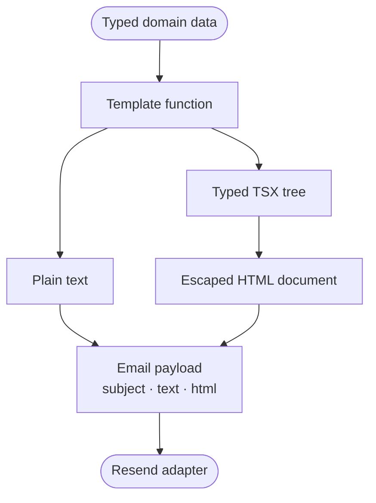

This server treats email templates as TypeScript functions. Each function accepts domain data, composes a small set of TSX primitives, and returns a message that does not depend on the delivery provider:

```ts
type RenderedMessage = {
  subject: string;
  text: string;
  html: string;
};
```

Solid's server renderer turns the TSX tree into HTML. A local JSX factory connects the two. There is no reactivity or hydration.



## Put the type boundary before the markup

The templates do not query SQLite, read the battery, inspect environment variables, or know when a cron task runs. Their inputs contain only the data needed to render a message.

The battery alert accepts three scalar values:

```ts
type BatteryAlert = {
  batteryPercent: number;
  thresholdPercent: number;
  timestamp: string;
};

export function renderBatteryAlert(alert: BatteryAlert) {
  return {
    subject: `Battery alert: ${alert.batteryPercent}% and discharging`,
    text: [
      "Battery alert",
      "",
      `Your battery is at ${alert.batteryPercent}% and is currently discharging.`,
      `Alert threshold: below ${alert.thresholdPercent}%.`,
      `Checked at: ${alert.timestamp}.`,
    ].join("\n"),
    html: renderEmail(() => <BatteryAlertEmail {...alert} />),
  };
}
```

The report uses a discriminated union:

```ts
export type BlogReport =
  | (BlogReportBase & { kind: "daily" })
  | (BlogReportBase & {
      kind: "weekly";
      previousDayViews: number;
    });
```

Checking `report.kind === "weekly"` narrows the value before the template accesses `previousDayViews`. A daily report cannot require that field by mistake, and TypeScript rejects a weekly report constructed without it. The report builder depends on the narrow `BlogViewsReader` interface instead of the concrete SQLite store, so tests can aggregate views with an in-memory object.

The server completes the domain data before rendering, TypeScript checks component props at each TSX call site, and the delivery function always receives `{ subject, text, html }`. The current inputs originate inside the server. Data from the network would still need runtime validation.

## A JSX factory only needs two branches

Each email TSX file starts with `/** @jsx emailElement */`. Bun's JSX transform therefore sends both components and intrinsic tags to the local factory in [`server/email/components.tsx`](https://github.com/ErickCReis/ErickCReis/blob/main/server/email/components.tsx).

```ts
export function emailElement(
  type: EmailElementType,
  props: Record<string, unknown> | null,
  ...children: unknown[]
): JSX.Element {
  const resolvedChildren = children.length === 1 ? children[0] : children;

  if (typeof type === "function") {
    return type({ ...props, children: resolvedChildren });
  }

  return ssrElement(
    type,
    props,
    resolveIntrinsicChild(resolvedChildren),
    false,
  ) as unknown as JSX.Element;
}
```

There are only two cases:

1. A function means a local component such as `EmailCard`; call it with its props and children.
2. A string means an intrinsic HTML element such as `table`; pass it to Solid's `ssrElement`.

`renderEmail` then wraps Solid's server output in a doctype:

```ts
export function renderEmail(template: () => JSX.Element) {
  return `<!doctype html>${renderToString(template)}`;
}
```

The callback matters because `renderToString` establishes the server-rendering context while it evaluates the tree. The output is a complete HTML document. The delivery adapter does not have to assemble fragments later.

The factory's `Record<string, unknown>` signature is permissive. A larger component set would need tighter props and return types.

## Escape at the intrinsic-element boundary

Template data eventually becomes children of HTML elements. Before handing those children to `ssrElement`, the renderer recursively resolves arrays and child functions, then escapes strings:

```ts
function resolveIntrinsicChild(child: unknown): unknown {
  if (Array.isArray(child)) return child.map(resolveIntrinsicChild);
  if (typeof child === "function") return resolveIntrinsicChild(child());
  if (typeof child === "string") return escape(child);
  return child;
}
```

This placement keeps component composition intact. A component may forward its children through several function calls, but the renderer escapes strings when they enter an intrinsic tag. Numeric children stay numeric, and Solid serializes them.

The report test uses the slug `typescript-<patterns>` to check the injection boundary. The plain-text body keeps the readable value. The HTML must contain `typescript-&lt;patterns>` and must not contain the raw tag-shaped string.

This protects text children used by the current templates. The renderer does not offer an API for trusted raw HTML, and the templates do not interpolate user-controlled style declarations, attribute names, or markup. Adding any of those features would require a separate review of the escaping model.

## Build for email clients, not browser layout engines

The shared component layer contains four visual primitives:

- `EmailLayout` owns the document shell, hidden preview text, page background, and outer presentation table.
- `EmailCard` creates a centered content surface with a maximum width of 600 pixels.
- `EmailHeading` and `EmailText` provide repeatable typography.
- `renderEmail` serializes the final tree.

The layout uses tables with `role="presentation"`, HTML alignment attributes, conservative system fonts, and inline style objects:

```tsx
<table
  role="presentation"
  style={{
    width: "100%",
    "border-collapse": "collapse",
    "background-color": "#f4f4f5",
  }}
>
  <tbody>
    <tr>
      <td align="center" style={{ padding: "32px 16px" }}>
        {props.children}
      </td>
    </tr>
  </tbody>
</table>
```

These choices rely less on stylesheet support and modern layout engines. They still cannot guarantee identical rendering in every inbox. The card, for example, uses `max-width` and `border-radius` without Outlook-specific conditional markup. There are no dark-mode overrides either.

The report's two-column data table stays inside `BlogReportEmail` because no other message needs it. The shared layer contains only the layout that both emails use, not a component wrapper for every HTML tag.

## Generate the two MIME alternatives explicitly

Both renderers produce HTML and plain text from the same typed input. The text version is written explicitly:

```ts
const rows =
  report.views.length === 0
    ? ["No blog reads were recorded in this period."]
    : report.views.map((row) => `${row.slug}: ${row.views}`);

return {
  subject: `${label} blog report: ${total}`,
  text: [
    `${label} blog report`,
    period,
    "",
    `Total: ${total}`,
    ...previousDaySummary,
    ...rows,
  ].join("\n"),
  html: renderEmail(() => <BlogReportEmail report={report} />),
};
```

An explicit text renderer controls hierarchy, whitespace, empty states, and how the table becomes lines of text. It also keeps both versions next to each other. Changing the report label or adding a field means reviewing the text and HTML in the same function.

The text and HTML branches do duplicate some presentation logic. For two short messages, that duplication is easier to audit than a shared intermediate document AST. More templates might make the AST worthwhile. The current code does not.

## Keep scheduling, rendering, and delivery separate

The scheduled report follows a narrow pipeline:

```ts
const message = renderBlogReport(createBlogReport(blogViewsStore, now));

return sendEmail({
  to: BLOG_REPORT_EMAIL_TO,
  ...message,
});
```

`createBlogReport` handles calendar and aggregation rules. `renderBlogReport` handles presentation. The cron task selects the time and recipient. [`sendEmail`](https://github.com/ErickCReis/ErickCReis/blob/main/server/lib/email.ts) calls the provider and adds the sender address.

The delivery adapter accepts `to`, `subject`, `text`, and `html`, adds the fixed sender, and calls `resend.emails.send`. If `RESEND_API_KEY` is missing it returns `false`. It also returns `false` for a provider error or thrown exception after logging the error, and `true` only when the API call succeeds.

The battery cron uses that boolean as its in-memory `batteryAlertSent` latch. A failed attempt does not suppress the next check five seconds later. A successful attempt suppresses repeats until the battery status changes. The blog report cron returns the result, but the code has no retry queue or persisted delivery record.

## Test each boundary on its own

The tests exercise three different boundaries:

- `createBlogReport` receives fixed dates and fake reader methods, verifying the previous São Paulo calendar day, the Sunday-to-Saturday weekly switch, sort order, and totals.
- `renderBlogReport` verifies the subject, plain-text row, and escaped HTML output.
- `renderBatteryAlert` verifies the shared message shape, doctype, threshold text, and rendered percentage.

These deterministic unit tests do not need SQLite to construct a report and never call Resend. There is no snapshot suite across email clients, mock test for the delivery adapter, or automated visual regression test. Checking the HTML in real inboxes remains manual.

## Know when to replace the small renderer

This renderer is appropriate for the two operational emails currently in the server. Its limits are explicit:

- no CSS inliner or stylesheet transformation;
- no Outlook/VML compatibility layer;
- no responsive component system or dark-mode policy;
- no local preview server;
- no runtime validation for template inputs;
- no persisted retries, idempotency key, or delivery audit;
- no automated rendering matrix across clients.

If the server adds more templates, stricter Outlook support, or automated client previews, a dedicated email framework will earn its keep.
