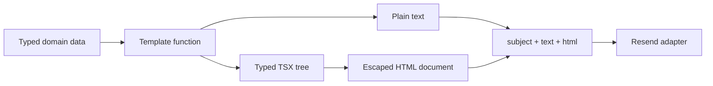

Email templates in this server are TypeScript functions. They accept domain data, compose a small set of TSX primitives, and return a provider-independent message:

```ts
type RenderedMessage = {
  subject: string;
  text: string;
  html: string;
};
```

Solid's server renderer turns the TSX tree into HTML. A local JSX factory handles the integration; no reactivity or hydration is involved.



## Put the type boundary before the markup

The templates do not query SQLite, read the battery, inspect environment variables, or know when a cron task runs. Their inputs describe only what is required to render a message.

The battery alert accepts three scalar values:

```ts
type BatteryAlert = {
  batteryPercent: number;
  thresholdPercent: number;
  timestamp: string;
};

export function renderBatteryAlert(alert: BatteryAlert) {
  return {
    subject: `Battery alert: ${alert.batteryPercent}% and discharging`,
    text: [
      "Battery alert",
      "",
      `Your battery is at ${alert.batteryPercent}% and is currently discharging.`,
      `Alert threshold: below ${alert.thresholdPercent}%.`,
      `Checked at: ${alert.timestamp}.`,
    ].join("\n"),
    html: renderEmail(() => <BatteryAlertEmail {...alert} />),
  };
}
```

The report uses a discriminated union:

```ts
export type BlogReport =
  | (BlogReportBase & { kind: "daily" })
  | (BlogReportBase & {
      kind: "weekly";
      previousDayViews: number;
    });
```

Checking `report.kind === "weekly"` narrows the value before the template accesses `previousDayViews`. A daily report cannot accidentally require that field, and a weekly report cannot be constructed without it. The report builder also depends on the narrow `BlogViewsReader` interface rather than the concrete SQLite store, so aggregation can be tested with an in-memory object.

Domain data is complete before rendering, component props are checked at TSX call sites, and delivery always receives `{ subject, text, html }`. Current inputs are constructed inside the server; network data would still need runtime validation.

## A JSX factory only needs two branches

Each email TSX file starts with `/** @jsx emailElement */`. Bun's JSX transform therefore sends both components and intrinsic tags to the local factory in [`server/email/components.tsx`](https://github.com/ErickCReis/ErickCReis/blob/main/server/email/components.tsx).

```ts
export function emailElement(
  type: EmailElementType,
  props: Record<string, unknown> | null,
  ...children: unknown[]
): JSX.Element {
  const resolvedChildren = children.length === 1 ? children[0] : children;

  if (typeof type === "function") {
    return type({ ...props, children: resolvedChildren });
  }

  return ssrElement(
    type,
    props,
    resolveIntrinsicChild(resolvedChildren),
    false,
  ) as unknown as JSX.Element;
}
```

There are only two cases:

1. A function means a local component such as `EmailCard`; call it with its props and children.
2. A string means an intrinsic HTML element such as `table`; pass it to Solid's `ssrElement`.

`renderEmail` then wraps Solid's server output in a doctype:

```ts
export function renderEmail(template: () => JSX.Element) {
  return `<!doctype html>${renderToString(template)}`;
}
```

The callback matters because `renderToString` establishes the server-rendering context while evaluating the tree. The output is a complete HTML document, not a fragment to be assembled later by the delivery adapter.

The factory's `Record<string, unknown>` signature is permissive. A larger component set would need tighter props and return types.

## Escape at the intrinsic-element boundary

Template data eventually becomes children of HTML elements. Before handing those children to `ssrElement`, the renderer recursively resolves arrays and child functions, then escapes strings:

```ts
function resolveIntrinsicChild(child: unknown): unknown {
  if (Array.isArray(child)) return child.map(resolveIntrinsicChild);
  if (typeof child === "function") return resolveIntrinsicChild(child());
  if (typeof child === "string") return escape(child);
  return child;
}
```

This placement keeps component composition intact: a component may forward its children through several function calls, but strings are escaped when they cross into an intrinsic tag. Numeric children remain numeric and are serialized by Solid.

The report test uses the slug `typescript-<patterns>` as a concrete injection boundary. The plain-text body retains that readable value, while the HTML must contain `typescript-&lt;patterns>` and must not contain the raw tag-shaped string.

This protects text children used by the current templates. The renderer does not offer an API for trusted raw HTML, and the templates do not interpolate user-controlled style declarations, attribute names, or markup. Adding any of those features would require a separate review of the escaping model.

## Build primitives for email layout, not browser layout

The shared component layer contains four visual primitives:

- `EmailLayout` owns the document shell, hidden preview text, page background, and outer presentation table.
- `EmailCard` creates a centered content surface with a maximum width of 600 pixels.
- `EmailHeading` and `EmailText` provide repeatable typography.
- `renderEmail` serializes the final tree.

The layout uses tables with `role="presentation"`, HTML alignment attributes, conservative system fonts, and inline style objects:

```tsx
<table
  role="presentation"
  style={{
    width: "100%",
    "border-collapse": "collapse",
    "background-color": "#f4f4f5",
  }}
>
  <tbody>
    <tr>
      <td align="center" style={{ padding: "32px 16px" }}>
        {props.children}
      </td>
    </tr>
  </tbody>
</table>
```

These choices reduce dependence on stylesheet support and modern layout engines. They do not guarantee identical rendering in every inbox. For example, the card uses `max-width` and `border-radius` without Outlook-specific conditional markup, and there are no dark-mode overrides.

The report's two-column data table remains inside `BlogReportEmail`. It is message-specific structure, not a shared primitive. Reuse here follows an actual common layout requirement; it does not wrap every HTML tag in a component.

## Generate the two MIME alternatives explicitly

Both renderers produce HTML and plain text from the same typed input. The text version is written explicitly:

```ts
const rows =
  report.views.length === 0
    ? ["No blog reads were recorded in this period."]
    : report.views.map((row) => `${row.slug}: ${row.views}`);

return {
  subject: `${label} blog report: ${total}`,
  text: [
    `${label} blog report`,
    period,
    "",
    `Total: ${total}`,
    ...previousDaySummary,
    ...rows,
  ].join("\n"),
  html: renderEmail(() => <BlogReportEmail report={report} />),
};
```

An explicit text renderer controls hierarchy, whitespace, empty states, and table flattening. It also makes divergence visible in the same function: changing the report label or adding a field requires reviewing both representations together.

There is still duplication between the text and HTML branches. The current messages are short enough that the duplicated presentation logic is easier to audit than a shared intermediate document AST. A larger template set could justify such an AST, but the current code does not need one.

## Keep scheduling, rendering, and delivery separate

The scheduled report follows a narrow pipeline:

```ts
const message = renderBlogReport(createBlogReport(blogViewsStore, now));

return sendEmail({
  to: BLOG_REPORT_EMAIL_TO,
  ...message,
});
```

`createBlogReport` owns calendar and aggregation rules. `renderBlogReport` owns presentation. The cron task owns timing and recipient selection. [`sendEmail`](https://github.com/ErickCReis/ErickCReis/blob/main/server/lib/email.ts) owns the provider call and sender address.

The delivery adapter accepts `to`, `subject`, `text`, and `html`, adds the fixed sender, and calls `resend.emails.send`. If `RESEND_API_KEY` is missing it returns `false`. It also returns `false` for a provider error or thrown exception after logging the error, and `true` only when the API call succeeds.

That boolean is operationally significant in the battery cron. The in-memory `batteryAlertSent` latch is assigned from `sendEmail`, so a failed attempt does not suppress the next five-second check. A successful attempt suppresses repeats until the battery status changes. The blog report cron returns the result; the current code has no retry queue or persisted delivery record.

## Test the seams that can break independently

The tests exercise three different boundaries:

- `createBlogReport` receives fixed dates and fake reader methods, verifying the previous São Paulo calendar day, the Sunday-to-Saturday weekly switch, sort order, and totals.
- `renderBlogReport` verifies the subject, plain-text row, and escaped HTML output.
- `renderBatteryAlert` verifies the shared message shape, doctype, threshold text, and rendered percentage.

These are deterministic unit tests: they do not need SQLite for report construction and do not call Resend. There is currently no snapshot suite across email clients, delivery-adapter mock test, or automated visual regression test. Running the HTML through real inboxes remains a manual compatibility check.

## Where this design stops

This renderer is appropriate for the two operational emails currently in the server. Its limits are explicit:

- no CSS inliner or stylesheet transformation;
- no Outlook/VML compatibility layer;
- no responsive component system or dark-mode policy;
- no local preview server;
- no runtime validation for template inputs;
- no persisted retries, idempotency key, or delivery audit;
- no automated rendering matrix across clients.

More templates, stricter Outlook support, or automated client previews would justify moving to a dedicated email framework.
