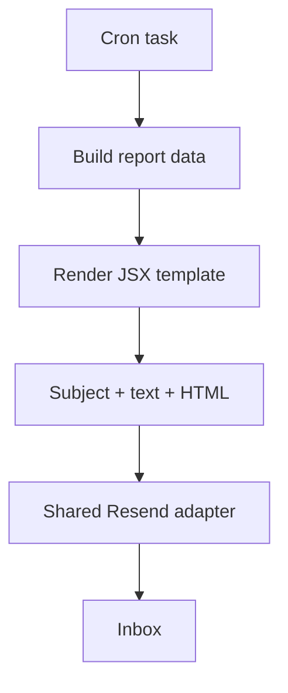
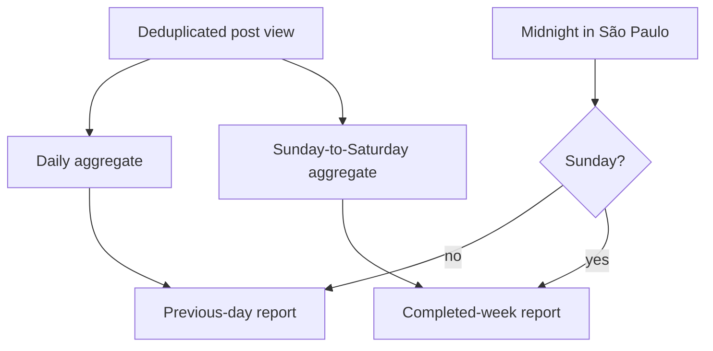

The first email sent by this site did not need a template system. It was the battery warning from the [runtime telemetry post](/blog/health-telemetry-from-the-real-runtime): a subject, a few lines of plain text, and one HTML string assembled inside the cron task.

That stopped being enough when I added daily and weekly reports for the [blog's live view counts](/blog/the-blog-layer-static-pages-live-view-counts). The new message needed a heading, a reporting period, totals, and a table whose rows came from SQLite. Copying more HTML into a second cron file would have worked, but it would also have mixed scheduling, data aggregation, markup, and delivery in one place again.

I kept the solution small: a custom JSX renderer built with [Solid](https://www.solidjs.com/), a few table-based components, and one delivery adapter for the [Resend Email API](https://resend.com/docs/api-reference/emails/send-email).



## The old alert exposed the boundary

The [original battery cron](https://github.com/ErickCReis/ErickCReis/blob/71c27c7d200ad5da15b328941a2fae4c5cd484dd/server/cron/battery-alert.ts) owned the whole operation. It read environment variables, created a Resend client, built both message bodies, sent the request, and handled errors. That was reasonable while it was the only caller.

The [blog report cron](https://github.com/ErickCReis/ErickCReis/blob/71c27c7d200ad5da15b328941a2fae4c5cd484dd/server/cron/blog-report.ts) introduced a second caller with different data but the same delivery needs. That made the boundary clearer:

- cron tasks decide when to send;
- report code decides what the data means;
- templates decide how the message reads;
- the email adapter decides how it leaves the server.

The refactored cron now reads the battery, calls [`renderBatteryAlert`](https://github.com/ErickCReis/ErickCReis/blob/71c27c7d200ad5da15b328941a2fae4c5cd484dd/server/email/battery-alert.tsx), and passes the returned message to [`sendEmail`](https://github.com/ErickCReis/ErickCReis/blob/71c27c7d200ad5da15b328941a2fae4c5cd484dd/server/lib/email.ts). The report cron follows the same path with [`createBlogReport`](https://github.com/ErickCReis/ErickCReis/blob/71c27c7d200ad5da15b328941a2fae4c5cd484dd/server/blog/report.ts) and [`renderBlogReport`](https://github.com/ErickCReis/ErickCReis/blob/71c27c7d200ad5da15b328941a2fae4c5cd484dd/server/email/blog-report.tsx). Both renderers return provider-independent messages, so `sendEmail` can accept them without knowing what a battery percentage or blog view is.

## JSX is the template syntax

The [earlier Solid post](/blog/astro-static-shell-solid-live-layer) used TSX for interactive browser islands. These templates use it as a server-only authoring syntax. A file-level JSX pragma sends every element through a local `emailElement` factory:

```tsx
/** @jsx emailElement */

function BatteryAlertEmail(props: BatteryAlert) {
  return (
    <EmailLayout preview={`Battery alert: ${props.batteryPercent}% and discharging`}>
      <EmailCard>
        <EmailHeading>Battery alert</EmailHeading>
        <EmailText>
          Your battery is at <strong>{props.batteryPercent}%</strong>.
        </EmailText>
      </EmailCard>
    </EmailLayout>
  );
}
```

For a component such as `EmailCard`, the factory calls the function with its props and children. For an intrinsic element such as `table` or `strong`, it delegates to Solid's server-side `ssrElement`. Finally, [`renderToString`](https://docs.solidjs.com/reference/rendering/render-to-string) turns the tree into an HTML document.

```ts
export function emailElement(type, props, ...children) {
  const resolvedChildren = children.length === 1 ? children[0] : children;

  if (typeof type === "function") {
    return type({ ...props, children: resolvedChildren });
  }

  return ssrElement(type, props, resolveIntrinsicChild(resolvedChildren), false);
}

export function renderEmail(template) {
  return `<!doctype html>${renderToString(template)}`;
}
```

The code produces server-rendered HTML and stops there. JSX provides a convenient way to compose that markup with typed props.

## The component library is intentionally small

Email HTML has different constraints from the site. The shared layout uses presentation tables, conservative fonts, and inline styles because inbox rendering is less predictable than browser rendering.

[`server/email/components.tsx`](https://github.com/ErickCReis/ErickCReis/blob/71c27c7d200ad5da15b328941a2fae4c5cd484dd/server/email/components.tsx) currently exports only the pieces shared by both messages:

- `EmailLayout` creates the document, preview text, background, and centered container;
- `EmailCard` provides the 600-pixel content surface;
- `EmailHeading` and `EmailText` keep typography consistent;
- `renderEmail` produces the final document.

The report template keeps its data table because the battery alert does not need one. Promoting every tag into a reusable component would create an API larger than the two emails it serves. I only move a primitive into the shared file after both templates need the same markup.

## Plain text stays explicit

Each renderer returns one complete message rather than HTML alone:

```ts
return {
  subject: `${label} blog report: ${total}`,
  text: [
    `${label} blog report`,
    period,
    "",
    `Total: ${total}`,
    ...rows,
  ].join("\n"),
  html: renderEmail(() => <BlogReportEmail report={report} />),
};
```

I write the plain-text version directly instead of stripping tags from the HTML. It is short, and writing it separately gives me control over line breaks, labels, and empty states. Every template returns the same clear contract: a subject, text body, and HTML body.

Dynamic content still needs escaping. Blog slugs come from the view store and are inserted into table cells. `resolveIntrinsicChild` escapes string children before passing them to Solid's serializer. A [rendering test](https://github.com/ErickCReis/ErickCReis/blob/71c27c7d200ad5da15b328941a2fae4c5cd484dd/server/blog/report.test.ts) uses `typescript-<patterns>` and verifies that the HTML contains `typescript-&lt;patterns>` while the plain-text body keeps the readable original.

## Reports use São Paulo calendar days

The email work was triggered by a reporting feature, so the period calculation matters as much as the markup.

Every accepted post view now increments a permanent total plus daily and weekly SQLite aggregates in [`server/blog/views.ts`](https://github.com/ErickCReis/ErickCReis/blob/71c27c7d200ad5da15b328941a2fae4c5cd484dd/server/blog/views.ts). The keys use the `America/Sao_Paulo` calendar. At midnight, an [`@elysiajs/cron`](https://github.com/elysiajs/elysia-cron) task creates a report for the completed day. On Sundays, that daily email is replaced by a report for the completed Sunday-to-Saturday week.



The [`createBlogReport` builder](https://github.com/ErickCReis/ErickCReis/blob/71c27c7d200ad5da15b328941a2fae4c5cd484dd/server/blog/report.ts) returns plain data: kind, date range, sorted rows, and totals. I keep JSX and cron patterns out of it, which makes boundary cases testable with fixed dates. The Sunday switch can be tested without rendering or sending an email.

## Delivery is deliberately boring

[`server/lib/email.ts`](https://github.com/ErickCReis/ErickCReis/blob/71c27c7d200ad5da15b328941a2fae4c5cd484dd/server/lib/email.ts) owns the Resend client and sender address. It accepts a recipient plus the message returned by a renderer. Missing configuration turns scheduled email into a no-op; provider errors are logged and returned as `false`.

That adapter is small, but centralizing it fixed two problems. The battery and report tasks now agree on configuration and failure behavior, and changing the provider no longer requires editing message markup.

There are limits to this approach. It has no visual preview server, CSS inliner, compatibility matrix, or broad component catalog. If this site needed transactional emails across many clients, those omissions would make an established email framework a better trade. For two operational messages, the custom layer is easier to understand than the dependency it would replace.
