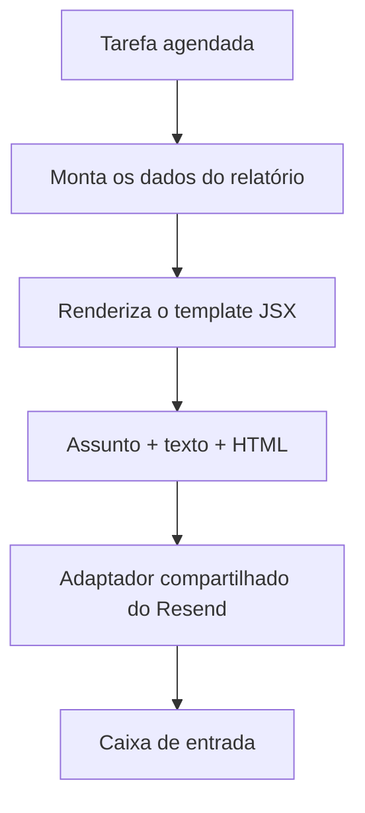
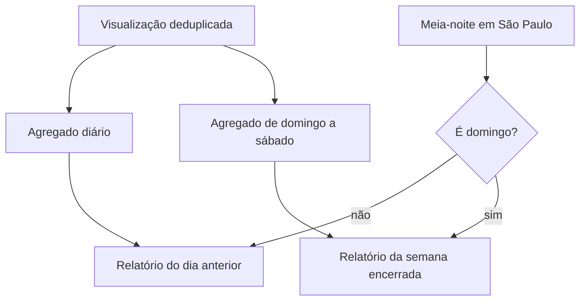

O primeiro e-mail enviado por este site não precisava de um sistema de templates. Era o alerta de bateria apresentado no [post sobre a telemetria do runtime](/pt-BR/blog/health-telemetry-from-the-real-runtime): assunto, algumas linhas de texto e uma string de HTML montada dentro da própria tarefa agendada.

Isso deixou de ser suficiente quando criei relatórios diários e semanais para as [contagens de visualizações do blog](/pt-BR/blog/the-blog-layer-static-pages-live-view-counts). A nova mensagem teria título, período, totais e uma tabela preenchida com dados do SQLite. Eu poderia copiar mais HTML para outro arquivo de cron, mas voltaria a juntar agendamento, agregação, marcação e envio no mesmo lugar.

Mantive a solução pequena: um renderizador JSX próprio baseado no [Solid](https://www.solidjs.com/), alguns componentes construídos com tabelas e um único adaptador de entrega para a [API de e-mails do Resend](https://resend.com/docs/api-reference/emails/send-email).



## O alerta antigo mostrou onde dividir

O [cron da bateria original](https://github.com/ErickCReis/ErickCReis/blob/71c27c7d200ad5da15b328941a2fae4c5cd484dd/server/cron/battery-alert.ts) cuidava da operação inteira. Ele lia as variáveis de ambiente, criava o cliente do Resend, montava as duas versões da mensagem, enviava a requisição e tratava os erros. Enquanto havia apenas um e-mail, essa solução era suficiente.

O [cron dos relatórios do blog](https://github.com/ErickCReis/ErickCReis/blob/71c27c7d200ad5da15b328941a2fae4c5cd484dd/server/cron/blog-report.ts) trouxe dados diferentes, mas repetia as mesmas necessidades de entrega. A separação ficou mais clara:

- as tarefas agendadas decidem quando enviar;
- o código do relatório decide o que os dados representam;
- os templates decidem como apresentar a mensagem;
- o adaptador de e-mail decide como ela sai do servidor.

Depois da refatoração, o cron lê a bateria, chama [`renderBatteryAlert`](https://github.com/ErickCReis/ErickCReis/blob/71c27c7d200ad5da15b328941a2fae4c5cd484dd/server/email/battery-alert.tsx) e entrega a mensagem retornada para [`sendEmail`](https://github.com/ErickCReis/ErickCReis/blob/71c27c7d200ad5da15b328941a2fae4c5cd484dd/server/lib/email.ts). O relatório percorre o mesmo caminho com [`createBlogReport`](https://github.com/ErickCReis/ErickCReis/blob/71c27c7d200ad5da15b328941a2fae4c5cd484dd/server/blog/report.ts) e [`renderBlogReport`](https://github.com/ErickCReis/ErickCReis/blob/71c27c7d200ad5da15b328941a2fae4c5cd484dd/server/email/blog-report.tsx). Os dois renderizadores devolvem mensagens independentes do provedor, então `sendEmail` pode recebê-las sem entender o percentual da bateria nem as visualizações do blog.

## JSX como sintaxe dos templates

O [post sobre o Solid](/pt-BR/blog/astro-static-shell-solid-live-layer) usou TSX nas ilhas interativas do navegador. Nestes templates, ele funciona apenas como sintaxe de autoria no servidor. Uma diretiva no início do arquivo encaminha cada elemento para a função local `emailElement`:

```tsx
/** @jsx emailElement */

function BatteryAlertEmail(props: BatteryAlert) {
  return (
    <EmailLayout preview={`Battery alert: ${props.batteryPercent}% and discharging`}>
      <EmailCard>
        <EmailHeading>Battery alert</EmailHeading>
        <EmailText>
          Your battery is at <strong>{props.batteryPercent}%</strong>.
        </EmailText>
      </EmailCard>
    </EmailLayout>
  );
}
```

Quando encontra um componente como `EmailCard`, a função o chama com as propriedades e os filhos recebidos. Para um elemento nativo, como `table` ou `strong`, ela delega o trabalho ao `ssrElement` do Solid. No fim, [`renderToString`](https://docs.solidjs.com/reference/rendering/render-to-string) transforma a árvore em um documento HTML.

```ts
export function emailElement(type, props, ...children) {
  const resolvedChildren = children.length === 1 ? children[0] : children;

  if (typeof type === "function") {
    return type({ ...props, children: resolvedChildren });
  }

  return ssrElement(type, props, resolveIntrinsicChild(resolvedChildren), false);
}

export function renderEmail(template) {
  return `<!doctype html>${renderToString(template)}`;
}
```

O código produz HTML no servidor e para por aí. O JSX oferece uma forma prática de compor essa marcação com propriedades tipadas.

## Poucos componentes, de propósito

O HTML de e-mail tem restrições diferentes das páginas do site. O layout compartilhado usa tabelas de apresentação, fontes conservadoras e estilos inline porque a renderização nas caixas de entrada é menos previsível do que nos navegadores.

Hoje, [`server/email/components.tsx`](https://github.com/ErickCReis/ErickCReis/blob/71c27c7d200ad5da15b328941a2fae4c5cd484dd/server/email/components.tsx) exporta apenas o que as duas mensagens compartilham:

- `EmailLayout` cria o documento, o texto de prévia, o fundo e o contêiner centralizado;
- `EmailCard` define a área de conteúdo com 600 pixels;
- `EmailHeading` e `EmailText` mantêm a tipografia consistente;
- `renderEmail` produz o documento final.

A tabela de dados continua dentro do template do relatório, pois o alerta de bateria não precisa dela. Transformar cada tag em um componente reutilizável criaria uma API maior do que os dois e-mails que ela atende. Eu só movo um componente para o arquivo compartilhado depois que os dois templates precisam da mesma marcação.

## O texto puro continua explícito

Cada função de renderização retorna uma mensagem completa, não apenas o HTML:

```ts
return {
  subject: `${label} blog report: ${total}`,
  text: [
    `${label} blog report`,
    period,
    "",
    `Total: ${total}`,
    ...rows,
  ].join("\n"),
  html: renderEmail(() => <BlogReportEmail report={report} />),
};
```

Eu escrevo a versão em texto puro diretamente, em vez de remover as tags do HTML. Como ela é curta, consigo controlar as quebras de linha, os rótulos e os estados vazios sem adicionar outra transformação. Todo template devolve o mesmo contrato: assunto, corpo em texto e corpo em HTML.

Conteúdo dinâmico ainda precisa ser escapado. Os slugs do blog vêm do armazenamento de visualizações e são inseridos nas células da tabela. Antes de entregar uma string ao serializador do Solid, `resolveIntrinsicChild` escapa seu conteúdo. Um [teste de renderização](https://github.com/ErickCReis/ErickCReis/blob/71c27c7d200ad5da15b328941a2fae4c5cd484dd/server/blog/report.test.ts) usa `typescript-<patterns>` e confirma que o HTML contém `typescript-&lt;patterns>`, enquanto o corpo em texto preserva o valor legível.

## Os relatórios usam o calendário de São Paulo

Foi a nova rotina de relatórios que motivou essa camada, e o cálculo do período importa tanto quanto a marcação.

Cada visualização aceita agora incrementa o total permanente e também agregados diários e semanais no SQLite, dentro de [`server/blog/views.ts`](https://github.com/ErickCReis/ErickCReis/blob/71c27c7d200ad5da15b328941a2fae4c5cd484dd/server/blog/views.ts). As chaves seguem o calendário de `America/Sao_Paulo`. À meia-noite, uma tarefa do [`@elysiajs/cron`](https://github.com/elysiajs/elysia-cron) gera um relatório sobre o dia encerrado. Aos domingos, o e-mail diário dá lugar ao resumo da semana completa, de domingo a sábado.



O gerador [`createBlogReport`](https://github.com/ErickCReis/ErickCReis/blob/71c27c7d200ad5da15b328941a2fae4c5cd484dd/server/blog/report.ts) devolve dados simples: tipo, intervalo de datas, linhas ordenadas e totais. Deixei o JSX e as expressões de cron fora dele, o que permite testar os casos de fronteira com datas fixas. A troca feita no domingo pode ser verificada sem renderizar nem enviar e-mails.

## O envio ficou simples de propósito

O arquivo [`server/lib/email.ts`](https://github.com/ErickCReis/ErickCReis/blob/71c27c7d200ad5da15b328941a2fae4c5cd484dd/server/lib/email.ts) concentra o cliente do Resend e o endereço do remetente. Ele recebe o destinatário e a mensagem produzida pelo renderizador. Se a configuração estiver ausente, a tarefa não faz nada; se o provedor falhar, o erro é registrado e a função retorna `false`.

Centralizar esse adaptador resolveu dois problemas. O alerta e o relatório passaram a compartilhar configuração e tratamento de falhas, e uma futura troca de provedor não exigirá alterações na marcação das mensagens.

Essa solução tem limites. Ela não oferece servidor de prévia visual, conversão automática dos estilos para CSS inline, matriz de compatibilidade nem um catálogo amplo de componentes. Se o site precisasse enviar muitos e-mails transacionais para diferentes clientes de e-mail, um framework estabelecido provavelmente seria a escolha certa. Para duas mensagens operacionais, a camada local é mais fácil de entender do que a dependência que ocuparia seu lugar.
