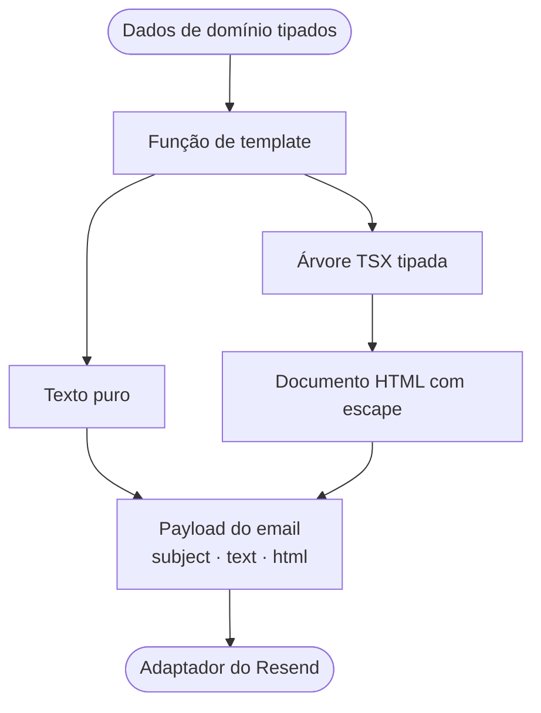

Este servidor trata os templates de e-mail como funções TypeScript. Cada função recebe dados de domínio, compõe um conjunto pequeno de primitivas TSX e devolve uma mensagem que não depende do provedor de entrega:

```ts
type RenderedMessage = {
  subject: string;
  text: string;
  html: string;
};
```

O renderizador de servidor do Solid transforma a árvore TSX em HTML. Uma função JSX local conecta os dois. Não há reatividade nem hidratação.



## Coloque o limite de tipos antes da marcação

Os templates não consultam o SQLite, não leem a bateria, não inspecionam variáveis de ambiente e não sabem quando uma tarefa agendada é executada. Suas entradas contêm apenas os dados necessários para renderizar uma mensagem.

O alerta de bateria recebe três valores escalares:

```ts
type BatteryAlert = {
  batteryPercent: number;
  thresholdPercent: number;
  timestamp: string;
};

export function renderBatteryAlert(alert: BatteryAlert) {
  return {
    subject: `Battery alert: ${alert.batteryPercent}% and discharging`,
    text: [
      "Battery alert",
      "",
      `Your battery is at ${alert.batteryPercent}% and is currently discharging.`,
      `Alert threshold: below ${alert.thresholdPercent}%.`,
      `Checked at: ${alert.timestamp}.`,
    ].join("\n"),
    html: renderEmail(() => <BatteryAlertEmail {...alert} />),
  };
}
```

O relatório usa uma união discriminada:

```ts
export type BlogReport =
  | (BlogReportBase & { kind: "daily" })
  | (BlogReportBase & {
      kind: "weekly";
      previousDayViews: number;
    });
```

A condição `report.kind === "weekly"` estreita o tipo antes de o template acessar `previousDayViews`. Um relatório diário não pode exigir esse campo por engano, e o TypeScript rejeita um relatório semanal construído sem ele. O gerador depende da interface estreita `BlogViewsReader`, em vez do armazenamento SQLite concreto, por isso os testes podem agregar visualizações com um objeto em memória.

O servidor completa os dados de domínio antes da renderização, o TypeScript verifica as props em cada chamada TSX e a função de entrega sempre recebe `{ subject, text, html }`. As entradas atuais surgem dentro do servidor. Dados vindos da rede ainda exigiriam validação em runtime.

## Uma função JSX precisa de apenas dois caminhos

Cada arquivo TSX de e-mail começa com `/** @jsx emailElement */`. Assim, a transformação JSX do Bun encaminha componentes e tags nativas para a função local definida em [`server/email/components.tsx`](https://github.com/ErickCReis/ErickCReis/blob/main/server/email/components.tsx).

```ts
export function emailElement(
  type: EmailElementType,
  props: Record<string, unknown> | null,
  ...children: unknown[]
): JSX.Element {
  const resolvedChildren = children.length === 1 ? children[0] : children;

  if (typeof type === "function") {
    return type({ ...props, children: resolvedChildren });
  }

  return ssrElement(
    type,
    props,
    resolveIntrinsicChild(resolvedChildren),
    false,
  ) as unknown as JSX.Element;
}
```

Existem apenas dois casos:

1. Uma função representa um componente local como `EmailCard`; ela é chamada com suas props e filhos.
2. Uma string representa um elemento HTML nativo como `table`; ela é entregue ao `ssrElement` do Solid.

Em seguida, `renderEmail` acrescenta o doctype à saída do servidor:

```ts
export function renderEmail(template: () => JSX.Element) {
  return `<!doctype html>${renderToString(template)}`;
}
```

O callback é importante porque `renderToString` estabelece o contexto de renderização no servidor enquanto avalia a árvore. O resultado é um documento HTML completo. O adaptador de entrega não precisa montar fragmentos depois.

A assinatura interna com `Record<string, unknown>` é permissiva. Um conjunto maior de componentes exigiria props e tipos de retorno mais restritos.

## Faça o escape na fronteira do elemento nativo

Os dados do template acabam como filhos de elementos HTML. Antes de entregá-los a `ssrElement`, o renderizador resolve arrays e funções filhas recursivamente e escapa strings:

```ts
function resolveIntrinsicChild(child: unknown): unknown {
  if (Array.isArray(child)) return child.map(resolveIntrinsicChild);
  if (typeof child === "function") return resolveIntrinsicChild(child());
  if (typeof child === "string") return escape(child);
  return child;
}
```

Essa posição mantém a composição de componentes intacta. Um componente pode encaminhar seus filhos por várias chamadas de função, mas o renderizador escapa as strings quando elas entram em uma tag nativa. Filhos numéricos continuam como números, e o Solid os serializa.

O teste do relatório usa o slug `typescript-<patterns>` para verificar o limite contra injeção. O corpo em texto mantém o valor legível. O HTML deve conter `typescript-&lt;patterns>` e não pode conter a string original com formato de tag.

Isso protege os filhos de texto usados pelos templates atuais. O renderizador não oferece uma API para HTML bruto confiável, e os templates não interpolam estilos, nomes de atributos ou marcação controlados pelo usuário. Adicionar qualquer um desses recursos exigiria uma nova revisão do modelo de escape.

## Construa para clientes de e-mail, não para o navegador

A camada de componentes compartilhados contém quatro primitivas visuais:

- `EmailLayout` controla o documento, o texto oculto de prévia, o fundo e a tabela externa de apresentação.
- `EmailCard` cria uma área de conteúdo centralizada com largura máxima de 600 pixels.
- `EmailHeading` e `EmailText` fornecem tipografia reutilizável.
- `renderEmail` serializa a árvore final.

O layout usa tabelas com `role="presentation"`, atributos HTML de alinhamento, fontes de sistema conservadoras e objetos de estilo inline:

```tsx
<table
  role="presentation"
  style={{
    width: "100%",
    "border-collapse": "collapse",
    "background-color": "#f4f4f5",
  }}
>
  <tbody>
    <tr>
      <td align="center" style={{ padding: "32px 16px" }}>
        {props.children}
      </td>
    </tr>
  </tbody>
</table>
```

Essas escolhas dependem menos de folhas de estilo e mecanismos modernos de layout. Ainda assim, não garantem uma renderização idêntica em todas as caixas de entrada. O cartão, por exemplo, usa `max-width` e `border-radius` sem marcação condicional específica para Outlook. Também não há ajustes para modo escuro.

A tabela de duas colunas continua dentro de `BlogReportEmail` porque nenhuma outra mensagem precisa dela. A camada compartilhada contém apenas o layout usado pelos dois e-mails, não um componente para envolver cada tag HTML.

## Gere explicitamente as duas alternativas MIME

Os dois renderizadores produzem HTML e texto puro a partir da mesma entrada tipada. A versão em texto é escrita explicitamente:

```ts
const rows =
  report.views.length === 0
    ? ["No blog reads were recorded in this period."]
    : report.views.map((row) => `${row.slug}: ${row.views}`);

return {
  subject: `${label} blog report: ${total}`,
  text: [
    `${label} blog report`,
    period,
    "",
    `Total: ${total}`,
    ...previousDaySummary,
    ...rows,
  ].join("\n"),
  html: renderEmail(() => <BlogReportEmail report={report} />),
};
```

Um renderizador de texto explícito controla hierarquia, espaços, estados vazios e a transformação da tabela em linhas de texto. Ele também mantém as duas versões lado a lado. Mudar o rótulo do relatório ou adicionar um campo exige revisar o texto e o HTML na mesma função.

Os caminhos de texto e HTML ainda duplicam parte da lógica de apresentação. Para duas mensagens curtas, essa duplicação é mais fácil de auditar do que uma AST intermediária de documento. Mais templates poderiam tornar a AST útil. O código atual não precisa dela.

## Separe agendamento, renderização e entrega

O relatório agendado segue um pipeline estreito:

```ts
const message = renderBlogReport(createBlogReport(blogViewsStore, now));

return sendEmail({
  to: BLOG_REPORT_EMAIL_TO,
  ...message,
});
```

`createBlogReport` cuida das regras de calendário e agregação. `renderBlogReport` cuida da apresentação. A tarefa agendada escolhe o horário e o destinatário. [`sendEmail`](https://github.com/ErickCReis/ErickCReis/blob/main/server/lib/email.ts) chama o provedor e adiciona o remetente.

O adaptador de entrega recebe `to`, `subject`, `text` e `html`, adiciona o remetente fixo e chama `resend.emails.send`. Se `RESEND_API_KEY` não existir, ele retorna `false`. Também retorna `false` para um erro do provedor ou uma exceção, depois de registrar o erro, e retorna `true` apenas quando a chamada à API termina sem erro.

O cron da bateria usa esse booleano como seu latch em memória `batteryAlertSent`. Uma tentativa malsucedida não bloqueia a próxima verificação, feita cinco segundos depois. Um envio bem-sucedido evita repetições até que o status da bateria mude. O cron do relatório apenas devolve o resultado, mas o código não tem fila de tentativas nem registro persistente de entrega.

## Teste cada ponto de falha separadamente

Os testes cobrem três fronteiras diferentes:

- `createBlogReport` recebe datas fixas e métodos de leitura falsos, verificando o dia anterior no calendário de São Paulo, a troca para o relatório semanal de domingo a sábado, a ordenação e os totais.
- `renderBlogReport` verifica o assunto, a linha em texto puro e o HTML escapado.
- `renderBatteryAlert` verifica a estrutura compartilhada da mensagem, o doctype, o texto do limite e o percentual renderizado.

Esses testes unitários determinísticos não precisam do SQLite para construir relatórios e nunca chamam o Resend. Não existe uma suíte de snapshots em diferentes clientes de e-mail, teste com mock do adaptador de entrega nem regressão visual automatizada. Validar o HTML em caixas de entrada reais continua sendo uma etapa manual.

## Saiba quando trocar o pequeno renderizador

Este renderizador atende aos dois e-mails operacionais presentes no servidor. Seus limites são explícitos:

- não há inliner de CSS nem transformação de folhas de estilo;
- não há camada de compatibilidade para Outlook/VML;
- não há sistema de componentes responsivos nem política de modo escuro;
- não há servidor local de prévia;
- não há validação em runtime para as entradas dos templates;
- não há tentativas persistidas, chave de idempotência ou auditoria de entrega;
- não há matriz automatizada de renderização entre clientes.

Se o servidor ganhar mais templates, suporte rigoroso ao Outlook ou prévias automatizadas, um framework de e-mail dedicado passará a valer o custo.
