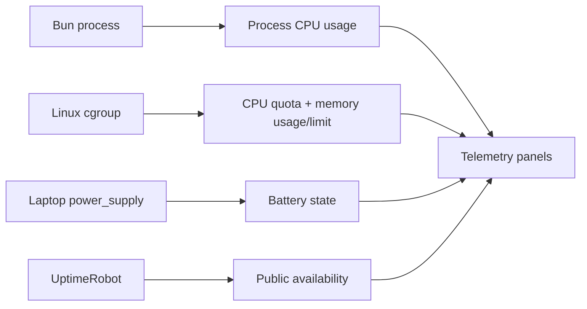

import { RuntimeVantageLab } from "@web/features/blog-series/labs/runtime-vantage-lab";

The [previous post](/content/shipping-astro-from-a-bun-server) put Astro's files and the Bun server inside one container. Once that container became the production unit, a simple question stopped having a simple answer: when the site displays “system health,” which system is it describing?

CPU can mean the whole laptop, the container's allowance, or the server process itself. Memory reported by `node:os` may describe the host even when the process is constrained by a cgroup. The laptop has a battery, but the container cannot see it unless that host detail is deliberately exposed. Process uptime says nothing about whether the public domain was reachable.

When I first put these readings beside one another, their proximity made them look interchangeable. They are not. The telemetry on this site keeps four observer lenses—process, cgroup, host, and outside—separate instead of pretending one measurement can describe the whole deployment.



## CPU is relative to the process allowance

[`server/stats/system.ts`](https://github.com/ErickCReis/ErickCReis/blob/main/server/stats/system.ts) samples every 1.5 seconds. For CPU, it starts with `process.cpuUsage()`, which reports the user and system CPU time consumed by the Bun process. It compares those cumulative values with the previous sample and divides the work by elapsed wall time.

The denominator also includes the CPU count available to the deployment. On cgroup v2, the module reads `cpu.max` and divides quota by period. It supports the equivalent cgroup v1 files and falls back to `os.cpus().length` when no finite quota is available.

```ts
const percent = (usedMicroseconds / (elapsedMicroseconds * CPU_COUNT)) * 100;
```

The result is therefore not “how busy is every process on the laptop?” It is the share of the deployment's CPU capacity used by this process, clamped between zero and 100 percent. Docker Compose currently limits the service to one CPU, so the panel answers the operationally useful question: how much of the CPU assigned to this application is its Bun process consuming?

The calculated cgroup CPU count rounds the quota to a whole number and never goes below one. That is sufficient for the current one-CPU limit, but it would be a coarse model for fractional CPU quotas. Telemetry is only useful when its interpretation and limitations remain visible.

## Memory should respect the cgroup

Calling `os.totalmem()` inside a container can expose the host's total memory rather than the amount the service may use. The module checks the container boundary first.

For cgroup v2 it reads `memory.current` and `memory.max`; for v1 it uses `memory.usage_in_bytes` and `memory.limit_in_bytes`. A v2 limit of `max` means unlimited. Cgroup v1 can represent the same idea with a very large number, so the module rejects a reported limit larger than twice the host memory.

If the cgroup files are unavailable or unlimited, the fallback is host memory from `node:os`. Otherwise, the panel calculates used megabytes and percentage against the cgroup values. With the current Compose limit of 1 GB, “memory used” describes pressure against the container's budget rather than against all RAM installed in the laptop.

That number is not the Bun heap either. `memory.current` accounts memory to the cgroup boundary, which can include the process, native allocations, and filesystem cache. It is the right signal for “is this container approaching its enforced budget?”, not for diagnosing which allocation inside Bun consumed it.

That distinction matters before an out-of-memory kill. A host with free RAM can still terminate a container that crosses its own limit.

## The battery is an intentional host leak

The application runs on a laptop, so power state is unusually relevant. Linux exposes it through `/sys/class/power_supply`, but that path belongs to the host.

The [Compose configuration](https://github.com/ErickCReis/ErickCReis/blob/main/docker-compose.yml) mounts only that directory into the container, read-only, at `/host-sys/class/power_supply`. `BATTERY_SUPPLY_ROOT` tells the application to look there:

```yaml
volumes:
  - /sys/class/power_supply:/host-sys/class/power_supply:ro
environment:
  BATTERY_SUPPLY_ROOT: /host-sys/class/power_supply
```

[`server/lib/battery.ts`](https://github.com/ErickCReis/ErickCReis/blob/main/server/lib/battery.ts) finds the first directory beginning with `BAT`, reads `capacity` and `status`, validates a percentage between zero and 100, and normalizes the status to charging, discharging, full, or unknown. Reads are cached for 15 seconds even though the system stat samples faster; battery state does not need a disk read every 1.5 seconds.

If the mount, battery, or files do not exist, the reader returns `null` values and the panel displays `n/a`. Host battery telemetry is an optional capability, not an assumption every deployment must satisfy.

This is a deliberate, narrow leak through the container boundary. Mounting the whole host filesystem would make a dashboard easier to build and much harder to trust. Exposing only the power-supply directory says exactly which host detail the application is allowed to observe.

## Uptime needs a view from outside

The original uptime value was close to a process timer. That can say how long the current process has been alive, but not whether DNS, the Cloudflare tunnel, the network, the container, and the HTTP server formed a working public path.

[`server/stats/server.ts`](https://github.com/ErickCReis/ErickCReis/blob/main/server/stats/server.ts) now polls [UptimeRobot](https://uptimerobot.com/) every five minutes. The request asks for 30 explicit UTC day ranges, a 30-day ratio, and recent up/down logs. The returned monitor becomes three pieces of product data:

- daily availability for the 30-day bar;
- overall availability for that window;
- the current reachable streak, calculated from the latest recovery log.

Days before the monitor was created remain `null` instead of becoming zero-percent outages. Between server snapshots, the Solid panel advances a successful streak locally once per second, so the visible timer moves without polling the external API every second.

The request has a 15-second timeout and short retries after network failures, `429` responses, and server errors. If those attempts fail after the module has already fetched a valid monitor, it keeps the last successful snapshot and tries the polling cycle again after one minute. An outage in the monitoring API should not immediately rewrite the site's last known availability as zero.

I use the lab below as a boundary debugger. Choose a lens, change only the signal available to it, and watch both the answer and its blind spot. In particular, leave the Bun process “up 7d” while taking the public route down: both statements can be true at the same time.

<RuntimeVantageLab client:visible locale="en-US" />

The gauge is deliberately not enough on its own. Its observer, denominator, and blind spot are part of the value; without those labels, a precise percentage can still tell the wrong story.

## From a visible stat to an actionable signal

Battery level also powers a small operational action. An [`@elysiajs/cron`](https://github.com/elysiajs/elysia-cron) task checks every five seconds with a forced fresh battery read. When the laptop is discharging below 50 percent, it sends an email through [Resend](https://resend.com/).

The task records whether an alert was sent and resets that state when the battery status changes. It therefore avoids sending the same warning every five seconds. If the Resend API key or destination address is absent, the task is a no-op; telemetry continues without email configuration.

The panel and alert answer different questions. The panel helps a visitor—or me—understand the deployment. The email asks for action when a host-specific condition crosses a threshold. They reuse the same battery reader, but they should not share the same delivery policy.

There is no single “real system” behind a containerized application. This site measures process work against its cgroup allowance, opts into one host hardware signal, and asks an external observer whether the full public route works. I keep those perspectives separate because the boundary around a number is what makes that number honest.

The next post returns to the static Astro output and adds one narrow runtime feature of its own: view counts for MDX articles without making the blog dynamic.
