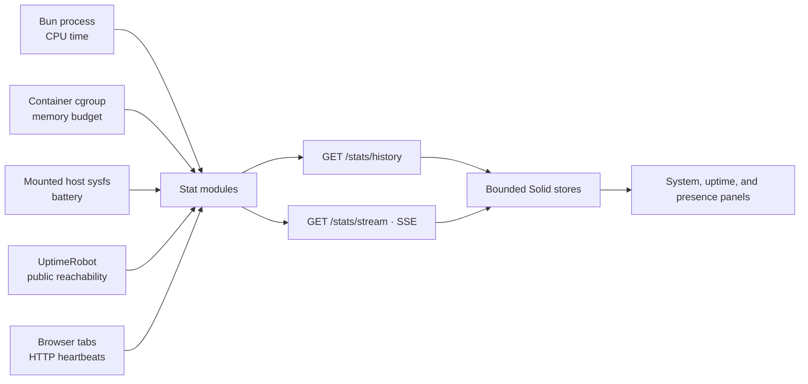

A runtime metric is incomplete until it identifies where it was observed and what its denominator means. In this deployment, the Bun process runs inside a container on a laptop and is reached through a public network path. Those layers produce measurements with different scopes:


```mermaid center
flowchart LR
  Process["Bun process<br/>CPU time"] --> Stats["Stat modules"]
  Cgroup["Container cgroup<br/>memory budget"] --> Stats
  Host["Mounted host sysfs<br/>battery"] --> Stats
  Outside["UptimeRobot<br/>public reachability"] --> Stats
  Presence["Browser tabs<br/>HTTP heartbeats"] --> Stats
  Stats --> Bootstrap["GET /stats/history"]
  Stats --> Stream["GET /stats/stream · SSE"]
  Bootstrap --> Stores["Bounded Solid stores"]
  Stream --> Stores
  Stores --> Panels["System, uptime, and presence panels"]
```

## One module contract, different sampling policies

The runtime collectors implement the same deliberately small interface:

```ts
export type StatModule<T> = {
  start: (...args: any[]) => void;
  getLatest: () => T;
  getHistory: () => T[];
  getVersion: () => number;
};
```

Each module owns its clock and retention policy. System samples arrive every 1.5 seconds, presence every 5 seconds, and external uptime every 5 minutes. The shared interface standardizes delivery while the source defines what each value means.

## Process CPU normalized by an inferred cgroup allowance

[`server/stats/system.ts`](https://github.com/ErickCReis/ErickCReis/blob/main/server/stats/system.ts) measures CPU with `process.cpuUsage()`. That API returns cumulative user and system CPU time for the Bun process in microseconds. The collector takes a delta and divides it by monotonic wall-clock time from `Bun.nanoseconds()`:

```ts
const usedMicroseconds =
  currentCpuUsage.user -
  previousCpuUsage.user +
  (currentCpuUsage.system - previousCpuUsage.system);

const percent = (usedMicroseconds / (elapsedMicroseconds * CPU_COUNT)) * 100;
return Number(Math.max(0, Math.min(100, percent)).toFixed(2));
```

The numerator is process work, not total cgroup CPU usage and not host CPU usage. A second process in the same container would not appear in this value.

`CPU_COUNT` is resolved once when the module loads. For cgroup v2, the code reads `cpu.max`; for v1 it reads `cpu.cfs_quota_us` and `cpu.cfs_period_us`. A finite quota is converted to a CPU count with:

```ts
Math.max(1, Math.round(Number(quota) / Number(period)));
```

Without a finite cgroup quota, the fallback is `os.cpus().length`. The current Compose deployment sets `cpus: "1"`, so 100% means the Bun process consumed approximately one assigned CPU during the sample interval.

Fractional quotas are rounded to an integer, the result is clamped to 100%, and the allowance is read only when the module loads. The module keeps 84 samples, about 126 seconds of history, and loses them on restart.

## Cgroup memory is a budget metric, not a heap metric

Memory uses a different observer boundary. The collector reads `memory.current` and `memory.max` on cgroup v2, with equivalent v1 files as fallbacks. It uses the cgroup boundary only when both current usage and a finite limit are available:

```ts
if (input.cgroupUsedBytes !== null && input.cgroupTotalBytes !== null) {
  return {
    usedBytes: input.cgroupUsedBytes,
    totalBytes: input.cgroupTotalBytes,
  };
}

return {
  usedBytes: input.hostUsedBytes,
  totalBytes: input.hostTotalBytes,
};
```

This avoids dividing container usage by host capacity. If either cgroup value is unavailable, both numerator and denominator fall back to `os.totalmem() - os.freemem()` and `os.totalmem()`.

For cgroup v2, `memory.max === "max"` means no finite limit. Cgroup v1 represents an unlimited boundary with a very large number, so the collector accepts a v1 limit only when it is below twice host memory. In the Compose deployment, `memory: 1G` gives the panel a container-sized denominator.

`memory.current` is not `process.memoryUsage().heapUsed`. It can include Bun's heap, native allocations, other processes in the cgroup, and accounted page cache. It answers “how close is this container to its enforced memory limit?”, not “which JavaScript allocation is growing?”. If the cgroup is unlimited, the host fallback changes the question again to host-wide memory pressure. The schema and panel do not currently expose which boundary was selected, so deployment knowledge is required to interpret the percentage correctly.

## Host battery is an optional, cached capability

The container cannot normally see laptop power state. Compose exposes only the required host subtree as a read-only mount:

```yaml
volumes:
  - /sys/class/power_supply:/host-sys/class/power_supply:ro
environment:
  BATTERY_SUPPLY_ROOT: /host-sys/class/power_supply
```

[`server/lib/battery.ts`](https://github.com/ErickCReis/ErickCReis/blob/main/server/lib/battery.ts) selects the first entry whose name starts with `BAT`, reads `capacity` and `status`, validates the percentage, and normalizes status to `charging`, `discharging`, `full`, or `unknown`.

The reader caches its result for 15 seconds:

```ts
if (!forceRefresh && now - cachedBatteryAt < BATTERY_CACHE_MS) {
  return cachedBatteryInfo;
}
```

Consequently, the 1.5-second system sampler can emit repeated battery values without repeatedly reading sysfs. Missing mounts, absent batteries, unreadable files, and invalid capacity values become nullable fields; the panel renders a missing percentage as `n/a`.

The reader cannot distinguish every failure cause, and the first `BAT*` entry is insufficient for a host with several batteries. The five-second alert cron bypasses the cache with `forceRefresh: true`.

## External uptime is a 30-day aggregation

Process lifetime is not public availability. [`server/stats/server.ts`](https://github.com/ErickCReis/ErickCReis/blob/main/server/stats/server.ts) asks UptimeRobot to observe the route from outside the host. Its request contains 30 explicit UTC ranges, a 30-day ratio, and up to 50 recent transition logs.

[`server/stats/uptime.ts`](https://github.com/ErickCReis/ErickCReis/blob/main/server/stats/uptime.ts) creates 29 complete UTC-day ranges plus a partial range from the start of today to `now`. It maps `custom_uptime_ranges` back to those dates. A day entirely before monitor creation is represented as `null`; a missing percentage for a day after creation currently becomes `0`.

The overall value prefers UptimeRobot's `custom_uptime_ratio`. If that field is absent, the fallback is the unweighted arithmetic mean of non-null daily percentages:

```ts
const availableDays = dailyUptime.filter((day) => day.uptimePercent !== null);
const total = availableDays.reduce(
  (sum, day) => sum + (day.uptimePercent ?? 0),
  0,
);
return Number((total / availableDays.length).toFixed(2));
```

That fallback gives today's partial day the same weight as a complete day, so it is an approximation rather than a duration-weighted availability calculation.

The current reachable streak is also derived rather than directly supplied. If the monitor is not up, it is zero. Otherwise, the collector sorts the returned logs newest first and counts from the latest recovery event. If there are no logs, monitor creation time is the fallback. Because only 50 logs are requested, an unusually transition-heavy period can prevent the collector from finding an older recovery point.

The browser does not wait five minutes to repaint the streak. `ServerPanel` adds elapsed client time to the snapshot once per second while `currentStreakSeconds > 0`. This is a display extrapolation: it assumes the route remains up until the next server snapshot says otherwise.

## Retry and stale-data behavior are part of the metric

Uptime requests have a 15-second timeout. Network errors, invalid JSON, HTTP `429`, and `5xx` responses are retryable; delays are one and two seconds, for at most three attempts. Permanent API failures are not retried inside that request cycle.

After an error, the collector schedules its next cycle in one minute instead of five. Before the first success it publishes an empty snapshot; after a success it keeps the last valid snapshot and does not increment the version for a failed refresh.

Keeping the last good value prevents a monitoring-provider failure from looking like a site outage. However, the data model has no `stale`, `configured`, or `fetchError` field. A visitor cannot distinguish missing credentials, startup failure, or a genuine zero value from the numeric fields alone. Once a successful snapshot becomes stale, its original timestamp is the only freshness signal, and the current panel does not display it.

## The “WebSocket” stat measures heartbeat presence

The module and panel retain the name `websocket`, but the current presence mechanism is HTTP-based. An inline browser script assigns each tab an ID and sends `POST /presence/ping` every 15 seconds. `pagehide` attempts `POST /presence/leave`; both operations prefer `navigator.sendBeacon` and fall back to `fetch(..., { keepalive: true })`.

The server stores `tabId -> lastSeenAt` in a `Map`. Entries older than 45 seconds are pruned:

```ts
const cutoff = now - VIEWER_STALE_AFTER_MS;
for (const [tabId, lastSeenAt] of activeViewerTabs) {
  if (lastSeenAt < cutoff) activeViewerTabs.delete(tabId);
}
```

`connectedUsers` means recently active browser tabs, not authenticated people or open WebSocket connections. Multiple tabs from one person count multiple times. A tab can remain counted for up to roughly 45 seconds after an unreported departure.

Presence changes update `latest` and `version` immediately. Independently, a five-second tick appends a sample to an 84-point history, giving the chart about seven minutes of in-memory data. The maximum observed concurrency and compact `{ ts, count }` history records are written to `presence-stats-v1.json` at most every 30 seconds. Corrupt persisted JSON is ignored, writes are not wrapped in local error handling, and active tab identities are intentionally never persisted.

`connectionStartedAt` records when the presence collector started. The panel labels it “Connected”, although it measures server collector lifetime rather than a browser session.

## Bootstrap once, then coalesce updates over SSE

When `TelemetryBackdrop` mounts, it starts the history request and stream subscription concurrently. `GET /stats/history` returns projected histories plus full latest snapshots. Historical system points include only timestamp, CPU, and memory percentages; presence history includes only timestamp and connected count. Fields needed only for labels stay in `latest`.

The wire format uses positional tuples and short event names such as `sy`, `sr`, and `ws`. The SSE route checks module versions every 500 milliseconds and sends only the latest snapshot. Several changes inside one scan can collapse into one event.

After a disconnect, the client retries in one second. Each response starts with an empty `lastSeen` map, so initialized modules resend their current snapshots. Client stores keep 84 system and presence points and 10 uptime points. The tuple decoders do not run Valibot at the transport boundary, so server and browser must be deployed together when fields move.
