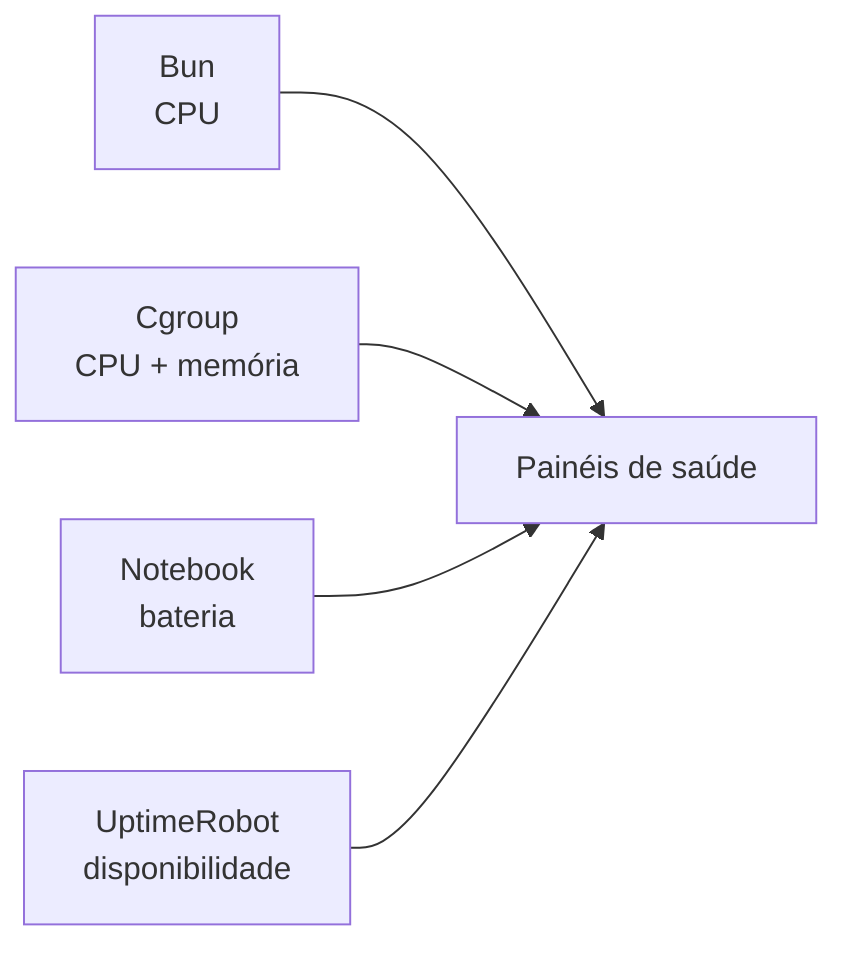

import { RuntimeVantageLab } from "@web/content/labs/runtime-vantage-lab";

O [post anterior](/pt-BR/blog/shipping-astro-from-a-bun-server) colocou os arquivos do Astro e o servidor Bun dentro de um único container. Quando esse container se tornou a unidade de produção, uma pergunta simples deixou de ter uma resposta simples: quando o site exibe a “saúde do sistema”, qual sistema está descrevendo?

CPU pode significar o notebook inteiro, a capacidade permitida ao container ou o próprio processo do servidor. A memória informada por `node:os` pode descrever o host mesmo quando o processo está restrito por um cgroup. O notebook tem bateria, mas o container não consegue enxergá-la sem que esse detalhe do host seja exposto de propósito. O tempo de vida do processo não diz se o domínio público estava acessível.

Quando coloquei essas leituras lado a lado pela primeira vez, a proximidade fez com que parecessem intercambiáveis. A telemetria deste site mantém separadas quatro lentes de observação (processo, cgroup, host e observador externo), pois uma única medida não consegue descrever todo o deploy.



## A CPU é relativa à capacidade atribuída ao processo

O arquivo [`server/stats/system.ts`](https://github.com/ErickCReis/ErickCReis/blob/main/server/stats/system.ts) coleta uma amostra a cada 1,5 segundos. Para a CPU, ele começa com `process.cpuUsage()`, que informa o tempo de CPU gasto pelo processo Bun em espaço de usuário e de sistema. O módulo compara esses valores cumulativos com a amostra anterior e divide o trabalho pelo tempo decorrido.

O denominador também inclui o número de CPUs disponível para o deploy. No cgroup v2, o módulo lê `cpu.max` e divide a cota pelo período. Ele aceita os arquivos equivalentes do cgroup v1 e usa `os.cpus().length` quando não há uma cota finita disponível.

```ts
const percent = (usedMicroseconds / (elapsedMicroseconds * CPU_COUNT)) * 100;
```

O resultado representa a parcela da capacidade de CPU do deploy consumida por este processo, limitada entre zero e 100 por cento. Hoje, o Docker Compose limita o serviço a uma CPU, então o painel mostra quanto da CPU atribuída a esta aplicação está sendo consumido pelo processo Bun.

O número de CPUs calculado a partir do cgroup arredonda a cota para um inteiro e nunca fica abaixo de um. Isso é suficiente para o limite atual de uma CPU, mas seria um modelo aproximado para cotas fracionárias. A telemetria só é útil quando sua interpretação e suas limitações permanecem visíveis.

## A memória deve respeitar o cgroup

Chamar `os.totalmem()` dentro de um container pode expor a memória total do host, não a quantidade que o serviço pode usar. O módulo verifica primeiro a fronteira do container.

No cgroup v2, ele lê `memory.current` e `memory.max`; no v1, usa `memory.usage_in_bytes` e `memory.limit_in_bytes`. Um limite `max` no v2 significa que não há limite. O cgroup v1 pode representar a mesma ideia com um número muito grande, por isso o módulo rejeita um limite informado que ultrapasse duas vezes a memória do host.

Se os arquivos do cgroup não estiverem disponíveis ou não houver limite, o fallback é a memória do host informada por `node:os`. Caso contrário, o painel calcula os megabytes usados e o percentual a partir dos valores do cgroup. Com o limite atual de 1 GB no Compose, “memória usada” descreve a pressão sobre o orçamento do container, não sobre toda a RAM instalada no notebook.

`memory.current` mede mais do que o heap do Bun. Ele contabiliza memória na fronteira do cgroup, o que pode incluir o processo, alocações nativas e cache do sistema de arquivos. O valor mostra se o container está se aproximando do orçamento imposto; ele não permite diagnosticar qual alocação dentro do Bun o consumiu.

Essa distinção importa antes de uma interrupção por falta de memória. Um host com RAM livre ainda pode encerrar um container que ultrapassa seu próprio limite.

## A bateria é uma exposição intencional do host

A aplicação roda em um notebook, por isso o estado da energia é relevante de uma forma incomum. O Linux o expõe por `/sys/class/power_supply`, mas esse caminho pertence ao host.

A [configuração do Compose](https://github.com/ErickCReis/ErickCReis/blob/main/docker-compose.yml) monta apenas esse diretório dentro do container, em modo somente leitura, no caminho `/host-sys/class/power_supply`. A variável `BATTERY_SUPPLY_ROOT` instrui a aplicação a procurar ali:

```yaml
volumes:
  - /sys/class/power_supply:/host-sys/class/power_supply:ro
environment:
  BATTERY_SUPPLY_ROOT: /host-sys/class/power_supply
```

O arquivo [`server/lib/battery.ts`](https://github.com/ErickCReis/ErickCReis/blob/main/server/lib/battery.ts) encontra o primeiro diretório cujo nome começa com `BAT`, lê `capacity` e `status`, valida um percentual entre zero e 100 e normaliza o estado em quatro categorias: `charging`, `discharging`, `full` ou `unknown`. As leituras ficam em cache por 15 segundos mesmo que a estatística do sistema seja coletada com mais frequência; o estado da bateria não exige uma leitura do disco a cada 1,5 segundos.

Se a montagem, a bateria ou os arquivos não existirem, o leitor retorna valores `null`, e o painel mostra `n/a`. A telemetria da bateria do host é opcional e específica dos deploys que a expõem.

Essa é uma exposição intencional e estreita pela fronteira do container. Montar todo o sistema de arquivos do host facilitaria a criação do painel, mas reduziria muito a confiabilidade da aplicação. Expor apenas o diretório de alimentação declara exatamente qual detalhe do host a aplicação tem permissão para observar.

## O uptime precisa de um ponto de vista externo

O valor original de uptime se parecia com um contador do processo. Ele pode dizer há quanto tempo o processo atual está vivo, mas não informa se DNS, túnel da Cloudflare, rede, container e servidor HTTP formaram um caminho público funcional.

O arquivo [`server/stats/server.ts`](https://github.com/ErickCReis/ErickCReis/blob/main/server/stats/server.ts) agora consulta o [UptimeRobot](https://uptimerobot.com/) a cada cinco minutos. A requisição pede 30 intervalos diários explícitos em UTC, uma taxa de 30 dias e os logs recentes de disponibilidade. O monitor retornado se transforma em três dados do produto:

- disponibilidade diária para a barra dos últimos 30 dias;
- disponibilidade geral durante essa janela;
- período contínuo de disponibilidade, calculado a partir do último log de recuperação.

Os dias anteriores à criação do monitor permanecem como `null` em vez de se tornarem períodos com zero por cento de disponibilidade. Entre dois retratos do servidor, o painel do Solid prolonga localmente esse período a cada segundo, fazendo o contador visível avançar sem consultar a API externa a cada segundo.

A requisição tem um timeout de 15 segundos e novas tentativas curtas após falhas de rede, respostas `429` e erros do servidor. Se essas tentativas falharem depois que o módulo já obteve um monitor válido, ele mantém o último retrato bem-sucedido e tenta o ciclo de polling novamente após um minuto. Uma indisponibilidade da API de monitoramento não deve reescrever imediatamente como zero a última disponibilidade conhecida do site.

Uso o laboratório abaixo como um depurador de fronteiras. Escolha uma lente, altere apenas o sinal disponível para ela e observe tanto a resposta quanto seu ponto cego. Em especial, mantenha o processo Bun “ativo há 7d” enquanto tira a rota pública do ar: as duas afirmações podem ser verdadeiras ao mesmo tempo.

<RuntimeVantageLab client:load locale="pt-BR" />

O medidor precisa de contexto. Seu observador, denominador e ponto cego fazem parte do valor; sem esses rótulos, um percentual preciso ainda pode contar a história errada.

## De estatística visível a sinal acionável

O nível da bateria também alimenta uma pequena ação operacional. Uma tarefa do [`@elysiajs/cron`](https://github.com/elysiajs/elysia-cron) verifica a bateria a cada cinco segundos e força uma nova leitura. Quando o notebook está descarregando com menos de 50 por cento, ela envia um e-mail pelo [Resend](https://resend.com/).

A tarefa registra se um alerta foi enviado e limpa esse estado quando o status da bateria muda. Assim, evita mandar o mesmo aviso a cada cinco segundos. Sem a chave da API do Resend ou o endereço de destino, a tarefa não faz nada; a telemetria continua funcionando sem a configuração do e-mail.

O painel e o alerta respondem a perguntas diferentes. O painel ajuda os visitantes e também me ajuda a entender o deploy. O e-mail pede uma ação quando uma condição específica do host cruza um limite. Os dois reutilizam o mesmo leitor da bateria, mas não devem compartilhar a mesma política de entrega.

Uma aplicação em container expõe vários sistemas que podem ser medidos. Este site mede o trabalho do processo em relação à capacidade do cgroup, escolhe observar um sinal do hardware do host e pergunta a um observador externo se o caminho público completo funciona. Manter essas perspectivas separadas impede que um número seja confundido com o estado de todo o deploy.

O próximo post volta à saída estática do Astro e adiciona a ela uma pequena funcionalidade de runtime: contagens de visualizações para artigos MDX sem tornar o blog dinâmico.
