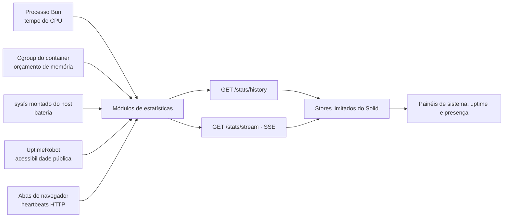

Uma métrica de runtime está incompleta enquanto não identifica onde foi observada e o que seu denominador significa. Neste deploy, o processo Bun roda em um container hospedado em um notebook e é acessado por um caminho público de rede. Essas camadas produzem medidas com escopos diferentes:


```mermaid center
flowchart LR
  Process["Processo Bun<br/>tempo de CPU"] --> Stats["Módulos de estatísticas"]
  Cgroup["Cgroup do container<br/>orçamento de memória"] --> Stats
  Host["sysfs montado do host<br/>bateria"] --> Stats
  Outside["UptimeRobot<br/>acessibilidade pública"] --> Stats
  Presence["Abas do navegador<br/>heartbeats HTTP"] --> Stats
  Stats --> Bootstrap["GET /stats/history"]
  Stats --> Stream["GET /stats/stream · SSE"]
  Bootstrap --> Stores["Stores limitados do Solid"]
  Stream --> Stores
  Stores --> Panels["Painéis de sistema, uptime e presença"]
```

## Um contrato de módulo, várias políticas de amostragem

Os coletores do runtime implementam a mesma interface, deliberadamente pequena:

```ts
export type StatModule<T> = {
  start: (...args: any[]) => void;
  getLatest: () => T;
  getHistory: () => T[];
  getVersion: () => number;
};
```

Cada módulo controla seu relógio e sua política de retenção. O sistema produz amostras a cada 1,5 segundos, a presença a cada 5 segundos e o uptime externo a cada 5 minutos. A interface compartilhada padroniza a entrega; a fonte define o significado de cada valor.

## CPU do processo normalizada por uma cota inferida do cgroup

O arquivo [`server/stats/system.ts`](https://github.com/ErickCReis/ErickCReis/blob/main/server/stats/system.ts) mede CPU com `process.cpuUsage()`. Essa API retorna, em microssegundos, o tempo cumulativo gasto pelo processo Bun em espaço de usuário e de sistema. O coletor calcula a diferença entre amostras e a divide pelo tempo de relógio monotônico obtido com `Bun.nanoseconds()`:

```ts
const usedMicroseconds =
  currentCpuUsage.user -
  previousCpuUsage.user +
  (currentCpuUsage.system - previousCpuUsage.system);

const percent = (usedMicroseconds / (elapsedMicroseconds * CPU_COUNT)) * 100;
return Number(Math.max(0, Math.min(100, percent)).toFixed(2));
```

O numerador representa o trabalho do processo, não o uso total de CPU do cgroup nem o uso do host. Um segundo processo no mesmo container não apareceria nesse valor.

`CPU_COUNT` é resolvido uma vez durante o carregamento do módulo. No cgroup v2, o código lê `cpu.max`; no v1, lê `cpu.cfs_quota_us` e `cpu.cfs_period_us`. Uma cota finita é convertida em quantidade de CPUs com:

```ts
Math.max(1, Math.round(Number(quota) / Number(period)));
```

Sem uma cota finita do cgroup, o fallback é `os.cpus().length`. O Compose atual define `cpus: "1"`, então 100% significa que o processo Bun consumiu aproximadamente uma CPU atribuída durante o intervalo da amostra.

Cotas fracionárias são arredondadas para um inteiro, o resultado é limitado a 100%, e a cota é lida somente durante o carregamento do módulo. O módulo mantém 84 amostras, cerca de 126 segundos de histórico, e perde esse histórico ao reiniciar.

## Memória do cgroup é uma métrica de orçamento, não de heap

A memória usa outra fronteira de observação. O coletor lê `memory.current` e `memory.max` no cgroup v2, com os arquivos equivalentes do v1 como alternativas. Ele usa a fronteira do cgroup apenas quando tanto o uso atual quanto um limite finito estão disponíveis:

```ts
if (input.cgroupUsedBytes !== null && input.cgroupTotalBytes !== null) {
  return {
    usedBytes: input.cgroupUsedBytes,
    totalBytes: input.cgroupTotalBytes,
  };
}

return {
  usedBytes: input.hostUsedBytes,
  totalBytes: input.hostTotalBytes,
};
```

Isso evita dividir o uso do container pela capacidade do host. Se um dos valores do cgroup estiver indisponível, numerador e denominador usam `os.totalmem() - os.freemem()` e `os.totalmem()`.

No cgroup v2, `memory.max === "max"` indica a ausência de limite finito. O cgroup v1 representa uma fronteira ilimitada com um número muito grande; por isso, o coletor só aceita o limite do v1 quando ele é inferior ao dobro da memória do host. No deploy do Compose, `memory: 1G` fornece ao painel um denominador do tamanho do container.

`memory.current` não é `process.memoryUsage().heapUsed`. Ele pode incluir o heap do Bun, alocações nativas, outros processos no cgroup e cache de páginas contabilizado. Ele responde “quão perto este container está do limite de memória imposto?”, não “qual alocação JavaScript está crescendo?”. Se o cgroup for ilimitado, o fallback para o host muda novamente a pergunta para a pressão de memória do host inteiro. O schema e o painel não expõem hoje qual fronteira foi escolhida, então interpretar o percentual exige conhecer o deploy.

## A bateria do host é uma capacidade opcional com cache

Normalmente, o container não enxerga o estado de energia do notebook. O Compose expõe somente a subárvore necessária do host, em modo somente leitura:

```yaml
volumes:
  - /sys/class/power_supply:/host-sys/class/power_supply:ro
environment:
  BATTERY_SUPPLY_ROOT: /host-sys/class/power_supply
```

O arquivo [`server/lib/battery.ts`](https://github.com/ErickCReis/ErickCReis/blob/main/server/lib/battery.ts) seleciona a primeira entrada cujo nome começa com `BAT`, lê `capacity` e `status`, valida o percentual e normaliza o estado como `charging`, `discharging`, `full` ou `unknown`.

O leitor mantém o resultado em cache por 15 segundos:

```ts
if (!forceRefresh && now - cachedBatteryAt < BATTERY_CACHE_MS) {
  return cachedBatteryInfo;
}
```

Assim, o amostrador de sistema que roda a cada 1,5 segundos pode emitir valores repetidos da bateria sem reler o sysfs em cada ciclo. Montagem ausente, bateria inexistente, arquivos ilegíveis e capacidade inválida se tornam campos anuláveis; o painel exibe `n/a` quando o percentual está ausente.

O leitor não distingue todas as causas de falha, e a primeira entrada `BAT*` não é suficiente para um host com várias baterias. O cron de alerta, executado a cada cinco segundos, ignora o cache com `forceRefresh: true`.

## Uptime externo é uma agregação de 30 dias

Tempo de vida do processo não é disponibilidade pública. O arquivo [`server/stats/server.ts`](https://github.com/ErickCReis/ErickCReis/blob/main/server/stats/server.ts) usa o UptimeRobot para observar a rota de fora do host. A requisição contém 30 intervalos UTC explícitos, um percentual de uptime para o período de 30 dias e até 50 logs recentes de transição.

O arquivo [`server/stats/uptime.ts`](https://github.com/ErickCReis/ErickCReis/blob/main/server/stats/uptime.ts) cria 29 intervalos correspondentes a dias UTC completos e um intervalo parcial entre o início de hoje e `now`. Depois, associa `custom_uptime_ranges` a essas datas. Um dia inteiro anterior à criação do monitor é representado como `null`; um percentual ausente para um dia posterior à criação se torna `0`.

O valor geral prefere `custom_uptime_ratio`, fornecido pelo UptimeRobot. Se esse campo estiver ausente, o fallback é a média aritmética sem ponderação dos percentuais diários não nulos:

```ts
const availableDays = dailyUptime.filter((day) => day.uptimePercent !== null);
const total = availableDays.reduce(
  (sum, day) => sum + (day.uptimePercent ?? 0),
  0,
);
return Number((total / availableDays.length).toFixed(2));
```

Esse fallback dá ao dia parcial de hoje o mesmo peso de um dia completo. Portanto, é uma aproximação, não um cálculo de disponibilidade ponderado por duração.

O período contínuo de acessibilidade também é derivado. Se o monitor não estiver ativo, o valor é zero. Caso contrário, o coletor ordena os logs do mais novo para o mais antigo e conta a partir do evento mais recente de recuperação. Se não houver logs, usa a data de criação do monitor. Como a requisição limita a resposta a 50 logs, um período com muitas transições pode impedir que o coletor encontre um ponto de recuperação mais antigo.

O navegador não espera cinco minutos para redesenhar esse contador. `ServerPanel` adiciona ao retrato o tempo transcorrido no cliente, uma vez por segundo, enquanto `currentStreakSeconds > 0`. Essa é uma extrapolação de apresentação: ela presume que a rota continua acessível até que o próximo retrato do servidor informe o contrário.

## Retentativas e dados antigos fazem parte da métrica

As requisições de uptime têm timeout de 15 segundos. Requisições que resultam em erros de rede, JSON inválido ou respostas HTTP `429` e `5xx` são repetidas; os atrasos são de um e dois segundos, com no máximo três tentativas. Requisições que resultam em falhas permanentes da API não são repetidas dentro do mesmo ciclo.

Depois de um erro, o coletor agenda o próximo ciclo para um minuto, em vez de cinco. Antes do primeiro sucesso, publica um retrato vazio; depois de um sucesso, mantém o último retrato válido e não incrementa a versão quando uma atualização falha.

Preservar o último valor válido evita transformar uma falha do provedor de monitoramento em uma indisponibilidade do site. Porém, o modelo não possui campos `stale`, `configured` ou `fetchError`. Somente pelos valores numéricos, o visitante não consegue distinguir credenciais ausentes, falha na inicialização ou um zero real. Quando um retrato válido fica antigo, seu timestamp original é o único sinal de atualidade, e o painel atual não o exibe.

## A estatística “WebSocket” mede presença por heartbeat

O módulo e o painel ainda preservam o nome `websocket`, mas o mecanismo atual de presença usa HTTP. Um script inline atribui um ID a cada aba e envia `POST /presence/ping` a cada 15 segundos. Em `pagehide`, tenta enviar `POST /presence/leave`; as duas operações preferem `navigator.sendBeacon` e usam `fetch(..., { keepalive: true })` como fallback.

O servidor mantém `tabId -> lastSeenAt` em um `Map`. Entradas com mais de 45 segundos são removidas:

```ts
const cutoff = now - VIEWER_STALE_AFTER_MS;
for (const [tabId, lastSeenAt] of activeViewerTabs) {
  if (lastSeenAt < cutoff) activeViewerTabs.delete(tabId);
}
```

`connectedUsers` significa abas de navegador ativas recentemente, não pessoas autenticadas nem conexões WebSocket abertas. Várias abas da mesma pessoa são contadas separadamente. Uma aba pode continuar na contagem por aproximadamente 45 segundos depois de sair sem conseguir enviar a notificação.

Mudanças de presença atualizam `latest` e `version` imediatamente. Em paralelo, um ciclo de cinco segundos acrescenta uma amostra a um histórico de 84 pontos, dando ao gráfico cerca de sete minutos de dados em memória. O pico de concorrência observado e registros compactos `{ ts, count }` são gravados em `presence-stats-v1.json` no máximo a cada 30 segundos. JSON persistido corrompido é ignorado, as escritas não têm tratamento local de erro, e as identidades das abas ativas nunca são persistidas.

`connectionStartedAt` registra quando o coletor de presença iniciou. O painel rotula o valor como “Connected”, embora ele meça a duração do coletor no servidor, não uma sessão do navegador.

## Bootstrap inicial e atualizações combinadas por SSE

Quando `TelemetryBackdrop` é montado, ele inicia simultaneamente a requisição de histórico e a assinatura do stream. `GET /stats/history` retorna históricos projetados e os retratos completos mais recentes. Os pontos históricos do sistema contêm apenas timestamp, CPU e percentuais de memória; os de presença contêm somente timestamp e quantidade de abas conectadas. Os campos usados apenas nos rótulos permanecem em `latest`.

O transporte usa tuplas posicionais e nomes curtos de evento, como `sy`, `sr` e `ws`. A rota SSE verifica as versões dos módulos a cada 500 milissegundos e envia apenas o retrato mais recente. Várias mudanças dentro de uma varredura podem virar um único evento.

Depois de uma desconexão, o cliente tenta novamente em um segundo. Cada resposta começa com um mapa `lastSeen` vazio, então os módulos inicializados reenviam seus retratos atuais. Os stores mantêm 84 pontos de sistema e presença e 10 pontos de uptime. Os decoders das tuplas não executam validações com o Valibot na fronteira de transporte; servidor e cliente precisam ser implantados juntos quando os campos mudam.
