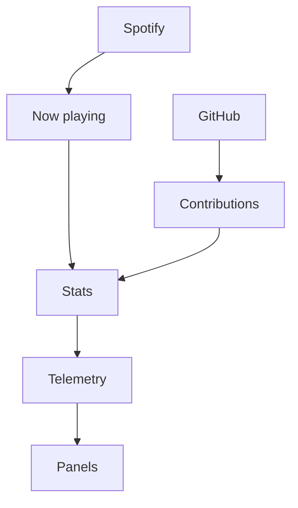
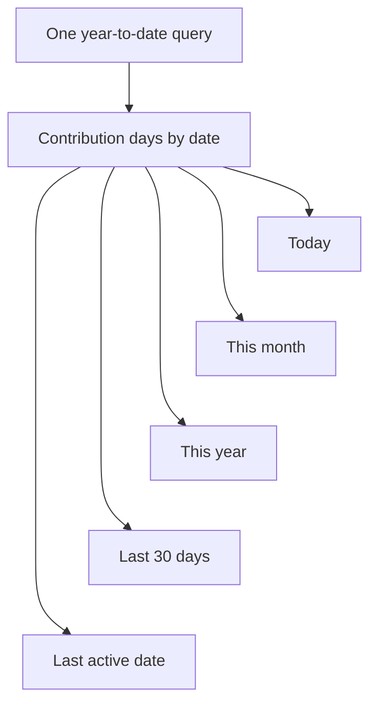

import { SourcePolicyLab } from "@web/content/labs/source-policy-lab";

The [cursor presence feature](/blog/realtime-cursor-presence-with-tiny-pieces) moves short-lived data between browsers. The next two live surfaces move in the other direction: they bring outside context into the portfolio.

A portfolio can accidentally become an archive: every card points backward. I wanted mine to keep a small pulse. One panel shows what I am listening to on [Spotify](https://developer.spotify.com/documentation/web-api); another summarizes my recent activity from the [GitHub GraphQL API](https://docs.github.com/en/graphql). Together they let the homepage say something about the present instead of only listing work from the past.

The panels look like neighboring pieces of telemetry, but their sources behave differently. Playback changes in seconds and can be absent. Contribution data changes slowly and remains useful after a restart. Treating both as “fetch an API every so often” would hide the product decisions that keep them timely, honest, and small.



I designed each adapter by answering the same three questions: how quickly can this value become misleading, what may cross the browser boundary, and what should happen when the source says “not now”? Those answers define each panel's policy.

## Spotify is a changing snapshot

The server cannot use the long-lived Spotify refresh token as an API token. [`server/stats/spotify.ts`](https://github.com/ErickCReis/ErickCReis/blob/main/server/stats/spotify.ts) first exchanges it, together with the client credentials, for a short-lived access token. That token stays in memory until one minute before its reported expiry, leaving a margin for the next request.

With an access token, the module requests the currently-playing endpoint and reduces the response to the fields the panel needs:

```ts
type SpotifyNowPlaying = {
  isConfigured: boolean;
  isPlaying: boolean;
  trackId: string | null;
  trackName: string | null;
  artistNames: string[];
  albumName: string | null;
  trackUrl: string | null;
  progressMs: number;
  durationMs: number;
  fetchedAt: number;
};
```

The [shared schema](https://github.com/ErickCReis/ErickCReis/blob/main/shared/stats/spotify.ts) is also a privacy boundary. The browser receives track metadata and a public Spotify link. Refresh tokens, API credentials, raw responses, device information, and playback controls stay on the server.

An HTTP `204` means there is no current playback, and non-track items become the same safe empty snapshot. Missing configuration is represented explicitly with `isConfigured: false`; the rest of the pipeline does not need an exception just because a deployment has no Spotify credentials.

The polling interval follows the usefulness of the data. While a track is playing, the server checks every 2.5 seconds so the progress bar and track changes remain believable. When playback is idle, it waits 15 seconds. A `429` response honors Spotify's `Retry-After` header, falling back to 30 seconds if the header cannot be parsed. A rejected access token clears the cache so the next cycle can refresh it.

The latest 84 snapshots live only in process memory. They let the panel find a previous track and disappear when the server restarts. The site displays playback context without building another permanent record of it.

## GitHub is a derived window

The GitHub panel has almost the opposite shape. It does not need a request every few seconds, and one response contains enough information to derive several UI values.

The [GitHub stat module](https://github.com/ErickCReis/ErickCReis/blob/main/server/stats/github.ts) sends one GraphQL query for the account's year-to-date contribution calendar. It flattens the returned weeks into dates, then calculates today's count, the current month's count, the year's count, the last active date, and a 30-day bar series locally.



The implementation and compact UI call these values commits, but the upstream source is GitHub's contribution calendar. That calendar is the product metric GitHub exposes; it should not be read as a local `git log` or an audit of every commit.

The module polls every 30 minutes. After a successful request, it writes the normalized snapshot to `github-cache.json` inside the application's data directory. On startup, a valid cache younger than the polling interval can populate the panel immediately, and the next request is delayed until that snapshot would have expired.

The cache contains the same aggregate values sent to the browser. It avoids an empty panel and a redundant API call after a process restart. Valibot validates it before use, so an old or malformed file degrades to a fresh request instead of quietly entering the stat stream.

GitHub rate limits have their own clock. On a rate-limited response, the module reads `X-RateLimit-Reset` and schedules the next attempt after the reset time, with a 15-minute fallback. Other failures produce an empty configured snapshot and use the same slower retry interval. That policy currently favors an honest empty state over leaving an old value on screen indefinitely.

Try making Spotify idle or rate-limited, then drag the GitHub cache past its 30-minute freshness boundary. The controls change the source conditions; the strip at the bottom is the stable contract both adapters still produce.

<SourcePolicyLab client:load locale="en-US" />

## One panel shape, two source policies

Both modules eventually expose the same four operations: start collecting, return the latest snapshot, return recent history, and report a version that changes with new data. Their [Solid panels](https://github.com/ErickCReis/ErickCReis/tree/main/web/stats) can therefore stay focused on presentation.

The Spotify panel derives a running progress bar from the latest track and shows the previous in-memory track when available. The GitHub panel turns the 30-day arrays into bars and puts the month and year totals in its footer. Neither component refreshes credentials, interprets rate-limit headers, reads a cache file, or knows how often its source should be polled.

Each source adapter owns authentication, timing, normalization, retention, and failure behavior. A shared contract carries only what the product surface needs. The UI renders a state rather than reenacting the external API.

Spotify and GitHub are two examples, but the homepage has several modules updating at several rates. The next post will follow the common path beneath them: initial history, compact transport tuples, an Elysia SSE stream, and the Solid stores that keep each panel small.
