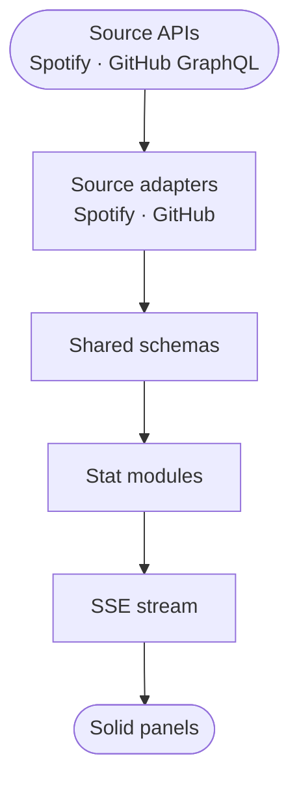
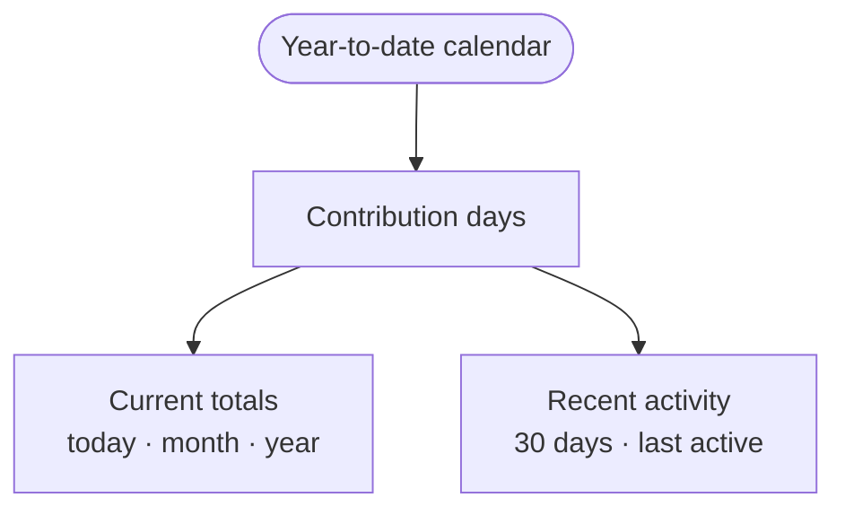

I do not want a live telemetry panel to hide an API client inside a UI component. A small adapter should fetch each source and decide how fresh its data must be, which fields to keep, how long to retain them, and what to publish after a failure.

Spotify and GitHub are useful contrasting examples. Spotify playback can become misleading within seconds and may not exist at all. GitHub contribution data changes slowly, can be derived from one larger response, and is worth caching across a process restart. Both sources still need to reach the same browser-side stats layer.


```mermaid center
flowchart TB
  APIs(["Source APIs<br/>Spotify · GitHub GraphQL"]) --> Adapters["Source adapters<br/>Spotify · GitHub"]
  Adapters --> Schemas["Shared schemas"]
  Schemas --> Modules["Stat modules"]
  Modules --> Stream["SSE stream"]
  Stream --> Panels(["Solid panels"])
```

The adapter deals with the external system. The panel renders the result. If a provider goes down, its adapter decides what to publish and the panel keeps the same input contract.

## Start with the output contract

The common module interface is intentionally small:

```ts
export type StatModule<T> = {
  start: (...args: any[]) => void;
  getLatest: () => T;
  getHistory: () => T[];
  getVersion: () => number;
};
```

Each module has one job: publish snapshots when its source changes. `getLatest` feeds the current state, `getHistory` supplies the initial view, and `getVersion` lets the SSE route detect changes without sending the same value repeatedly.

The generic interface does not make the data interchangeable. Each source has its own schema in [`shared/stats`](https://github.com/ErickCReis/ErickCReis/tree/main/shared/stats). Valibot validates persisted GitHub data before it is used, while the shared types keep server code, transport serialization, and Solid stores aligned.

The public snapshot is also a security boundary. It should contain exactly what the panel needs. Provider credentials, raw API responses, device metadata, and control methods stay on the server.

## Give every source its own clock

Polling should match what the visitor sees:

| Source  | Useful freshness            | Local policy                        | Persistence             |
| ------- | --------------------------- | ----------------------------------- | ----------------------- |
| Spotify | A few seconds while playing | 2.5 s while active, 15 s while idle | In-memory history only  |
| GitHub  | Several minutes             | 30 min after success                | Validated disk snapshot |

A shared five-minute timer would be wrong for both. It would make Spotify feel stale while asking GitHub for data more often than the UI needs.

## Adapter 1: reduce Spotify to a safe snapshot

The Spotify integration has two authentication steps. The refresh token is kept in server environment variables. [`server/stats/spotify.ts`](https://github.com/ErickCReis/ErickCReis/blob/main/server/stats/spotify.ts) exchanges it for a short-lived access token and keeps that access token in memory until one minute before its reported expiry:

```ts
if (tokenCache && tokenCache.expiresAt > Date.now() + TOKEN_EXPIRY_SAFETY_MARGIN_MS) {
  return tokenCache.accessToken;
}

const response = await fetch(SPOTIFY_TOKEN_ENDPOINT, {
  method: "POST",
  headers: {
    authorization: createBasicAuthHeader(clientId, clientSecret),
    "content-type": "application/x-www-form-urlencoded",
  },
  body: new URLSearchParams({
    grant_type: "refresh_token",
    refresh_token: refreshToken,
  }),
});
```

The browser never sees the refresh token or client secret. After authentication, the adapter maps the provider response to the fields that the panel can render:

```ts
type SpotifyNowPlaying = {
  isConfigured: boolean;
  isPlaying: boolean;
  trackId: string | null;
  trackName: string | null;
  artistNames: string[];
  albumName: string | null;
  trackUrl: string | null;
  progressMs: number;
  durationMs: number;
  fetchedAt: number;
};
```

This normalization handles three different "empty" cases without making the UI understand Spotify's response format:

- HTTP `204` means there is no current playback.
- A non-track item is reduced to the same empty snapshot.
- Missing credentials produce `isConfigured: false` instead of an exception in the stats stream.

The polling delay follows the current snapshot rather than staying fixed:

```ts
function getPollIntervalMs(isPlaying: boolean) {
  return isPlaying ? 2_500 : 15_000;
}
```

When Spotify responds with `429`, the adapter reads `Retry-After` and falls back to 30 seconds. A rejected access token invalidates the in-memory token cache so the next attempt can refresh it. Other request failures publish an empty configured snapshot and continue at the slower interval.

Playback history stays in memory. The module keeps at most 84 snapshots, enough for the panel to show a previous track without writing listening activity to a database. A restart clears the history.

## Adapter 2: derive GitHub metrics once

The GitHub integration uses the opposite strategy. [`server/stats/github.ts`](https://github.com/ErickCReis/ErickCReis/blob/main/server/stats/github.ts) requests the year-to-date contribution calendar with one GraphQL query, then derives all panel values locally:


```mermaid center
flowchart TB
  Query(["Year-to-date calendar"]) --> Days["Contribution days"]
  Days --> Current["Current totals<br/>today · month · year"]
  Days --> Recent["Recent activity<br/>30 days · last active"]
```

The derivation uses ISO date strings as keys. That gives the adapter a stable comparison format for the year and month boundaries, while the 30-day series is generated from the local date window so days without contributions still appear as zeroes.

The resulting snapshot contains only display-ready aggregates:

```ts
type GitHubCommitStats = {
  isConfigured: boolean;
  username: string;
  lastCommitDate: string | null;
  commitsToday: number;
  commitsLast30Days: number[];
  commitsLast30DayLabels: string[];
  commitsThisMonth: number;
  commitsThisYear: number;
  fetchedAt: number;
};
```

The panel uses "commits" as shorthand for GitHub's contribution calendar. It is not a local `git log` or an audit of every commit.

## Cache only the normalized state

GitHub data is slow enough to survive a restart. After a successful fetch, the adapter writes the normalized snapshot to `github-cache.json` in the application data directory. On startup it:

1. Checks whether the file exists.
2. Parses it with the shared Valibot schema.
3. Uses it only while it is younger than the 30-minute polling interval.
4. Schedules the next request for the remaining freshness window.

The cache stores the normalized object, so the rest of the application never has to interpret the provider response again. Valibot turns an old schema or malformed file into a cache miss instead of letting it enter the stream.

The error policy separates "try later" from "show a new state." After a rate limit, the adapter reads `X-RateLimit-Reset` and preserves the latest valid snapshot until then. If the header is missing, it waits 15 minutes. Other failures publish an empty configured snapshot and retry on the slower interval. The panel does not present stale data as fresh, and a temporary rate limit does not erase the last valid value.

## Keep the panel unaware of the provider

The Solid panels consume the normalized snapshots through the stats transport. They do not refresh credentials, parse `Retry-After`, read a cache file, or know how often a provider should be polled.

Each adapter now contains all decisions specific to its source:

| Concern         | Spotify adapter                       | GitHub adapter                                      |
| --------------- | ------------------------------------- | --------------------------------------------------- |
| Authentication  | Refresh token exchanged in memory     | Server token in the GraphQL request                 |
| Normalization   | Current track or explicit empty state | Contribution days into aggregate metrics            |
| Freshness       | Adaptive active/idle polling          | Fixed 30-minute polling                             |
| Rate limit      | `Retry-After`                         | `X-RateLimit-Reset`                                 |
| Retention       | 84 in-memory snapshots                | 84 in-memory snapshots plus one fresh disk snapshot |
| Browser payload | Track metadata and public URL         | Aggregated contribution values                      |

The two providers follow different clocks and failure rules, but both publish a small typed snapshot that the UI can render directly.

The history endpoint can load both modules through that contract. The SSE route emits only changed versions, and the panels render state without repeating either provider's API logic.
