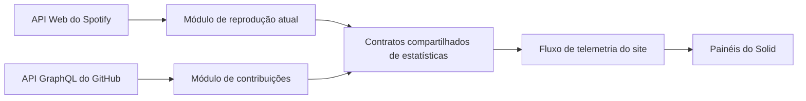
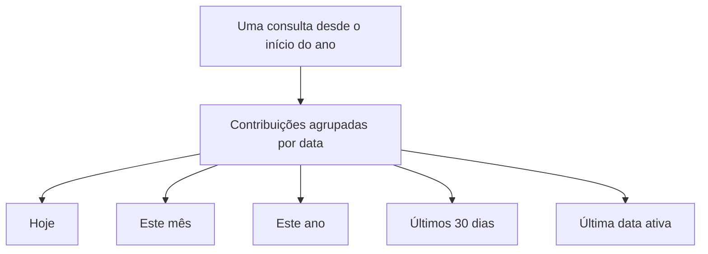

import { SourcePolicyLab } from "@web/content/labs/source-policy-lab";

A [funcionalidade de presença de cursores](/pt-BR/content/realtime-cursor-presence-with-tiny-pieces) movimenta dados temporários entre navegadores. As duas próximas superfícies dinâmicas seguem na direção oposta: trazem contexto externo para dentro do portfólio.

Um portfólio pode virar um arquivo sem querer: cada card aponta para trás. Eu queria que o meu mantivesse um pequeno pulso. Um painel mostra o que estou ouvindo no [Spotify](https://developer.spotify.com/documentation/web-api); outro resume minha atividade recente a partir da [API GraphQL do GitHub](https://docs.github.com/pt/graphql). Juntos, eles permitem que a página inicial diga algo sobre o presente em vez de apenas listar trabalhos do passado.

Os painéis aparecem lado a lado como peças de telemetria, mas suas fontes se comportam de formas diferentes. A reprodução muda em segundos e pode nem existir. Os dados de contribuições mudam devagar e continuam úteis depois de uma reinicialização. Tratar os dois apenas como “consultar uma API de tempos em tempos” esconderia as decisões de produto que os mantêm atuais, honestos e pequenos.



Projetei cada adaptador respondendo às mesmas três perguntas: com que rapidez esse valor pode se tornar enganoso, o que pode atravessar a fronteira do navegador e o que deve acontecer quando a fonte diz “agora não”? As respostas — e não o tamanho visual do painel — definem a política.

## O Spotify é um retrato em movimento

O servidor não pode usar o refresh token duradouro do Spotify diretamente como token da API. Primeiro, o arquivo [`server/stats/spotify.ts`](https://github.com/ErickCReis/ErickCReis/blob/main/server/stats/spotify.ts) troca esse token, junto com as credenciais do cliente, por um access token de curta duração. Esse token permanece em memória até um minuto antes do vencimento informado, deixando uma margem para a próxima requisição.

Com o access token, o módulo consulta o endpoint de reprodução atual e reduz a resposta aos campos necessários para o painel:

```ts
type SpotifyNowPlaying = {
  isConfigured: boolean;
  isPlaying: boolean;
  trackId: string | null;
  trackName: string | null;
  artistNames: string[];
  albumName: string | null;
  trackUrl: string | null;
  progressMs: number;
  durationMs: number;
  fetchedAt: number;
};
```

O [schema compartilhado](https://github.com/ErickCReis/ErickCReis/blob/main/shared/stats/spotify.ts) também funciona como uma fronteira de privacidade. O navegador recebe os metadados da faixa e um link público do Spotify, não o refresh token, as credenciais da API, a resposta bruta, informações sobre o dispositivo ou controles de reprodução.

Uma resposta HTTP `204` indica que não há reprodução atual, e itens que não são faixas se transformam no mesmo retrato vazio e seguro. A ausência de configuração é representada explicitamente por `isConfigured: false`; o restante do pipeline não precisa lidar com uma exceção só porque um deploy não tem credenciais do Spotify.

O intervalo de polling acompanha a utilidade dos dados. Enquanto uma faixa está tocando, o servidor consulta a API a cada 2,5 segundos para que a barra de progresso e as trocas de música continuem convincentes. Quando a reprodução está parada, ele espera 15 segundos. Uma resposta `429` respeita o header `Retry-After` do Spotify, com um intervalo padrão de 30 segundos quando o header não pode ser interpretado. Se um access token for recusado, o cache é limpo para que o próximo ciclo possa renová-lo.

Os 84 retratos mais recentes vivem apenas na memória do processo. Eles permitem que o painel encontre a faixa anterior, mas não formam um histórico duradouro de reprodução. Reiniciar o servidor os apaga, e essa é uma distinção útil: o site exibe o contexto da reprodução sem criar mais um registro permanente sobre ela.

## O GitHub é uma janela derivada

O painel do GitHub tem um formato quase oposto. Ele não precisa de uma requisição a cada poucos segundos, e uma única resposta contém informação suficiente para derivar vários valores da interface.

O [módulo de estatísticas do GitHub](https://github.com/ErickCReis/ErickCReis/blob/main/server/stats/github.ts) envia uma consulta GraphQL para o calendário de contribuições da conta desde o início do ano. Depois, transforma as semanas retornadas em datas e calcula localmente a contagem de hoje, do mês atual e do ano, a última data com atividade e uma série de barras dos últimos 30 dias.



A implementação e a interface compacta chamam esses valores de commits, mas a fonte é o calendário de contribuições do GitHub. Esse calendário é a métrica que o produto expõe; ele não deve ser interpretado como um `git log` local nem como uma auditoria de todos os commits.

O módulo consulta a API a cada 30 minutos. Depois de uma requisição bem-sucedida, ele grava o retrato normalizado em `github-cache.json`, dentro do diretório de dados da aplicação. Durante a inicialização, um cache válido e mais novo do que o intervalo de polling pode preencher o painel imediatamente, e a próxima consulta é adiada até o momento em que aquele retrato expiraria.

Esse cache não é um segundo banco de analytics. Ele contém os mesmos valores agregados enviados ao navegador e existe para evitar um painel vazio e uma chamada redundante à API depois que o processo reinicia. O Valibot valida o arquivo antes do uso, portanto um cache antigo ou malformado resulta em uma nova consulta em vez de entrar silenciosamente no fluxo de estatísticas.

Os limites da API do GitHub têm seu próprio relógio. Diante de uma resposta por excesso de requisições, o módulo lê `X-RateLimit-Reset` e agenda a nova tentativa para depois desse horário, usando 15 minutos como padrão. Outras falhas produzem um retrato vazio, mas configurado, e usam o mesmo intervalo mais longo. A política atual prefere um estado vazio e honesto a manter um valor antigo na tela por tempo indeterminado.

Experimente deixar o Spotify parado ou limitado e depois arraste o cache do GitHub além da fronteira de validade de 30 minutos. Os controles mudam as condições das fontes; a faixa inferior é o contrato estável que os dois adaptadores continuam produzindo.

<SourcePolicyLab client:visible locale="pt-BR" />

## Um formato de painel, duas políticas de origem

No fim, os dois módulos expõem as mesmas quatro operações: iniciar a coleta, retornar o retrato mais recente, retornar o histórico recente e informar uma versão que muda quando chegam novos dados. Por isso, seus [painéis do Solid](https://github.com/ErickCReis/ErickCReis/tree/main/web/stats) podem se concentrar na apresentação.

O painel do Spotify deriva uma barra de progresso da faixa atual e mostra a faixa anterior mantida em memória quando ela existe. O painel do GitHub transforma os arrays dos últimos 30 dias em barras e coloca os totais do mês e do ano no rodapé. Nenhum dos componentes renova credenciais, interpreta headers de limite, lê um arquivo de cache ou sabe com que frequência sua fonte deve ser consultada.

Essa separação é a parte importante de usar APIs pessoais como dados do produto. O adaptador da fonte cuida da autenticação, do tempo, da normalização, da retenção e do comportamento diante de falhas. Um contrato compartilhado transporta somente o necessário para a superfície do produto. A interface renderiza um estado em vez de reencenar a API externa.

Spotify e GitHub são dois exemplos, mas a página inicial tem vários módulos atualizados em frequências diferentes. O próximo post acompanhará o caminho comum por baixo deles: histórico inicial, tuplas compactas de transporte, um fluxo SSE do Elysia e os stores do Solid que mantêm cada painel pequeno.
