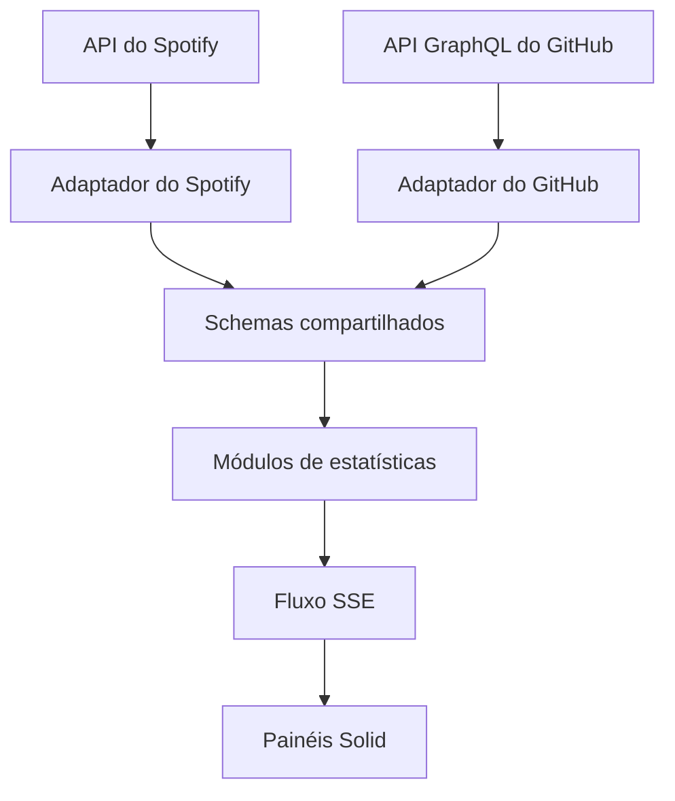
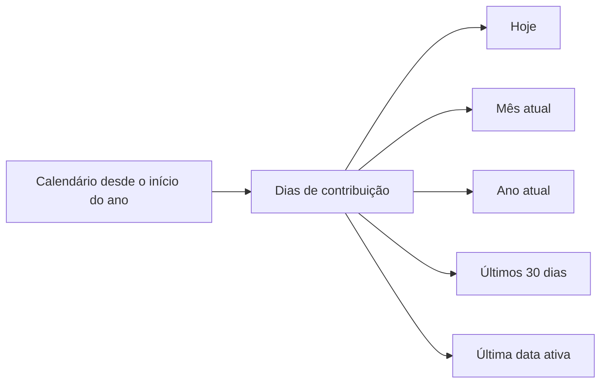

import { SourcePolicyLab } from "@web/content/labs/source-policy-lab";

Um painel de telemetria dinâmica não deve ser um cliente de API escondido dentro de um componente de interface. Ele deve ser um pequeno adaptador de origem, com políticas explícitas de atualidade, normalização, retenção e falhas.

Spotify e GitHub são exemplos contrastantes. A reprodução do Spotify pode se tornar enganosa em poucos segundos e pode nem existir. Os dados de contribuições do GitHub mudam devagar, podem ser derivados de uma resposta maior e valem um cache entre reinicializações do processo. Ainda assim, as duas fontes precisam chegar à mesma camada de estatísticas do navegador.


```mermaid center
flowchart TB
  SpotifyAPI["API do Spotify"] --> SpotifyAdapter["Adaptador do Spotify"]
  GitHubAPI["API GraphQL do GitHub"] --> GitHubAdapter["Adaptador do GitHub"]
  SpotifyAdapter --> Schemas["Schemas compartilhados"]
  GitHubAdapter --> Schemas
  Schemas --> Modules["Módulos de estatísticas"]
  Modules --> Stream["Fluxo SSE"]
  Stream --> Panels["Painéis Solid"]
```

O adaptador é responsável pelo sistema externo. O painel é responsável pela apresentação. Separar essas responsabilidades mantém a camada dinâmica previsível mesmo quando o provedor está indisponível.

## Comece pelo contrato de saída

A interface comum dos módulos é deliberadamente pequena:

```ts
export type StatModule<T> = {
  start: (...args: any[]) => void;
  getLatest: () => T;
  getHistory: () => T[];
  getVersion: () => number;
};
```

Cada módulo tem uma tarefa: publicar retratos quando sua fonte mudar. `getLatest` alimenta o estado atual, `getHistory` fornece a visão inicial e `getVersion` permite que a rota SSE detecte mudanças sem enviar o mesmo valor repetidamente.

A interface genérica não torna os dados intercambiáveis. Cada fonte tem seu próprio schema em [`shared/stats`](https://github.com/ErickCReis/ErickCReis/tree/main/shared/stats). O Valibot valida os dados persistidos do GitHub antes do uso, enquanto os tipos compartilhados mantêm o código do servidor, a serialização do transporte e os stores do Solid alinhados.

O retrato público também é uma fronteira de segurança. Ele deve conter exatamente o que o painel precisa—não credenciais do provedor, respostas brutas, metadados do dispositivo ou capacidades de controle.

## Dê a cada fonte o seu próprio relógio

Polling é uma decisão de produto tanto quanto uma decisão de rede:

| Fonte | Atualidade útil | Política local | Persistência |
| --- | --- | --- | --- |
| Spotify | Poucos segundos durante a reprodução | 2,5 s ativo, 15 s parado | Apenas histórico em memória |
| GitHub | Vários minutos | 30 min após sucesso | Retrato validado em disco |

Um timer compartilhado de cinco minutos seria inadequado para as duas fontes. Ele deixaria o Spotify desatualizado e consultaria o GitHub com mais frequência do que a interface precisa.

## Adaptador 1: reduza o Spotify a um retrato seguro

A integração com o Spotify tem duas etapas de autenticação. O refresh token fica nas variáveis de ambiente do servidor. [`server/stats/spotify.ts`](https://github.com/ErickCReis/ErickCReis/blob/main/server/stats/spotify.ts) troca esse token por um access token de curta duração e o mantém em memória até um minuto antes do vencimento informado:

```ts
if (tokenCache && tokenCache.expiresAt > Date.now() + TOKEN_EXPIRY_SAFETY_MARGIN_MS) {
  return tokenCache.accessToken;
}

const response = await fetch(SPOTIFY_TOKEN_ENDPOINT, {
  method: "POST",
  headers: {
    authorization: createBasicAuthHeader(clientId, clientSecret),
    "content-type": "application/x-www-form-urlencoded",
  },
  body: new URLSearchParams({
    grant_type: "refresh_token",
    refresh_token: refreshToken,
  }),
});
```

O navegador nunca recebe o refresh token ou o client secret. Depois da autenticação, o adaptador transforma a resposta do provedor nos campos que o painel pode renderizar:

```ts
type SpotifyNowPlaying = {
  isConfigured: boolean;
  isPlaying: boolean;
  trackId: string | null;
  trackName: string | null;
  artistNames: string[];
  albumName: string | null;
  trackUrl: string | null;
  progressMs: number;
  durationMs: number;
  fetchedAt: number;
};
```

Essa normalização trata três casos diferentes de “vazio” sem obrigar a interface a conhecer o formato da resposta do Spotify:

- HTTP `204` significa que não há reprodução atual.
- Um item que não é uma faixa vira o mesmo retrato vazio.
- A falta de credenciais produz `isConfigured: false` em vez de uma exceção no fluxo de estatísticas.

O intervalo de polling acompanha o retrato atual em vez de permanecer fixo:

```ts
function getPollIntervalMs(isPlaying: boolean) {
  return isPlaying ? 2_500 : 15_000;
}
```

Quando o Spotify responde com `429`, o adaptador lê `Retry-After` e usa 30 segundos como fallback. Se o access token for rejeitado, o cache em memória é invalidado para que a próxima tentativa possa renová-lo. Outras falhas de requisição publicam um retrato configurado vazio e continuam no intervalo mais lento.

O histórico da reprodução é deliberadamente efêmero. O módulo mantém no máximo 84 retratos na memória do processo, o suficiente para o painel mostrar uma faixa anterior sem transformar a atividade de escuta em um registro durável. Uma reinicialização limpa esse histórico por decisão de projeto.

## Adaptador 2: derive as métricas do GitHub uma vez

A integração com o GitHub usa a estratégia oposta. [`server/stats/github.ts`](https://github.com/ErickCReis/ErickCReis/blob/main/server/stats/github.ts) solicita o calendário de contribuições desde o início do ano com uma consulta GraphQL e deriva localmente todos os valores do painel:


```mermaid center
flowchart LR
  Query["Calendário desde o início do ano"] --> Days["Dias de contribuição"]
  Days --> Today["Hoje"]
  Days --> Month["Mês atual"]
  Days --> Year["Ano atual"]
  Days --> Window["Últimos 30 dias"]
  Days --> Last["Última data ativa"]
```

A derivação usa strings de data ISO como chaves. Isso fornece um formato estável para comparar os limites do ano e do mês, enquanto a série de 30 dias é criada a partir da janela de datas local para que dias sem contribuições apareçam como zero.

O retrato resultante contém apenas agregados prontos para a interface:

```ts
type GitHubCommitStats = {
  isConfigured: boolean;
  username: string;
  lastCommitDate: string | null;
  commitsToday: number;
  commitsLast30Days: number[];
  commitsLast30DayLabels: string[];
  commitsThisMonth: number;
  commitsThisYear: number;
  fetchedAt: number;
};
```

O nome “commits” no painel é um atalho para o calendário de contribuições do GitHub. Ele não é um `git log` local e não deve ser apresentado como uma auditoria de todos os commits.

## Armazene apenas o estado normalizado

Os dados do GitHub são lentos o suficiente para sobreviver a uma reinicialização. Depois de uma consulta bem-sucedida, o adaptador grava o retrato normalizado em `github-cache.json`, no diretório de dados da aplicação. Durante a inicialização, ele:

1. Verifica se o arquivo existe.
2. Faz o parse com o schema compartilhado do Valibot.
3. Usa o arquivo somente enquanto ele tiver menos de 30 minutos.
4. Agenda a próxima requisição para o fim da janela de validade restante.

Armazenar o objeto normalizado evita persistir uma resposta do provedor que o restante da aplicação precisaria interpretar novamente. A validação faz com que um schema antigo ou um arquivo malformado vire um cache miss, em vez de entrar silenciosamente no fluxo.

A política de erro distingue “tentar mais tarde” de “mostrar um novo estado”. Uma resposta limitada lê `X-RateLimit-Reset` e preserva o último retrato válido até aquele horário, usando 15 minutos como fallback. Outras falhas publicam um retrato configurado vazio e repetem a tentativa no intervalo mais longo. Assim, o painel não apresenta um valor antigo como se fosse atual, mas um limite temporário também não apaga sem necessidade um dado válido conhecido.

<SourcePolicyLab client:load locale="pt-BR" />

## Mantenha o painel alheio ao provedor

Os painéis do Solid consomem os retratos normalizados através do transporte de estatísticas. Eles não renovam credenciais, interpretam `Retry-After`, leem arquivos de cache nem sabem com que frequência um provedor deve ser consultado.

Isso deixa as decisões específicas de cada fonte em um único lugar:

| Preocupação | Adaptador do Spotify | Adaptador do GitHub |
| --- | --- | --- |
| Autenticação | Refresh token trocado em memória | Token do servidor na requisição GraphQL |
| Normalização | Faixa atual ou estado vazio explícito | Dias de contribuição em métricas agregadas |
| Atualidade | Polling ativo/parado adaptativo | Polling fixo de 30 minutos |
| Limite | `Retry-After` | `X-RateLimit-Reset` |
| Retenção | 84 retratos em memória | 84 retratos em memória e um retrato fresco em disco |
| Payload do navegador | Metadados da faixa e URL pública | Valores agregados de contribuição |

O resultado é um contrato de interface sobre dois sistemas externos muito diferentes. A abstração útil não é “toda fonte faz polling do mesmo jeito”; é “toda fonte publica um retrato tipado, limitado e pronto para exibição”.

Essa fronteira mantém simples o restante da camada dinâmica: o endpoint de histórico pode carregar os dois módulos, a rota SSE pode emitir apenas versões alteradas e os painéis podem renderizar estado sem reencenar uma API externa.
