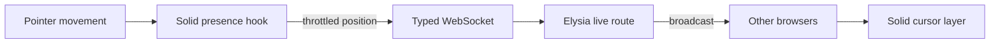
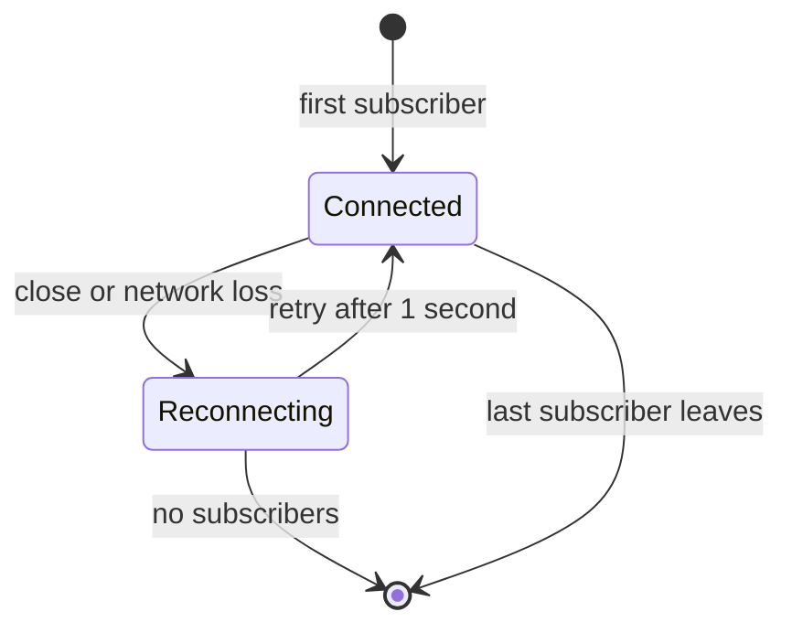

import { CursorProtocolLab } from "@web/content/labs/cursor-protocol-lab";

The [previous post](/content/astro-static-shell-solid-live-layer) ended at the boundary of the Solid island. This one follows a pointer across it.

Move the pointer on the homepage and a small marker follows it. Open the page in another browser and that marker becomes a remote cursor there. I like the visible result because it is playful; I like the implementation because it stays small. It is a useful example of the architecture behind the site: a few pieces, each responsible for one edge of the interaction.

The browser tracks a position. A shared schema defines the message. An Elysia WebSocket validates and broadcasts it. Solid keeps the current cursors reactive and renders them. No cursor position is stored after that.



## One small shared message

The contract is deliberately boring. [`shared/cursor.ts`](https://github.com/ErickCReis/ErickCReis/blob/main/shared/cursor.ts) defines four fields:

```ts
const cursorPayloadSchema = v.object({
  id: v.string(),
  x: v.number(),
  y: v.number(),
  color: v.optional(v.string()),
});
```

The Valibot schema is both a runtime validator and the source of the TypeScript type used by the client. Coordinates are relative to the document, not the viewport. That detail matters when one visitor scrolls: the marker should stay attached to a position on the page instead of sliding with the browser window.

I resisted adding join, leave, or room messages. This site has one public cursor surface, and a position update is all it needs. The smaller protocol also makes its limit explicit: this is transient presence, not a collaboration system.

## Identity belongs to the connection

The browser needs an identifier so other clients can distinguish its updates. Letting it choose any identifier would also let it impersonate another cursor.

Instead, the [live routes](https://github.com/ErickCReis/ErickCReis/blob/main/server/live/routes.ts) assign the WebSocket a cursor ID in an HTTP-only cookie during the upgrade. The cookie is strict same-site, secure in production, and unavailable to client-side JavaScript. A small `GET /live/id` endpoint returns the existing ID or, when the cookie is missing, creates an ID, stores it in the same HTTP-only cookie, and then returns it. That lets the rendering layer learn its own ID without making the cookie itself readable.

Every incoming message still includes an ID, but that field is only a claim. The connection cookie is the authority. The server broadcasts a message only when its claimed ID matches the ID attached to the connection:

```ts
message(ws, payload) {
  if (payload.id !== ws.data.cookie.cursorId.value) return;
  ws.publish("cursors", payload, true);
}
```

That check is not a complete security model—positions and colors are still untrusted public input—but it preserves the one property this feature relies on: one connection cannot publish as another connection's cursor.

Elysia validates the message body with the same shared schema before the handler runs. [Eden Treaty](https://elysiajs.com/eden/overview.html) then carries the server route type into [`web/lib/api.ts`](https://github.com/ErickCReis/ErickCReis/blob/main/web/lib/api.ts), so opening the socket does not require a second handwritten client protocol.

## From pointer movement to document position

The [`useCursorPresence`](https://github.com/ErickCReis/ErickCReis/blob/main/web/hooks/use-cursor-presence.ts) hook owns the browser half of the feature. [`@solid-primitives/mouse`](https://primitives.solidjs.community/package/mouse/) exposes pointer movement as reactive values, and a Solid effect turns those values into document coordinates.

Mouse coordinates already follow the document in this primitive. Touch coordinates are adjusted with the current scroll offset. The hook also keeps the last viewport-relative point and recalculates its document position on scroll. Without that extra step, a stationary local cursor would appear to detach from the content as the page moved beneath it.

Publishing every pointer event would create work the interface cannot display. [`@solid-primitives/scheduled`](https://primitives.solidjs.community/package/scheduled/) throttles sends to one update every 50 milliseconds. The local marker is updated through the same path, while remote markers use a short CSS transition to smooth the gaps between network updates.

This is a visual sampling decision, not guaranteed delivery. If the socket is not open, the current update is dropped. A newer pointer position will replace it soon enough.

The workbench below compresses the whole path into one surface. Move the blue local cursor, then change the scroll offset without moving it: its viewport position stays fixed while its document `y` and the violet marker on the remote document change. Close the socket or make the IDs differ, move again, and the sample stops at that gate. “Skip 7 s” demonstrates the separate stale-presence cleanup rule.

<CursorProtocolLab client:visible locale="en-US" />

## A shared socket with a small lifecycle

The API module maintains one WebSocket and a set of subscribers. The first subscriber connects; the last unsubscribe closes it. I keep that ownership outside the rendering component because Astro's client-side navigation can mount and unmount the live island without a full page reload.

When the connection closes unexpectedly, the module waits one second and reconnects as long as a listener still exists. It does not queue old coordinates during the outage. Replaying them would only animate history that is no longer true.

The server also does not broadcast an explicit leave event. Each received cursor carries an `updatedAt` timestamp in local state, and the hook removes entries that have not updated for seven seconds. This handles closed tabs, lost networks, and missed close events with the same rule.



## Rendering presence without owning the page

The [`CursorPresenceLayer`](https://github.com/ErickCReis/ErickCReis/blob/main/web/components/cursor-presence-layer.tsx) receives the derived cursor list from the hook. Solid's keyed rendering keeps one marker per ID, CSS custom properties carry the coordinates and color, and `translate3d` moves the marker without changing document layout.

The local cursor is intentionally dimmer and moves without interpolation; remote cursors are smoothed. Labels disappear while a telemetry panel is active so the two live surfaces do not compete visually. That is the small shared state that kept both features inside the same island in the previous post.

There are obvious limits. All connections live in one server process. There is no cross-instance broadcast, durable membership, history, or server-side stale-presence registry. A restart clears everything—which, for cursor positions, is the correct persistence policy.

The feature works because I do not ask it to be more than it is. A server-owned identity, a validated position message, a throttled sender, a reconnecting socket, and expiring client state are enough to make the otherwise static page feel occupied.

The next post will reuse that preference for small pieces with slower-moving data: Spotify playback and GitHub contributions collected by the server and presented as personal telemetry.
