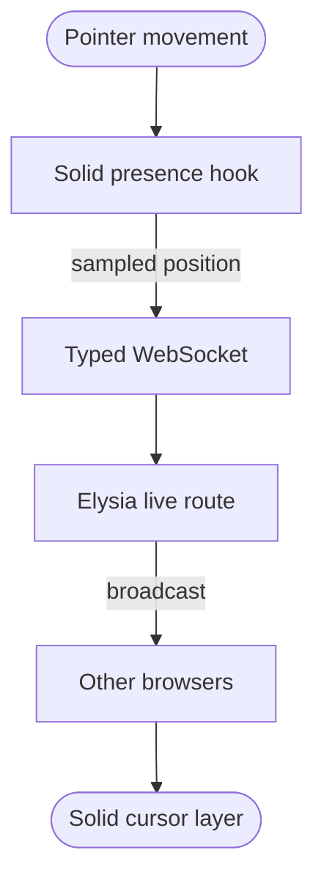
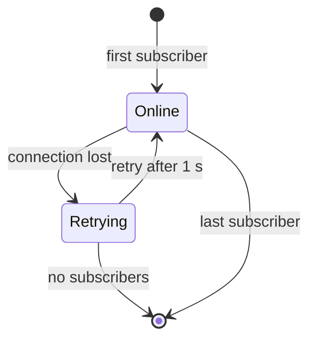

> This post describes the original JSON transport. The current implementation uses a compact binary protocol, covered in [A four-byte protocol for cursor presence](/blog/four-byte-cursor-presence).

The [previous post](/blog/astro-static-shell-solid-live-layer) stopped at the Solid island. This one follows a pointer through it.

Move the pointer on the homepage and a small marker follows it. Open the page in another browser and that marker appears there as a remote cursor. The result is playful. The implementation is small enough to trace from one end to the other, which is the part I care about here.

The browser tracks a position. A shared schema defines the message, then an Elysia WebSocket validates and broadcasts it. Solid keeps the current cursors reactive and renders them. The application never stores a cursor position after that.


```mermaid center
flowchart TB
  Pointer(["Pointer movement"]) --> Hook["Solid presence hook"]
  Hook -->|"sampled position"| Socket["Typed WebSocket"]
  Socket --> Server["Elysia live route"]
  Server -->|"broadcast"| Peers["Other browsers"]
  Peers --> Layer(["Solid cursor layer"])
```

## One small shared message

The contract is deliberately boring. [`shared/cursor.ts`](https://github.com/ErickCReis/ErickCReis/blob/main/shared/cursor.ts) defines four fields:

```ts
const cursorPayloadSchema = v.object({
  id: v.string(),
  x: v.number(),
  y: v.number(),
  color: v.optional(v.string()),
});
```

The Valibot schema is both a runtime validator and the source of the TypeScript type used by the client. Coordinates are relative to the document, not the viewport. That detail matters when one visitor scrolls: the marker should stay attached to a position on the page instead of sliding with the browser window.

I left out join, leave, and room messages. This site has one public page with cursors, and a position update is all it needs. The server treats every update as transient presence and does not turn the protocol into anything larger.

## Identity belongs to the connection

The browser needs an identifier so other clients can distinguish its updates. Letting it choose any identifier would also let it impersonate another cursor.

Instead, the [live routes](https://github.com/ErickCReis/ErickCReis/blob/main/server/live/routes.ts) assign the WebSocket a cursor ID in an `HttpOnly` cookie during the upgrade. The cookie uses `SameSite=Strict`, adds the `Secure` flag in production, and stays unavailable to client-side JavaScript. A small `GET /live/id` endpoint returns the existing ID. If the cookie is missing, the endpoint creates an ID, stores it in the same `HttpOnly` cookie, and returns it. The rendering code can learn its own ID without reading the cookie.

Every incoming message still includes an ID, but that field is only a claim. The connection cookie decides which ID the client may use. The server broadcasts a message only when its claimed ID matches the ID attached to the connection:

```ts
message(ws, payload) {
  if (payload.id !== ws.data.cookie.cursorId.value) return;
  ws.publish("cursors", payload, true);
}
```

Positions and colors are still untrusted public input, so that check is not a complete security model. It enforces the rule this feature needs: one connection cannot publish as another connection's cursor.

Elysia validates the message body with the same shared schema before the handler runs. [Eden Treaty](https://elysiajs.com/eden/overview.html) carries the server route type into [`web/lib/api.ts`](https://github.com/ErickCReis/ErickCReis/blob/main/web/lib/api.ts). Opening the socket therefore needs no second handwritten client protocol.

## From pointer movement to document position

The [`useCursorPresence`](https://github.com/ErickCReis/ErickCReis/blob/main/web/hooks/use-cursor-presence.ts) hook runs the browser half of the feature. [`@solid-primitives/mouse`](https://primitives.solidjs.community/package/mouse/) exposes pointer movement as reactive values, and a Solid effect turns those values into document coordinates.

Mouse coordinates from this package already follow the document. The hook adds the current scroll offset to touch coordinates. It also keeps the last viewport-relative point and recalculates its document position on scroll. Without that step, a stationary local cursor would appear to detach from the content as the page moved beneath it.

Sending every pointer event would create updates the interface cannot show. [`@solid-primitives/scheduled`](https://primitives.solidjs.community/package/scheduled/) limits sends to one update every 50 milliseconds. The same path updates the local marker. Remote markers use a short CSS transition to smooth the gaps between network updates.

The hook samples motion for the display and makes no delivery guarantee. If the socket is not open, it drops the current update. A newer pointer position will replace it soon enough.

## The shared WebSocket lifecycle

The API module owns one WebSocket and a set of subscribers. The first subscriber opens the connection. The last unsubscribe closes it. I keep that lifecycle outside the rendering component because Astro's client-side navigation can mount and unmount the live island without a full page reload.

When the connection closes unexpectedly, the module waits one second and reconnects while a listener still exists. It does not queue old coordinates during the outage. Replaying them would animate positions that are no longer true.

The server does not broadcast an explicit leave event. Local state adds an `updatedAt` timestamp to each received cursor, and the hook removes entries that have not changed for seven seconds. The same timeout handles closed tabs, lost networks, and missed close events.


```mermaid center
stateDiagram-v2
  direction TB
  [*] --> Online: first subscriber
  Online --> Retrying: connection lost
  Retrying --> Online: retry after 1 s
  Retrying --> [*]: no subscribers
  Online --> [*]: last subscriber
```

## Rendering cursors beside the Astro page

The [`CursorPresenceLayer`](https://github.com/ErickCReis/ErickCReis/blob/main/web/components/cursor-presence-layer.tsx) receives the derived cursor list from the hook. Solid's keyed rendering keeps one marker per ID. CSS custom properties carry the coordinates and color. `translate3d` moves the marker without changing document layout.

The local cursor is dimmer and moves without interpolation. Remote cursors use smoothing. Labels disappear while a telemetry panel is active so they do not cover the panel. That shared `isStatsHovered` value kept both features inside the same island in the previous post.

All connections live in one server process. There is no cross-instance broadcast, durable membership, history, or server-side stale-presence registry. A restart clears everything. For cursor positions, that is the correct persistence policy.

The page stays mostly static, but it can show who else is moving a pointer right now. It also forgets those positions as soon as they stop mattering.

The next post moves to slower data. The server collects Spotify playback and GitHub contributions, then presents them as personal telemetry.
