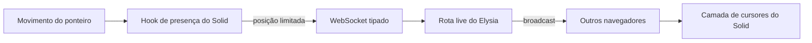
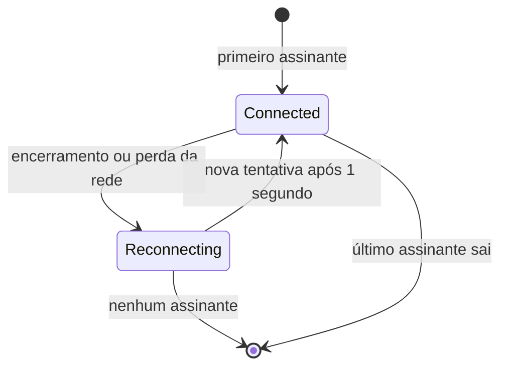

import { CursorProtocolLab } from "@web/content/labs/cursor-protocol-lab";

O [post anterior](/pt-BR/content/astro-static-shell-solid-live-layer) terminou na fronteira da ilha do Solid. Este acompanha um ponteiro atravessando essa fronteira.

Ao mover o ponteiro na página inicial, um pequeno marcador o acompanha. Se a página for aberta em outro navegador, esse marcador aparece ali como um cursor remoto. Gosto do resultado visível porque ele é divertido; gosto da implementação porque ela continua pequena. É um bom exemplo da arquitetura por trás do site: algumas peças, cada uma responsável por uma ponta da interação.

O navegador acompanha uma posição. Um schema compartilhado define a mensagem. Um WebSocket do Elysia valida e transmite essa mensagem. O Solid mantém os cursores atuais reativos e os renderiza. Nenhuma posição é armazenada depois disso.



## Uma pequena mensagem compartilhada

O contrato é simples de propósito. O arquivo [`shared/cursor.ts`](https://github.com/ErickCReis/ErickCReis/blob/main/shared/cursor.ts) define quatro campos:

```ts
const cursorPayloadSchema = v.object({
  id: v.string(),
  x: v.number(),
  y: v.number(),
  color: v.optional(v.string()),
});
```

O schema do Valibot funciona como validador em runtime e também como origem do tipo TypeScript usado pelo cliente. As coordenadas são relativas ao documento, não à área visível do navegador. Esse detalhe importa quando um visitante rola a página: o marcador precisa continuar ligado a uma posição no conteúdo, em vez de deslizar junto com a janela.

Resisti a adicionar mensagens para entrada, saída ou salas. O site tem uma única superfície pública de cursores, e uma atualização de posição é tudo de que ela precisa. O protocolo reduzido também deixa clara a sua limitação: isto é presença transitória, não um sistema de colaboração.

## A identidade pertence à conexão

O navegador precisa de um identificador para que os outros clientes diferenciem suas atualizações. Permitir que ele escolhesse qualquer identificador também abriria espaço para se passar por outro cursor.

Por isso, as [rotas live](https://github.com/ErickCReis/ErickCReis/blob/main/server/live/routes.ts) atribuem ao WebSocket um ID em um cookie HTTP-only durante o upgrade. O cookie usa `same-site` estrito, é seguro em produção e não pode ser acessado pelo JavaScript do cliente. Um pequeno endpoint `GET /live/id` retorna o ID existente ou, quando o cookie está ausente, cria um ID, armazena-o no mesmo cookie HTTP-only e então o retorna. Assim, a camada de renderização descobre o próprio ID sem tornar o cookie legível.

Cada mensagem recebida ainda inclui um ID, mas esse campo é apenas uma alegação. A autoridade é o cookie da conexão. O servidor só transmite a mensagem quando o ID declarado corresponde ao ID associado à conexão:

```ts
message(ws, payload) {
  if (payload.id !== ws.data.cookie.cursorId.value) return;
  ws.publish("cursors", payload, true);
}
```

Essa verificação não forma um modelo de segurança completo — posições e cores ainda são entradas públicas não confiáveis — mas preserva a propriedade da qual a funcionalidade depende: uma conexão não pode publicar como o cursor de outra.

O Elysia valida o corpo da mensagem com o mesmo schema compartilhado antes de executar o handler. O [Eden Treaty](https://elysiajs.com/eden/overview.html) leva o tipo da rota do servidor até [`web/lib/api.ts`](https://github.com/ErickCReis/ErickCReis/blob/main/web/lib/api.ts), evitando a criação de um segundo protocolo manual para abrir o socket no cliente.

## Do movimento do ponteiro à posição no documento

O hook [`useCursorPresence`](https://github.com/ErickCReis/ErickCReis/blob/main/web/hooks/use-cursor-presence.ts) cuida da metade da funcionalidade que roda no navegador. O [`@solid-primitives/mouse`](https://primitives.solidjs.community/package/mouse/) expõe o movimento do ponteiro como valores reativos, e um efeito do Solid transforma esses valores em coordenadas do documento.

Nessa primitive, as coordenadas do mouse já acompanham o documento. No toque, elas são ajustadas com o deslocamento atual da rolagem. O hook também guarda o último ponto relativo à área visível e recalcula sua posição no documento durante a rolagem. Sem essa etapa, um cursor local parado pareceria se soltar do conteúdo conforme a página se movesse por baixo dele.

Publicar cada evento do ponteiro criaria um volume de trabalho que a interface não conseguiria exibir. O [`@solid-primitives/scheduled`](https://primitives.solidjs.community/package/scheduled/) limita os envios a uma atualização a cada 50 milissegundos. O marcador local é atualizado pelo mesmo caminho, enquanto os marcadores remotos usam uma transição CSS curta para suavizar os intervalos entre atualizações da rede.

Essa é uma decisão de amostragem visual, não uma garantia de entrega. Se o socket não estiver aberto, a atualização atual é descartada. Em pouco tempo, uma posição mais nova tomará seu lugar.

A bancada abaixo comprime todo o caminho em uma única superfície. Mova o cursor local azul e, sem movê-lo novamente, altere a rolagem: sua posição na área visível permanece fixa, enquanto seu `y` no documento e o marcador violeta no documento remoto mudam. Feche o socket ou faça os IDs divergirem, mova outra vez e veja a amostra parar naquela etapa. “Avançar 7 s” demonstra a regra separada de limpeza da presença expirada.

<CursorProtocolLab client:visible locale="pt-BR" />

## Um socket compartilhado com um ciclo de vida pequeno

O módulo da API mantém um único WebSocket e um conjunto de assinantes. O primeiro assinante inicia a conexão; a saída do último a encerra. Mantenho essa responsabilidade fora do componente de renderização porque a navegação no cliente do Astro pode montar e desmontar a ilha interativa sem recarregar a página inteira.

Quando a conexão é fechada de forma inesperada, o módulo espera um segundo e tenta novamente enquanto ainda houver algum assinante. As coordenadas antigas não são enfileiradas durante a interrupção. Reproduzi-las depois apenas animaria um histórico que já não representa a realidade.

O servidor também não transmite uma mensagem explícita de saída. Cada cursor recebido ganha um `updatedAt` no estado local, e o hook remove os registros sem atualização há sete segundos. A mesma regra cobre abas fechadas, redes perdidas e eventos de encerramento que não chegaram.



## Renderizando presença sem controlar a página

O [`CursorPresenceLayer`](https://github.com/ErickCReis/ErickCReis/blob/main/web/components/cursor-presence-layer.tsx) recebe do hook a lista derivada de cursores. A renderização identificada do Solid mantém um marcador por ID, propriedades customizadas do CSS carregam as coordenadas e a cor, e `translate3d` move o marcador sem alterar o layout do documento.

O cursor local fica mais discreto e se move sem interpolação; os cursores remotos são suavizados. Os rótulos desaparecem enquanto um painel de telemetria está ativo para que as duas superfícies dinâmicas não disputem atenção. Esse é o pequeno estado compartilhado que manteve as duas funcionalidades dentro da mesma ilha no post anterior.

Existem limitações evidentes. Todas as conexões vivem em um único processo de servidor. Não há transmissão entre instâncias, participação durável, histórico nem um registro de presença expirada no servidor. Uma reinicialização limpa tudo — o que, para posições de cursores, é a política de persistência correta.

A funcionalidade funciona porque não exijo que ela seja maior do que é. Uma identidade definida pelo servidor, uma mensagem de posição validada, um emissor limitado, um socket que se reconecta e um estado temporário no cliente são suficientes para dar vida a uma página que, fora isso, continua estática.

O próximo post reutilizará essa preferência por peças pequenas com dados que mudam mais devagar: a reprodução do Spotify e as contribuições do GitHub coletadas pelo servidor e apresentadas como telemetria pessoal.
