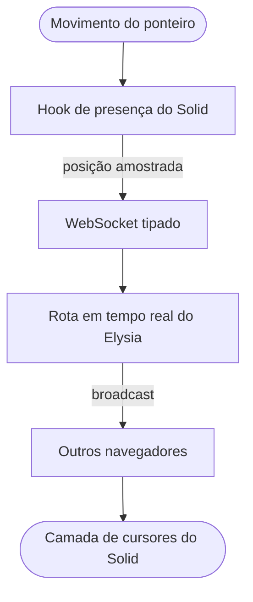
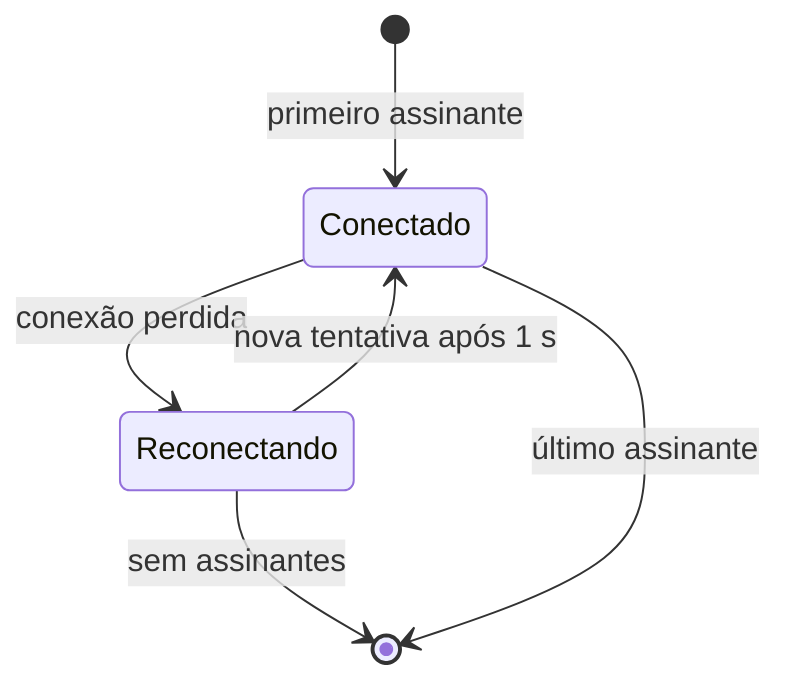

O [post anterior](/pt-BR/blog/astro-static-shell-solid-live-layer) parou na ilha do Solid. Este acompanha o caminho de um ponteiro dentro dela.

Ao mover o ponteiro na página inicial, um pequeno marcador o acompanha. Se a página estiver aberta em outro navegador, o marcador aparece ali como um cursor remoto. O resultado é divertido. A implementação é pequena o bastante para ser acompanhada de ponta a ponta, que é o que me interessa aqui.

O navegador acompanha uma posição. Um schema compartilhado define a mensagem, então um WebSocket do Elysia a valida e transmite. O Solid mantém os cursores atuais reativos e os renderiza. A aplicação não armazena nenhuma posição depois disso.


```mermaid center
flowchart TB
  Pointer(["Movimento do ponteiro"]) --> Hook["Hook de presença do Solid"]
  Hook -->|"posição amostrada"| Socket["WebSocket tipado"]
  Socket --> Server["Rota em tempo real do Elysia"]
  Server -->|"broadcast"| Peers["Outros navegadores"]
  Peers --> Layer(["Camada de cursores do Solid"])
```

## Uma pequena mensagem compartilhada

O contrato é simples de propósito. O arquivo [`shared/cursor.ts`](https://github.com/ErickCReis/ErickCReis/blob/main/shared/cursor.ts) define quatro campos:

```ts
const cursorPayloadSchema = v.object({
  id: v.string(),
  x: v.number(),
  y: v.number(),
  color: v.optional(v.string()),
});
```

O schema do Valibot funciona como validador em runtime e também como origem do tipo TypeScript usado pelo cliente. As coordenadas são relativas ao documento, não à área visível do navegador. Esse detalhe importa quando um visitante rola a página: o marcador precisa continuar ligado a uma posição no conteúdo, em vez de deslizar junto com a janela.

Deixei de fora as mensagens de entrada, saída e salas. O site tem uma única página pública com cursores, e ela só precisa de atualizações de posição. O servidor trata cada atualização como presença transitória e não amplia o protocolo além disso.

## A identidade pertence à conexão

O navegador precisa de um identificador para que os outros clientes diferenciem suas atualizações. Permitir que ele escolhesse qualquer identificador também permitiria que se passasse por outro cursor.

Por isso, as [rotas em tempo real](https://github.com/ErickCReis/ErickCReis/blob/main/server/live/routes.ts) atribuem ao WebSocket um ID em um cookie `HttpOnly` durante o upgrade. O cookie usa `SameSite=Strict`, recebe a flag `Secure` em produção e não pode ser acessado pelo JavaScript do cliente. Um pequeno endpoint `GET /live/id` retorna o ID existente. Se o cookie não existir, o endpoint cria um ID, guarda-o no mesmo cookie `HttpOnly` e o retorna. O código de renderização descobre o próprio ID sem ler o cookie.

Cada mensagem recebida ainda inclui um ID, mas esse campo é apenas uma alegação. O cookie da conexão decide qual ID o cliente pode usar. O servidor só transmite a mensagem quando o ID declarado corresponde ao ID associado à conexão:

```ts
message(ws, payload) {
  if (payload.id !== ws.data.cookie.cursorId.value) return;
  ws.publish("cursors", payload, true);
}
```

Posições e cores ainda são entradas públicas não confiáveis, então essa verificação não forma um modelo de segurança completo. Ela aplica a regra necessária para esta funcionalidade: uma conexão não pode publicar como o cursor de outra.

O Elysia valida o corpo da mensagem com o mesmo schema compartilhado antes de executar o handler. O [Eden Treaty](https://elysiajs.com/eden/overview.html) leva o tipo da rota do servidor até [`web/lib/api.ts`](https://github.com/ErickCReis/ErickCReis/blob/main/web/lib/api.ts). Assim, abrir a conexão não exige um segundo protocolo escrito à mão para o cliente.

## Do movimento do ponteiro à posição no documento

O hook [`useCursorPresence`](https://github.com/ErickCReis/ErickCReis/blob/main/web/hooks/use-cursor-presence.ts) executa a parte da funcionalidade que roda no navegador. O [`@solid-primitives/mouse`](https://primitives.solidjs.community/package/mouse/) expõe o movimento do ponteiro como valores reativos, e um efeito do Solid transforma esses valores em coordenadas do documento.

Nesse pacote, as coordenadas do mouse já acompanham o documento. O hook soma o deslocamento atual da rolagem às coordenadas de toque. Ele também guarda o último ponto relativo à área visível e recalcula sua posição no documento durante a rolagem. Sem essa etapa, um cursor local parado pareceria se soltar do conteúdo conforme a página se movesse por baixo dele.

Enviar cada evento do ponteiro criaria mais atualizações do que a interface conseguiria exibir. O [`@solid-primitives/scheduled`](https://primitives.solidjs.community/package/scheduled/) limita os envios a uma atualização a cada 50 milissegundos. O mesmo caminho atualiza o marcador local. Os marcadores remotos usam uma transição CSS curta para suavizar os intervalos entre atualizações da rede.

O hook amostra o movimento para a tela e não garante a entrega. Se a conexão não estiver aberta, ele descarta a atualização atual. Em pouco tempo, uma posição mais nova tomará seu lugar.

## O ciclo de vida do WebSocket compartilhado

O módulo da API controla um único WebSocket e um conjunto de assinantes. O primeiro assinante abre a conexão. A saída do último a encerra. Mantenho esse ciclo de vida fora do componente de renderização porque a navegação no cliente do Astro pode montar e desmontar a ilha interativa sem recarregar a página inteira.

Quando a conexão fecha de forma inesperada, o módulo espera um segundo e tenta novamente enquanto ainda houver algum assinante. As coordenadas antigas não entram em uma fila durante a interrupção. Reproduzi-las depois animaria posições que já não correspondem à realidade.

O servidor não transmite uma mensagem explícita de saída. O estado local acrescenta um `updatedAt` a cada cursor recebido, e o hook remove os registros que não mudam por sete segundos. O mesmo limite cobre abas fechadas, redes perdidas e eventos de encerramento que não chegaram.


```mermaid center
stateDiagram-v2
  direction TB
  [*] --> Conectado: primeiro assinante
  Conectado --> Reconectando: conexão perdida
  Reconectando --> Conectado: nova tentativa após 1 s
  Reconectando --> [*]: sem assinantes
  Conectado --> [*]: último assinante
```

## Renderizando cursores ao lado da página do Astro

O [`CursorPresenceLayer`](https://github.com/ErickCReis/ErickCReis/blob/main/web/components/cursor-presence-layer.tsx) recebe do hook a lista derivada de cursores. A renderização por chave do Solid mantém um marcador por ID. As propriedades customizadas do CSS carregam as coordenadas e a cor. `translate3d` move o marcador sem alterar o layout do documento.

O cursor local fica mais discreto e se move sem interpolação. Os cursores remotos usam suavização. Os rótulos desaparecem enquanto um painel de telemetria está ativo para não cobrir o painel. O valor compartilhado `isStatsHovered` manteve as duas funcionalidades dentro da mesma ilha no post anterior.

Todas as conexões vivem em um único processo de servidor. Não há transmissão entre instâncias, participação durável, histórico nem um registro de presença expirada no servidor. Uma reinicialização limpa tudo. Para posições de cursores, essa é a política de persistência correta.

A página continua quase toda estática, mas mostra quem está movendo o ponteiro naquele momento. Ela também esquece essas posições assim que deixam de importar.

O próximo post passa para dados que mudam mais devagar. O servidor coleta a reprodução do Spotify e as contribuições do GitHub e as apresenta como telemetria pessoal.
