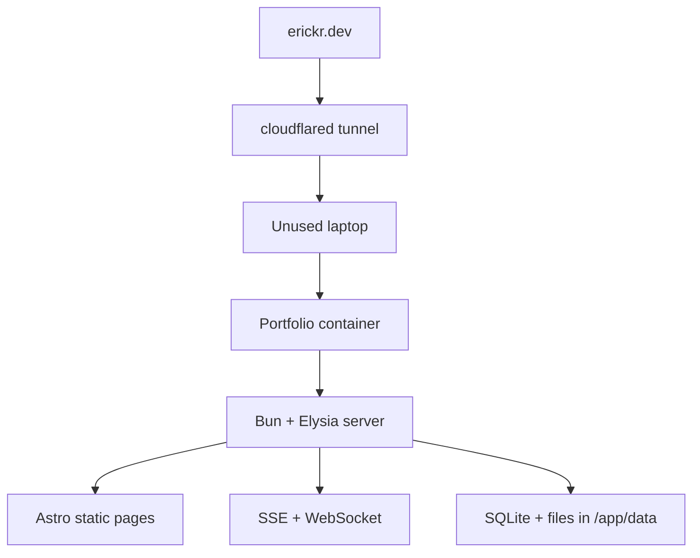
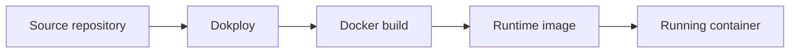

import { DeploymentShapeLab } from "@web/content/labs/deployment-shape-lab";

At some point this portfolio stopped being just a static page. I kept adding telemetry, API routes, cursor presence, background polling, local data, and internal jobs. It was still a small project, but “static-site deployment” was no longer an honest description of it.

This rewrite was not about escaping Cloudflare or saving money. I wanted the deployment to have a physical answer: one machine. [Astro](https://astro.build/) would still produce static pages and [Elysia](https://elysiajs.com/) would still handle live routes, but the whole application would ship as one container to an unused laptop.

## Why self-host this

The laptop was already my low-risk place for experiments. I test local LLMs there, run small services, use it for media, and sometimes treat it as a remote development box. Putting a real site on it was a way to learn infrastructure without pretending the machine was a production system.

The previous version of the portfolio leaned more heavily on platform services. It explored separate web and server apps, [Cloudflare](https://www.cloudflare.com/) deployment, authentication, [oRPC](https://orpc.dev/), [Drizzle](https://orm.drizzle.team/), [Durable Objects](https://developers.cloudflare.com/durable-objects/), and [D1](https://developers.cloudflare.com/d1/).

The rewrite changed the default boundary:

| Before                                   | After                                                   |
| ---------------------------------------- | ------------------------------------------------------- |
| Separate web and server applications     | One server process                                      |
| Managed real-time state and persistence  | In-process state and [SQLite](https://www.sqlite.org/)  |
| Several provider-specific runtime pieces | One Docker image and one data directory                 |
| Platform deployment configuration        | A container deployed by [Dokploy](https://dokploy.com/) |

I still like Cloudflare, and it remains part of this setup. DNS and connectivity stay at the edge; the compute and persistent data moved to the laptop. Self-hosting here is a change in where the application runs, not a claim that every external service disappeared.

## The runtime and deployment paths

The experiment became real when `erickr.dev` started reaching the laptop through a [`cloudflared` tunnel](https://developers.cloudflare.com/cloudflare-one/networks/connectors/cloudflare-tunnel/). The public request path is short:



Dokploy is on a different path. It is the deployment control plane, not a hop that each request crosses:



I chose Dokploy because it works directly with [Docker](https://www.docker.com/) and keeps the deployment workflow easy to inspect. The useful simplification is not that the infrastructure has only one piece. It is that the application has fewer runtime boundaries: one deploy target, one container, and one server process.

Those paths meet at the running container, but they carry different things. Trace a request in the model below, then deploy another revision. The container changes; the mounted `/app/data` directory does not.

<DeploymentShapeLab client:visible locale="en-US" />

## The build artifact

Once the deploy target is a single container, the artifact matters more than provider configuration.

Astro builds the mostly static site. [Solid](https://www.solidjs.com/) hydrates only the live islands. In production, Elysia serves that generated output alongside the API, SSE, WebSocket, and internal routes. [Bun](https://bun.sh/) runs the scripts and compiles the server.

The build script is short:

```json
{
  "scripts": {
    "build": "bun --bun astro build && bun build ./server/index.ts --compile --outfile myserver"
  }
}
```

The first command produces the Astro output in `dist`. The second compiles [`server/index.ts`](https://github.com/ErickCReis/ErickCReis/blob/main/server/index.ts) into an executable called `myserver`.

That executable is what makes the runtime stage simple:

```dockerfile
FROM debian:bookworm-slim AS runtime

WORKDIR /app

COPY --from=build /app/dist ./dist
COPY --from=build /app/myserver ./myserver
COPY --from=build /app/server/db/migrations ./server/db/migrations

CMD ["./myserver"]
```

The runtime stage does not need the source tree, `node_modules`, or the Bun build image. It receives the static assets, compiled server, and database migrations. The [full Dockerfile](https://github.com/ErickCReis/ErickCReis/blob/main/Dockerfile) keeps the build and runtime concerns separate.

## Persistent state is the real boundary

Putting the process in a container is the easy part. Deciding what must survive that container is more important.

The application uses `DATA_DIR=/app/data` for SQLite and local files, and Docker Compose mounts `./data` from the host into that directory. The container can be replaced without replacing its state. Compose also gives the process a restart policy and explicit CPU and memory limits.

An explicit data directory is not a backup, though. It makes the state easy to locate and snapshot, but an automated off-machine copy is still part of the work. The laptop also makes power, storage, and network failures my responsibility instead of the provider's.

## What became simpler—and what did not

Files can be files again. Static assets and runtime routes come from the same server. Internal jobs do not need their own platform story before they exist. I can start a feature with a directory and a process instead of first deciding which managed product owns it.

The real-time layer is the part I trust the least. Durable Objects gave WebSocket state a natural home; on one server, connection lifecycle, cleanup, monitoring, and recovery are mine to handle. The current version works, but it still needs a better abstraction for tracking connections and seeing what the live layer is doing.

Self-hosting made this application simpler to deploy, not simpler to operate. The shape is smaller, not magically safer. I traded managed runtime boundaries for responsibilities I can see: one process, one data directory, one backup problem, and one real-time layer I still need to harden.

The next posts will go deeper into those smaller pieces: cursor presence, telemetry, static asset routing, content tracking, localization, and token usage sync.
