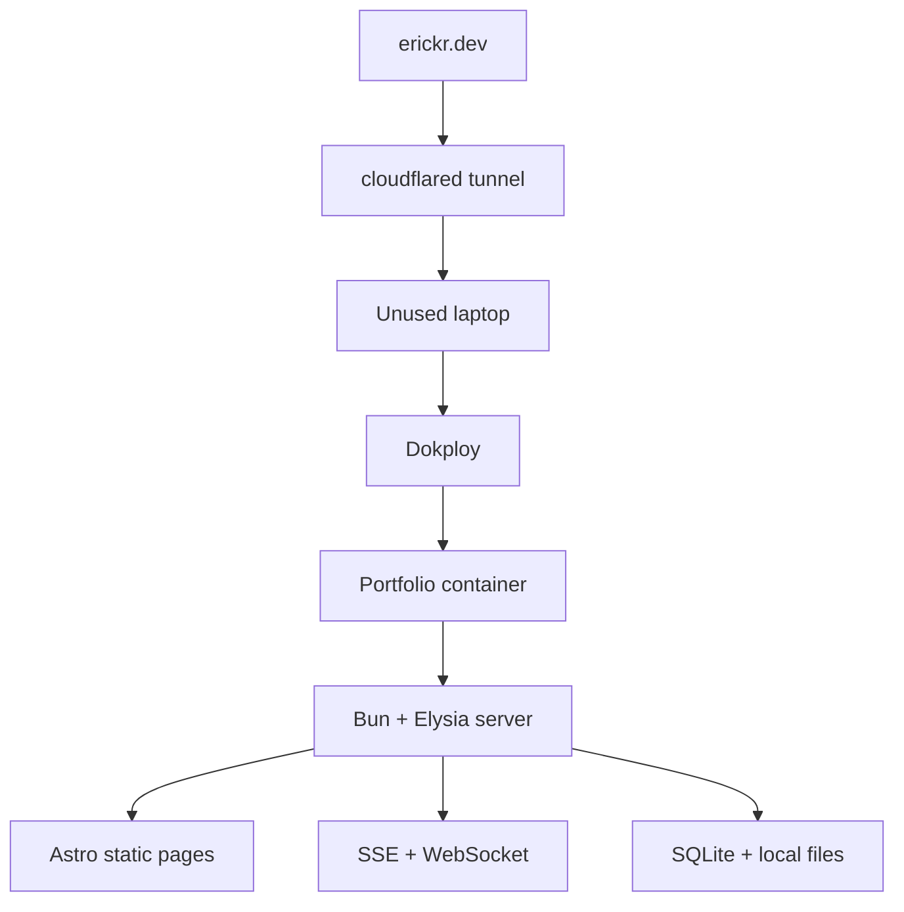
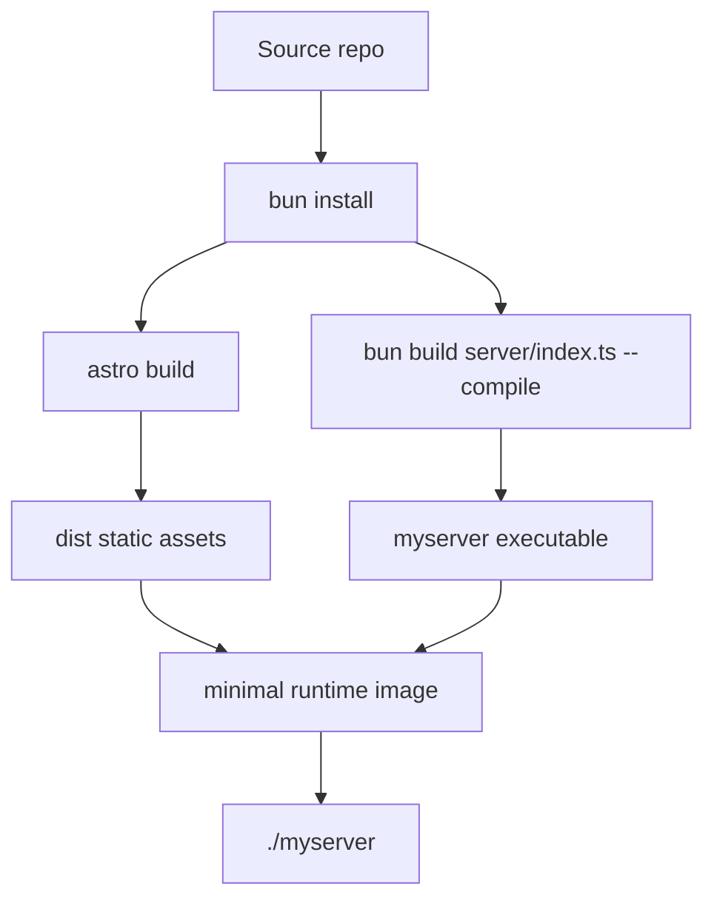

At some point this portfolio stopped being just a static page.

I kept adding small live pieces: telemetry, API routes, cursor presence, background polling, local data, and a few internal jobs. That made it a good project to move onto a server I control. Small enough to break safely, but real enough that the deployment shape matters.

## Why self-host this

I had a laptop sitting unused, and it was already the machine I used for experiments. I test local LLMs there, run small services, use it for media, and sometimes treat it as a remote development box. Those details are not the point of this post, but they explain why the machine was available: it was a low-risk place to try infrastructure ideas without pretending they were production systems.

The older version of this site leaned more toward platform pieces. It explored a monorepo shape with separate web and server apps, [Cloudflare](https://www.cloudflare.com/) deployment, auth, [oRPC](https://orpc.dev/), [Drizzle](https://orm.drizzle.team/), and a cursor websocket experiment.

I still like Cloudflare. I build a lot of small projects there, and for this level of traffic it is hard to beat. This rewrite was not a complaint about Cloudflare. I wanted to see what the same project feels like when the default answer is not another managed product.

That changes the questions. Instead of asking where each piece fits in the platform, I started asking what can run together on one machine.

## The deployment path

The experiment became real when `erickr.dev` started reaching the machine through a [`cloudflared` tunnel](https://developers.cloudflare.com/cloudflare-one/networks/connectors/cloudflare-tunnel/). Before that it was only a local service on my network. After that it was my portfolio, served from the same box I use for learning.

This is the runtime path:



[Dokploy](https://dokploy.com/) is not the main character here. It was just the tool I wanted to try because it stays close to [Docker](https://www.docker.com/) and keeps the deploy workflow easy to inspect.

I was not doing this to save money. At my current volume, Cloudflare was effectively free too. The useful part was having fewer boundaries to cross: one domain, one tunnel, one deploy target, one container, one server process.

That is the main simplification.

## The build artifact

Once the deploy target is a single container, the build artifact matters more than provider configuration.

The app still has separate parts. [Astro](https://astro.build/) builds the mostly static site. [Solid](https://www.solidjs.com/) hydrates only the live islands. [Elysia](https://elysiajs.com/) owns the API, SSE, websockets, and internal routes. [Bun](https://bun.sh/) runs the scripts and compiles the server.

The output is the part I care about:



The build script is short:

```json
{
  "scripts": {
    "build": "bun --bun astro build && bun build ./server/index.ts --compile --outfile myserver"
  }
}
```

The first command builds the static Astro output. The second compiles the Elysia server into a raw executable called `myserver`.

That lets the runtime image stay small:

```dockerfile
FROM oven/bun:1.3 AS build

WORKDIR /app

COPY package.json bun.lock ./
RUN bun install --frozen-lockfile

COPY . .
ENV NODE_ENV=production
RUN bun run build

FROM debian:bookworm-slim AS runtime

WORKDIR /app

COPY --from=build /app/dist ./dist
COPY --from=build /app/myserver ./myserver
COPY --from=build /app/server/db/migrations ./server/db/migrations

ENV NODE_ENV=production
EXPOSE 3000

CMD ["./myserver"]
```

The runtime image does not install the app dependencies. It gets the static assets, the compiled server, and the database migrations. The server entry is still normal TypeScript in [`server/index.ts`](https://github.com/ErickCReis/ErickCReis/blob/main/server/index.ts), but production runs the compiled executable.

## What became simpler

Files can be files again. [SQLite](https://www.sqlite.org/) can sit next to the app. Static assets and runtime routes can come from the same server. Internal jobs do not need a separate platform story before they exist.

That sounds obvious, but it changes how I design small features. I do not need to start by wiring products together. I can start with a directory, a process, and a backup plan.

## What became harder

The realtime layer is the part I trust the least right now.

[Cloudflare Durable Objects](https://developers.cloudflare.com/durable-objects/) gave me a natural place for websocket state, and [D1](https://developers.cloudflare.com/d1/) gave me a managed persistence story. On one server I have more control, but connection lifecycle, cleanup, monitoring, and failure recovery are mine to handle.

That is the next thing I need to improve. The current version works, but it needs a better abstraction for tracking connections and seeing what the live layer is doing.

## Checklist

For another small self-hosted app, I would start with this checklist:

- keep one deployable container until there is a real reason not to,
- make the runtime entry obvious,
- keep static assets and runtime routes behind the same server when it simplifies deployment,
- persist data and files in explicit directories,
- avoid platform glue unless it pays for itself,
- expose enough telemetry to see what the server is doing,
- treat realtime state as a first-class subsystem, not a detail.

This post is the base. The next pieces are smaller: cursor presence, telemetry, static asset routing, content tracking, localization, and token usage sync.
