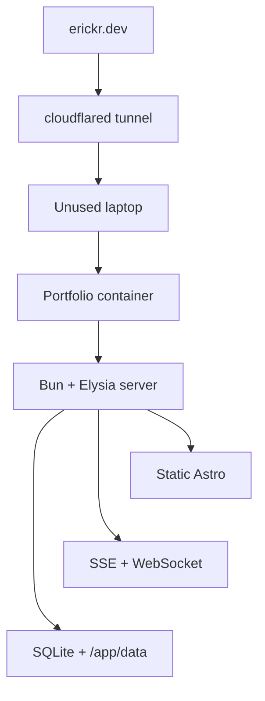
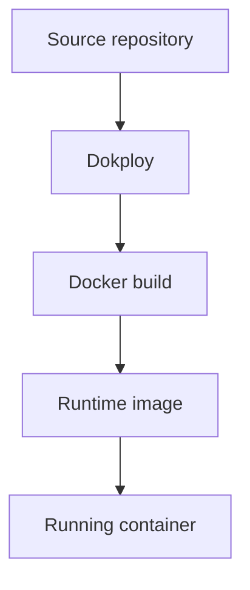

This portfolio outgrew a static page after I added telemetry, API routes, cursor presence, background polling, local data, and internal jobs. The project was still small, but calling it a "static-site deployment" no longer made sense.

I rewrote it to run on one physical machine. [Astro](https://astro.build/) would still produce static pages, and [Elysia](https://elysiajs.com/) would still handle live routes. The whole application would ship as one container to an unused laptop.

## Why self-host it

The laptop was already where I ran low-risk experiments. I test local LLMs there, run small services, use it for media, and sometimes turn it into a remote development box. Putting a public site on it gave me real infrastructure problems to solve without pretending that the machine was a production system.

The previous version of the portfolio used more managed services. It had separate web and server apps, [Cloudflare](https://www.cloudflare.com/) deployment, authentication, [oRPC](https://orpc.dev/), [Drizzle](https://orm.drizzle.team/), [Durable Objects](https://developers.cloudflare.com/durable-objects/), and [D1](https://developers.cloudflare.com/d1/).

The rewrite moved those responsibilities:

| Before                                   | After                                                   |
| ---------------------------------------- | ------------------------------------------------------- |
| Separate web and server applications     | One server process                                      |
| Managed real-time state and persistence  | In-process state and [SQLite](https://www.sqlite.org/)  |
| Several provider-specific runtime pieces | One Docker image and one data directory                 |
| Platform deployment configuration        | A container deployed by [Dokploy](https://dokploy.com/) |

I still like Cloudflare, and it remains part of the setup. DNS and connectivity stay at the edge. The laptop now handles the application process and persistent data. In this project, self-hosting describes where the application runs, not who handles every supporting service.

## The runtime and deployment paths

The experiment became real when requests to `erickr.dev` started reaching the laptop through a [`cloudflared` tunnel](https://developers.cloudflare.com/cloudflare-one/networks/connectors/cloudflare-tunnel/). The public request path is short:


```mermaid
flowchart TB
  Domain["erickr.dev"] --> Tunnel["cloudflared tunnel"]
  Tunnel --> Host["Unused laptop"]
  Host --> Container["Portfolio container"]
  Container --> Server["Bun + Elysia server"]
  Server --> Static["Static Astro"]
  Server --> Live["SSE + WebSocket"]
  Server --> Data["SQLite + /app/data"]
  Static ~~~ Live ~~~ Data
```

Dokploy handles deployment on a separate path. Public requests never pass through it:


```mermaid center
flowchart TB
  Source["Source repository"] --> Dokploy["Dokploy"]
  Dokploy --> Build["Docker build"]
  Build --> Image["Runtime image"]
  Image --> Container["Running container"]
```

I chose Dokploy because it works directly with [Docker](https://www.docker.com/) and lets me inspect each deploy step. The supporting infrastructure still has several pieces. The application itself now has one deploy target, one container, and one server process.

Public requests and deploys meet at the running container. A new deploy replaces the container. The mounted `/app/data` directory remains.

## The build artifact

With one container as the deploy target, the built files matter more than provider configuration.

Astro builds the mostly static site. [Solid](https://www.solidjs.com/) hydrates only the live islands. In production, Elysia serves the generated files and handles the API, SSE, WebSocket, and internal routes. [Bun](https://bun.sh/) runs the scripts and compiles the server.

The build script is short:

```json
{
  "scripts": {
    "build": "bun --bun astro build && bun build ./server/index.ts --compile --outfile myserver"
  }
}
```

The first command produces the Astro output in `dist`. The second compiles [`server/index.ts`](https://github.com/ErickCReis/ErickCReis/blob/main/server/index.ts) into an executable called `myserver`.

The runtime stage starts that executable:

```dockerfile
FROM debian:bookworm-slim AS runtime

WORKDIR /app

COPY --from=build /app/dist ./dist
COPY --from=build /app/myserver ./myserver
COPY --from=build /app/server/db/migrations ./server/db/migrations

CMD ["./myserver"]
```

The runtime stage does not need the source tree, `node_modules`, or the Bun build image. The Docker build copies in the static files, compiled server, and database migrations. The [full Dockerfile](https://github.com/ErickCReis/ErickCReis/blob/main/Dockerfile) separates the build stage from the runtime image.

## State must survive the container

Starting the process in a container is easy. The harder decision is what must survive when that container is replaced.

The application uses `DATA_DIR=/app/data` for SQLite and local files. Docker Compose mounts the host's `./data` directory there, so a replacement container reads the same state. Compose also sets the restart policy and explicit CPU and memory limits.

With one explicit data directory, I know what to snapshot. I still need to automate an off-machine copy. I also own failures in the laptop's power, storage, and network connection instead of handing them to a provider.

## What I now operate

Static files and runtime routes now come from the same Bun server. An internal job can start as a module in that process. I no longer need to choose a managed product before writing the feature.

I trust the real-time layer the least. Durable Objects handled WebSocket state for me. On one server, I own connection cleanup, monitoring, and recovery. The current version works, but I still need a better way to track connections and inspect what that code is doing.

Self-hosting made this application simpler to deploy and gave me more operational work. One process serves the application, and one mounted directory holds its state. I now own the backup plan and the real-time code I still need to harden.

The next posts will take those parts one at a time, starting with cursor presence and telemetry before moving into static file routing, content tracking, localization, and token usage sync.
