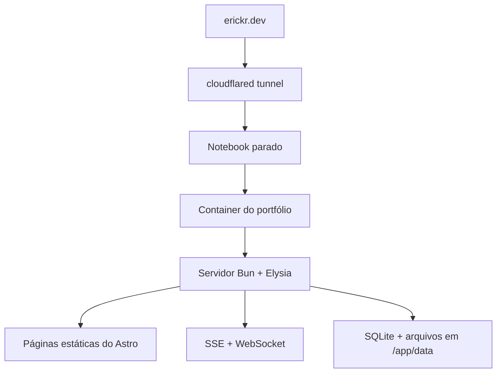

Em algum momento, este portfólio deixou de ser apenas uma página estática. Fui acrescentando telemetria, rotas de API, presença de cursor, polling em segundo plano, dados locais e tarefas internas. O projeto continuava pequeno, mas o formato do deploy já importava.

Esta reescrita não foi uma tentativa de abandonar a Cloudflare nem de economizar dinheiro. Eu queria transformar uma única máquina na unidade de deploy. O [Astro](https://astro.build/) continuaria gerando páginas estáticas e o [Elysia](https://elysiajs.com/) cuidaria das rotas dinâmicas, mas a aplicação inteira seria empacotada em um único container e executada em um notebook que estava parado.

## Por que self-hosting

Esse notebook já era o meu lugar de baixo risco para testar coisas. Nele, testo LLMs locais, rodo pequenos serviços e consumo mídia; às vezes, também o uso como máquina remota de desenvolvimento. Colocar um site de verdade ali trouxe problemas reais para resolver sem tratar a máquina como se fosse uma infraestrutura de produção.

A versão anterior do portfólio dependia mais de serviços de plataforma. Ela explorava aplicações separadas para web e servidor, deploy na [Cloudflare](https://www.cloudflare.com/), autenticação, [oRPC](https://orpc.dev/), [Drizzle](https://orm.drizzle.team/), [Durable Objects](https://developers.cloudflare.com/durable-objects/) e [D1](https://developers.cloudflare.com/d1/).

A reescrita mudou onde eu colocava as fronteiras:

| Antes | Depois |
| --- | --- |
| Aplicações separadas para web e servidor | Um processo de servidor |
| Estado em tempo real e persistência gerenciados | Estado mantido no processo e [SQLite](https://www.sqlite.org/) |
| Várias peças de runtime específicas do provedor | Uma imagem Docker e um diretório de dados |
| Configuração de deploy na plataforma | Um container entregue pelo [Dokploy](https://dokploy.com/) |

A Cloudflare não saiu completamente da arquitetura. O DNS e a conectividade continuam na borda; o processamento e os dados persistentes foram para o notebook. Neste caso, self-hosting descreve onde a aplicação roda, não o desaparecimento de todo serviço externo.

## Os caminhos de runtime e deploy

O experimento se tornou real quando `erickr.dev` começou a chegar ao notebook por um túnel do [`cloudflared`](https://developers.cloudflare.com/cloudflare-one/networks/connectors/cloudflare-tunnel/). O caminho de uma requisição pública é curto:



O Dokploy participa de outro caminho. Ele controla o deploy, mas não é uma etapa pela qual cada requisição passa:


Escolhi o Dokploy porque ele trabalha diretamente com o [Docker](https://www.docker.com/) e deixa o fluxo de deploy fácil de inspecionar. A infraestrutura ainda tem várias peças. A simplificação está dentro da aplicação: um destino de deploy, um container e um processo de servidor.

## O artefato de build

Quando o destino é um único container, o artefato passa a importar mais do que a configuração do provedor.

O Astro gera o site quase todo estático. O [Solid](https://www.solidjs.com/) hidrata apenas as ilhas interativas. O Elysia cuida da API, do SSE, do WebSocket e das rotas internas. O [Bun](https://bun.sh/) roda os scripts e compila o servidor.

O script de build é curto:

```json
{
  "scripts": {
    "build": "bun --bun astro build && bun build ./server/index.ts --compile --outfile myserver"
  }
}
```

O primeiro comando gera a saída do Astro em `dist`. O segundo transforma [`server/index.ts`](https://github.com/ErickCReis/ErickCReis/blob/main/server/index.ts) em um executável chamado `myserver`.

É esse executável que deixa o estágio de runtime simples:

```dockerfile
FROM debian:bookworm-slim AS runtime

WORKDIR /app

COPY --from=build /app/dist ./dist
COPY --from=build /app/myserver ./myserver
COPY --from=build /app/server/db/migrations ./server/db/migrations

CMD ["./myserver"]
```

O estágio de runtime não precisa do código-fonte, de `node_modules` nem da imagem de build do Bun. Ele recebe os arquivos estáticos, o servidor compilado e as migrações do banco. O [Dockerfile completo](https://github.com/ErickCReis/ErickCReis/blob/main/Dockerfile) mantém o build e a execução separados.

## O estado persistente é a fronteira importante

Colocar o processo em um container é a parte fácil. Mais importante é decidir o que precisa sobreviver a esse container.

A aplicação usa `DATA_DIR=/app/data` para o SQLite e os arquivos locais. O Docker Compose monta `./data`, no host, dentro desse diretório. Assim, o container pode ser reconstruído sem levar os dados junto. O Compose também define uma política de reinicialização e limites explícitos de CPU e memória.

Um diretório de dados explícito ainda não é um backup. Ele facilita localizar e copiar o estado, mas automatizar uma cópia para fora do notebook continua sendo trabalho pendente. Falhas de energia, armazenamento e rede também passam a ser problemas meus, não do provedor.

## O que ficou mais simples — e o que não ficou

Arquivos voltam a ser apenas arquivos. Os arquivos estáticos e as rotas de runtime saem do mesmo servidor. Uma tarefa interna não precisa de uma estratégia de plataforma antes de existir. Posso começar uma funcionalidade com um diretório e um processo, sem decidir primeiro qual produto gerenciado vai cuidar dela.

A camada em tempo real é a parte em que eu menos confio. O Durable Objects oferecia um lugar natural para o estado das conexões WebSocket. Em um servidor único, o ciclo de vida das conexões, a limpeza, o monitoramento e a recuperação ficam comigo. A versão atual funciona, mas ainda preciso de uma abstração melhor para acompanhar as conexões e enxergar o que essa camada está fazendo.

Self-hosting deixou esta aplicação mais simples de entregar, não mais simples de operar. Troquei fronteiras gerenciadas por responsabilidades que consigo enxergar: um processo, um diretório de dados, um problema de backup e uma camada em tempo real que ainda preciso fortalecer.

Os próximos posts entram nessas partes menores: presença de cursor, telemetria, roteamento de arquivos estáticos, rastreamento de conteúdo, localização e sincronização do uso de tokens.
