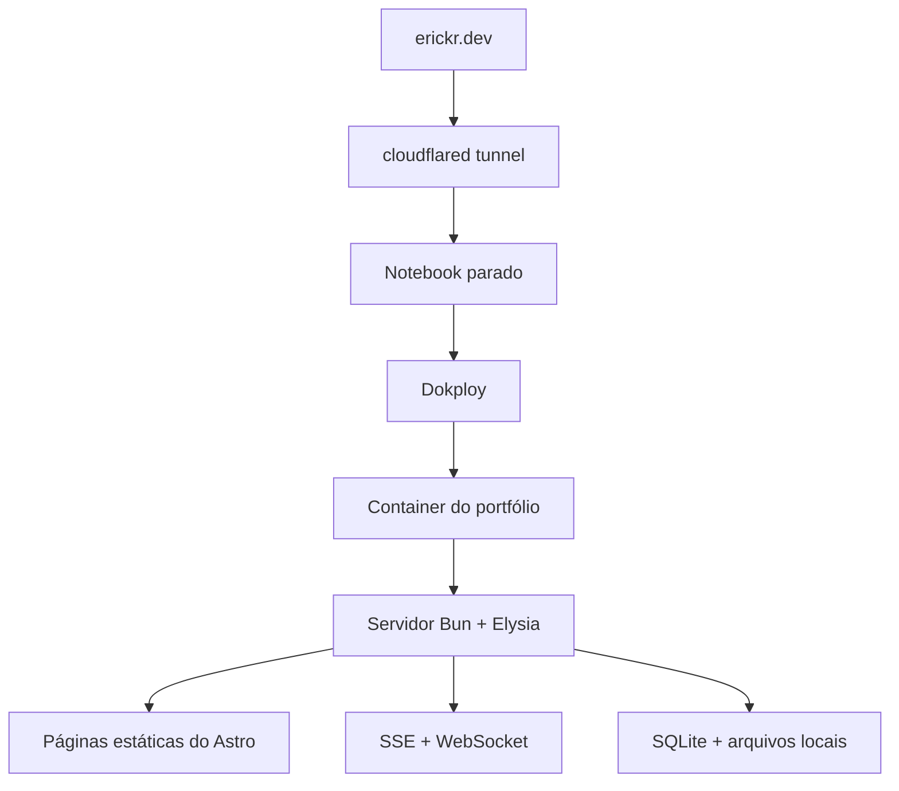
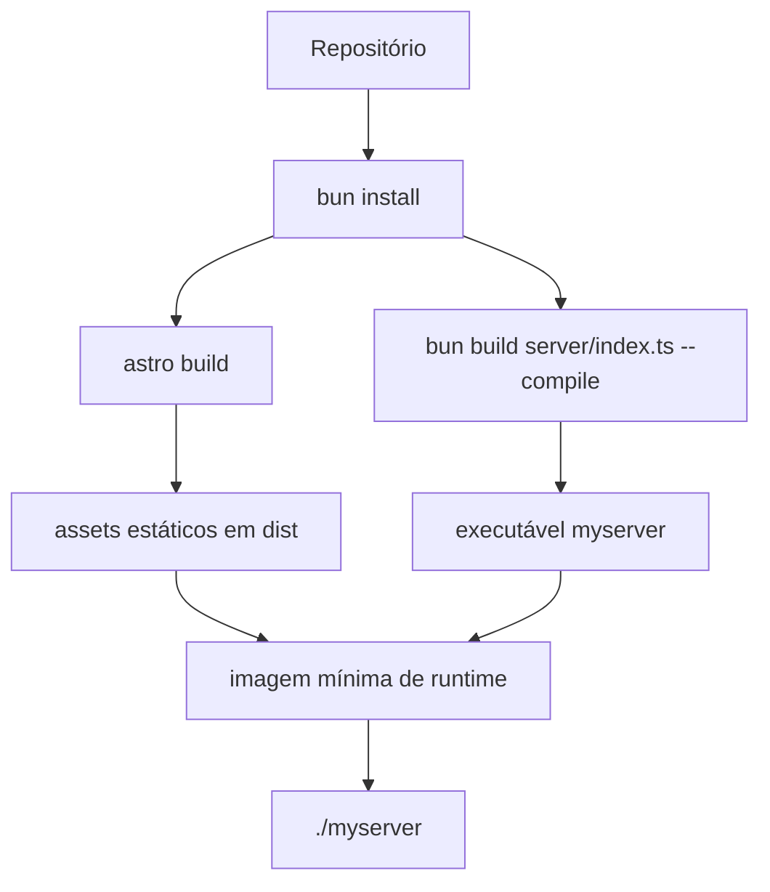

Em algum momento, este portfólio deixou de ser apenas uma página estática.

Comecei colocando telemetria, rotas de API, presença de cursor, polling em segundo plano, dados locais e algumas tarefas internas. Quando percebi, ele já era pequeno demais para justificar uma infraestrutura grande, mas real o bastante para o deploy não ser detalhe.

## Por que self-hosting

Eu tinha um notebook parado, e ele já era a máquina que eu usava para experimentos. Testo LLMs locais nele, rodo alguns serviços pequenos, uso para mídia e às vezes como máquina remota de desenvolvimento. Nada disso é o assunto principal deste post. O ponto é que eu tinha um lugar de baixo risco para aprender rodando algo real, não só subir containers soltos.

A versão anterior do site dependia mais de peças de plataforma. Ela explorava um monorepo com apps separados para web e servidor, deploy na [Cloudflare](https://www.cloudflare.com/), autenticação, [oRPC](https://orpc.dev/), [Drizzle](https://orm.drizzle.team/) e um experimento de websocket para cursor.

Eu continuo gostando da Cloudflare. Construo muitos projetos pequenos lá e, para este volume de tráfego, é difícil competir. Esta reescrita não foi uma ruptura. Eu queria sentir como o mesmo projeto muda quando a resposta padrão deixa de ser adicionar mais um serviço gerenciado.

Isso muda a pergunta. Em vez de pensar onde cada parte encaixa na plataforma, eu comecei a olhar para o que podia rodar junto em um único servidor.

## O caminho do deploy

O experimento ficou de verdade quando `erickr.dev` começou a chegar nesse notebook por um túnel do [`cloudflared`](https://developers.cloudflare.com/cloudflare-one/networks/connectors/cloudflare-tunnel/). Antes disso era só um serviço local na minha rede. Depois disso, era meu portfólio atendendo um domínio público a partir de um notebook que eu nem estava usando.

Esse é o caminho em runtime:



[Dokploy](https://dokploy.com/) não é o foco do post. Foi a ferramenta que eu queria testar porque fica perto do [Docker](https://www.docker.com/) e deixa o fluxo de deploy fácil de inspecionar.

Eu não estava fazendo isso para economizar dinheiro. No meu volume atual, a Cloudflare também era basicamente grátis. A parte útil era ter menos peças para costurar: um domínio, um túnel, um destino de deploy, um container, um processo de servidor.

Essa é a simplificação principal.

## O artefato de build

Quando o destino do deploy é um único container, o artefato de build passa a importar mais do que a configuração do provedor.

O app ainda tem partes separadas. [Astro](https://astro.build/) gera um site quase todo estático. [Solid](https://www.solidjs.com/) hidrata só as ilhas interativas. [Elysia](https://elysiajs.com/) fica com a API, SSE, websockets e rotas internas. [Bun](https://bun.sh/) roda os scripts e compila o servidor.

O que me interessa é o resultado:



O script de build é curto:

```json
{
  "scripts": {
    "build": "bun --bun astro build && bun build ./server/index.ts --compile --outfile myserver"
  }
}
```

O primeiro comando gera os arquivos estáticos do Astro. O segundo compila o servidor Elysia em um executável chamado `myserver`.

Com isso, a imagem de runtime fica pequena:

```dockerfile
FROM oven/bun:1.3 AS build

WORKDIR /app

COPY package.json bun.lock ./
RUN bun install --frozen-lockfile

COPY . .
ENV NODE_ENV=production
RUN bun run build

FROM debian:bookworm-slim AS runtime

WORKDIR /app

COPY --from=build /app/dist ./dist
COPY --from=build /app/myserver ./myserver
COPY --from=build /app/server/db/migrations ./server/db/migrations

ENV NODE_ENV=production
EXPOSE 3000

CMD ["./myserver"]
```

A imagem de runtime não instala as dependências da aplicação. Ela recebe os assets estáticos, o servidor compilado e as migrations do banco. A entrada do servidor continua sendo TypeScript normal em [`server/index.ts`](https://github.com/ErickCReis/ErickCReis/blob/main/server/index.ts), mas em produção eu rodo o executável compilado.

## O que ficou mais simples

Arquivos podem ser arquivos de novo. [SQLite](https://www.sqlite.org/) pode ficar ao lado da aplicação. Assets estáticos e rotas de runtime podem sair do mesmo servidor. Tarefas internas não precisam de uma estratégia de plataforma antes de existirem.

Isso parece óbvio, mas muda como eu desenho funcionalidades pequenas. Eu não preciso começar conectando produtos. Posso começar com um diretório, um processo e um plano de backup.

## O que ficou mais difícil

A camada de realtime é a parte que eu menos confio hoje.

[Cloudflare Durable Objects](https://developers.cloudflare.com/durable-objects/) me dava um lugar natural para guardar estado de websocket, e [D1](https://developers.cloudflare.com/d1/) resolvia a persistência gerenciada. Em um servidor único eu tenho mais controle, mas ciclo de vida das conexões, cleanup, monitoramento e recuperação de falhas ficam comigo.

Essa é a próxima parte que eu preciso melhorar. A versão atual funciona, mas ainda precisa de uma abstração melhor para rastrear conexões e enxergar o que a camada realtime está fazendo.

## Checklist

Para outro app pequeno em self-hosting, eu começaria com este checklist:

- manter um único container deployável até existir um motivo real para separar,
- deixar a entrada de runtime óbvia,
- manter assets estáticos e rotas de runtime atrás do mesmo servidor quando isso simplificar o deploy,
- persistir dados e arquivos em diretórios explícitos,
- evitar integrações de plataforma quando elas não resolvem um problema claro,
- expor telemetria suficiente para ver o que o servidor está fazendo,
- tratar estado realtime como um subsistema de primeira classe, não como detalhe.

Esse é o ponto de partida. Os próximos posts entram em partes menores: presença de cursor, telemetria, roteamento de assets estáticos, tracking de conteúdo, localização e sincronização do uso de tokens.
