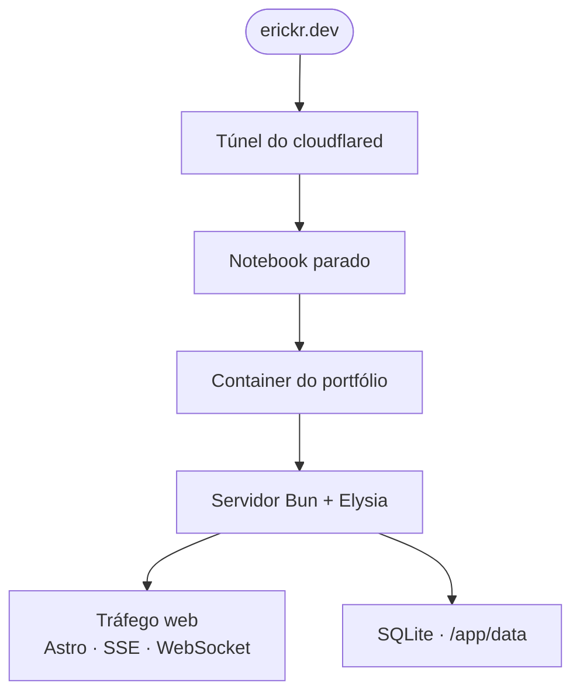
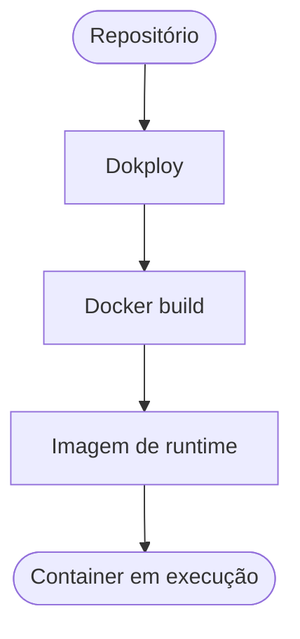

Este portfólio deixou de caber em uma página estática quando acrescentei telemetria, rotas de API, presença de cursor, polling em segundo plano, dados locais e tarefas internas. O projeto continuava pequeno, mas chamá-lo de "site estático" já não fazia sentido.

Reescrevi o projeto para rodar em uma única máquina física. O [Astro](https://astro.build/) continuaria gerando páginas estáticas, e o [Elysia](https://elysiajs.com/) cuidaria das rotas dinâmicas. A aplicação inteira seria empacotada em um container e executada em um notebook que estava parado.

## Por que hospedar por conta própria

Eu já usava o notebook para experimentos de baixo risco. Nele, testo LLMs locais, rodo pequenos serviços, consumo mídia e, às vezes, abro uma sessão remota de desenvolvimento. Colocar um site público ali trouxe problemas reais de infraestrutura sem fingir que a máquina era um ambiente de produção.

A versão anterior do portfólio usava mais serviços gerenciados. Ela tinha aplicações separadas para web e servidor, deploy na [Cloudflare](https://www.cloudflare.com/), autenticação, [oRPC](https://orpc.dev/), [Drizzle](https://orm.drizzle.team/), [Durable Objects](https://developers.cloudflare.com/durable-objects/) e [D1](https://developers.cloudflare.com/d1/).

A reescrita redistribuiu essas responsabilidades:

| Antes                                           | Depois                                                         |
| ----------------------------------------------- | -------------------------------------------------------------- |
| Aplicações separadas para web e servidor        | Um processo de servidor                                        |
| Estado em tempo real e persistência gerenciados | Estado mantido no processo e [SQLite](https://www.sqlite.org/) |
| Várias peças de runtime específicas do provedor | Uma imagem Docker e um diretório de dados                      |
| Configuração de deploy na plataforma            | Um container entregue pelo [Dokploy](https://dokploy.com/)     |

Ainda gosto da Cloudflare, que continua fazendo parte do projeto. O DNS e a conectividade permanecem na borda. O notebook agora executa a aplicação e guarda os dados persistentes. Neste caso, self-hosting descreve onde a aplicação roda, não quem cuida de todos os serviços de apoio.

## Os caminhos de runtime e deploy

O experimento se tornou real quando as requisições para `erickr.dev` começaram a chegar ao notebook por um túnel do [`cloudflared`](https://developers.cloudflare.com/cloudflare-one/networks/connectors/cloudflare-tunnel/). O caminho de uma requisição pública é curto:


```mermaid center
flowchart TB
  Domain(["erickr.dev"]) --> Tunnel["Túnel do cloudflared"]
  Tunnel --> Host["Notebook parado"]
  Host --> Container["Container do portfólio"]
  Container --> Server["Servidor Bun + Elysia"]
  Server --> Web["Tráfego web<br/>Astro · SSE · WebSocket"]
  Server --> Data["SQLite · /app/data"]
```

O Dokploy controla o deploy por outro caminho. As requisições públicas nunca passam por ele:


```mermaid center
flowchart TB
  Source(["Repositório"]) --> Dokploy["Dokploy"]
  Dokploy --> Build["Docker build"]
  Build --> Image["Imagem de runtime"]
  Image --> Container(["Container em execução"])
```

Escolhi o Dokploy porque ele trabalha diretamente com o [Docker](https://www.docker.com/) e me deixa inspecionar cada etapa do deploy. A infraestrutura de apoio ainda tem várias peças. A aplicação agora tem um destino de deploy, um container e um processo de servidor.

As requisições públicas e os deploys se encontram no container em execução. Um novo deploy substitui o container. O diretório `/app/data` montado permanece.

## O artefato de build

Com um único container como destino do deploy, os arquivos gerados importam mais do que a configuração do provedor.

O Astro gera o site quase todo estático. O [Solid](https://www.solidjs.com/) hidrata apenas as ilhas interativas. Em produção, o Elysia serve os arquivos gerados e atende a API, o SSE, o WebSocket e as rotas internas. O [Bun](https://bun.sh/) roda os scripts e compila o servidor.

O script de build é curto:

```json
{
  "scripts": {
    "build": "bun --bun astro build && bun build ./server/index.ts --compile --outfile myserver"
  }
}
```

O primeiro comando gera a saída do Astro em `dist`. O segundo transforma [`server/index.ts`](https://github.com/ErickCReis/ErickCReis/blob/main/server/index.ts) em um executável chamado `myserver`.

O estágio de runtime inicia esse executável:

```dockerfile
FROM debian:bookworm-slim AS runtime

WORKDIR /app

COPY --from=build /app/dist ./dist
COPY --from=build /app/myserver ./myserver
COPY --from=build /app/server/db/migrations ./server/db/migrations

CMD ["./myserver"]
```

O estágio de runtime não precisa do código-fonte, de `node_modules` nem da imagem de build do Bun. O build do Docker copia os arquivos estáticos, o servidor compilado e as migrações do banco. O [Dockerfile completo](https://github.com/ErickCReis/ErickCReis/blob/main/Dockerfile) separa o build da imagem usada para executar a aplicação.

## O estado precisa sobreviver ao container

Iniciar o processo em um container é fácil. A decisão difícil é o que precisa sobreviver quando esse container for substituído.

A aplicação usa `DATA_DIR=/app/data` para o SQLite e os arquivos locais. O Docker Compose monta ali o diretório `./data` do host, então o novo container encontra o mesmo estado. O Compose também define a política de reinicialização e limites explícitos de CPU e memória.

Com um diretório de dados explícito, sei o que preciso copiar. Ainda preciso automatizar uma cópia para fora do notebook. Também assumi os problemas de energia, armazenamento e rede da máquina que antes ficavam com o provedor.

## O que agora preciso operar

Os arquivos estáticos e as rotas de runtime agora saem do mesmo servidor Bun. Uma tarefa interna pode começar como um módulo nesse processo. Não preciso escolher um produto gerenciado antes de escrever a funcionalidade.

A camada em tempo real é a parte em que menos confio. O Durable Objects cuidava do estado das conexões WebSocket. Em um servidor único, eu cuido da limpeza das conexões, do monitoramento e da recuperação. A versão atual funciona, mas ainda preciso de uma forma melhor de acompanhar as conexões e inspecionar esse código.

Self-hosting simplificou o deploy desta aplicação e aumentou meu trabalho operacional. Um processo serve a aplicação, e um diretório montado guarda o estado. Agora preciso cuidar do backup e fortalecer o código que mantém as conexões em tempo real.

Os próximos posts vão tratar dessas partes uma de cada vez. Começo com presença de cursor e telemetria, depois passo para roteamento de arquivos estáticos, rastreamento de conteúdo, localização e sincronização do uso de tokens.
