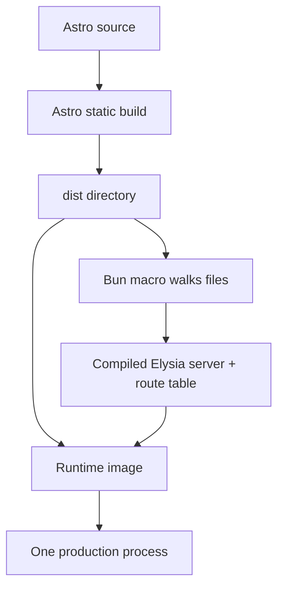

import { DistRouteLab } from "@web/content/labs/dist-route-lab";

The public site has one front door, but two very different kinds of work happen behind it. The [stats pipeline](/blog/the-stats-pipeline) ends at live Elysia routes; every article, stylesheet, font, image, and script is already finished before the server starts.

I wanted that single entry point without turning Astro into a server-rendered application. The [first post in this series](/blog/rewriting-my-portfolio-for-self-hosting) showed the outer deployment shape—an Astro build, a compiled Bun server, and a small runtime image—but intentionally skipped how those pieces meet.

The seam is a route table generated during the build. Astro remains a static-site generator; Elysia learns which files it produced and later serves those exact files beside the live endpoints.



## The order is part of the build

The two commands in `package.json` are joined for a reason:

```json
{
  "scripts": {
    "build": "bun --bun astro build && bun build ./server/index.ts --compile --outfile myserver"
  }
}
```

Astro must finish first and write `dist`. Only then can Bun compile [`server/index.ts`](https://github.com/ErickCReis/ErickCReis/blob/main/server/index.ts), because the server build inspects that directory to discover the static routes.

I keep two build products rather than one artifact pretending to contain everything:

- `dist`, with the actual Astro files;
- `myserver`, a native executable containing the Elysia application and the generated route metadata.

Database migrations are the third directory copied into the runtime image, but they do not participate in static routing.

My first version embedded asset contents in the server. The current version embeds only paths and keeps files as files. That makes the boundary clearer: the executable knows how to route a request, while `dist` remains the payload Astro generated.

## Discovering clean routes at compile time

[`server/dist-assets.macro.ts`](https://github.com/ErickCReis/ErickCReis/blob/main/server/dist-assets.macro.ts) recursively walks `dist` in sorted order. For each file it produces one or more request paths.

An ordinary asset keeps its path. HTML files also receive the clean aliases people expect from a static site:

| Generated file       | Registered routes                     |
| -------------------- | ------------------------------------- |
| `index.html`         | `/index.html`, `/`                    |
| `blog/index.html`    | `/blog/index.html`, `/blog`, `/blog/` |
| `about.html`         | `/about.html`, `/about`               |
| `_astro/app.A1B2.js` | `/_astro/app.A1B2.js`                 |

The macro import is evaluated by Bun while the server is bundled:

```ts
import { loadDistAssetRoutes } from "./dist-assets.macro" with { type: "macro" };

const distAssetRoutes = loadDistAssetRoutes();
```

The resulting array is compiled into `myserver`; the directory scan does not run every time the process starts. This also means static routes cannot change independently of the binary. If `dist` changes, the server must be rebuilt so its route table and files remain the same build.

The macro refuses to compile when `dist` is required but missing. Its error points back to the Astro build instead of producing a server whose homepage silently returns 404.

## Duplicate aliases should fail the build

Generating aliases creates a possible collision. `about.html` and `about/index.html`, for example, would both claim `/about`. I do not want filesystem traversal order to decide which page wins.

The generator puts candidates in a map and throws as soon as a route already exists, including both file entries in the error. Sorted traversal makes diagnostics stable, but it is the failure itself that matters: I treat an ambiguous static route as a build problem, not a production routing policy.

This check covers collisions within Astro's generated files. API routes remain explicit Elysia routes in `server/index.ts`, registered before the production-only static subrouter. Keeping the static route registration in one subrouter makes that boundary visible.

## Serving files with different cache lifetimes

At runtime, [`server/dist-assets.ts`](https://github.com/ErickCReis/ErickCReis/blob/main/server/dist-assets.ts) loops over the compiled route table and registers an Elysia `GET` handler for each entry. The handler passes the file path to Elysia's `file` response helper and assigns cache behavior from the asset type.

```ts
function getCacheControl(asset: DistAssetRoute) {
  if (asset.routePath.startsWith("/_astro/")) {
    return "public, max-age=31536000, immutable";
  }

  if (asset.filePath.endsWith(".html")) {
    return "no-cache";
  }

  return "public, max-age=3600";
}
```

Astro fingerprints its bundled assets, so files under `/_astro/` can be cached as immutable for a year. HTML uses `no-cache`: a browser may retain it, but must revalidate before reuse. Other public files receive a one-hour lifetime.

The clean aliases and the original `.html` route point to the same file and therefore receive the same HTML policy. Cache behavior belongs to the file, not the prettier URL used to reach it.

## Put the build contract under pressure

The lab below compresses the macro and runtime handler into one view. Pick a route to trace it to its file and response header. Add a regular asset and it receives one literal route; add an HTML file and its clean alias appears. Then inject the conflicting `about/index.html`: `/about` gains two owners, the build stops, and there is no binary available to answer the request.

<DistRouteLab client:load locale="en-US" />

That failure is the useful result. The invalid state never becomes a rule that production has to resolve.

## The container preserves the build's layout

The [multi-stage Dockerfile](https://github.com/ErickCReis/ErickCReis/blob/main/Dockerfile) runs the combined build in `oven/bun`, then starts again from `debian:bookworm-slim`:

```dockerfile
COPY --from=build /app/dist ./dist
COPY --from=build /app/myserver ./myserver
COPY --from=build /app/server/db/migrations ./server/db/migrations

CMD ["./myserver"]
```

Both stages use `/app` as their working directory. I preserve that layout because the compile-time route table points to the files discovered under `/app/dist`. The runtime image does not install Bun or application dependencies; it needs the compiled executable, the files it serves, and the migrations the application runs.

Development deliberately has a different shape. Astro's dev server and the Bun API run in parallel with separate ports and fast feedback. The static subrouter is only attached when `NODE_ENV` is `production`. One-process production does not require forcing the development servers into the same lifecycle.

## Static output behind a live server

This setup is not Astro SSR, and Elysia does not render the pages. A request for an article reads the HTML Astro already generated. A request for `/stats/stream`, `/live`, or a content counter reaches runtime code in the same process.

That distinction keeps the original constraint intact: static when possible, live only where behavior requires it. The deployment has one public server, but the page-generation and request-time responsibilities remain separate.

The next post stays inside that container and asks a more operational question: when the server reports CPU, memory, battery, and uptime, which machine is it actually measuring?
