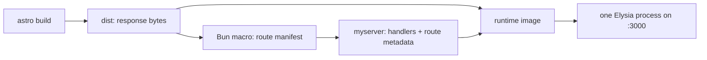
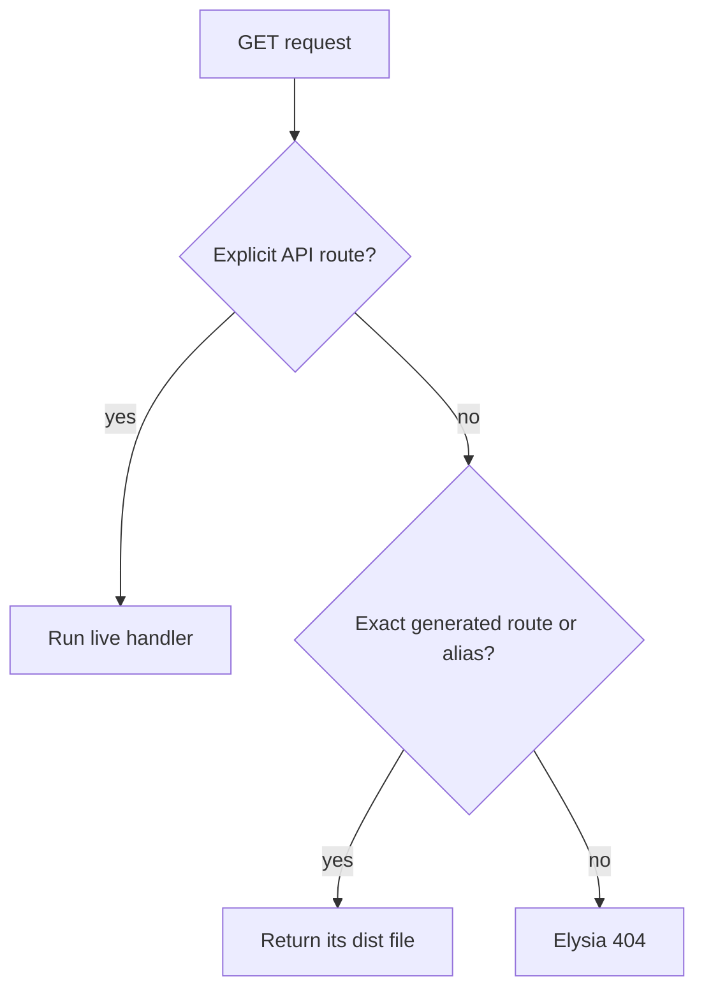

Astro produces static files. Elysia handles requests. `bun build --compile` produces an executable. This deployment joins them behind one port with a route manifest created at build time. Astro writes response bytes to `dist`. A Bun macro turns those files into exact Elysia routes while compiling the server. The runtime image ships `dist` and the executable together.


```mermaid center
flowchart LR
  Astro["astro build"] --> Dist["dist: response bytes"]
  Dist --> Macro["Bun macro: route manifest"]
  Macro --> Binary["myserver: handlers + route metadata"]
  Dist --> Image["runtime image"]
  Binary --> Image
  Image --> Elysia["one Elysia process on :3000"]
```

Each request path maps to a file generated by the same build. No server-side rendering or generic directory fallback runs at request time.

## Build Astro before compiling the server

The build script establishes the dependency order:

```json
{
  "scripts": {
    "build": "bun --bun astro build && bun build ./server/index.ts --compile --outfile myserver"
  }
}
```

The `&&` is part of the deployment contract. `astro build` must complete before Bun compiles `server/index.ts`, because compilation evaluates a macro that walks `dist`.

The release has two static-serving artifacts:

| Artifact | Owns | Does not own |
| --- | --- | --- |
| `dist/` | HTML, JavaScript, CSS, fonts, images, and other generated bytes | Request routing |
| `myserver` | Elysia handlers, the generated route table, and response policy | The static file contents |

The route table contains file paths, not embedded file contents. Replacing only `dist` is unsafe. The binary may have no route for a new file, retain a route for a removed file, or point an alias at the wrong release. Replacing only the binary creates the inverse problem. The executable and directory form one deployment unit even though they remain separate files.

The Docker image preserves `/app/dist` because the macro resolves each file to an absolute path while building under `/app`. The runtime stage uses the same working directory.

## Compile files into exact request paths

The route compiler lives in `server/dist-assets.macro.ts`. It recursively walks `dist`, sorts every directory read, normalizes platform separators to `/`, and derives route candidates from each relative file path:

```ts
function toRouteCandidates(relativePath: string): string[] {
  const routePath = `/${relativePath.split(sep).join("/")}`;
  const routes = new Set<string>([routePath]);

  if (routePath.endsWith("/index.html")) {
    const nestedIndexPath = routePath.slice(0, -"/index.html".length) || "/";
    routes.add(nestedIndexPath);

    if (nestedIndexPath !== "/") {
      routes.add(`${nestedIndexPath}/`);
    }
  } else if (routePath.endsWith(".html")) {
    routes.add(routePath.slice(0, -".html".length) || "/");
  }

  return [...routes];
}
```

Every file keeps its literal URL. HTML receives additional clean aliases:

| File in `dist` | Registered request paths |
| --- | --- |
| `index.html` | `/index.html`, `/` |
| `blog/index.html` | `/blog/index.html`, `/blog`, `/blog/` |
| `about.html` | `/about.html`, `/about` |
| `_astro/app.A1B2.js` | `/_astro/app.A1B2.js` |

The macro import is the build-time boundary:

```ts
import {
  loadDistAssetRoutes,
  type DistAssetRoute,
} from "./dist-assets.macro" with { type: "macro" };

const distAssetRoutes = loadDistAssetRoutes() as DistAssetRoute[];
```

Bun evaluates `loadDistAssetRoutes()` while processing the server build and substitutes its result. Production startup does not recursively scan `dist`. It iterates route metadata already compiled into `myserver`.

The loader also treats a missing `dist` as a build error when Bun is compiling or `NODE_ENV` is `production`. That turns a reversed build order into a failed release instead of a server that starts successfully and returns 404 for every page.

## Reject ambiguous clean URLs

Aliases introduce a correctness problem that literal file serving does not have. These files are distinct:

```text
dist/about.html
dist/about/index.html
```

but both claim `/about`. The compiler stores candidates in a `Map` and throws on the second owner:

```ts
const existingRoute = routes.get(routePath);
if (existingRoute) {
  throw new Error(
    `Duplicate dist route "${routePath}" for "${filePath}". ` +
      `Existing route entry: ${JSON.stringify(existingRoute)}.`,
  );
}

routes.set(routePath, { routePath, filePath });
```

Sorted traversal makes the diagnostic deterministic. The compiler decides route ownership during the build. The result does not depend on filesystem order or whichever handler happens to register last.

This check covers collisions inside `dist`. It does not compare generated static paths with separately declared API routes. `server/index.ts` installs the API plugins before the production static subrouter, so the application still has to prevent overlap between API and static paths.

## Return 404 for unknown paths

The server does not register `/*`, does not send `index.html` for unknown requests, and does not perform extension probing at request time. It registers only the candidates produced above:

```ts
export function createDistAssetsSubrouter() {
  const router = new Elysia({ name: "dist-assets" });

  for (const asset of distAssetRoutes) {
    router.get(asset.routePath, ({ set }) => {
      set.headers["cache-control"] = getCacheControl(asset);
      return file(asset.filePath);
    });
  }

  return router;
}
```

Every GET request follows this decision tree:


```mermaid center
flowchart TD
  Request["GET request"] --> API{"Explicit API route?"}
  API -- yes --> Handler["Run live handler"]
  API -- no --> Static{"Exact generated route or alias?"}
  Static -- yes --> File["Return its dist file"]
  Static -- no --> Missing["Elysia 404"]
```

A typo such as `/blgo` remains a 404. A client-side router that needs history-API fallback would require a separate catch-all route.

The server attaches the static subrouter only when `NODE_ENV === "production"`. During development, Astro serves its output on port 4321 while Bun watches the API on a separate port. The two processes stay separate during development and share one port in production.

## Assign cache headers by file type

Not every generated file has the same invalidation model. The static handler assigns one of three policies:

```ts
function getCacheControl(asset: DistAssetRoute) {
  if (asset.routePath.startsWith("/_astro/")) {
    return "public, max-age=31536000, immutable";
  }

  if (asset.filePath.endsWith(".html")) {
    return "no-cache";
  }

  return "public, max-age=3600";
}
```

- `/_astro/*` receives one year plus `immutable`. Astro's bundled assets are content-fingerprinted, so a content change produces a new URL.
- HTML receives `no-cache`. A cache may store it, but must revalidate before using the stored response.
- Other public files receive a one-hour freshness lifetime. This covers assets whose filenames may be stable and therefore should not be treated as immutable.

The HTML check uses `filePath`, not `routePath`. `/about`, `/about/` when generated from an index, and the literal `.html` route share the same policy because they return the same file type. Elysia's `file()` helper streams the file and sets its media type. The subrouter adds the cache header for this deployment.

The rule trusts every `/_astro/` path to contain a fingerprinted file. Astro's generated bundle directory satisfies that assumption. A manually added stable filename would not, and browsers could cache it for a year.

## Add security headers without replacing route headers

Static files and API responses pass through the same application-level `onAfterHandle` hook:

```ts
.onAfterHandle(({ set }) => {
  applySecureHeaders(set.headers);
})
```

`applySecureHeaders` fills headers only when a route has not already supplied them:

```ts
headers["x-content-type-options"] ??= "nosniff";
headers["x-frame-options"] ??= "DENY";
headers["referrer-policy"] ??= "strict-origin-when-cross-origin";
headers["permissions-policy"] ??=
  "camera=(), geolocation=(), microphone=(), payment=()";
headers["cross-origin-opener-policy"] ??= "same-origin";

if (Bun.env.NODE_ENV === "production") {
  headers["strict-transport-security"] ??=
    "max-age=31536000; includeSubDomains; preload";
}
```

Using `??=` keeps the global defaults from overwriting a header set by a route. The static subrouter sets `cache-control`, while the application hook adds the security headers.

CORS is configured separately. Production browser requests with credentials are allowed only from `https://erickr.dev` and `https://www.erickr.dev`; development allows `http://localhost:4321`. That policy controls cross-origin browser access to the API. It does not replace response hardening, authentication, or cache control.

## Ship the binary and dist from the same build

The multi-stage Docker build compiles with Bun, then runs the result without a Bun installation or `node_modules`:

```dockerfile
FROM oven/bun:1.3 AS build
WORKDIR /app

COPY package.json bun.lock ./
RUN bun install --frozen-lockfile

COPY . .
ENV NODE_ENV=production
RUN bun run build

FROM debian:bookworm-slim AS runtime
WORKDIR /app

COPY --from=build /app/dist ./dist
COPY --from=build /app/myserver ./myserver
COPY --from=build /app/server/db/migrations ./server/db/migrations

ENV NODE_ENV=production
EXPOSE 3000
CMD ["./myserver"]
```

The final image contains three application artifacts:

- `myserver` owns live routes, the static manifest, cache selection, CORS, and security headers;
- `dist` owns the bytes returned by static routes;
- `server/db/migrations` is runtime data for the application, unrelated to static serving.

`dist` and the compiled route manifest must come from the same build and ship together. Otherwise, the server can register routes for files that are missing or fail to register files that exist. Building both in one image keeps clean URLs, 404 responses, and cache headers tied to the files being served.
