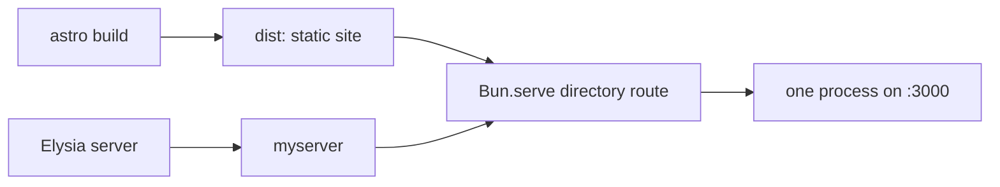

An Astro static build produces a directory, Elysia produces request handlers, and `bun build --compile` produces an executable. Bun 1.4's directory routes let the executable serve the entire Astro output without generating one Elysia handler per file. The result is one process and two deployment artifacts: `myserver` contains the application, while `dist` contains the static site.


```mermaid center
flowchart LR
  Astro["astro build"] --> Dist["dist: static site"]
  Server["Elysia server"] --> Binary["myserver"]
  Dist --> Directory["Bun.serve directory route"]
  Binary --> Directory
  Directory --> Process["one process on :3000"]
```

The native route handles directory indexes, redirects, media types, validators, partial responses, and safe filesystem lookup. Elysia continues to own the live API routes.

## Build the two artifacts in order

The build script establishes the dependency order:

```json
{
  "scripts": {
    "build": "bun --bun astro build && bun build ./server/index.ts --compile --outfile myserver"
  }
}
```

The `&&` is part of the deployment contract. `astro build` must complete before the server is compiled and packaged, so a release cannot accidentally carry an old or incomplete `dist` directory.

| Artifact   | Owns                                                                 |
| ---------- | -------------------------------------------------------------------- |
| `dist/`    | HTML, JavaScript, CSS, fonts, images, and other generated bytes      |
| `myserver` | Elysia handlers, Bun's native route configuration, and response code |

Bun 1.4 also supports embedding directories with `--asset`, but that is a separate mechanism. A native `{ dir }` route opens a real filesystem directory, so this deployment intentionally places `dist` beside `myserver` in the runtime image.

## Give Bun the whole folder

The static serving configuration is now small enough to fit in one function:

```ts
import { resolve } from "node:path";

export function createDistAssetsServeOptions() {
  const routes = {
    "/*": { dir: resolve("dist") },
  };

  return { routes };
}
```

The real source has a narrow type assertion because Bun 1.4 shipped before the matching `@types/bun` declarations. At runtime this object is passed unchanged to `Bun.serve()`.

Elysia exposes Bun's server options on its root configuration:

```ts
const app = new Elysia({
  serve: Bun.env.NODE_ENV === "production" ? createDistAssetsServeOptions() : undefined,
})
  .use(statsRoutes)
  .use(presenceRoutes)
  .use(blogRoutes)
  .use(internalRoutes)
  .use(liveRoutes);
```

Elysia's Bun adapter merges the framework's routes with the supplied native routes. Bun matches exact and parameterized API paths before the global `/*` directory route, so a request such as `/live/id` reaches Elysia while `/favicon.svg` reaches the static folder.

The folder route exists only in production. During development, Astro still serves its own output on port 4321 while Bun watches the API separately.

## Let directory semantics define clean URLs

Bun maps the URL suffix after `/*` directly into `dist`:

| Request             | Result                                |
| ------------------- | ------------------------------------- |
| `/`                 | Serves `dist/index.html`              |
| `/blog`             | Redirects to `/blog/` with status 301 |
| `/blog/`            | Serves `dist/blog/index.html`         |
| `/favicon.svg`      | Serves `dist/favicon.svg`             |
| `/does-not-exist`   | Returns 404                           |
| an explicit API URL | Runs the more-specific Elysia handler |

This is a smaller contract than the old generated route manifest. There is no recursive startup scan, alias table, extension probing, or catch-all that returns the root page. Astro's directory output and normal web-directory behavior provide the clean URLs.

A client-side application that needs history-API fallback would need a different route. This site is statically generated, so an unknown URL should remain a real 404.

## Use Bun's built-in file response behavior

Directory routes provide the response machinery that the application previously assembled itself:

- `Content-Type` is inferred from the extension;
- `Last-Modified` and a weak `ETag` are emitted;
- `If-Modified-Since` and `If-None-Match` can return 304;
- byte ranges return 206 with `Accept-Ranges` and `Content-Range`;
- directories redirect to a trailing slash and then serve `index.html`;
- missing files return 404.

On Linux, Bun performs the directory lookup beneath the configured root, preventing a path or symlink from escaping `dist`. Keeping private files outside that directory is still the correct security boundary.

Native directory responses do not pass through Elysia's `onAfterHandle` hook. The application's security-header and CORS policies therefore still apply to API responses, while static caching and file headers come directly from Bun. If static files need additional headers, those belong at the reverse proxy/CDN or in explicit application handlers.

## Keep scheduling inside Elysia

The server's scheduled jobs remain Elysia plugins:

```ts
const app = new Elysia({ serve }).use(batteryAlertCron).use(blogReportCron);
```

The battery monitor keeps its five-second expression, and the daily blog report keeps the `America/Sao_Paulo` timezone. Static serving and scheduling use different layers for different jobs: Bun owns filesystem delivery, while Elysia owns application lifecycle plugins.

## Preserve the contract in the runtime image

The multi-stage Docker build compiles with Bun, then runs the result without Bun or `node_modules` in the final image:

```dockerfile
FROM oven/bun:1.4.0 AS build
WORKDIR /app

COPY package.json bun.lock ./
RUN bun install --frozen-lockfile

COPY . .
ENV NODE_ENV=production
RUN bun run build

FROM debian:bookworm-slim AS runtime
WORKDIR /app

COPY --from=build /app/dist ./dist
COPY --from=build /app/myserver ./myserver
COPY --from=build /app/server/db/migrations ./server/db/migrations

ENV NODE_ENV=production
EXPOSE 3000
CMD ["./myserver"]
```

`myserver` and `dist` must come from the same build and ship together. That pairing keeps the native folder route simple while making routing behavior, cache validation, partial responses, and API precedence responsibilities of the server rather than application-level file-walking code.
