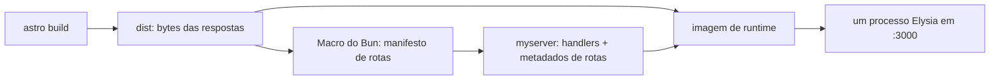
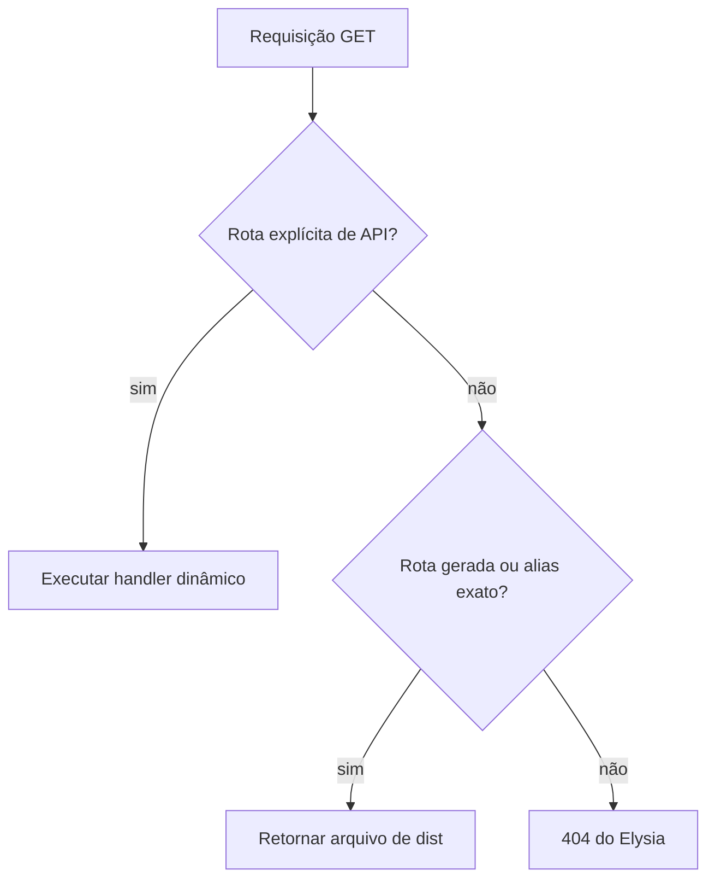

Um build estático do Astro produz arquivos, o Elysia produz handlers HTTP e `bun build --compile` produz um executável. Este deploy coloca os três atrás da mesma porta com um manifesto de rotas criado no build. O Astro grava os bytes das respostas em `dist`; uma macro do Bun transforma os arquivos em rotas exatas do Elysia durante a compilação do servidor; a imagem de runtime inclui `dist` e o executável.



Cada caminho de requisição aponta para um arquivo produzido pelo mesmo build. Não há renderização no servidor nem fallback genérico de diretório durante a requisição.

## A propriedade dos artefatos vem antes do roteamento

O script de build estabelece a ordem de dependência:

```json
{
  "scripts": {
    "build": "bun --bun astro build && bun build ./server/index.ts --compile --outfile myserver"
  }
}
```

O `&&` faz parte do contrato de deploy. `astro build` precisa terminar antes de o Bun compilar `server/index.ts`, pois a compilação avalia uma macro que percorre `dist`.

O release tem dois artefatos responsáveis pelo conteúdo estático:

| Artefato | É responsável por | Não é responsável por |
| --- | --- | --- |
| `dist/` | HTML, JavaScript, CSS, fontes, imagens e outros bytes gerados | Roteamento das requisições |
| `myserver` | Handlers do Elysia, tabela de rotas gerada e política das respostas | Conteúdo dos arquivos estáticos |

A tabela de rotas contém caminhos de arquivos, não o conteúdo incorporado desses arquivos. Por isso, substituir apenas `dist` é inseguro: o binário pode não ter uma rota para um arquivo novo, manter uma rota para um arquivo removido ou apontar um alias para o release errado. Substituir apenas o binário cria o problema inverso. O executável e o diretório formam uma unidade atômica de deploy, apesar de continuarem como artefatos separados.

A imagem Docker preserva `/app/dist` porque a macro resolve cada arquivo para um caminho absoluto durante o build em `/app`. O estágio de runtime usa o mesmo diretório de trabalho.

## Compile arquivos em caminhos exatos de requisição

O compilador de rotas está em `server/dist-assets.macro.ts`. Ele percorre `dist` recursivamente, ordena cada leitura de diretório, normaliza os separadores da plataforma para `/` e deriva rotas candidatas do caminho relativo de cada arquivo:

```ts
function toRouteCandidates(relativePath: string): string[] {
  const routePath = `/${relativePath.split(sep).join("/")}`;
  const routes = new Set<string>([routePath]);

  if (routePath.endsWith("/index.html")) {
    const nestedIndexPath = routePath.slice(0, -"/index.html".length) || "/";
    routes.add(nestedIndexPath);

    if (nestedIndexPath !== "/") {
      routes.add(`${nestedIndexPath}/`);
    }
  } else if (routePath.endsWith(".html")) {
    routes.add(routePath.slice(0, -".html".length) || "/");
  }

  return [...routes];
}
```

Todo arquivo mantém sua URL literal. Arquivos HTML recebem aliases limpos adicionais:

| Arquivo em `dist` | Caminhos de requisição registrados |
| --- | --- |
| `index.html` | `/index.html`, `/` |
| `blog/index.html` | `/blog/index.html`, `/blog`, `/blog/` |
| `about.html` | `/about.html`, `/about` |
| `_astro/app.A1B2.js` | `/_astro/app.A1B2.js` |

O import da macro é a fronteira de build:

```ts
import {
  loadDistAssetRoutes,
  type DistAssetRoute,
} from "./dist-assets.macro" with { type: "macro" };

const distAssetRoutes = loadDistAssetRoutes() as DistAssetRoute[];
```

O Bun avalia `loadDistAssetRoutes()` enquanto processa o build do servidor e substitui seu resultado. A inicialização em produção não percorre `dist` recursivamente; ela percorre os metadados de rota já compilados em `myserver`.

O loader também considera a ausência de `dist` um erro quando o Bun está compilando ou `NODE_ENV` é `production`. Assim, uma ordem de build invertida interrompe o release em vez de iniciar um servidor que retorna 404 para todas as páginas.

## Rejeite URLs limpas ambíguas

Aliases introduzem um problema de correção que o serviço de arquivos por caminhos literais não tem. Estes arquivos são diferentes:

```text
dist/about.html
dist/about/index.html
```

mas ambos tentam ser donos de `/about`. O compilador armazena candidatos em um `Map` e lança um erro quando encontra o segundo dono:

```ts
const existingRoute = routes.get(routePath);
if (existingRoute) {
  throw new Error(
    `Duplicate dist route "${routePath}" for "${filePath}". ` +
      `Existing route entry: ${JSON.stringify(existingRoute)}.`,
  );
}

routes.set(routePath, { routePath, filePath });
```

O percurso ordenado torna o diagnóstico determinístico. A propriedade da rota é decidida durante o build, sem depender da ordem do sistema de arquivos ou de qual handler foi registrado por último.

Essa verificação cobre colisões dentro de `dist`. Ela **não** compara os caminhos estáticos gerados com rotas de API declaradas separadamente. `server/index.ts` instala os plugins de API antes do subroteador estático de produção, portanto evitar sobreposição entre caminhos de API e arquivos continua sendo uma regra de nomenclatura da aplicação.

## Torne o comportamento de fallback explícito

O servidor não registra `/*`, não envia `index.html` para requisições desconhecidas e não tenta extensões em runtime. Ele registra apenas os candidatos produzidos acima:

```ts
export function createDistAssetsSubrouter() {
  const router = new Elysia({ name: "dist-assets" });

  for (const asset of distAssetRoutes) {
    router.get(asset.routePath, ({ set }) => {
      set.headers["cache-control"] = getCacheControl(asset);
      return file(asset.filePath);
    });
  }

  return router;
}
```

Isso dá ao deploy uma árvore de decisão pequena e previsível:



Um erro como `/blgo` continua sendo 404. Um roteador no cliente que dependesse do fallback da History API precisaria de uma rota catch-all separada.

O subroteador estático só é conectado quando `NODE_ENV === "production"`. No desenvolvimento, o Astro serve sua própria saída na porta 4321, enquanto o Bun observa a API em outra porta. A convergência em produção não prejudica o ciclo rápido de desenvolvimento.

## Derive a política de cache da semântica do artefato

Nem todo arquivo gerado tem o mesmo modelo de invalidação. O handler estático escolhe uma de três políticas:

```ts
function getCacheControl(asset: DistAssetRoute) {
  if (asset.routePath.startsWith("/_astro/")) {
    return "public, max-age=31536000, immutable";
  }

  if (asset.filePath.endsWith(".html")) {
    return "no-cache";
  }

  return "public, max-age=3600";
}
```

- `/_astro/*` recebe um ano e `immutable`. Os assets empacotados pelo Astro têm fingerprint do conteúdo, então uma alteração produz uma URL nova.
- HTML recebe `no-cache`. Um cache pode armazená-lo, mas precisa revalidar antes de usar a resposta armazenada.
- Outros arquivos públicos recebem uma hora de validade em cache. Isso cobre assets cujos nomes podem ser estáveis e que, portanto, não devem ser tratados como imutáveis.

A decisão sobre HTML usa `filePath`, não `routePath`. `/about`, `/about/` quando gerada a partir de um arquivo `index` e a rota literal com `.html` recebem a mesma política porque retornam o mesmo tipo de artefato. O helper `file()` do Elysia é responsável por transmitir o arquivo e definir seu tipo de mídia; o subroteador acrescenta o header de cache específico do deploy.

Há uma limitação sutil: todo caminho em `/_astro/` é considerado fingerprintado. Isso é verdadeiro para o diretório de bundles gerado pelo Astro, mas colocar manualmente arquivos com nomes estáveis ali quebraria a invariante de cache. A propriedade do diretório faz parte da política.

## Aplique headers de segurança sem apagar políticas das rotas

Arquivos estáticos e respostas da API passam pelo mesmo hook `onAfterHandle` da aplicação:

```ts
.onAfterHandle(({ set }) => {
  applySecureHeaders(set.headers);
})
```

`applySecureHeaders` preenche um header somente quando a rota ainda não definiu esse valor:

```ts
headers["x-content-type-options"] ??= "nosniff";
headers["x-frame-options"] ??= "DENY";
headers["referrer-policy"] ??= "strict-origin-when-cross-origin";
headers["permissions-policy"] ??=
  "camera=(), geolocation=(), microphone=(), payment=()";
headers["cross-origin-opener-policy"] ??= "same-origin";

if (Bun.env.NODE_ENV === "production") {
  headers["strict-transport-security"] ??=
    "max-age=31536000; includeSubDomains; preload";
}
```

O uso de `??=` importa: a linha de base global não sobrescreve uma resposta mais específica. O header `cache-control` do subroteador estático e os headers de segurança são camadas independentes.

O CORS é configurado separadamente. Em produção, requisições de navegador com credenciais são permitidas apenas quando originadas de `https://erickr.dev` ou `https://www.erickr.dev`; no desenvolvimento, `http://localhost:4321` é permitido. Essa política controla o acesso cross-origin do navegador à API. Ela não substitui o endurecimento das respostas, a autenticação nem o controle de cache.

## Preserve o contrato na imagem de runtime

O build Docker de múltiplos estágios compila com Bun e executa o resultado sem instalar Bun ou `node_modules` no estágio final:

```dockerfile
FROM oven/bun:1.3 AS build
WORKDIR /app

COPY package.json bun.lock ./
RUN bun install --frozen-lockfile

COPY . .
ENV NODE_ENV=production
RUN bun run build

FROM debian:bookworm-slim AS runtime
WORKDIR /app

COPY --from=build /app/dist ./dist
COPY --from=build /app/myserver ./myserver
COPY --from=build /app/server/db/migrations ./server/db/migrations

ENV NODE_ENV=production
EXPOSE 3000
CMD ["./myserver"]
```

O conteúdo do runtime reflete diretamente a arquitetura:

- `myserver` é responsável pelas rotas dinâmicas, pelo manifesto estático, pela seleção de cache, pelo CORS e pelos headers de segurança;
- `dist` é responsável pelos bytes retornados pelas rotas estáticas;
- `server/db/migrations` contém dados de runtime da aplicação e não participa do serviço estático.

`dist` e o manifesto de rotas compilado precisam vir do mesmo build e ser distribuídos como uma unidade. Essa restrição mantém URLs limpas, respostas 404 e políticas de cache explícitas no código da aplicação.
