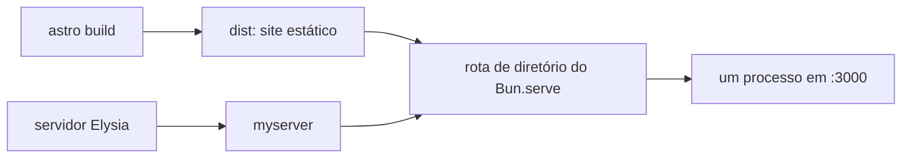

Um build estático do Astro produz um diretório, o Elysia produz handlers HTTP e `bun build --compile` produz um executável. As rotas de diretório do Bun 1.4 permitem que o executável sirva toda a saída do Astro sem gerar um handler do Elysia para cada arquivo. O resultado é um processo e dois artefatos de deploy: `myserver` contém a aplicação, enquanto `dist` contém o site estático.



A rota nativa cuida de índices de diretório, redirecionamentos, tipos de mídia, validadores, respostas parciais e acesso seguro ao sistema de arquivos. O Elysia continua responsável pelas rotas dinâmicas da API.

## Construa os dois artefatos em ordem

O script de build estabelece a ordem de dependência:

```json
{
  "scripts": {
    "build": "bun --bun astro build && bun build ./server/index.ts --compile --outfile myserver"
  }
}
```

O `&&` faz parte do contrato de deploy. `astro build` precisa terminar antes de o servidor ser compilado e empacotado, evitando que um release inclua um diretório `dist` antigo ou incompleto.

| Artefato   | É responsável por                                                     |
| ---------- | --------------------------------------------------------------------- |
| `dist/`    | HTML, JavaScript, CSS, fontes, imagens e outros bytes gerados         |
| `myserver` | Handlers do Elysia, configuração das rotas nativas do Bun e respostas |

O Bun 1.4 também permite incorporar diretórios com `--asset`, mas esse é outro mecanismo. Uma rota nativa `{ dir }` abre um diretório real do sistema de arquivos, então este deploy coloca `dist` ao lado de `myserver` na imagem de runtime.

## Entregue a pasta inteira ao Bun

A configuração do serviço estático agora cabe em uma função pequena:

```ts
import { resolve } from "node:path";

export function createDistAssetsServeOptions() {
  const routes = {
    "/*": { dir: resolve("dist") },
  };

  return { routes };
}
```

O código-fonte real contém uma asserção de tipo restrita porque o Bun 1.4 foi publicado antes das declarações correspondentes de `@types/bun`. Em runtime, esse objeto é entregue sem alterações a `Bun.serve()`.

O Elysia expõe as opções do servidor Bun na configuração raiz:

```ts
const app = new Elysia({
  serve: Bun.env.NODE_ENV === "production" ? createDistAssetsServeOptions() : undefined,
})
  .use(statsRoutes)
  .use(presenceRoutes)
  .use(blogRoutes)
  .use(internalRoutes)
  .use(liveRoutes);
```

O adaptador Bun do Elysia combina as rotas do framework com as rotas nativas fornecidas. O Bun testa caminhos exatos e parametrizados da API antes da rota global de diretório `/*`: uma requisição a `/live/id` chega ao Elysia, enquanto `/favicon.svg` chega à pasta estática.

A rota da pasta existe apenas em produção. Durante o desenvolvimento, o Astro continua servindo sua saída na porta 4321 enquanto o Bun observa a API separadamente.

## Deixe a semântica de diretório definir as URLs limpas

O Bun associa o sufixo da URL depois de `/*` diretamente a `dist`:

| Requisição               | Resultado                                   |
| ------------------------ | ------------------------------------------- |
| `/`                      | Serve `dist/index.html`                     |
| `/blog`                  | Redireciona para `/blog/` com status 301    |
| `/blog/`                 | Serve `dist/blog/index.html`                |
| `/favicon.svg`           | Serve `dist/favicon.svg`                    |
| `/does-not-exist`        | Retorna 404                                 |
| uma URL explícita da API | Executa o handler mais específico do Elysia |

Esse contrato é menor que o antigo manifesto de rotas gerado. Não há varredura recursiva na inicialização, tabela de aliases, tentativa de extensões nem catch-all que devolve a página raiz. A saída em diretórios do Astro e o comportamento normal de diretórios web fornecem as URLs limpas.

Uma aplicação no cliente que dependesse do fallback da History API precisaria de outra rota. Este site é gerado estaticamente, então uma URL desconhecida deve continuar sendo um 404 real.

## Use o comportamento de arquivos nativo do Bun

As rotas de diretório fornecem a mecânica das respostas que antes era montada pela aplicação:

- `Content-Type` é inferido pela extensão;
- `Last-Modified` e um `ETag` fraco são enviados;
- `If-Modified-Since` e `If-None-Match` podem retornar 304;
- intervalos de bytes retornam 206 com `Accept-Ranges` e `Content-Range`;
- diretórios redirecionam para uma barra final e então servem `index.html`;
- arquivos ausentes retornam 404.

No Linux, o Bun faz a busca no diretório sem permitir que o caminho ultrapasse a raiz configurada, impedindo que um caminho ou link simbólico escape de `dist`. Manter arquivos privados fora desse diretório continua sendo a fronteira de segurança correta.

Respostas nativas de diretório não passam pelo hook `onAfterHandle` do Elysia. Portanto, as políticas de headers de segurança e CORS da aplicação continuam valendo para a API, enquanto os headers de arquivos e cache estático vêm diretamente do Bun. Se os arquivos estáticos precisarem de headers adicionais, eles devem ser definidos no proxy reverso/CDN ou em handlers explícitos da aplicação.

## Mantenha o agendamento dentro do Elysia

Os jobs agendados do servidor continuam sendo plugins do Elysia:

```ts
const app = new Elysia({ serve }).use(batteryAlertCron).use(blogReportCron);
```

O monitor de bateria mantém sua expressão de cinco segundos, e o relatório diário do blog mantém o fuso `America/Sao_Paulo`. O serviço estático e o agendamento usam camadas diferentes para trabalhos diferentes: o Bun é responsável pela entrega dos arquivos, enquanto o Elysia controla os plugins do ciclo de vida da aplicação.

## Preserve o contrato na imagem de runtime

O build Docker de múltiplos estágios compila com Bun e executa o resultado sem Bun ou `node_modules` na imagem final:

```dockerfile
FROM oven/bun:1.4.0 AS build
WORKDIR /app

COPY package.json bun.lock ./
RUN bun install --frozen-lockfile

COPY . .
ENV NODE_ENV=production
RUN bun run build

FROM debian:bookworm-slim AS runtime
WORKDIR /app

COPY --from=build /app/dist ./dist
COPY --from=build /app/myserver ./myserver
COPY --from=build /app/server/db/migrations ./server/db/migrations

ENV NODE_ENV=production
EXPOSE 3000
CMD ["./myserver"]
```

`myserver` e `dist` precisam vir do mesmo build e ser distribuídos juntos. Esse pareamento mantém a rota nativa da pasta simples e transfere o comportamento de roteamento, validação de cache, respostas parciais e precedência da API ao servidor, em vez de mantê-lo em código que percorre arquivos na aplicação.
