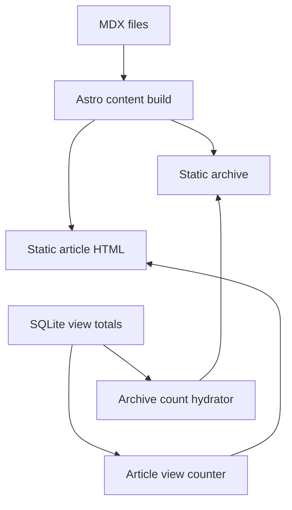
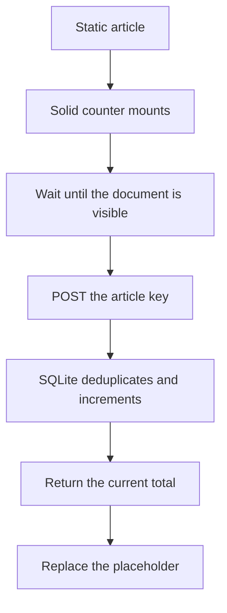
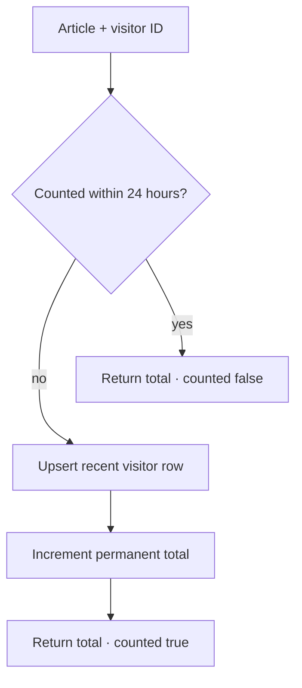

import { ViewCounterLab } from "@web/content/labs/view-counter-lab";

The [runtime telemetry post](/content/health-telemetry-from-the-real-runtime) ended with several kinds of data moving through the live server. The article you are reading takes the opposite path: its title, description, tags, date, body, and route all existed before the server started.

I wanted this blog to participate in the same live system without turning it into a dynamic publishing application. That led to a deliberately uneven split: Astro owns the complete article, while Elysia adds one narrow runtime value—how many deduplicated views each language version has received.



## Content is a build-time concern

[`web/content.config.ts`](https://github.com/ErickCReis/ErickCReis/blob/main/web/content.config.ts) defines one Astro content collection. A glob loader discovers Markdown and MDX files, and a schema requires a title, description, date, and optional list of non-empty tags.

```ts
const blog = defineCollection({
  loader: glob({
    base: "./web/content/blog",
    pattern: "**/*.{md,mdx}",
  }),
  schema: z.object({
    title: z.string(),
    description: z.string(),
    date: z.coerce.date(),
    tags: z.array(z.string().trim().min(1)).default([]),
  }),
});
```

A malformed article fails where it should: during the build. The archive can read typed frontmatter, sort by date, derive its tag filters, and generate links without querying the production server. The detail route asks Astro to render the selected MDX entry and places the resulting component inside the shared layout and typography styles.

MDX is useful here because an article can include the build-time Mermaid diagrams used throughout this series without giving up Markdown as the normal authoring format. It does not turn each article into a client application; the generated body is still HTML.

## A date is also a publication boundary

The `date` field serves two related jobs. It is displayed on the article, and it decides whether a production build may include that article.

[`web/lib/blog-publication.ts`](https://github.com/ErickCReis/ErickCReis/blob/main/web/lib/blog-publication.ts) compares the frontmatter date with the current calendar date in `America/Sao_Paulo`. The archive list and article static paths both filter through that rule. In local development they opt into scheduled entries, so future English and Portuguese files can be reviewed through their real routes.

This series uses that boundary directly: each remaining pair is dated on a Saturday. A production build before that Saturday omits the post from the archive, article routes, and generated sitemap. The output does not wake up and publish itself at midnight; a build made on or after the scheduled date is still required.

Scheduling therefore remains a static concern. There is no runtime draft query, publishing table, or administrator session.

## The dynamic requirement is one number

The archive initially renders a placeholder beside each post. After the page loads, a client-only Solid component sends one batch `GET /content/views` request for the listed entries and replaces the placeholders with totals. Reading the archive does not register an article view.

The article page uses a different island, [`PostViewCounter`](https://github.com/ErickCReis/ErickCReis/blob/main/web/islands/post-view-counter.tsx). When mounted, it sends `POST /content/views` for that article's view key and displays the returned total. If the document opened in a background tab, the island waits until the document becomes visible before sending. A browser preload should not look like a person reading a post.



If either request fails, the archive hides its count labels and the article removes its counter. The content, route, metadata, and navigation were never inside those islands, so the failure does not turn the post into an error page.

## The view key follows the content file

The public English and Portuguese routes share a readable slug, but their source files have different names: `post.mdx` and `post.pt-BR.mdx`. [`web/lib/blog.ts`](https://github.com/ErickCReis/ErickCReis/blob/main/web/lib/blog.ts) removes the locale suffix to create the public route and keeps the full source name as the view key.

As a result, `post` and `post.pt-BR` receive separate totals even though both language routes end in `/content/post`. The runtime API never needs to resolve a locale or inspect an MDX file; it receives the stable key the build selected.

The shared request schema allows letters, numbers, and a limited set of separators, caps a key at 160 characters, and limits batch reads to 100 keys. That validates the shape and size of public input. It does not currently verify that a key belongs to the built content collection, so a direct client could create a total for an invented but well-formed key. The UI only asks for real entries, but a generated allow-list would be a reasonable hardening step.

## Deduplicating without an account

The server assigns the first count request an opaque `ct_` visitor ID in a strict same-site, HTTP-only cookie. It is secure in production and expires after one year. JavaScript can make credentialed requests but cannot read or choose the cookie value.

Two SQLite tables serve different retention needs:

| Table                     | Purpose                     | Key                           |
| ------------------------- | --------------------------- | ----------------------------- |
| `blog_post_view_totals`   | Permanent aggregate count   | article view key              |
| `blog_post_view_visitors` | Recent deduplication record | article view key + visitor ID |

[`server/content/views.ts`](https://github.com/ErickCReis/ErickCReis/blob/main/server/content/views.ts) handles a write in one immediate transaction. It opportunistically deletes visitor rows older than 24 hours, checks the current article-and-visitor pair, and returns the existing total when that pair is still inside the window. Otherwise it upserts the visitor timestamp and atomically inserts or increments the aggregate total.



The immediate transaction prevents two concurrent requests from reading the same old state and both incrementing outside the intended sequence. It also keeps the visitor record and total update together.

The lab below makes that transaction visible. Read as browser A twice: the first request increments the total, while the second finds the active token and leaves it alone. Browser B has an independent token. You can also hide the tab to hold a read at the visibility gate, or advance the clock by 25 hours and make a browser eligible again. Notice that the MDX half never changes; only the runtime number and short-lived token set move.

<ViewCounterLab client:visible locale="en-US" />

The view tables do not store an IP address, user agent, account, or referrer. They do store the same opaque visitor ID beside each recently viewed article, which means views can be correlated during the deduplication window. Expired rows are pruned on a later write rather than by a dedicated cleanup job. This is a small counter, not anonymous analytics, and that distinction belongs in its privacy description.

## Static first, dynamic at the edge

Making the entire blog server-rendered would not simplify any of this. The content changes at deploy time; only the count changes between requests. Astro content collections give authoring, validation, localized variants, and static routes. Two small islands give the archive a batch read and the article an intentional write.

It is the same boundary I keep returning to on the homepage: the document exists without client state, and JavaScript enters where a live value adds something useful.

The next post follows the localized variants mentioned here. It explains the small build plugin and runtime that collect translation strings, generate catalogs, and make the same locale available to Astro pages and hydrated Solid islands.
