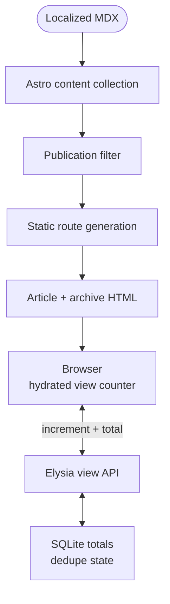

Astro validates and renders each article before deployment. The view count changes after deployment, so it needs a small live path through Solid, Elysia, and SQLite:


```mermaid center
flowchart TB
  MDX(["Localized MDX"]) --> Collection["Astro content collection"]
  Collection --> Filter["Publication filter"]
  Filter --> Paths["Static route generation"]
  Paths --> HTML["Article + archive HTML"]
  HTML --> Browser["Browser<br/>hydrated view counter"]
  Browser <-->|"increment + total"| API["Elysia view API"]
  API <--> SQLite["SQLite totals<br/>dedupe state"]
```

Astro handles content identity, locale selection, navigation, and publication. SQLite handles the counters. If the API fails, the article still renders.

## Compile the content contract before generating routes

Astro's collection schema is the first boundary. [`web/content.config.ts`](https://github.com/ErickCReis/ErickCReis/blob/main/web/content.config.ts) discovers both Markdown and MDX and converts `date` into a `Date` while validating every other frontmatter field:

```ts
const blog = defineCollection({
  loader: glob({
    base: "./web/content/blog",
    pattern: "**/*.{md,mdx}",
  }),
  schema: z.object({
    title: z.string(),
    description: z.string(),
    date: z.coerce.date(),
    tags: z.array(z.string().trim().min(1)).default([]),
  }),
});
```

Malformed frontmatter now fails the build instead of producing a partial page in production. The archive derives tag filters and sorts entries from typed data. The detail route calls `render(post)` and emits the MDX body as static HTML.

The schema does not require non-empty copy, constrain tag vocabulary, enforce unique dates, or verify locale pairs.

## Treat the source filename as content identity

The two localized files for one article are:

```text
the-blog-layer-static-pages-live-view-counts.mdx
the-blog-layer-static-pages-live-view-counts.pt-BR.mdx
```

[`web/lib/blog.ts`](https://github.com/ErickCReis/ErickCReis/blob/main/web/lib/blog.ts) derives two identities from those names:

```ts
export function getBlogSlug(entry: BlogEntry) {
  const sourceName = getSourceName(entry);

  for (const suffix of localeSuffixes) {
    if (sourceName.endsWith(suffix)) {
      return sourceName.slice(0, -suffix.length);
    }
  }

  return sourceName;
}

export function getBlogViewKey(entry: BlogEntry) {
  return getSourceName(entry);
}
```

The public slug removes a recognized non-default locale suffix, so both variants use the same route-shaped identifier. The view key keeps the full source name, which gives the English and Portuguese articles separate totals:

| Concern         | English                  | Portuguese                     |
| --------------- | ------------------------ | ------------------------------ |
| Source identity | `the-blog-layer-…`       | `the-blog-layer-….pt-BR`       |
| Public path     | `/blog/the-blog-layer-…` | `/pt-BR/blog/the-blog-layer-…` |
| Counter key     | `the-blog-layer-…`       | `the-blog-layer-….pt-BR`       |

Keeping the locale in the counter key prevents the two audiences from being merged without warning. Renaming a source file also creates a new counter identity. No alias or migration connects the old key to the new one.

Locale pairing is convention-based. For a requested locale, `getBlogEntry` first looks for `${slug}.${normalizedLocale}` and then falls back to the unsuffixed source:

```ts
return (
  visibleEntries.find((entry) => getSourceName(entry) === `${slug}.${normalizedLocale}`) ??
  visibleEntries.find((entry) => getSourceName(entry) === slug)
);
```

That fallback keeps the route available when a translation is missing. It can also make a Portuguese URL render English content when the `.pt-BR` file does not exist. The build does not report incomplete locale pairs.

## Generate only routes visible to that build

The detail page's `getStaticPaths` takes every visible logical slug and produces its Cartesian product with the configured locales:

```ts
const slugs = [...new Set(filterPublishedEntries(entries, options).map(getBlogSlug))];

return locales.flatMap((locale) =>
  slugs.map((slug) => ({
    params: {
      locale: locale === defaultLocale ? undefined : locale,
      slug,
    },
    props: { locale, slug },
  })),
);
```

The default locale omits the URL prefix. Other locales receive one through the optional catch-all route. The archive applies the same publication filter and selects at most one source per logical slug, preferring an exact localized source over the default fallback. Route generation, archive links, article navigation, and counter keys all use the same selection functions, so they cannot drift into slightly different identities.

Publication is a calendar comparison, not a timestamp comparison. [`web/lib/blog-publication.ts`](https://github.com/ErickCReis/ErickCReis/blob/main/web/lib/blog-publication.ts) reads the frontmatter date as a UTC calendar key and compares it with the current date in `America/Sao_Paulo`:

```ts
export function isBlogPostPublished(date: Date, now = new Date()) {
  return getScheduledDateKey(date) <= getPublicationDateKey(now);
}
```

Both the archive and detail route pass `includeScheduled: true` only in development. Production builds exclude future entries from the archive and from `getStaticPaths`; development builds expose them for review.

This schedule runs at build time. A build produced on August 21 does not reveal the article when São Paulo reaches August 22. A new build must run on or after the publication date. Once a route exists, changing the server clock does not remove it. The publication date is an input to the build.

## Hydrate the counters, not the document

The archive and article use different client behaviors.

The archive renders every title, description, date, tag, link, and a `-- views` placeholder into HTML. A `client:only="solid-js"` hydrator adds no DOM of its own. On mount, it finds every `[data-post-view-count]` span, sends one batch request for their keys, and replaces each placeholder:

```ts
void fetchPostViewCounts(props.slugs)
  .then((result) => {
    for (const placeholder of placeholders) {
      const slug = placeholder.dataset.postViewCount;
      if (!slug) continue;

      placeholder.textContent = formatViewCountLabel(result[slug] ?? 0);
    }
  })
  .catch(() => {
    for (const placeholder of placeholders) {
      placeholder.hidden = true;
      placeholder.textContent = "";
    }
  });
```

The article uses `PostViewCounter`, also as a client-only Solid island. It writes only after the document becomes visible. A background tab waits for `visibilitychange`, which cuts down counts from speculative navigation and tabs the reader never brings to the foreground.

Without JavaScript, the article remains readable and the archive keeps its placeholder. Failed archive reads hide the labels, and failed article writes hide the counter. An `isDisposed` guard prevents signal updates after unmount.

Unmounting does not abort the request, and visibility is only a rough signal that someone read the article. A foreground tab counts even if the visitor leaves immediately. A reader with JavaScript disabled never counts.

## Validate the API without relying on the UI

The browser and server share Valibot request schemas from [`shared/blog/views.ts`](https://github.com/ErickCReis/ErickCReis/blob/main/shared/blog/views.ts):

```ts
export const blogPostSlugSchema = v.pipe(
  v.string(),
  v.minLength(1),
  v.maxLength(160),
  v.regex(/^[A-Za-z0-9]+(?:[./_-][A-Za-z0-9]+)*$/),
);

export const blogPostQueryRequestSchema = v.object({
  slugs: v.pipe(v.array(blogPostSlugSchema), v.minLength(1), v.maxLength(100)),
});
```

`GET /blog/views` reads up to 100 keys in one query. `POST /blog/views` accepts one key and registers a view. Both responses set `cache-control: no-store`, and the client requests `cache: "no-store"` too. Neither the browser nor an intermediary cache should serve an old count.

The API validates key shape but does not verify that a key belongs to the built collection. Any caller can create rows for a well-formed invented key. There is also no rate limiter beyond per-cookie deduplication, so clients that discard cookies can inflate totals.

## Count one view in one transaction

The first `POST` assigns an opaque visitor ID matching `ct_[A-Za-z0-9_-]{21}`. Elysia stores it in a strict same-site, HTTP-only cookie with a one-year lifetime and enables `Secure` in production. Client JavaScript sends the cookie but cannot read or select its value.

SQLite stores four projections:

| Table                     | Primary key        | Retention and purpose        |
| ------------------------- | ------------------ | ---------------------------- |
| `blog_post_view_totals`   | `slug`             | Permanent total              |
| `blog_post_view_visitors` | `slug, visitor_id` | 24-hour dedupe state         |
| `blog_post_daily_views`   | `date, slug`       | Daily report aggregate       |
| `blog_post_weekly_views`  | `week_start, slug` | Sunday-to-Saturday aggregate |

`registerPostView` runs an immediate SQLite transaction. It calculates a 24-hour cutoff, removes stale visitor rows, and checks the current visitor-and-key pair. If the pair is still recent, it returns the existing total. Otherwise it upserts the dedupe row and increments the total, daily, and weekly projections:

```ts
tx.insert(blogPostViewTotals)
  .values({ slug, totalViews: 1, updatedAtMs: nowMs })
  .onConflictDoUpdate({
    target: blogPostViewTotals.slug,
    set: {
      totalViews: sql`${blogPostViewTotals.totalViews} + 1`,
      updatedAtMs: nowMs,
    },
  })
  .run();
```

The daily date and week start are calculated in the same São Paulo timezone used by reporting. At midnight, a cron job builds either the previous day's report or, on Sunday, the previous Sunday-to-Saturday weekly report. These report tables are denormalized at write time; reports do not scan visitor rows or reconstruct history from the permanent total.

`behavior: "immediate"` acquires SQLite's write reservation before the read-modify-write sequence. Two writers cannot both observe a missing dedupe row and increment the total independently. The four projections and the dedupe token commit together. An exception before commit rolls everything back, while a successful response contains the total selected inside the committed transaction.

The operation is atomic inside one SQLite database. It is not a distributed exactly-once protocol. Durability still depends on the database file and its storage configuration. Multiple application instances must share the same database with compatible locking. Independent SQLite files would produce different totals. Because cleanup happens during writes, expired visitor rows remain until a later write succeeds.

## Define what the number means

The displayed value counts accepted `(content key, visitor cookie, 24-hour window)` writes committed to this database. It does not represent unique people or sessions.

That definition exposes the system's limits:

- Clearing or blocking the cookie creates a new visitor identity.
- Several people sharing one browser profile are deduplicated together.
- One person using multiple browsers or devices is counted multiple times.
- View totals split when a localized source or filename uses a different key.
- The visitor table permits short-term cross-article correlation through the same opaque ID, even though it stores no IP address, account, referrer, or user agent.
