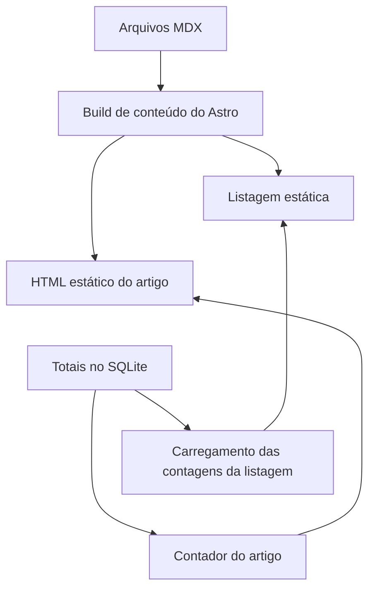
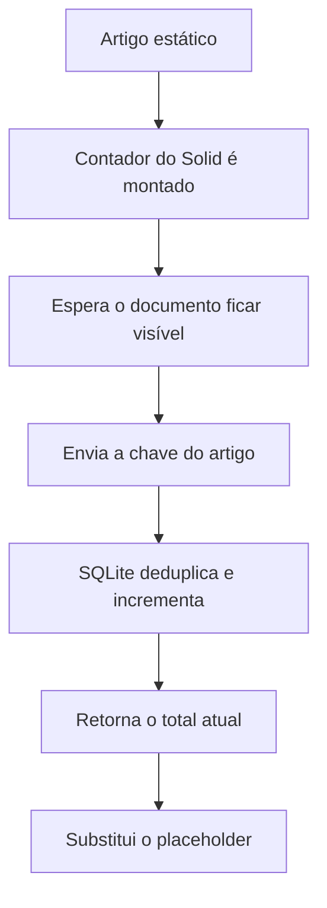
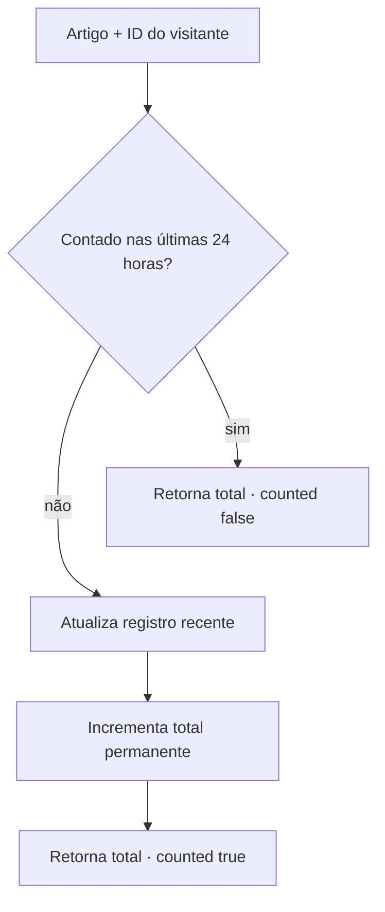

import { ViewCounterLab } from "@web/content/labs/view-counter-lab";

O [post sobre a telemetria do runtime](/pt-BR/content/health-telemetry-from-the-real-runtime) terminou com vários tipos de dados atravessando o servidor dinâmico. O artigo que você está lendo segue o caminho oposto: título, descrição, tags, data, corpo e rota já existiam antes de o servidor iniciar.

Eu queria que este blog participasse do mesmo sistema dinâmico sem se transformar em uma aplicação de publicação dinâmica. Isso levou a uma divisão intencionalmente desigual: o Astro cuida do artigo completo, enquanto o Elysia acrescenta um único valor de runtime — quantas visualizações deduplicadas cada versão de idioma recebeu.



## O conteúdo pertence ao build

O arquivo [`web/content.config.ts`](https://github.com/ErickCReis/ErickCReis/blob/main/web/content.config.ts) define uma coleção de conteúdo do Astro. Um glob loader encontra os arquivos Markdown e MDX, e um schema exige título, descrição, data e uma lista opcional de tags não vazias.

```ts
const blog = defineCollection({
  loader: glob({
    base: "./web/content/blog",
    pattern: "**/*.{md,mdx}",
  }),
  schema: z.object({
    title: z.string(),
    description: z.string(),
    date: z.coerce.date(),
    tags: z.array(z.string().trim().min(1)).default([]),
  }),
});
```

Um artigo malformado falha no lugar certo: durante o build. A página de listagem pode ler o frontmatter tipado, ordenar os posts por data, derivar seus filtros de tags e gerar links sem consultar o servidor de produção. A rota de detalhes pede ao Astro que renderize a entrada MDX escolhida e coloca o componente resultante dentro do layout compartilhado e dos estilos tipográficos.

O MDX é útil porque um artigo pode incluir os diagramas Mermaid gerados durante o build e usados ao longo desta série sem abandonar o Markdown como formato normal de escrita. Isso não transforma cada artigo em uma aplicação no cliente; o corpo gerado continua sendo HTML.

## A data também é uma fronteira de publicação

O campo `date` tem duas funções relacionadas. Ele aparece no artigo e decide se um build de produção pode incluir aquele conteúdo.

O arquivo [`web/lib/blog-publication.ts`](https://github.com/ErickCReis/ErickCReis/blob/main/web/lib/blog-publication.ts) compara a data do frontmatter com a data atual em `America/Sao_Paulo`. A listagem e as rotas estáticas dos artigos passam por essa regra. No desenvolvimento local, elas incluem as entradas agendadas, permitindo revisar os futuros arquivos em inglês e português por meio de suas rotas reais.

Esta série usa essa fronteira diretamente: cada par restante recebe a data de um sábado. Um build de produção feito antes desse sábado deixa o post fora da listagem, das rotas dos artigos e do sitemap gerado. A saída não acorda e publica o post sozinha à meia-noite; ainda é necessário fazer um build na data agendada ou depois dela.

O agendamento, portanto, continua sendo uma responsabilidade estática. Não há consulta de rascunhos em runtime, tabela de publicação nem sessão de administrador.

## O requisito dinâmico é um número

A listagem do blog renderiza inicialmente um placeholder ao lado de cada post. Depois que a página carrega, um componente do Solid executado apenas no cliente envia uma única requisição em lote para `GET /content/views` com as entradas listadas e substitui os placeholders pelos totais. Abrir a listagem não registra uma visualização de artigo.

A página do artigo usa outra ilha, [`PostViewCounter`](https://github.com/ErickCReis/ErickCReis/blob/main/web/islands/post-view-counter.tsx). Ao ser montada, ela envia `POST /content/views` com a chave daquele artigo e exibe o total retornado. Se o documento for aberto em uma aba em segundo plano, a ilha espera até que ele fique visível. O pré-carregamento do navegador não deve parecer uma pessoa lendo um post.



Se qualquer requisição falhar, a listagem esconde os rótulos de contagem, e o artigo remove seu contador. Conteúdo, rota, metadados e navegação nunca estiveram dentro dessas ilhas, portanto a falha não transforma o post em uma página de erro.

## A chave de visualização acompanha o arquivo

As rotas públicas em inglês e português compartilham um slug legível, mas seus arquivos de origem têm nomes diferentes: `post.mdx` e `post.pt-BR.mdx`. O arquivo [`web/lib/blog.ts`](https://github.com/ErickCReis/ErickCReis/blob/main/web/lib/blog.ts) remove o sufixo do idioma para criar a rota pública e mantém o nome completo do arquivo como chave de visualização.

Assim, `post` e `post.pt-BR` recebem totais separados, mesmo que as duas rotas de idioma terminem em `/content/post`. A API de runtime nunca precisa resolver um idioma nem inspecionar um arquivo MDX; ela recebe a chave estável escolhida no build.

O schema compartilhado das requisições permite letras, números e um conjunto limitado de separadores, restringe a chave a 160 caracteres e limita leituras em lote a 100 chaves. Isso valida o formato e o tamanho da entrada pública. Hoje, ele não verifica se uma chave pertence à coleção gerada, então um cliente direto poderia criar um total para uma chave inventada, mas bem formada. A interface pede apenas entradas reais, porém uma lista de permissões gerada seria uma melhoria razoável.

## Deduplicando sem uma conta

O servidor atribui à primeira requisição de contagem um ID opaco de visitante com prefixo `ct_`, armazenado em um cookie HTTP-only com `same-site` estrito. O cookie é seguro em produção e vence depois de um ano. O JavaScript pode fazer requisições com as credenciais, mas não consegue ler nem escolher o valor do cookie.

Duas tabelas do SQLite atendem a necessidades diferentes de retenção:

| Tabela                    | Finalidade                         | Chave                             |
| ------------------------- | ---------------------------------- | --------------------------------- |
| `blog_post_view_totals`   | Contagem agregada permanente       | chave do artigo                   |
| `blog_post_view_visitors` | Registro recente para deduplicação | chave do artigo + ID do visitante |

O arquivo [`server/content/views.ts`](https://github.com/ErickCReis/ErickCReis/blob/main/server/content/views.ts) trata uma gravação dentro de uma única transação imediata. Ele remove de forma oportunista os registros de visitantes com mais de 24 horas, consulta o par atual de artigo e visitante e retorna o total existente quando o par ainda está dentro da janela. Caso contrário, atualiza o timestamp do visitante e insere ou incrementa atomicamente o total agregado.



A transação imediata impede que duas requisições simultâneas leiam o mesmo estado antigo e façam dois incrementos fora da sequência desejada. Ela também mantém o registro do visitante e a atualização do total juntos.

O laboratório abaixo torna essa transação visível. Simule duas leituras do navegador A: a primeira requisição incrementa o total, enquanto a segunda encontra o token ativo e não o altera. O navegador B tem um token independente. Você também pode ocultar a aba para reter uma leitura no controle de visibilidade ou avançar o relógio em 25 horas e tornar um navegador elegível novamente. Note que o conteúdo em MDX nunca muda; apenas o número em runtime e o conjunto de tokens temporários se movimentam.

<ViewCounterLab client:load locale="pt-BR" />

As tabelas de visualizações não armazenam endereço IP, user agent, conta nem referer. Elas armazenam o mesmo ID opaco de visitante ao lado de cada artigo visto recentemente, o que permite correlacionar as visualizações durante a janela de deduplicação. Registros vencidos são removidos em uma gravação posterior, não por uma tarefa exclusiva de limpeza. Este é um pequeno contador, não uma ferramenta de análise anônima, e essa distinção faz parte da sua descrição de privacidade.

## Estático primeiro, dinâmico na borda

Tornar o blog inteiro renderizado pelo servidor não simplificaria nada disso. O conteúdo muda no deploy; apenas a contagem muda entre requisições. As coleções do Astro oferecem autoria, validação, variantes localizadas e rotas estáticas. Duas pequenas ilhas dão à listagem uma leitura em lote e ao artigo uma gravação intencional.

É a mesma fronteira à qual continuo voltando na página inicial: o documento existe sem estado no cliente, e o JavaScript entra onde um valor dinâmico acrescenta algo útil.

O próximo post acompanha as variantes localizadas mencionadas aqui. Ele explica o pequeno plugin de build e o runtime que coletam strings de tradução, geram catálogos e disponibilizam o mesmo idioma para páginas do Astro e ilhas hidratadas do Solid.
