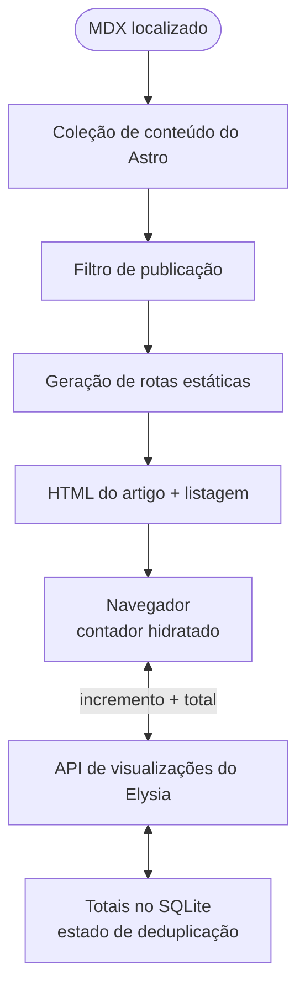

O Astro valida e renderiza cada artigo antes do deploy. A contagem de visualizações muda depois, por isso precisa de um pequeno caminho dinâmico por Solid, Elysia e SQLite:


```mermaid center
flowchart TB
  MDX(["MDX localizado"]) --> Collection["Coleção de conteúdo do Astro"]
  Collection --> Filter["Filtro de publicação"]
  Filter --> Paths["Geração de rotas estáticas"]
  Paths --> HTML["HTML do artigo + listagem"]
  HTML --> Browser["Navegador<br/>contador hidratado"]
  Browser <-->|"incremento + total"| API["API de visualizações do Elysia"]
  API <--> SQLite["Totais no SQLite<br/>estado de deduplicação"]
```

O Astro cuida da identidade do conteúdo, do idioma, da navegação e da publicação. O SQLite cuida dos contadores. Se a API falhar, o artigo ainda renderiza.

## Compile o contrato de conteúdo antes de gerar rotas

O schema da coleção do Astro é a primeira fronteira. O arquivo [`web/content.config.ts`](https://github.com/ErickCReis/ErickCReis/blob/main/web/content.config.ts) encontra Markdown e MDX, converte `date` em um `Date` e valida todos os outros campos do frontmatter:

```ts
const blog = defineCollection({
  loader: glob({
    base: "./web/content/blog",
    pattern: "**/*.{md,mdx}",
  }),
  schema: z.object({
    title: z.string(),
    description: z.string(),
    date: z.coerce.date(),
    tags: z.array(z.string().trim().min(1)).default([]),
  }),
});
```

Um frontmatter malformado agora interrompe o build, em vez de produzir uma página parcial em produção. A listagem deriva filtros de tags e ordena entradas a partir de dados tipados. A rota de detalhes executa `render(post)` e emite o corpo em MDX como HTML estático.

O schema não exige textos não vazios, não limita o vocabulário de tags, não impõe datas únicas e não verifica pares de idiomas.

## Use o nome do arquivo como identidade do conteúdo

Os dois arquivos localizados deste artigo são:

```text
the-blog-layer-static-pages-live-view-counts.mdx
the-blog-layer-static-pages-live-view-counts.pt-BR.mdx
```

O arquivo [`web/lib/blog.ts`](https://github.com/ErickCReis/ErickCReis/blob/main/web/lib/blog.ts) deriva duas identidades desses nomes:

```ts
export function getBlogSlug(entry: BlogEntry) {
  const sourceName = getSourceName(entry);

  for (const suffix of localeSuffixes) {
    if (sourceName.endsWith(suffix)) {
      return sourceName.slice(0, -suffix.length);
    }
  }

  return sourceName;
}

export function getBlogViewKey(entry: BlogEntry) {
  return getSourceName(entry);
}
```

O slug público remove o sufixo reconhecido de um idioma não padrão, portanto as duas variantes usam o mesmo identificador de rota. A chave de visualização mantém o nome completo da fonte, o que dá totais separados aos artigos em inglês e português:

| Responsabilidade | Inglês | Português |
| --- | --- | --- |
| Identidade da fonte | `the-blog-layer-…` | `the-blog-layer-….pt-BR` |
| Caminho público | `/blog/the-blog-layer-…` | `/pt-BR/blog/the-blog-layer-…` |
| Chave do contador | `the-blog-layer-…` | `the-blog-layer-….pt-BR` |

Manter o idioma na chave do contador impede que os dois públicos sejam combinados sem aviso. Renomear um arquivo também cria uma nova identidade de contador. Nenhum alias ou migração liga a chave antiga à nova.

O pareamento de idiomas depende de convenção. Para o idioma solicitado, `getBlogEntry` procura primeiro `${slug}.${normalizedLocale}` e depois usa a fonte sem sufixo como fallback:

```ts
return (
  visibleEntries.find((entry) => getSourceName(entry) === `${slug}.${normalizedLocale}`) ??
  visibleEntries.find((entry) => getSourceName(entry) === slug)
);
```

Esse fallback mantém a rota disponível quando falta uma tradução. Também pode fazer uma URL em português renderizar conteúdo em inglês quando o arquivo `.pt-BR` não existe. O build não sinaliza pares de idiomas incompletos.

## Gere apenas as rotas visíveis para aquele build

O `getStaticPaths` da página de detalhes produz o produto cartesiano entre cada slug lógico visível e os idiomas configurados:

```ts
const slugs = [...new Set(filterPublishedEntries(entries, options).map(getBlogSlug))];

return locales.flatMap((locale) =>
  slugs.map((slug) => ({
    params: {
      locale: locale === defaultLocale ? undefined : locale,
      slug,
    },
    props: { locale, slug },
  })),
);
```

O idioma padrão não recebe prefixo na URL. Os demais recebem um prefixo pela rota catch-all opcional. A listagem aplica o mesmo filtro de publicação e seleciona no máximo uma fonte por slug lógico, preferindo a fonte correspondente ao idioma em vez do fallback padrão. Geração de rotas, links da listagem, navegação entre artigos e chaves dos contadores usam as mesmas funções de seleção, então não acabam com identidades ligeiramente diferentes.

A publicação é uma comparação de datas de calendário, não de instantes. O arquivo [`web/lib/blog-publication.ts`](https://github.com/ErickCReis/ErickCReis/blob/main/web/lib/blog-publication.ts) lê a data do frontmatter como uma chave de calendário em UTC e a compara com a data atual em `America/Sao_Paulo`:

```ts
export function isBlogPostPublished(date: Date, now = new Date()) {
  return getScheduledDateKey(date) <= getPublicationDateKey(now);
}
```

A listagem e a rota de detalhes passam `includeScheduled: true` apenas em desenvolvimento. Builds de produção excluem entradas futuras da listagem e de `getStaticPaths`; builds de desenvolvimento as expõem para revisão.

Esse agendamento acontece no build. Um build produzido em 21 de agosto não revela o artigo quando São Paulo chega a 22 de agosto. É necessário executar outro build na data de publicação ou depois dela. Depois que a rota existe, mudar o relógio do servidor não a remove. A data de publicação é uma entrada do build.

## Hidrate os contadores, não o documento

A listagem e o artigo usam comportamentos de cliente diferentes.

A listagem renderiza no HTML todos os títulos, descrições, datas, tags, links e um placeholder `-- views`. Um hidratador com `client:only="solid-js"` não acrescenta DOM próprio. Ao montar, ele encontra todos os elementos `[data-post-view-count]`, faz uma única requisição em lote para suas chaves e substitui cada placeholder:

```ts
void fetchPostViewCounts(props.slugs)
  .then((result) => {
    for (const placeholder of placeholders) {
      const slug = placeholder.dataset.postViewCount;
      if (!slug) continue;

      placeholder.textContent = formatViewCountLabel(result[slug] ?? 0);
    }
  })
  .catch(() => {
    for (const placeholder of placeholders) {
      placeholder.hidden = true;
      placeholder.textContent = "";
    }
  });
```

O artigo usa `PostViewCounter`, também como uma ilha Solid executada apenas no cliente. Ele grava somente depois que o documento fica visível. Uma aba em segundo plano espera pelo evento `visibilitychange`, o que reduz contagens por navegação especulativa e por abas que o leitor nunca traz para o primeiro plano.

Sem JavaScript, o artigo continua legível e a listagem mantém seu placeholder. Falhas na leitura da listagem ocultam os rótulos, e falhas na gravação do artigo ocultam o contador. Um controle `isDisposed` impede atualizações depois da desmontagem.

A desmontagem não cancela a requisição, e a visibilidade é apenas um sinal aproximado de leitura. Uma aba em primeiro plano conta mesmo se o visitante sair imediatamente. Um leitor sem JavaScript nunca conta.

## Valide a API sem depender da interface

Navegador e servidor compartilham schemas Valibot de [`shared/blog/views.ts`](https://github.com/ErickCReis/ErickCReis/blob/main/shared/blog/views.ts):

```ts
export const blogPostSlugSchema = v.pipe(
  v.string(),
  v.minLength(1),
  v.maxLength(160),
  v.regex(/^[A-Za-z0-9]+(?:[./_-][A-Za-z0-9]+)*$/),
);

export const blogPostQueryRequestSchema = v.object({
  slugs: v.pipe(v.array(blogPostSlugSchema), v.minLength(1), v.maxLength(100)),
});
```

`GET /blog/views` lê até 100 chaves em uma consulta. `POST /blog/views` recebe uma chave e registra uma visualização. As duas respostas definem `cache-control: no-store`, e o cliente também solicita `cache: "no-store"`. Nem o navegador nem um cache intermediário devem servir uma contagem antiga.

A API valida o formato da chave, mas não verifica se ela pertence à coleção compilada. Qualquer cliente pode criar linhas para uma chave inventada e bem-formada. Também não há rate limiter além da deduplicação por cookie, então clientes que descartam cookies podem inflar os totais.

## Conte uma visualização em uma única transação

O primeiro `POST` atribui um ID opaco de visitante compatível com `ct_[A-Za-z0-9_-]{21}`. O Elysia o armazena por um ano em um cookie `HttpOnly` com `SameSite=Strict` e ativa `Secure` em produção. O JavaScript do cliente envia o cookie, mas não pode ler nem escolher seu valor.

O SQLite mantém quatro projeções:

| Tabela | Chave primária | Retenção e finalidade |
| --- | --- | --- |
| `blog_post_view_totals` | `slug` | Total permanente |
| `blog_post_view_visitors` | `slug, visitor_id` | Estado de deduplicação por 24 horas |
| `blog_post_daily_views` | `date, slug` | Agregado para relatório diário |
| `blog_post_weekly_views` | `week_start, slug` | Agregado de domingo a sábado |

`registerPostView` executa uma transação imediata do SQLite. Ele calcula o limite de 24 horas, remove registros de visitantes vencidos e consulta o par atual de visitante e chave. Se o par ainda for recente, devolve o total existente. Caso contrário, atualiza o registro de deduplicação e incrementa as projeções total, diária e semanal:

```ts
tx.insert(blogPostViewTotals)
  .values({ slug, totalViews: 1, updatedAtMs: nowMs })
  .onConflictDoUpdate({
    target: blogPostViewTotals.slug,
    set: {
      totalViews: sql`${blogPostViewTotals.totalViews} + 1`,
      updatedAtMs: nowMs,
    },
  })
  .run();
```

A data diária e o início da semana são calculados no mesmo fuso de São Paulo usado pelos relatórios. À meia-noite, um cron cria o relatório do dia anterior ou, aos domingos, o relatório da semana anterior de domingo a sábado. Essas tabelas de relatório são desnormalizadas no momento da escrita; os relatórios não percorrem registros de visitantes nem reconstroem o histórico a partir do total permanente.

`behavior: "immediate"` adquire o bloqueio reservado de escrita do SQLite antes da sequência de leitura, modificação e escrita. Dois escritores não conseguem observar ao mesmo tempo a ausência do registro de deduplicação e incrementar o total de forma independente. As quatro projeções e o token de deduplicação recebem commit juntos. Uma exceção antes do commit desfaz tudo, enquanto uma resposta bem-sucedida contém o total consultado dentro da transação confirmada.

A operação é atômica dentro de um banco SQLite. Ela não é um protocolo distribuído exactly-once. A durabilidade ainda depende do arquivo do banco e de sua configuração de armazenamento. Múltiplas instâncias da aplicação precisam compartilhar o mesmo banco com bloqueios compatíveis. Arquivos SQLite independentes produziriam totais diferentes. Como a limpeza acontece durante as gravações, registros de visitantes vencidos permanecem até que uma gravação posterior tenha sucesso.

## Defina o que o número significa

O valor exibido conta gravações aceitas de `(chave do conteúdo, cookie do visitante, janela de 24 horas)` cujo commit foi confirmado neste banco. Ele não representa pessoas únicas nem sessões.

Essa definição expõe os limites do sistema:

- Limpar ou bloquear o cookie cria uma nova identidade de visitante.
- Várias pessoas usando o mesmo perfil de navegador são deduplicadas juntas.
- Uma pessoa em múltiplos navegadores ou dispositivos é contada mais de uma vez.
- Os totais se dividem quando uma fonte localizada ou um nome de arquivo usa outra chave.
- A tabela de visitantes permite correlação de curto prazo entre artigos por meio do mesmo ID opaco, mesmo sem armazenar endereço IP, conta, `Referer` ou `User-Agent`.
