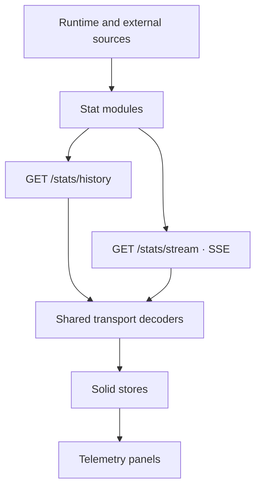

import { StatsPipelineLab } from "@web/content/labs/stats-pipeline-lab";

The [Spotify and GitHub panels](/content/personal-telemetry-from-spotify-and-github) have different credentials, polling intervals, cache policies, and empty states. Their components do not know any of that.

That is the job of the stats pipeline.

The hard part was not finding one more timer. It was letting every source keep its own clock while giving the browser one place to bootstrap, listen, and decode. I wanted the panels to feel coordinated without making their collectors pretend to work at the same pace.

The homepage currently combines system resources, external uptime, visitor presence, Spotify playback, GitHub contributions, and agent token usage. Some sources change every few seconds; others change every 30 minutes or only when another process syncs them. The interface needs an initial chart for each one and new snapshots after it starts, without six independent networking implementations.

The resulting path has four layers: collectors on the server, an initial history response, a shared server-sent event stream, and small Solid stores.



## A narrow collector interface

Every source implements the same small [`StatModule`](https://github.com/ErickCReis/ErickCReis/blob/main/server/stats/types.ts) shape:

```ts
type StatModule<T> = {
  start: (...args: any[]) => void;
  getLatest: () => T;
  getHistory: () => T[];
  getVersion: () => number;
};
```

`start` belongs to the source. The system module can sample frequently, Spotify can switch intervals based on playback, GitHub can wait 30 minutes, and token usage can wait for an internal sync. The common pipeline does not impose one global timer on them.

The other three operations expose a snapshot of each module's state. `getLatest` supplies the complete current value. `getHistory` supplies the recent samples available to a new browser. `getVersion` is a monotonically increasing change marker; the streaming route can ask whether something changed without comparing large objects or understanding their timestamps.

This is intentionally not a generic event framework. Each module still owns its state, retention limit, persistence choices, and source-specific errors. The interface only defines what the delivery layer needs.

The application starts the modules once, after Elysia begins listening. They keep collecting even when nobody has the homepage open. That makes a new visitor a reader of current server state rather than the trigger for six upstream requests.

## History and “now” are different payloads

A chart needs recent context, but a live event needs the full current state. Sending the full snapshot for every historical point would repeat fields the chart never reads.

[`server/stats/history.ts`](https://github.com/ErickCReis/ErickCReis/blob/main/server/stats/history.ts) deliberately projects smaller history records. System history keeps a timestamp, CPU usage, and memory usage; the latest system snapshot also includes memory totals, CPU count, and battery state. Spotify history keeps enough information to find the previous track, while its latest snapshot also carries the album, link, progress, and duration.

`GET /stats/history` returns both forms for all modules and uses `Cache-Control: no-store`. The response is a bootstrap snapshot of process state, not a static asset whose freshness can be delegated to an intermediary cache.

In the browser, the live overlay starts this request and the stream subscription together. When history arrives, each store merges its points by timestamp, sorts them, and retains its configured window. Stream events arriving around the same time use the same store instead of a second state tree.

## Why SSE fits this direction

Cursor presence needed a WebSocket because the browser sends positions and receives positions. Telemetry only flows from the server to the browser after the initial request, which makes [server-sent events](https://html.spec.whatwg.org/multipage/server-sent-events.html) the smaller protocol for this job.

The Elysia route in [`server/stats/routes.ts`](https://github.com/ErickCReis/ErickCReis/blob/main/server/stats/routes.ts) keeps a `lastSeen` version map for each connected response. Every 500 milliseconds it walks the six modules. When a module's version is greater than the version seen by that response, the route serializes the latest snapshot and yields one named SSE event.

```ts
for (const { name, mod } of statModules) {
  const version = mod.getVersion();
  if (version > (lastSeen.get(name) ?? 0)) {
    lastSeen.set(name, version);
    const payload = serializeStatsStreamEvent(name, mod.getLatest());
    yield sse({ event: payload.e, data: payload.d });
  }
}
```

The 500-millisecond loop does not make slow sources poll faster. It only notices their versions. It also coalesces multiple source changes that happen between checks into the newest snapshot, which is appropriate for a live dashboard: the browser needs the current value, not an audit log of every intermediate mutation.

The version check is easiest to see as a gate. In the lab below, change the same collector more than once before inspecting the versions: its counter advances each time, but the stream emits one event containing only the newest snapshot. Opening a new SSE connection sends every current snapshot because that response starts with no versions in `lastSeen`.

<StatsPipelineLab client:load locale="en-US" />

If the stream ends, the client waits one second and subscribes again while the island is mounted. An `AbortController` ends that loop when Astro navigation removes the overlay. The next SSE response has a fresh `lastSeen` map, so it emits the current versions again without a resume-token protocol.

## Compact on the wire, named in the application

The domain objects use descriptive fields. Repeating those names across every sample in a history response adds bytes without adding information, so the shared transport maps them to tuples and short event codes.

A WebSocket-presence snapshot, for example, changes from a named object into a positional array:

```text
Application: { timestamp, connectedUsers, maxConcurrentUsers, connectionStartedAt }
Wire event "ws": [timestamp, connectedUsers, maxConcurrentUsers, connectionStartedAt]
```

History can be smaller again: `[timestamp, connectedUsers]`. At the outer level, `system`, `server`, `websocket`, `spotify`, `github`, and `tokenUsage` become `sy`, `sr`, `ws`, `sp`, `gh`, and `tu`.

This is a tradeoff, not free compression. A tuple is not self-describing, and changing its field order requires both ends to change together. [`shared/stats/transport.ts`](https://github.com/ErickCReis/ErickCReis/blob/main/shared/stats/transport.ts) and the source-specific `*.transport.ts` files make that coupling explicit: every wire type has a serializer and deserializer next to it. The rest of the application continues to use named objects.

I would not start with tuple serialization for an API maintained by unrelated clients. Here, one repository builds both ends, the stream is repetitive, and the boundary is small enough to inspect. Those constraints make the compromise reasonable.

## Stores keep panels local

[`web/stats/history.ts`](https://github.com/ErickCReis/ErickCReis/blob/main/web/stats/history.ts) decodes the bootstrap response and hands each pair of `history` and `latest` values to its store. [`web/stats/stream.ts`](https://github.com/ErickCReis/ErickCReis/blob/main/web/stats/stream.ts) decodes each event code and dispatches the full snapshot to the same store.

A store only knows two operations: merge initial history and push a new sample. It also reduces a full new snapshot to the fields useful as a history point and caps the array, usually at 84 items. The panel reads reactive signals such as `latest()` and `history()` and turns them into labels, progress bars, or charts.

Adding a stat is not automatic. It still needs a source module, domain and transport types, registration in the routes, history projection, a client store, stream dispatch, and a panel. That repetition is visible, but it is also auditable. Each new source crosses the same explicit boundaries rather than disappearing behind a framework with more flexibility than this site needs.

The pipeline lets every source keep its own clock while the page sees one coherent live layer. The next post moves below the API routes and explains how the same Bun process also serves Astro's static output as the production site.
