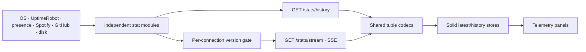

A telemetry dashboard has to reconcile sources with incompatible update models. CPU is sampled every 1.5 seconds, Spotify switches between active and idle polling, GitHub is rate-limited, and another process writes token usage. Each collector keeps its own polling, retry, cache, and retention policy. The delivery layer reads their snapshots through one browser-facing contract.


```mermaid center
flowchart LR
  Sources["OS · UptimeRobot · presence · Spotify · GitHub · disk"] --> Collectors["Independent stat modules"]
  Collectors --> History["GET /stats/history"]
  Collectors --> Gate["Per-connection version gate"]
  Gate --> SSE["GET /stats/stream · SSE"]
  History --> Codec["Shared tuple codecs"]
  SSE --> Codec
  Codec --> Stores["Solid latest/history stores"]
  Stores --> Panels["Telemetry panels"]
```

## The collector boundary is a read model

Every source implements the same [`StatModule`](https://github.com/ErickCReis/ErickCReis/blob/main/server/stats/types.ts) contract:

```ts
type StatModule<T> = {
  start: (...args: any[]) => void;
  getLatest: () => T;
  getHistory: () => T[];
  getVersion: () => number;
};
```

Polling intervals, errors, persistence, and subscriptions stay inside each collector:

| Module | Acquisition policy | Server retention |
| --- | --- | ---: |
| system | sample process/cgroup resources every 1.5 s | 84 snapshots |
| websocket | sample every 5 s and update on presence changes | 84 snapshots |
| Spotify | poll every 2.5 s while playing, otherwise every 15 s | 84 snapshots |
| GitHub | poll every 30 min, with rate-limit-aware delay and a disk cache | 84 snapshots |
| server uptime | poll every 5 min, or retry after 1 min following a failed cycle | 10 snapshots |
| token usage | inspect the persisted aggregate every 30 s | 30 snapshots |

`startStatsServices()` starts each module after Elysia is listening. The modules run independently of browser connections, so opening the page reads already-collected process state instead of triggering six upstream operations.

`getVersion()` returns an in-memory dirty counter. Each module increments it when publishing a snapshot; only the SSE route reads it.

For example, the system collector publishes a sample and advances its version in the same tick:

```ts
const tick = () => {
  latest = sample();
  history.push(latest);
  if (history.length > MAX_HISTORY) history.shift();
  version++;
};
```

That ordering is the module's publication boundary. JavaScript's run-to-completion semantics ensure the route cannot observe the increment halfway through the synchronous update.

## Project bootstrap history for charts

A newly mounted panel needs context for a chart and a complete current value for labels and details. Those are separate data shapes.

[`buildStatsHistoryResponse()`](https://github.com/ErickCReis/ErickCReis/blob/main/server/stats/history.ts) returns `{ latest, history }` for every module, but projects each historical sample down to chart-relevant fields:

```ts
system: {
  latest: systemStat.getLatest(),
  history: systemStat.getHistory().map((sample) => ({
    timestamp: sample.timestamp,
    cpuUsagePercent: sample.cpuUsagePercent,
    systemMemoryUsedPercent: sample.systemMemoryUsedPercent,
  })),
},
```

The full system snapshot also contains used and total memory, CPU count, and battery data. Repeating those fields across 84 points would not improve its two-series chart. The same rule applies to Spotify: historical points retain track identity so the UI can derive the previous track, while only `latest` carries progress, duration, album, and URL.

`GET /stats/history` is marked `Cache-Control: no-store`. This endpoint reflects mutable in-process state; an intermediary cache would create a second, uncontrolled freshness policy.

Most history arrays live in memory, have fixed limits, and reset with the process. Presence restores a bounded persisted series, and GitHub can restore a fresh cache. Neither turns the pipeline into an event log.

## One stream, six independent clocks

The live route does not subscribe to source-specific emitters. Each SSE response owns a `lastSeen` map and scans module versions every 500 milliseconds:

```ts
const lastSeen = new Map<string, number>();

while (true) {
  for (const { name, mod } of statModules) {
    const version = mod.getVersion();
    if (version > (lastSeen.get(name) ?? 0)) {
      lastSeen.set(name, version);
      const payload = serializeStatsStreamEvent(name, mod.getLatest());
      yield sse({ event: payload.e, data: payload.d });
    }
  }
  await Bun.sleep(SSE_POLL_INTERVAL_MS);
}
```

The 500 ms interval is a delivery scan, not a collection interval. A GitHub collector still waits 30 minutes; the route merely notices its next publication within at most one scan period.

The version gate intentionally coalesces. If Spotify publishes versions 41, 42, and 43 before the route checks it, the response emits one event containing the snapshot at version 43. This gives the pipeline **latest-state semantics**:

```text
collector transitions: v41 → v42 → v43
stream observation:                 v43
```

That is appropriate for gauges and “now playing,” but not for billing, auditing, or any domain where every transition matters. Those systems need a durable log, sequence identifiers, and resumable consumers.

Because `lastSeen` belongs to one response, a fresh connection starts with no observed versions. Every initialized module whose version is greater than zero emits its current snapshot. A module still at version zero is supplied by `/stats/history` and will enter the stream after its first publication.

## Tuple codecs define the wire protocol

Application code uses named objects. The wire protocol uses short outer keys and positional tuples to avoid repeating property names across history arrays and frequent events.

The aggregate history response is structurally:

```ts
type StatsHistoryItemWire<L, H> = { l: L; h: H[] };

type StatsHistoryResponseWire = {
  sy: StatsHistoryItemWire<SystemStatTuple, SystemHistoryPointTuple>;
  sr: StatsHistoryItemWire<ServerInfoStatTuple, ServerHistoryPointTuple>;
  ws: StatsHistoryItemWire<WebSocketStatTuple, WebSocketHistoryPointTuple>;
  sp: StatsHistoryItemWire<SpotifyNowPlayingTuple, SpotifyHistoryPointTuple>;
  gh: StatsHistoryItemWire<GitHubCommitStatsTuple, GitHubHistoryPointTuple>;
  tu: StatsHistoryItemWire<TokenUsageSnapshotTuple, TokenUsageHistoryPointTuple>;
};
```

A presence snapshot illustrates the compression:

```text
domain: { timestamp, connectedUsers, maxConcurrentUsers, connectionStartedAt }
wire:   [timestamp, connectedUsers, maxConcurrentUsers, connectionStartedAt]
history point: [timestamp, connectedUsers]
event code: "ws"
```

Serializers run in the server and deserializers restore domain objects in the browser. Keeping both in `shared/stats/*.transport.ts` makes tuple order an explicit, reviewable contract.

Tuples are compact but not self-describing. Reordering one field breaks the protocol, and the decoder converts positions without schema validation. It catches conversion errors, but structurally plausible invalid values can still pass through.

## Browser stores reconcile bootstrap and live samples

The Solid island starts both paths on mount:

```ts
void fetchStatsHistory();
void subscribeStatsStream(controller.signal);
```

The history client decodes the aggregate payload and calls `loadHistory()` on each source store. The stream client decodes a named event and calls that same store's `pushSample()`. A typical store merges history by timestamp, sorts it, and truncates its client-side window:

```ts
const merged = new Map<number, SystemHistoryPoint>();
for (const sample of prev) merged.set(sample.timestamp, sample);
for (const sample of data) merged.set(sample.timestamp, sample);

return [...merged.values()]
  .sort((a, b) => a.timestamp - b.timestamp)
  .slice(-MAX_POINTS);
```

This handles duplicate chart points when bootstrap and SSE overlap. It does not provide a fully ordered initialization transaction: `loadHistory()` also assigns its `latest` value unconditionally. If a newer stream event arrives before a slower history response, the history response can temporarily replace `latest` with an older snapshot. Subsequent stream data corrects it, and the merged chart remains ordered, but a strict implementation should compare source timestamps before replacing `latest`, or establish the stream first and buffer events until bootstrap completes.

## Failure and reconnection semantics

The stream client consumes Elysia's async iterable. A malformed event is logged and ignored without terminating the subscription. If the request fails or the iterable ends, it waits one second and reconnects; an `AbortController` stops both the request and retry timer when the Solid island unmounts.

There is no SSE `id`, `Last-Event-ID`, exponential backoff, or server-side replay buffer. Recovery works because the protocol transfers snapshots rather than events: a new response has a fresh `lastSeen` map and sends the current value of every initialized module.

The resulting guarantees are intentionally narrow:

- bounded, in-memory chart context;
- eventual convergence to current module state after reconnect;
- possible coalescing and loss of intermediate states;
- no ordering guarantee across different modules;
- no durable replay across process restarts;
- one fixed-delay retry loop per mounted telemetry island.

Auditability, multiple server replicas, or independently versioned clients would require replacing the in-memory version gate and repository-coupled tuple protocol.
