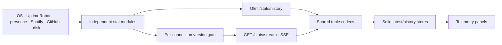

A telemetry dashboard pulls from sources that update on very different schedules. CPU is sampled every 1.5 seconds. Spotify switches between active and idle polling, GitHub is rate-limited, and another process writes token usage. Each collector owns its polling, retries, cache, and retention. The browser reads all of their snapshots through one contract.


```mermaid center
flowchart LR
  Sources["OS · UptimeRobot · presence · Spotify · GitHub · disk"] --> Collectors["Independent stat modules"]
  Collectors --> History["GET /stats/history"]
  Collectors --> Gate["Per-connection version gate"]
  Gate --> SSE["GET /stats/stream · SSE"]
  History --> Codec["Shared tuple codecs"]
  SSE --> Codec
  Codec --> Stores["Solid latest/history stores"]
  Stores --> Panels["Telemetry panels"]
```

## Treat each collector as a read model

Every source implements the same [`StatModule`](https://github.com/ErickCReis/ErickCReis/blob/main/server/stats/types.ts) contract:

```ts
type StatModule<T> = {
  start: (...args: any[]) => void;
  getLatest: () => T;
  getHistory: () => T[];
  getVersion: () => number;
};
```

Each collector contains its own polling intervals, error state, persistence, and subscriptions:

| Module | Acquisition policy | Server retention |
| --- | --- | ---: |
| system | sample process/cgroup resources every 1.5 s | 84 snapshots |
| websocket | sample every 5 s and update on presence changes | 84 snapshots |
| Spotify | poll every 2.5 s while playing, otherwise every 15 s | 84 snapshots |
| GitHub | poll every 30 min, with rate-limit-aware delay and a disk cache | 84 snapshots |
| server uptime | poll every 5 min, or retry after 1 min following a failed cycle | 10 snapshots |
| token usage | inspect the persisted aggregate every 30 s | 30 snapshots |

`startStatsServices()` starts each module after Elysia begins listening. The modules keep running without browser connections. Opening the page reads data already held by the process instead of triggering six upstream operations.

`getVersion()` returns an in-memory dirty counter. Each module increments it when publishing a snapshot; only the SSE route reads it.

For example, the system collector publishes a sample and advances its version in the same tick:

```ts
const tick = () => {
  latest = sample();
  history.push(latest);
  if (history.length > MAX_HISTORY) history.shift();
  version++;
};
```

That order defines when the sample becomes public. JavaScript finishes the synchronous update before the route can observe the increment.

## Keep bootstrap history focused on the chart

A newly mounted panel needs enough history to draw a chart. It also needs the complete current value for labels and details. Those two jobs use different data shapes.

[`buildStatsHistoryResponse()`](https://github.com/ErickCReis/ErickCReis/blob/main/server/stats/history.ts) returns `{ latest, history }` for every module, but projects each historical sample down to chart-relevant fields:

```ts
system: {
  latest: systemStat.getLatest(),
  history: systemStat.getHistory().map((sample) => ({
    timestamp: sample.timestamp,
    cpuUsagePercent: sample.cpuUsagePercent,
    systemMemoryUsedPercent: sample.systemMemoryUsedPercent,
  })),
},
```

The full system snapshot also contains used and total memory, CPU count, and battery data. Repeating those fields across 84 points adds nothing to a two-series chart. Spotify follows the same rule. Historical points keep the track identity so the UI can find the previous track, while only `latest` carries progress, duration, album, and URL.

`GET /stats/history` uses `Cache-Control: no-store`. The endpoint reads mutable in-process state. An intermediary cache would add a second freshness policy that the application does not control.

Most history arrays live in memory, have fixed limits, and reset with the process. Presence restores a bounded persisted series, and GitHub can restore a fresh cache. Neither turns the pipeline into an event log.

## One stream, six independent clocks

The live route does not subscribe to source-specific emitters. Each SSE response owns a `lastSeen` map and scans module versions every 500 milliseconds:

```ts
const lastSeen = new Map<string, number>();

while (true) {
  for (const { name, mod } of statModules) {
    const version = mod.getVersion();
    if (version > (lastSeen.get(name) ?? 0)) {
      lastSeen.set(name, version);
      const payload = serializeStatsStreamEvent(name, mod.getLatest());
      yield sse({ event: payload.e, data: payload.d });
    }
  }
  await Bun.sleep(SSE_POLL_INTERVAL_MS);
}
```

The 500 ms interval only checks for new deliveries. It does not change collection frequency. The GitHub collector still waits 30 minutes, and the route notices its next publication within one scan period.

The version gate intentionally coalesces. If Spotify publishes versions 41, 42, and 43 before the route checks it, the response emits one event containing the snapshot at version 43. This gives the pipeline **latest-state semantics**:

```text
collector transitions: v41 → v42 → v43
stream observation:                 v43
```

That works for gauges and "now playing." It does not work for billing, auditing, or any system that must record every transition. Those systems need a durable log, sequence identifiers, and resumable consumers.

Because `lastSeen` belongs to one response, a fresh connection starts with no observed versions. Every initialized module whose version is greater than zero emits its current snapshot. A module still at version zero is supplied by `/stats/history` and will enter the stream after its first publication.

## Tuple codecs define the wire protocol

Application code uses named objects. The wire protocol uses short outer keys and positional tuples to avoid repeating property names across history arrays and frequent events.

The aggregate history response is structurally:

```ts
type StatsHistoryItemWire<L, H> = { l: L; h: H[] };

type StatsHistoryResponseWire = {
  sy: StatsHistoryItemWire<SystemStatTuple, SystemHistoryPointTuple>;
  sr: StatsHistoryItemWire<ServerInfoStatTuple, ServerHistoryPointTuple>;
  ws: StatsHistoryItemWire<WebSocketStatTuple, WebSocketHistoryPointTuple>;
  sp: StatsHistoryItemWire<SpotifyNowPlayingTuple, SpotifyHistoryPointTuple>;
  gh: StatsHistoryItemWire<GitHubCommitStatsTuple, GitHubHistoryPointTuple>;
  tu: StatsHistoryItemWire<TokenUsageSnapshotTuple, TokenUsageHistoryPointTuple>;
};
```

A presence snapshot illustrates the compression:

```text
domain: { timestamp, connectedUsers, maxConcurrentUsers, connectionStartedAt }
wire:   [timestamp, connectedUsers, maxConcurrentUsers, connectionStartedAt]
history point: [timestamp, connectedUsers]
event code: "ws"
```

The server runs the serializers, and the browser uses the deserializers to restore domain objects. Keeping both in `shared/stats/*.transport.ts` puts the tuple order in one place where a reviewer can check it.

Tuples are compact, but their fields have no names on the wire. Reordering one field breaks the protocol. The decoder catches conversion errors, though invalid values with a plausible structure can still pass because it does not validate a schema.

## Merge bootstrap and live samples in the browser

The Solid island starts both paths on mount:

```ts
void fetchStatsHistory();
void subscribeStatsStream(controller.signal);
```

The history client decodes the aggregate payload and calls `loadHistory()` on each source store. The stream client decodes a named event and calls that same store's `pushSample()`. A typical store merges history by timestamp, sorts it, and truncates its client-side window:

```ts
const merged = new Map<number, SystemHistoryPoint>();
for (const sample of prev) merged.set(sample.timestamp, sample);
for (const sample of data) merged.set(sample.timestamp, sample);

return [...merged.values()]
  .sort((a, b) => a.timestamp - b.timestamp)
  .slice(-MAX_POINTS);
```

This removes duplicate chart points when bootstrap and SSE overlap. Initialization is not fully ordered, however. `loadHistory()` always assigns its `latest` value. If a newer stream event beats a slower history response, that response can briefly replace `latest` with an older snapshot. The next stream event corrects the value, and the merged chart stays ordered. A stricter implementation should compare source timestamps before replacing `latest`, or open the stream first and buffer events until bootstrap finishes.

## Reconnect by sending current state again

The stream client consumes Elysia's async iterable. It logs and skips a malformed event without ending the subscription. If the request fails or the iterable ends, the client waits one second and reconnects. An `AbortController` stops both the request and retry timer when the Solid island unmounts.

There is no SSE `id`, `Last-Event-ID`, exponential backoff, or server-side replay buffer. Recovery works because the protocol transfers snapshots instead of events. A new response starts with an empty `lastSeen` map and sends the current value of every initialized module.

The resulting guarantees are intentionally narrow:

- bounded, in-memory chart context;
- eventual convergence to current module state after reconnect;
- possible coalescing and loss of intermediate states;
- no ordering guarantee across different modules;
- no durable replay across process restarts;
- one fixed-delay retry loop per mounted telemetry island.

Supporting audit logs, multiple server replicas, or independently versioned clients would require a different design. The in-memory version gate and repository-coupled tuple protocol cannot provide those guarantees.
