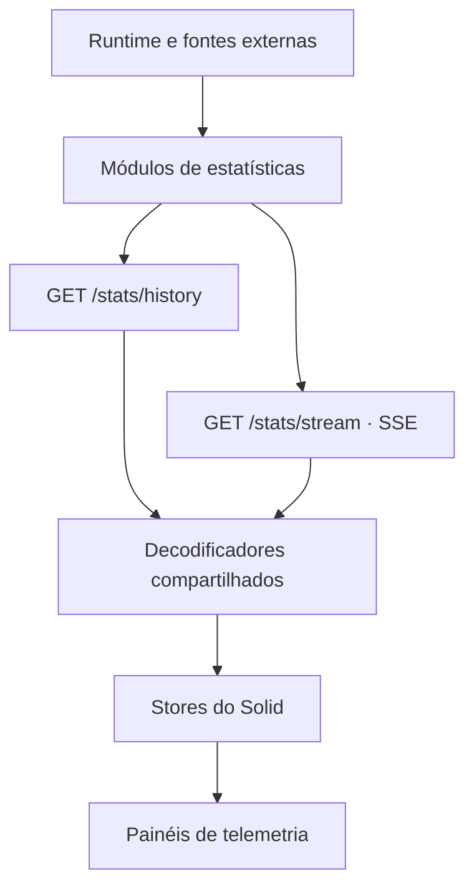

import { StatsPipelineLab } from "@web/content/labs/stats-pipeline-lab";

Os [painéis do Spotify e do GitHub](/pt-BR/blog/personal-telemetry-from-spotify-and-github) têm credenciais, intervalos de polling, políticas de cache e estados vazios diferentes. Seus componentes não sabem nada disso.

Esse é o trabalho do pipeline de estatísticas.

A parte difícil era deixar cada fonte manter o próprio relógio e, ao mesmo tempo, dar ao navegador um único lugar para carregar o estado inicial, escutar e decodificar. Eu queria que os painéis parecessem coordenados sem fazer seus coletores fingirem que trabalham no mesmo ritmo.

A página inicial combina hoje recursos do sistema, uptime externo, presença de visitantes, reprodução do Spotify, contribuições do GitHub e uso de tokens por agentes. Algumas fontes mudam a cada poucos segundos; outras, a cada 30 minutos ou apenas quando outro processo as sincroniza. A interface precisa de um gráfico inicial para cada uma delas e de novas amostras depois que começa a rodar, sem seis implementações de rede independentes.

O caminho resultante tem quatro camadas: coletores no servidor, uma resposta com o histórico inicial, um fluxo compartilhado de eventos enviados pelo servidor e pequenos stores do Solid.



## Uma interface estreita para os coletores

Cada fonte implementa o mesmo e pequeno formato de [`StatModule`](https://github.com/ErickCReis/ErickCReis/blob/main/server/stats/types.ts):

```ts
type StatModule<T> = {
  start: (...args: any[]) => void;
  getLatest: () => T;
  getHistory: () => T[];
  getVersion: () => number;
};
```

`start` pertence à fonte. O módulo do sistema pode coletar amostras com frequência, o Spotify pode trocar o intervalo conforme a reprodução, o GitHub pode esperar 30 minutos, e o uso de tokens pode aguardar uma sincronização interna. O pipeline comum não impõe um único timer global a todos eles.

As outras três operações expõem um retrato do estado de cada módulo. `getLatest` fornece o valor atual completo. `getHistory` fornece as amostras recentes disponíveis para um novo navegador. `getVersion` é um marcador de mudança sempre crescente; a rota do fluxo pode perguntar se algo mudou sem comparar objetos grandes nem entender os timestamps de cada fonte.

Cada módulo continua responsável pelo próprio estado, pelo limite de retenção, pelas escolhas de persistência e pelos erros específicos da sua fonte. A interface define apenas o necessário para a camada de entrega.

A aplicação inicia os módulos uma única vez, depois que o Elysia começa a escutar. Eles continuam coletando mesmo quando ninguém está com a página inicial aberta. Assim, um novo visitante apenas lê o estado atual do servidor em vez de provocar seis requisições às fontes externas.

## O histórico e o “agora” são payloads diferentes

Um gráfico precisa de contexto recente, mas um evento ao vivo precisa do estado atual completo. Enviar o retrato inteiro em cada ponto histórico repetiria campos que o gráfico nunca lê.

O arquivo [`server/stats/history.ts`](https://github.com/ErickCReis/ErickCReis/blob/main/server/stats/history.ts) projeta registros históricos menores de forma intencional. O histórico do sistema mantém timestamp, uso de CPU e uso de memória; o retrato mais recente também inclui totais de memória, número de CPUs e estado da bateria. O histórico do Spotify guarda o necessário para encontrar a faixa anterior, enquanto o retrato mais recente também leva o álbum, o link, o progresso e a duração.

`GET /stats/history` retorna os dois formatos para todos os módulos e usa `Cache-Control: no-store`. A resposta carrega o estado inicial do processo, então um cache intermediário não pode decidir quando atualizá-la.

No navegador, a camada interativa inicia essa requisição e a assinatura do fluxo ao mesmo tempo. Quando o histórico chega, cada store combina os pontos pelos timestamps, ordena o resultado e mantém a janela configurada. Eventos recebidos no mesmo período usam o mesmo store em vez de criar uma segunda árvore de estado.

## Por que SSE combina com essa direção

A presença de cursores precisava de um WebSocket porque o navegador envia e recebe posições. Depois da requisição inicial, a telemetria flui apenas do servidor para o navegador, o que torna os [eventos enviados pelo servidor](https://html.spec.whatwg.org/multipage/server-sent-events.html) um protocolo menor para esse trabalho.

A rota do Elysia em [`server/stats/routes.ts`](https://github.com/ErickCReis/ErickCReis/blob/main/server/stats/routes.ts) mantém um mapa da última versão vista por cada resposta conectada. A cada 500 milissegundos, ela percorre os seis módulos. Quando a versão de um deles é maior do que a versão já vista por aquela resposta, a rota serializa o retrato mais recente e produz um evento SSE nomeado.

```ts
for (const { name, mod } of statModules) {
  const version = mod.getVersion();
  if (version > (lastSeen.get(name) ?? 0)) {
    lastSeen.set(name, version);
    const payload = serializeStatsStreamEvent(name, mod.getLatest());
    yield sse({ event: payload.e, data: payload.d });
  }
}
```

O loop de 500 milissegundos não faz as fontes lentas consultarem suas APIs mais depressa. Ele apenas observa suas versões. Também combina várias mudanças ocorridas entre duas verificações no retrato mais recente, o que é adequado para um painel ao vivo: o navegador precisa do valor atual, não de um log de auditoria de cada mutação intermediária.

A verificação de versões fica mais fácil de enxergar como um filtro. No laboratório abaixo, mude o mesmo coletor mais de uma vez antes de verificar as versões: o contador dele avança a cada mudança, mas o fluxo emite um único evento apenas com o retrato mais novo. Abrir uma nova conexão SSE envia todos os retratos atuais porque aquela resposta começa sem versões em `lastSeen`.

<StatsPipelineLab client:load locale="pt-BR" />

Se o fluxo termina, o cliente espera um segundo e assina novamente enquanto a ilha continua montada. Um `AbortController` encerra esse loop quando a navegação do Astro remove a camada interativa. A nova resposta SSE começa com um mapa `lastSeen` vazio, então emite novamente as versões atuais sem precisar de um protocolo com token de retomada.

## Compacto no transporte, nomeado na aplicação

Os objetos do domínio usam campos descritivos. Repetir esses nomes em cada amostra de uma resposta histórica acrescentaria bytes sem acrescentar informação, por isso o transporte compartilhado os converte em tuplas e códigos curtos de evento.

Um retrato de presença via WebSocket, por exemplo, deixa de ser um objeto nomeado e vira um array posicional:

```text
Aplicação: { timestamp, connectedUsers, maxConcurrentUsers, connectionStartedAt }
Evento "ws" no transporte: [timestamp, connectedUsers, maxConcurrentUsers, connectionStartedAt]
```

O histórico pode ser ainda menor: `[timestamp, connectedUsers]`. No nível externo, `system`, `server`, `websocket`, `spotify`, `github` e `tokenUsage` se tornam `sy`, `sr`, `ws`, `sp`, `gh` e `tu`.

O payload menor abre mão da autodescrição. Qualquer alteração na ordem dos campos de uma tupla exige que os dois lados mudem juntos. O arquivo [`shared/stats/transport.ts`](https://github.com/ErickCReis/ErickCReis/blob/main/shared/stats/transport.ts) e os arquivos `*.transport.ts` específicos de cada fonte tornam esse acoplamento explícito: cada tipo de transporte tem um serializador e um desserializador ao lado. O restante da aplicação continua trabalhando com objetos nomeados.

Eu não começaria com serialização por tuplas em uma API mantida por clientes independentes. Aqui, um único repositório gera os dois lados, o fluxo é repetitivo e a fronteira é pequena o bastante para ser inspecionada. Essas restrições tornam o compromisso razoável.

## Os stores mantêm os painéis locais

O arquivo [`web/stats/history.ts`](https://github.com/ErickCReis/ErickCReis/blob/main/web/stats/history.ts) decodifica a resposta inicial e entrega o par de valores `history` e `latest` de cada fonte ao seu store. O arquivo [`web/stats/stream.ts`](https://github.com/ErickCReis/ErickCReis/blob/main/web/stats/stream.ts) decodifica cada código de evento e encaminha o retrato completo ao mesmo store.

Um store conhece apenas duas operações: combinar o histórico inicial e adicionar uma nova amostra. Ele também reduz um novo retrato completo aos campos úteis como ponto histórico e limita o array, normalmente a 84 itens. O painel lê sinais reativos como `latest()` e `history()` e os transforma em rótulos, barras de progresso ou gráficos.

Adicionar uma estatística não é automático. Ainda são necessários um módulo de origem, tipos de domínio e transporte, o registro nas rotas, uma projeção do histórico, um store no cliente, o encaminhamento do fluxo e um painel. Essa repetição é visível, mas também pode ser auditada. Cada nova fonte atravessa as mesmas fronteiras explícitas em vez de desaparecer por trás de um framework com mais flexibilidade do que o site precisa.

O próximo post vai para a camada abaixo das rotas de API e explica como o mesmo processo Bun também serve a saída estática do Astro como o site em produção.
