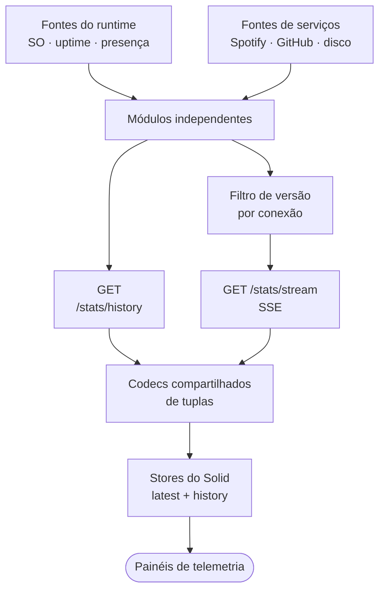

Um painel de telemetria reúne fontes que atualizam em ritmos bem diferentes. A CPU é amostrada a cada 1,5 segundos. O Spotify alterna entre polling ativo e ocioso, o GitHub tem limites de requisição e outro processo grava o uso de tokens. Cada coletor cuida do próprio polling, das retentativas, do cache e da retenção. O navegador lê todos esses retratos por um único contrato.


```mermaid center
flowchart TB
  Runtime["Fontes do runtime<br/>SO · uptime · presença"] --> Collectors["Módulos independentes"]
  Services["Fontes de serviços<br/>Spotify · GitHub · disco"] --> Collectors
  Collectors --> History["GET<br/>/stats/history"]
  Collectors --> Gate["Filtro de versão<br/>por conexão"]
  Gate --> SSE["GET /stats/stream<br/>SSE"]
  History --> Codec["Codecs compartilhados<br/>de tuplas"]
  SSE --> Codec
  Codec --> Stores["Stores do Solid<br/>latest + history"]
  Stores --> Panels(["Painéis de telemetria"])
```

## Trate cada coletor como um modelo de leitura

Cada fonte implementa o mesmo contrato de [`StatModule`](https://github.com/ErickCReis/ErickCReis/blob/main/server/stats/types.ts):

```ts
type StatModule<T> = {
  start: (...args: any[]) => void;
  getLatest: () => T;
  getHistory: () => T[];
  getVersion: () => number;
};
```

Cada coletor concentra seus próprios intervalos de polling, estado de erro, persistência e assinaturas:

| Módulo | Política de aquisição | Retenção no servidor |
| --- | --- | ---: |
| sistema | amostra os recursos do processo/cgroup a cada 1,5 s | 84 retratos |
| websocket | amostra a cada 5 s e atualiza quando há mudanças de presença | 84 retratos |
| Spotify | consulta a cada 2,5 s durante reprodução e a cada 15 s quando ocioso | 84 retratos |
| GitHub | consulta a cada 30 min, respeita o rate limit e mantém cache em disco | 84 retratos |
| uptime do servidor | consulta a cada 5 min ou tenta de novo após 1 min se o ciclo falhar | 10 retratos |
| uso de tokens | inspeciona o agregado persistido a cada 30 s | 30 retratos |

`startStatsServices()` inicia todos os módulos depois que o Elysia começa a escutar. Eles continuam rodando mesmo sem navegadores conectados. Abrir a página lê dados que já estão no processo, em vez de disparar seis operações externas.

`getVersion()` retorna um contador de alterações em memória. Cada módulo o incrementa ao publicar um retrato; somente a rota SSE o consulta.

Por exemplo, o coletor do sistema publica uma amostra e incrementa sua versão no mesmo tick:

```ts
const tick = () => {
  latest = sample();
  history.push(latest);
  if (history.length > MAX_HISTORY) history.shift();
  version++;
};
```

Essa ordem define quando a amostra se torna pública. O JavaScript termina a atualização síncrona antes que a rota possa observar o incremento.

## Mantenha o histórico inicial focado no gráfico

Um painel recém-montado precisa de histórico suficiente para desenhar o gráfico. Também precisa do valor atual completo para mostrar rótulos e detalhes. Esses dois usos pedem formatos de dados diferentes.

[`buildStatsHistoryResponse()`](https://github.com/ErickCReis/ErickCReis/blob/main/server/stats/history.ts) retorna `{ latest, history }` para cada módulo, mas reduz cada amostra histórica aos campos usados pelo gráfico:

```ts
system: {
  latest: systemStat.getLatest(),
  history: systemStat.getHistory().map((sample) => ({
    timestamp: sample.timestamp,
    cpuUsagePercent: sample.cpuUsagePercent,
    systemMemoryUsedPercent: sample.systemMemoryUsedPercent,
  })),
},
```

O retrato completo do sistema também contém memória usada e total, quantidade de CPUs e dados da bateria. Repetir esses campos em 84 pontos não acrescenta nada a um gráfico de duas séries. O Spotify segue a mesma regra. Os pontos históricos preservam a identidade da faixa para que a interface encontre a faixa anterior, enquanto apenas `latest` contém progresso, duração, álbum e URL.

`GET /stats/history` usa `Cache-Control: no-store`. O endpoint lê estado mutável dentro do processo. Um cache intermediário acrescentaria outra política de atualização, fora do controle da aplicação.

A maioria dos arrays de histórico vive em memória, tem limite fixo e volta ao estado inicial com o processo. A presença recupera uma série persistida e limitada, e o GitHub pode recuperar um cache válido. Nenhum dos dois transforma o pipeline em um log de eventos.

## Um fluxo, seis relógios independentes

A rota ao vivo não assina emissores específicos de cada fonte. Cada resposta SSE possui seu próprio mapa `lastSeen` e verifica as versões dos módulos a cada 500 milissegundos:

```ts
const lastSeen = new Map<string, number>();

while (true) {
  for (const { name, mod } of statModules) {
    const version = mod.getVersion();
    if (version > (lastSeen.get(name) ?? 0)) {
      lastSeen.set(name, version);
      const payload = serializeStatsStreamEvent(name, mod.getLatest());
      yield sse({ event: payload.e, data: payload.d });
    }
  }
  await Bun.sleep(SSE_POLL_INTERVAL_MS);
}
```

Os 500 ms servem apenas para verificar novas entregas. Eles não mudam a frequência de coleta. O coletor do GitHub continua esperando 30 minutos, e a rota detecta sua próxima publicação em até uma varredura.

O filtro por versão agrega mudanças intencionalmente. Se o Spotify publicar as versões 41, 42 e 43 antes da verificação da rota, a resposta emite um único evento com o retrato da versão 43. O pipeline oferece **semântica de estado mais recente**:

```text
transições do coletor: v41 → v42 → v43
observação do fluxo:                  v43
```

Isso funciona para indicadores e "tocando agora". Não funciona para faturamento, auditoria ou qualquer sistema que precise registrar todas as transições. Esses sistemas precisam de um log durável, identificadores de sequência e consumidores capazes de retomar a leitura.

Como `lastSeen` pertence a uma resposta, uma nova conexão começa sem versões observadas. Todo módulo inicializado cuja versão seja maior do que zero emite seu retrato atual. Um módulo que ainda esteja na versão zero aparece em `/stats/history` e entra no fluxo após sua primeira publicação.

## Codecs de tuplas definem o protocolo de transporte

O código da aplicação usa objetos nomeados. O protocolo usa chaves externas curtas e tuplas posicionais para evitar a repetição dos nomes das propriedades em arrays históricos e eventos frequentes.

A estrutura da resposta agregada de histórico é:

```ts
type StatsHistoryItemWire<L, H> = { l: L; h: H[] };

type StatsHistoryResponseWire = {
  sy: StatsHistoryItemWire<SystemStatTuple, SystemHistoryPointTuple>;
  sr: StatsHistoryItemWire<ServerInfoStatTuple, ServerHistoryPointTuple>;
  ws: StatsHistoryItemWire<WebSocketStatTuple, WebSocketHistoryPointTuple>;
  sp: StatsHistoryItemWire<SpotifyNowPlayingTuple, SpotifyHistoryPointTuple>;
  gh: StatsHistoryItemWire<GitHubCommitStatsTuple, GitHubHistoryPointTuple>;
  tu: StatsHistoryItemWire<TokenUsageSnapshotTuple, TokenUsageHistoryPointTuple>;
};
```

O retrato de presença mostra a compactação:

```text
domínio: { timestamp, connectedUsers, maxConcurrentUsers, connectionStartedAt }
transporte: [timestamp, connectedUsers, maxConcurrentUsers, connectionStartedAt]
ponto histórico: [timestamp, connectedUsers]
código do evento: "ws"
```

O servidor executa os serializadores, e o navegador usa os desserializadores para restaurar os objetos de domínio. Manter ambos em `shared/stats/*.transport.ts` concentra a ordem da tupla em um lugar que pode ser revisado.

Tuplas são compactas, mas os campos chegam sem nomes no transporte. Reordenar um item quebra o protocolo. O decoder captura erros de conversão, mas valores inválidos com uma estrutura plausível ainda podem passar porque não há validação de schema.

## Combine o bootstrap e as amostras ao vivo no navegador

A ilha do Solid inicia os dois caminhos ao ser montada:

```ts
void fetchStatsHistory();
void subscribeStatsStream(controller.signal);
```

O cliente do histórico decodifica o payload agregado e chama `loadHistory()` no store de cada fonte. O cliente do fluxo decodifica um evento nomeado e chama `pushSample()` no mesmo store. Um store típico mescla o histórico por timestamp, ordena o resultado e limita sua janela no cliente:

```ts
const merged = new Map<number, SystemHistoryPoint>();
for (const sample of prev) merged.set(sample.timestamp, sample);
for (const sample of data) merged.set(sample.timestamp, sample);

return [...merged.values()]
  .sort((a, b) => a.timestamp - b.timestamp)
  .slice(-MAX_POINTS);
```

Isso remove pontos duplicados quando o bootstrap e o SSE se sobrepõem. A inicialização, porém, não é totalmente ordenada. `loadHistory()` sempre define o valor de `latest`. Se um evento mais novo chegar antes de uma resposta de histórico mais lenta, essa resposta pode trocar `latest` por um retrato antigo por alguns instantes. O próximo evento corrige o valor, e o histórico combinado continua ordenado. Uma implementação mais estrita deveria comparar os timestamps antes de substituir `latest` ou abrir o fluxo primeiro e guardar os eventos até o fim do bootstrap.

## Reconecte enviando o estado atual outra vez

O cliente consome o iterável assíncrono do Elysia. Ele registra e ignora um evento malformado sem encerrar a assinatura. Se a requisição falhar ou o iterável terminar, o cliente espera um segundo e conecta novamente. Um `AbortController` interrompe tanto a requisição quanto o timer de retentativa quando a ilha do Solid é desmontada.

Não há `id` nos eventos SSE, suporte a `Last-Event-ID`, backoff exponencial nem buffer de replay no servidor. A recuperação funciona porque o protocolo transporta retratos em vez de eventos. Uma nova resposta começa com um mapa `lastSeen` vazio e envia o valor atual de todos os módulos já inicializados.

As garantias resultantes são intencionalmente estreitas:

- contexto limitado e em memória para os gráficos;
- convergência eventual para o estado atual dos módulos após uma reconexão;
- possível agregação e perda de estados intermediários;
- nenhuma garantia de ordem entre módulos diferentes;
- nenhum replay durável depois que o processo reinicia;
- um loop de retentativa com atraso fixo por ilha de telemetria montada.

Para oferecer logs de auditoria, múltiplas réplicas do servidor ou clientes versionados de forma independente, seria preciso mudar o design. O filtro de versões em memória e o protocolo de tuplas acoplado ao repositório não entregam essas garantias.
